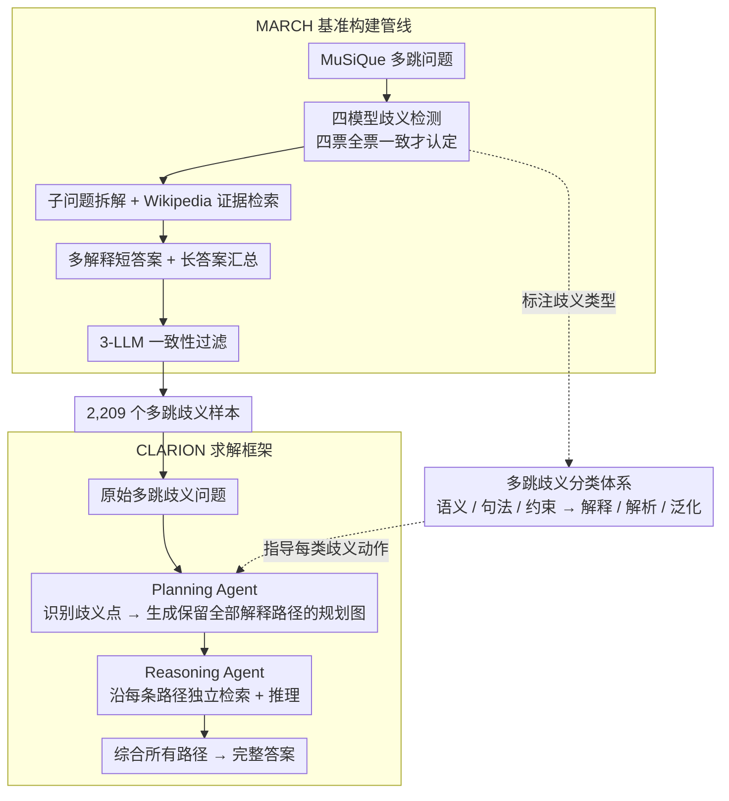

# MARCH: Evaluating the Intersection of Ambiguity Interpretation and Multi-hop Inference

**会议**: ACL 2026 Findings  
**arXiv**: [2509.22750](https://arxiv.org/abs/2509.22750)  
**代码**: [GitHub](https://github.com/jeonghyunpark2002/MARCH)  
**领域**: LLM Reasoning / Question Answering  
**关键词**: 多跳推理, 歧义解析, 基准构建, 分层不确定性, 智能体框架

## 一句话总结

提出 MARCH 基准（2,209 个多跳歧义问题）和 CLARION 框架，首次系统研究歧义解析与多步推理交叉场景下的 QA 挑战，揭示现有 SOTA 模型在此类问题上的严重不足。

## 研究背景与动机

**领域现状**：多跳 QA 要求模型跨多个文档构建逻辑链；歧义 QA 要求模型处理多义词和不充分上下文。这两类挑战已分别被广泛研究，但它们的**交叉**场景几乎未被探索。

**现有痛点**：在真实用户查询中，48.4% 包含歧义，17.7% 涉及多跳推理，13.3% 同时涉及两者。然而现有基准要么只关注单跳歧义(ASQA)，要么只关注多跳推理(MuSiQue)。当歧义发生在多跳推理的中间步骤时，不确定性会级联放大——早期的歧义解析错误会锁定错误的推理路径。

**核心矛盾**：多跳推理中的歧义可能是**潜在的**(latent)——只有在前面步骤被正确解析后才会显现。例如 "What is the best-selling pickup sold by the manufacturer of the 'Mustang'?" 中，pickup 的歧义（卡车 vs 吉他拾音器）只有在保留 Mustang 的两种解释（汽车 vs 吉他）后才能被发现。

**本文目标**：(1) 构建评估多跳歧义 QA 的专用基准；(2) 提出解决此问题的框架。

**核心idea**：多跳歧义 QA 需要模型在整个推理链中保持多条解释路径的"叠加态"，而非过早提交到单一解释。CLARION 通过将歧义规划与证据检索解耦，防止推理路径的过早剪枝。

## 方法详解

### 整体框架

这篇论文要回答的问题是：当歧义恰好藏在多跳推理的中间步骤时，现有模型能不能处理。为此它给出两件配套的东西——一个专门的评测基准 MARCH，从无歧义的多跳数据集 MuSiQue 出发、经四阶段管线注入并标注歧义，最终得到 2,209 个覆盖语义/句法/约束三类歧义的问题；以及一个无需训练的求解框架 CLARION，把"歧义规划"和"逐路径证据推理"拆成两个 Agent，让模型在整条推理链上同时托住多条解释路径，而不是在第一跳就锁死一种解读。贯穿两者的是一套多跳歧义分类体系：它既给基准的每个歧义点贴上类型标签，又指导求解时对每类歧义采取的动作。

### 关键设计

**1. MARCH 基准构建管线：用多模型全票一致换标签可信度**

要评测"多跳 + 歧义"的交叉能力，先得有高质量数据，而单个 LLM 标歧义容易带自身偏差。管线分四步走：先用 GPT-4.1、Llama-4、Qwen3-235B、Claude-4 四个模型对每个 MuSiQue 问题做歧义类型检测，只有**四票全部一致**才认定该问题含某类歧义；再把澄清后的问题拆成原子子问题并从 Wikipedia 检索证据；接着为每种合法解释各生成一个短答案、并汇总成一个覆盖所有解释的长答案；最后用 3 个独立 LLM 做一致性过滤。全票一致 + 多模型把单模型偏差摊薄，人工复核的标注一致性达到 Fleiss' $\kappa=0.92\text{–}0.95$，最终留下 2,209 个样本。

**2. 多跳歧义分类体系：三类歧义对应三种处理动作**

不同歧义需要的应对方式并不一样，作者把标准歧义分类扩展到多跳场景，给出三类各带一个明确动作的体系。**语义歧义**指同一 mention 映射到多个实体（如 Mustang 既可指 Ford 汽车又可指 Fender 吉他），对应动作是"解释"(Interpret)——把每种实体解读都展开；**句法歧义**指一句话有多种合法解析、导致跳与跳之间的依赖关系不同（如介词附着歧义），对应动作是"解析"(Resolve)；**约束歧义**指限定词过度具体、把本该合法的推理路径提前剪掉，对应动作是"泛化"(Generalize)。这套分类不只是给数据贴标签，更直接指导下游求解时该对每类歧义采取什么策略。

**3. CLARION 框架：规划与推理解耦，防止路径过早剪枝**

标准 RAG / CoT 的通病是在第一跳就提交到单一解读，一旦选错，后面的推理全锁死在错误路径上——尤其当歧义是"潜在的"、要靠前序步骤正确才显现时（Mustang 是汽车还是吉他，只有先保留两种解读，"它的制造商造的最畅销皮卡"这一跳的歧义才会浮现）。CLARION 把过程拆成两个 Agent：**Planning Agent** 先读原始问题、识别所有歧义点，生成一张保留全部合法解释路径的规划图；**Reasoning Agent** 再沿每条规划路径独立检索证据、独立推理，最后把所有路径的结果综合成完整答案。规划与执行分离，等于强制模型在推理全程维持多条解释的"叠加态"，把"过早提交"这个失败源头从机制上堵掉。

### 损失函数 / 训练策略

MARCH 和 CLARION 都是无训练(training-free)方案：MARCH 是构建型基准，CLARION 基于现有 LLM 用提示工程实现。评估指标包括 F1-score、EM、D-F1(disambiguation F1)、ROUGE-L 和 LLM-judge。

## 实验关键数据

### 主实验

| 设置 | MuSiQue(多跳) | ASQA(歧义) | MARCH(交叉) | 说明 |
|------|-------------|-----------|------------|------|
| 现有模型 | 尚可 | 尚可 | **显著下降** | 交叉场景远超单一场景的难度 |
| CLARION | - | - | **显著优于基线** | 验证了解耦策略的有效性 |

### 基准统计

| 指标 | 值 | 说明 |
|------|-----|------|
| 总样本数 | 2,209 | 覆盖三类歧义 |
| 歧义分布 | Sem:734, Syn:739, Const:736 | 均衡分布 |
| 平均跳数 | 2.11-2.95 | 句法歧义跳数最多 |
| 人工验证一致性 | Fleiss' κ=0.92-0.95 | 极高标注一致性 |
| 长答案有效率 | >90% | 整合了所有解释 |

### 关键发现
- 真实用户查询中 13.3% 同时涉及多跳和歧义，这不是罕见边缘情况
- 在单独的多跳或歧义任务上表现合理的模型，在交叉场景(MARCH)上性能急剧下降
- 模型倾向于在第一跳就锁定单一解释（过早提交），导致级联错误
- CLARION 的规划-执行解耦有效防止了推理路径的过早剪枝

## 亮点与洞察
- **问题定义的深度**："潜在歧义"（latent ambiguity，只有前序步骤正确才能显现的歧义）的概念非常深刻
- **三类歧义的分类**：语义/句法/约束歧义各有对应的处理动作(解释/解析/泛化)，分类体系实用
- **严格的基准构建流程**：4个 LLM 全票一致 + 人工验证，质量可靠性高
- **13.3% 的真实世界频率数据**：从 lmsys-chat-1m 中的统计数据有力论证了问题的现实重要性
- **CLARION 的简洁设计**：规划-执行解耦的思路简单但有效

## 局限与展望
- MARCH 基于 MuSiQue 构建，继承了其领域和跳数的限制
- CLARION 目前基于检索增强设置，开放域无检索场景未探索
- 三类歧义的均衡分布是人工控制的，可能不完全反映真实分布
- 未来可探索模型在何种条件下应主动提出澄清问题而非尝试所有解释
- 可扩展到多语言多跳歧义场景

## 相关工作与启发
- **vs ASQA**：ASQA 只关注单跳歧义，MARCH 首次扩展到多跳歧义
- **vs MuSiQue**：MuSiQue 关注多跳但假设无歧义，MARCH 在其基础上引入歧义
- **vs 标准 RAG/CoT**：标准方法在多跳歧义下因过早提交而失败，CLARION 通过规划-执行解耦解决

## 评分
- 新颖性: ⭐⭐⭐⭐⭐ 首次系统定义和评估多跳歧义 QA，问题重要且此前未被研究
- 实验充分度: ⭐⭐⭐⭐ 含基准构建、人工验证、模型评估和框架对比
- 写作质量: ⭐⭐⭐⭐⭐ 问题定义清晰，分类体系严谨，实例分析生动
- 价值: ⭐⭐⭐⭐⭐ 基准和框架均有独立贡献，对推理和歧义研究社区有重要影响

<!-- RELATED:START -->

## 相关论文

- [\[ICLR 2026\] Multi-LLM Adaptive Conformal Inference for Reliable LLM Responses](../../ICLR2026/llm_evaluation/multi-llm_adaptive_conformal_inference_for_reliable_llm_responses.md)
- [\[ACL 2026\] Evaluating Temporal Consistency in Multi-Turn Language Models](evaluating_temporal_consistency_in_multi-turn_language_models.md)
- [\[ACL 2026\] CLARITY: A Framework and Benchmark for Conversational Language Ambiguity and Unanswerability in Interactive NL2SQL Systems](clarity_a_framework_and_benchmark_for_conversational_language_ambiguity_and_unan.md)
- [\[ACL 2026\] SciImpact: A Multi-Dimensional, Multi-Field Benchmark for Scientific Impact Prediction](sciimpact_a_multi-dimensional_multi-field_benchmark_for_scientific_impact_predic.md)
- [\[ACL 2026\] Statistically Reliable LLM-Based Ranking Evaluation via Prediction-Powered Inference](statistically_reliable_llm-based_ranking_evaluation_via_prediction-powered_infer.md)

<!-- RELATED:END -->
