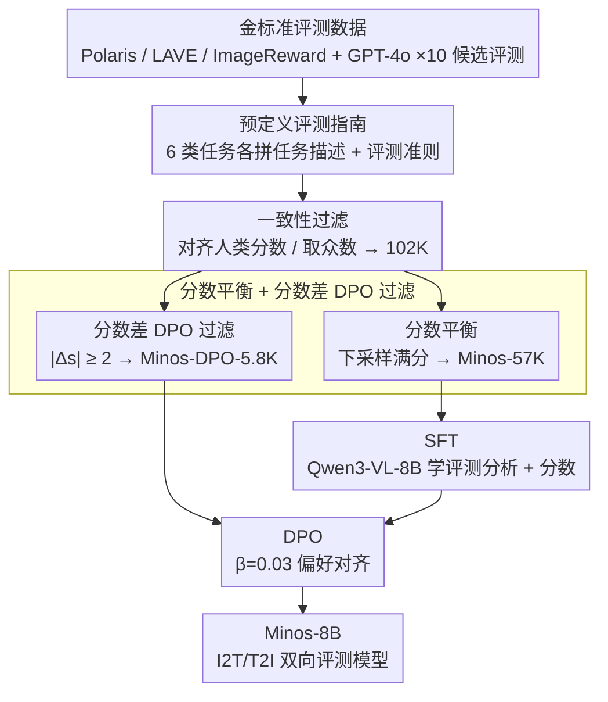

# Minos: A Multimodal Evaluation Model for Bidirectional Generation Between Image and Text

**会议**: ACL 2026 Findings  
**arXiv**: [2506.02494](https://arxiv.org/abs/2506.02494)  
**代码**: https://github.com/reroze/MINOS  
**领域**: 多模态评测 / MLLM-as-a-Judge / 偏好对齐  
**关键词**: 多模态评测、数据质量控制、I2T/T2I 双向评测、DPO 对齐、reference-free 打分

## 一句话总结
作者通过"严格的数据质量控制 + SFT + DPO 对齐"三步走，用不到现有工作一半规模的 57K 条高质量评测样本，训练出能同时给 I2T 与 T2I 双向多模态生成任务打分的 8B 评测模型 Minos，在 16 个 out-of-domain 任务上超过所有开源 MLLM-评测模型，并接近 GPT-4o。

## 研究背景与动机

**领域现状**：随着 MLLM 能力提升，"用 MLLM 当 judge"已经成为多模态生成（image captioning、VQA、text-to-image 等）的主流自动评测范式，代表工作有 Prometheus-Vision、LLaVA-Critic、UnifiedReward 等，它们都把 MLLM 训练成 pointwise / pairwise 的打分器。

**现有痛点**：(1) 现有评测模型主要靠"堆数据"——LLaVA-Critic 用 113K，UnifiedReward 用 236K，但对数据质量几乎不做筛选，直接拿 GPT-4o 生成的评测结果就往里灌；(2) 现有模型在 I2T 和 T2I 上很难同时强，LLaVA-Critic 几乎只覆盖 I2T，UnifiedReward 在 I2T 上又较弱；(3) SFT 之后基本没人做偏好对齐，导致 alignment 阶段的红利没吃到。

**核心矛盾**：评测能力的瓶颈到底是"数据多"还是"数据准"？作者明确押注于后者——一个评测样本如果 GPT 的判分和人类不一致，或者整体分数分布严重偏斜（大量满分），那再多也只会污染模型。

**本文目标**：(1) 构造一个跨 I2T+T2I、高质量、低体量的评测数据集；(2) 在此基础上同时做 SFT 和 DPO；(3) 验证"质量 > 数量"假设在多模态评测里成立。

**切入角度**：把人工标注的高质量评测数据（Polaris/LAVE/ImageReward）当作"金标准"，再用 GPT-4o 对每条样本生成 10 个候选评测，通过"和人类分数一致"或"GPT 内部众数"过滤出真正可靠的样本；并进一步用"chosen/rejected 分数差 ≥ 2"做 DPO 偏好对的筛选。

**核心 idea**：用严格的 instance-level + dataset-level 质量控制 + 分数差过滤的 DPO，让 57K 样本超过 236K 原始样本的训练效果。

## 方法详解

### 整体框架
Minos 的 pipeline 分两条线：**数据构造**（Minos-57K + Minos-DPO-5.8K）+ **两阶段训练**（SFT → DPO）。数据这一侧统一把每条评测实例形式化为 $(q, d, g, k, [r], a, s)$——即任务输入 $q$、任务描述 $d$、模型输出 $g$、评测准则 $k$、可选参考答案 $r$，输出为评测分析 $a$ 和 1–5 Likert 分 $s$。这种 schema 既能容纳 I2T（image+question→text），也能容纳 T2I（text→image），实现"双向统一"的关键。模型骨干用 Qwen3-VL-8B，SFT 用 Minos-57K（2 epoch、lr 1e-5），DPO 用 Minos-DPO-5.8K（1 epoch、lr 2e-6、$\beta=0.03$）。

### 关键设计

**1. Pre-defined Guideline（预定义评测指南）：先告诉模型"现在按什么标准评"**

人类评测员评不同任务前都要先受训，否则容易拿评 caption 的尺子去量 VQA。作者为 6 类多模态任务（caption / VQA / T2I / text reading / reasoning / instruction following）各写一份"任务描述 + 评测准则"，每条评测输入都拼接上对应任务的指南。这样消除了任务间评测准则的相互混淆，让一个 8B 模型在没见过的 OOD 任务上也能照着 guideline 一步步推理，而不是凭直觉乱给分——消融里仅加 guideline 就把 Pearson-r 从 36.3 抬到 37.1。

**2. Consistency Filter（一致性过滤）：把 GPT 噪声评测收敛到高置信度模式**

GPT-4o 当标注器在某些样本上方差很大，直接拿它的输出灌进训练会污染模型。作者对每条样本让 GPT-4o 生成 10 个候选评测，再分两种情况筛：对**有人工分数**的数据（Polaris / LAVE / ImageReward），只保留 GPT 分数与人类分数一致的候选，若 10 个里没一个对齐就整条作废；对**无人工分数**的数据，先取 10 个候选分数的众数 $\hat{s}=\mathrm{mode}(s_1,\ldots,s_{10})$ 当伪标签，再随机挑一个分数等于 $\hat{s}$ 的分析作最终标签。本质是把"模型生成的评测"从一个概率分布收敛到高置信度模式，规避 high-variance 的乱打分，124K 原始样本经此过滤后剩 102K，Pearson-r 进一步升到 39.0。

**3. Score Balance + Delta Score DPO Filter（分数平衡 + 分数差 DPO 过滤）：同时治"数据集级偏斜"和"偏好对噪声"**

过完一致性过滤，整体分数分布仍严重偏向满分（57K 里 56% 是 5 分），作者用随机下采样把分布平到 16/17/21/23/23%，得到 Minos-57K。DPO 这一侧更关键：对每条样本，把通过一致性过滤的样本当 chosen、剩余候选里分数差最大的当 rejected，再用 $|s_\text{chosen} - s_\text{rejected}| \ge 2$ 进一步筛，把 38K 偏好对压到 5.8K。这么做是因为作者发现 naive DPO 反而会把模型从 40.9 拖到 40.1——评测模型对偏好对噪声极其敏感，只有用"分数差"当显式置信度、留下少而精的信号，DPO 才能带来 +1.4 的稳定提升。这也正好利用了评测任务自带分数 $s$、天然能量化偏好强度的特点，省去了一般偏好建模里另训 reward model 挑对的麻烦。

### 损失函数 / 训练策略

SFT 阶段是标准 next-token prediction，监督整段评测分析 $a$ 加分数 $s$（实验证明"带分析的 SFT"比"只学分数"在平均 Pearson-r 上高 2.1 个点）。DPO 用 Rafailov et al. 的标准公式，$\beta=0.03$、$\gamma=0$。4 卡 H100，BF16；SFT 约 10 小时，DPO 约 2 小时。

## 实验关键数据

### 主实验
评测协议沿用 LLaVA-Critic：在 MLLM-as-a-Judge（14 个 I2T 任务）+ RichHF-18K + GenAI-Bench（2 个 T2I 任务）共 16 个 OOD 数据集上，用 Pearson-r 度量模型分数和人类分数的相关性。

| 模型 | 规模 | Avg. Pearson-r (16 任务) | 备注 |
|------|------|---------------------------|------|
| Gemini-2.5-Pro | / | 41.5 | 闭源 |
| GPT-4o | / | 44.2 | 闭源天花板 |
| Qwen3-VL (base) | 8B | 38.4 | 同骨干基线 |
| LLaVA-Critic | 7B | 30.7 | 仅 I2T 训练 |
| LLaVA-Critic | 72B | 39.8 | 前 SOTA（开源） |
| UnifiedReward_Q | 8B | 37.2 | 同规模前 SOTA |
| **Minos** | **8B** | **42.3** | 超 72B 的 LLaVA-Critic 2.5 点 |

### 消融实验

| 配置 | Avg. Pearson-r | 说明 |
|------|---------------|------|
| RAW（124K, 无任何质控） | 36.3 | 比 base 模型 38.4 还低 → "脏数据会负向训练" |
| + Guideline | 37.1 | +0.8，任务指南显著有用 |
| + Consistency Filter (102K) | 39.0 | +1.9，过滤 GPT 噪声评测 |
| + Score Balance → Minos-57K（SFT only） | 40.9 | +1.9，再平衡分数分布 |
| + Naive DPO (38K 偏好对) | 40.1 | **掉 0.8**，验证 naive DPO 反伤 |
| + Delta-Score DPO (5.8K) | **42.3** | +1.4，少而精的偏好对才有效 |
| 只 T2I 训练 (10K) → I2T 平均 | 25.4 | 比 base 36.7 掉 11.3，单向训练严重负迁移 |
| 只 I2T 训练 (47K) → T2I 平均 | 46.1 | 比联合训练 50.9 低 4.8 |
| **I2T+T2I 联合 (57K)** | I2T 39.5 / T2I 50.9 | 双向互相增益 |

### 关键发现
- **质量远比规模重要**：57K 样本（约 LLaVA-Critic 的 1/2、UnifiedReward 的 1/4）的训练效果反而比 124K 原始数据高 4.6 点；这是全文最硬的"反共识"结论。
- **Naive DPO 会负迁移**：38K 偏好对反让 Pearson-r 从 40.9 掉到 40.1，说明评测模型对偏好对噪声特别敏感；分数差 ≥ 2 这个简单 heuristic 把数据砍到 1/6 才扭正。
- **I2T 与 T2I 互补不矛盾**：单独训 T2I 会把 I2T 评测能力打废（36.7 → 25.4），但联合训能双向增益，意味着"评图文一致性"这件事在两个方向上共享底层能力。
- **带评测分析的 SFT 更准**：让模型先输出文字 rationale 再打分，比直接出分高 2.1 个 Pearson-r，分析不仅提升可解释性还能锚定打分行为。

## 亮点与洞察
- **"质量 > 规模"在多模态评测里被实证**：第一次明确给出"脏评测数据训练会让模型比 base 还差"的证据（36.3 < 38.4），这条 negative result 对后续做 reward model / judge model 的工作非常有警示意义。
- **分数差过滤的 DPO 是个干净的 heuristic**：评测任务本身带显式分数 $s$，天然能做偏好强度量化，作者把 $|s_\text{chosen}-s_\text{rejected}| \ge 2$ 当成"高置信度"硬筛，避免了一般偏好对建模里需要额外训 reward model 来挑对的繁琐做法——这个 trick 在所有"输出可被打分"的对齐任务里都能复用。
- **统一 schema $(q,d,g,k,[r],a,s)$ 让 I2T/T2I 同框训练**：通过把"image+question"和"prompt"都抽象成"任务输入 $q$ + 任务描述 $d$"，自然支持双向，几乎零成本接新任务，可直接迁移到 video-to-text、audio-to-text 这类多模态评测。

## 局限与展望
- 作者承认：受算力限制没在 70B 骨干上验证，scaling 趋势不明确；部分早期人工评测数据集链接失效，覆盖不全。
- 个人观察：评测任务集中在生成质量、文本对齐这类"通用"维度，对 safety / factuality / hallucination 这类专项评测维度没覆盖；guideline 都是手写，若想扩到几十类任务，guideline 自动化将成为新瓶颈。
- DPO 阶段把数据砍到 5.8K 才能 work，意味着可用偏好对极稀缺；未来可探索"软分数差"或在线偏好挖掘以扩大有效 DPO 数据。
- 改进思路：把 Delta-Score Filter 推广到 process-level 评分差（比如每个评测维度独立给分），可能解锁更多偏好对；或在 SFT 阶段直接做"评测分析 + 评测分数"的多任务联合训练。

## 相关工作与启发
- **vs LLaVA-Critic (7B/72B)**：他们靠 GPT-4o 大量生成 113K I2T 评测训练，只能评 I2T；Minos 只用 1/2 数据、加严格质控 + DPO + 双向覆盖，8B 反超其 72B 版本 2.5 个 Pearson-r。
- **vs UnifiedReward**：UnifiedReward 用了 236K 跨模态数据但缺质控且 I2T 偏弱（37.2）；Minos 在同规模 8B 下高 5.1 点，关键差距来自"是否做质量过滤 + DPO 对齐"。
- **vs Prometheus-V**：Prometheus-V 用 GPT 合成数据但未做一致性过滤，平均 20.3；Minos 把"GPT-as-annotator"和"严格筛选"配齐了。
- **启发**：所有"用 LLM 当 judge"的工作都应该先问"我的训练评测数据有没有过 consistency check"，而不是无脑堆数据；这对当下 reward model 训练同样适用。

## 评分
- 新颖性: ⭐⭐⭐⭐ 思路是组合拳（质控 + 双向 + DPO 分数差过滤），单点创新有限，但"少数据反超大数据"的实证有说服力。
- 实验充分度: ⭐⭐⭐⭐⭐ 16 个 OOD 数据集 + 4 张消融表，把每个设计点都拆开比较。
- 写作质量: ⭐⭐⭐⭐ 结构清晰，表格密度高；动机推导扎实，但 method 部分对 DPO 公式略简。
- 价值: ⭐⭐⭐⭐⭐ 同时给出 SOTA 开源 evaluator 和 "数据质量 > 规模" 的 negative-result，对做 reward / judge model 的同行直接可用。

<!-- RELATED:START -->

## 相关论文

- [\[ACL 2026\] Comprehensiveness Metrics for Automatic Evaluation of Factual Recall in Text Generation](comprehensiveness_metrics_for_automatic_evaluation_of_factual_recall_in_text_gen.md)
- [\[ACL 2025\] EditInspector: A Benchmark for Evaluation of Text-Guided Image Edits](../../ACL2025/llm_evaluation/editinspector_a_benchmark_for_evaluation_of_text-guided_image_edits.md)
- [\[ICML 2025\] Communicating Activations Between Language Model Agents](../../ICML2025/llm_evaluation/communicating_activations_between_language_model_agents.md)
- [\[ACL 2026\] Attribution, Citation, and Quotation: A Survey of Evidence-based Text Generation with Large Language Models](attribution_citation_and_quotation_a_survey_of_evidence-based_text_generation_wi.md)
- [\[ACL 2026\] Capabilities and Evaluation Biases of Large Language Models in Classical Chinese Poetry Generation: A Case Study on Tang Poetry](capabilities_and_evaluation_biases_of_large_language_models_in_classical_chinese.md)

<!-- RELATED:END -->
