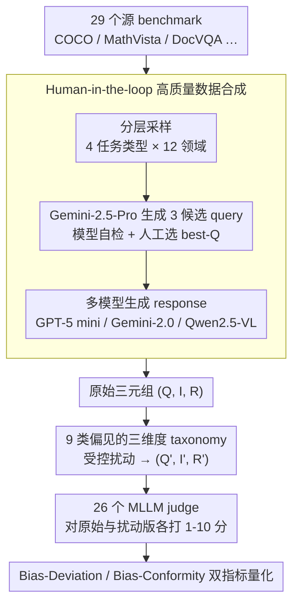

# MM-JudgeBias: A Benchmark for Evaluating Compositional Biases in MLLM-as-a-Judge

**会议**: ACL 2026  
**arXiv**: [2604.18164](https://arxiv.org/abs/2604.18164)  
**代码**: 论文 project page + GitHub（abstract 中标注）  
**领域**: 多模态评测 / MLLM-as-a-Judge / 偏见 benchmark  
**关键词**: MLLM-as-a-Judge、compositional bias、modality bias、Bias-Deviation、Bias-Conformity

## 一句话总结
作者把"MLLM 当 judge 时是否真的把图像、查询、回答三者综合起来评判"形式化为 Compositional Bias，并构建 MM-JudgeBias——一个含 9 类偏见、1804 条来自 29 个源 benchmark 样本的诊断集，用 Bias-Deviation（语义破坏后该降分但没降）+ Bias-Conformity（语义保不变时该稳但不稳）两个互补指标，发现 26 个 SOTA MLLM judge（含 Gemini-3 Pro、GPT-5.1、Claude Opus 4.5）都存在严重的 modality neglect。

## 研究背景与动机

**领域现状**：MLLM-as-a-Judge 已成为多模态生成（captioning、VQA、visual reasoning）的主流自动评测范式，从早期用 GPT-4o 直接当 judge，到现在专门微调 Prometheus-Vision、LLaVA-Critic 这类 critic model。

**现有痛点**：LLM-as-a-Judge 已有 12 类偏见的系统研究，但 MLLM judge 的可靠性研究还停留在"position bias / verbosity / length"这种从 LLM 直接照搬的浅层维度上，没人系统问过——"当 judge 缺失了图像、或图像和回答错位、或加了无关 caption 时，judge 还会不会乱给分？"这是 multimodal judge 独有的失败模式。

**核心矛盾**：MLLM judge 经常被发现"看不看图都打一样分"——这并不是单纯的能力不足，而是 verification integrity 的失败：judge 的本职是 conditional verification，但模型却把它退化成 unconditional prediction，根据 response 表面流畅度就给满分。

**本文目标**：(1) 给出多模态 judge 偏见的形式化框架；(2) 构造可控扰动的诊断集；(3) 用 26 个 MLLM 把这件事的严重程度量化出来。

**切入角度**：把"reliable judge 应有的行为"拆成三类——**Integrality**（缺组件就该扣分）、**Congruity**（组件互相矛盾就该扣分）、**Robustness**（语义不变的扰动不该影响分数）。前两个用 Bias-Deviation 度量（扰动后该掉分掉了多少），后者用 Bias-Conformity 度量（扰动后分数稳不稳）。

**核心 idea**：用 9 种受控扰动 × 1804 条数据 × 两个互补指标，把"compositional bias"系统化、可测量化。

## 方法详解

### 整体框架
MM-JudgeBias 的构造与评测是一条串行流水线：(a) 从 29 个源 benchmark（COCO、MathVista、DocVQA、ChartQAPro 等）按 4 任务类型 × 12 领域分层采样；(b) 用 Gemini-2.5-Pro 为每条样本生成 3 个 query，再走 model+human 两轮审选出 best-Q，确保 query 真的需要图文联合才能答；同时平行构造一个纯文本 query 集（用于 unnecessary-image 偏见）；(c) 用 GPT-5 mini / Gemini-2.0-Flash-Lite / Qwen2.5-VL-7B 多模型生成 response，保证分数分布多样——(a)-(c) 共同构成数据合成；(d) 按 9 类偏见对原始三元组 $(Q, I, R)$ 做受控扰动，得到 $(Q', I', R')$；(e) 让 26 个 MLLM judge 对原始与扰动版各打 1-10 分；(f) 按偏见类型用 Bias-Deviation / Bias-Conformity 量化。最终 1804 条样本，覆盖 9 偏见 × 4 任务 × 12 领域。

### 关键设计

**1. Human-in-the-loop 高质量数据合成：确保 query 真的非图文联合不可答**

如果一个 query 只看图或只看文就能蒙对，那扰动后 judge 没掉分就不算 bias、而是合理反应——这正是诊断 benchmark 最容易踩的陷阱。为此每条样本让 Gemini-2.5-Pro 先生成 3 个候选 query，经模型自检再由人工审选 1 个 best-Q，保证它必须图文联合推理才能答；再用 GPT-5 mini / Gemini-2.0-Flash-Lite / Qwen2.5-VL-7B 多模型生成 response，让分数分布足够多样。对图像扰动里需要语义不变的增广（Visual-Transformation）用预设 pipeline 组合，需要语义破坏的扰动（如 texture insertion）则用模型生成。每类偏见还分 easy / mod / hard 三档难度，并按 4 任务类型 × 12 领域做分层抽样。human review 是过滤"单边即可答"陷阱的必要保证，最终得到 1804 条覆盖 9 偏见 × 4 任务 × 12 领域的原始三元组。

**2. 9 类偏见的三维度 taxonomy：把"judge 失败"拆成可独立度量的细粒度类型**

拿到干净的三元组后，按 9 类偏见对其做受控扰动。一个可靠的 judge 应有三种行为，作者据此把 9 类偏见分到三维。**Integrality**（3 类）测"缺组件该不该扣分"——Text-Dominance / Image-Dominance / Response-Dominance，分别把 image、query、二者都替换成 null；**Congruity**（2 类）测"组件互相矛盾该不该扣分"——Instruction-Misalignment / Image-Misalignment，用随机不相关的 query 或 image 替换；**Robustness**（4 类）测"语义不变的扰动该不该影响分数"——Detail-Description（query 后拼图像 caption）、Unnecessary-Image（纯文本任务加无关图）、Visual-Transformation（语义保留的图像增广）、Texture-Insertion（在图上叠加 query 关键词文本）。前两维考察"该敏感时敏不敏感"、后一维考察"该稳时稳不稳"，这种 sensitivity 与 stability 双向考察，正好避免了单一指标把"全打满分"和"全打 0 分"两种 trivial 行为都误判为高分。

**3. Bias-Deviation (BD) 与 Bias-Conformity (BC) 双指标：给两种相反的期待各自量化**

judge 对原始与扰动版各打分后，"该掉分"和"该不掉分"是两类对立的诉求，得用两个互补指标分别度量。BD 用于 Integrality / Congruity 类，公式 $\text{BD} = \mathbb{E}_{(y, \hat{y}) \sim D}[(y - \hat{y})_+ / (y - 1)\mid y > 1]$，把扰动后的实际下降量对最大可能下降量做归一化，越高说明 judge 越能看穿扰动；它特意排除 $y=1$ 的样本，因为满分下界已无下降空间，留着会被边界效应污染。BC 用于 Robustness 类，公式 $\text{BC} = \mathbb{E}_{(y, \hat{y}) \sim D}[1 - |y - \hat{y}| / \max(y-1, S-y)]$，越接近 1 说明 judge 越不被无关扰动晃动。两者按偏见类型选择性使用、并非同一组对比；又因为单看 BC 时"对所有样本打同一分"就能拿满分却毫无判别力，论文额外报告 inter-sample variance 来抓这种 trivial constant judge。

### 损失函数 / 训练策略
MM-JudgeBias 是 benchmark 不是模型，无训练。评测时所有 judge model 用 max_tokens=16384，reasoning effort 设为 "high"（针对支持 thinking 模式的模型如 Gemini-2.5、o3、Claude Opus 4.5），其余超参用默认；三次独立采样取均值，并报告 inter-run / inter-sample variance。

## 实验关键数据

### 主实验：26 个 MLLM 在 9 类偏见上的 BD/BC（节选，越高越好）

| 模型 (Think) | Integrality 平均 BD | Congruity 平均 BD | Robustness 平均 BC | Overall |
|------|---------------------|--------------------|--------------------|---------|
| Gemini-3-Pro (high) ✓ | 0.726 | 0.969 | 0.926 | **0.869** |
| Claude-Opus-4.5 ✓ | 0.729 | 0.973 | 0.897 | 0.858 |
| Gemini-2.5-Pro ✓ | 0.755 | 0.952 | 0.913 | 0.869 |
| Gemini-2.5-Flash ✓ | 0.486 | 0.879 | 0.908 | 0.761 |
| o3 (high) ✓ | 0.409 | 0.661 | 0.880 | 0.675 |
| GPT-5.1 (high) ✓ | 0.201 | 0.648 | 0.912 | 0.616 |
| GPT-5 mini (high) ✓ | 0.228 | 0.588 | 0.914 | 0.613 |
| Qwen3-VL-30B-Thinking ✓ | 0.481 | 0.730 | 0.879 | 0.713 |
| Qwen2.5-VL-72B-Instruct | 0.154 | 0.598 | 0.858 | 0.566 |
| LLaVA-Critic-72B | 0.214 | 0.620 | 0.943 | 0.628 |
| Prometheus-Vision-13B | 0.288 | 0.528 | 0.785 | 0.563 |
| **All 26 models 平均** | **0.384** | **0.746** | **0.868** | **0.679** |

### 消融 / 干预实验：prompt-level intervention（3 个代表 judge）

| 模型 | Original | +Score Guide | +Modality Constraint | +Modality Reasoning |
|------|----------|--------------|----------------------|---------------------|
| GPT-5 mini | 0.612 | 0.609 | 0.644 | 0.645 |
| Qwen3-VL-8B-Thinking | 0.660 | 0.674 | 0.694 | **0.726** |
| LLaVA-Critic-7B | 0.647 | 0.631 | 0.600 | 0.653 |

另一组消融：加 N/A 抽签选项 abstention-aware 评测，发现 abstention 率有限（GPT-5 17.2%、Qwen3-VL 26.1%、LLaVA-Critic 6.5%），剔除后 overall 分数变化不大，验证 benchmark 不是"强迫无效样本打分"导致虚高。

### 关键发现
- **Integrality 是最大短板**：所有 26 个模型平均 Text-Dominance BD 仅 0.287、Image-Dominance 仅 0.317——即使把整张图换成黑图，judge 仍只是略微下调分数，说明 judge 根本没把图像作为评判的必要条件。
- **Response-Dominance 触目惊心**：把 query 和 image 都置空、只留 response，平均 BD 仍只有 0.547——意味着差不多一半场景下 judge 只凭 response 流畅度就给高分。
- **Reasoning 提升一致性，但不是万灵药**：开 think 模式的 Gemini 2.5 Pro / Claude Opus 4.5 显著优于非 think 同款，但 o3 / GPT-5 mini 加 reasoning 也救不了 modality neglect；Qwen3-VL-8B 甚至加了 think 反而退步，说明训练 recipe 影响比 reasoning capability 更大。
- **Critic 模型并非更可靠**：LLaVA-Critic-72B 比 7B overall 分数还低（0.628 vs 0.647），说明专门的 critic SFT 数据并没解决底层 modality 整合问题。
- **scale ≠ reliability**：同家族下加大参数不一定提升 BD/BC，证明 judgment reliability 是和 general capability 正交的能力维度。
- **Position / verbosity / self-enhancement bias 依然存在**：作为补充实验，verbosity bias 比 position bias 更严重，自打分偏好仍未消除。

## 亮点与洞察
- **"Compositional Bias" 这个概念命名得很准**：把 modality bias 从单纯的 task-solving 缺陷重新框定为 judge 维度的 verification integrity 失败，立刻显示出"为什么 judge 比 solver 更需要被严格测试"——这种 reframing 让以前散落的现象都有了统一的解释。
- **BD/BC 双指标避免了 metric gaming**：单看 BC 会被"打同一分"骗，单看 BD 会被"过度敏感"骗；二者按偏见类型选择性应用 + inter-sample variance 当哨兵，是个值得复用的 metric design 模式（reward model 评测、agent 评测都能借鉴）。
- **9 类偏见对应 9 种 perturbation 配方**：null image / null query / random Q / random I / detail caption / overlay text，每类都极简、可复现、易扩展；这种"扰动空间清单 + 评测指标清单"的组合是构造诊断 benchmark 的最佳实践模板。
- **结构化 prompt 能部分缓解**：modality reasoning prompt 让 Qwen3-VL-8B 的 overall 从 0.660 升到 0.726，意味着 inference-time 的 prompt 工程仍有空间，但不同模型反应不一致，需要 case-by-case 调。

## 局限与展望
- 作者承认：(1) 只覆盖 vision+language，没扩到 video/audio/任意模态；(2) 只用 pointwise scoring，没做 pairwise 或 batch ranking；(3) 没覆盖文化、社会、地域等更广 bias。
- 个人观察：1-10 离散打分本身就有上界效应，BD 公式排除 $y=1$ 已经处理了一部分，但仍可能受到模型默认偏分布（如 LLM 喜欢打 7 分）的影响；benchmark 也偏向英文场景。
- 改进思路：把 metric 推到 pairwise（"无图 vs 有图，judge 是否仍偏向有图"）能进一步控制 baseline 效应；可补加 calibration-conditioned BD（每个模型对自己默认分布归一化后再比 BD）来公平地比较不同分数偏好的 judge。

## 相关工作与启发
- **vs MLLM-as-a-Judge (Chen et al. 2024a)**：他们覆盖 14 task 的 evaluation，但偏见层面只查 ego/position/length 这些从 LLM 直接照搬的偏见；本文专门挖 multimodal 独有的 compositional bias。
- **vs Hwang et al. 2025 (visual biases)**：他们只看 text-to-image 评测里的视觉变换偏见，scope 窄；本文从 integrality/congruity/robustness 三维度系统化，覆盖图像和 query 双侧扰动。
- **vs Ye et al. 2025 (12 LLM-as-Judge biases)**：本文是其多模态扩展版，提供了类似系统化但聚焦 multimodal 失败模式的诊断框架。
- **启发**：所有"用 LLM/MLLM 当评测器"的工作发布前都应该跑一遍 BD/BC 体检；reward model 训练时也可以把"对 null-modality 输入打低分"作为 auxiliary loss 来直接 fix integrality bias。

## 评分
- 新颖性: ⭐⭐⭐⭐ Compositional Bias 这个 framing + BD/BC 双指标是新的；但单个 perturbation 配方（null image、random query 等）是从 LLM judge 偏见研究直接移植。
- 实验充分度: ⭐⭐⭐⭐⭐ 26 个模型 × 9 偏见 × 1804 样本 + 三种 prompt 干预 + abstention 验证，规模和广度都拉满。
- 写作质量: ⭐⭐⭐⭐⭐ taxonomy 清晰、metric 定义严谨、表 2 信息密度极高，附录覆盖到每个细节。
- 价值: ⭐⭐⭐⭐⭐ 直接产出可复现的诊断套件 + 26 个 SOTA model 的可靠性排名，对 multimodal alignment / reward model / leaderboard 建设都是必备工具。

<!-- RELATED:START -->

## 相关论文

- [\[ACL 2026\] Reasoning Model Is Superior LLM-Judge, Yet Suffers from Biases](reasoning_model_is_superior_llm-judge_yet_suffers_from_biases.md)
- [\[ACL 2026\] Multi-Task Reinforcement Learning for Enhanced Multimodal LLM-as-a-Judge](multi-task_reinforcement_learning_for_enhanced_multimodal_llm-as-a-judge.md)
- [\[ACL 2026\] Capabilities and Evaluation Biases of Large Language Models in Classical Chinese Poetry Generation: A Case Study on Tang Poetry](capabilities_and_evaluation_biases_of_large_language_models_in_classical_chinese.md)
- [\[ACL 2026\] RoleConflictBench: A Benchmark of Role Conflict Scenarios for Evaluating LLMs' Contextual Sensitivity](roleconflictbench_a_benchmark_of_role_conflict_scenarios_for_evaluating_llms39_c.md)
- [\[ACL 2026\] EngiBench: A Benchmark for Evaluating Large Language Models on Engineering Problem Solving](engibench_a_benchmark_for_evaluating_large_language_models_on_engineering_proble.md)

<!-- RELATED:END -->
