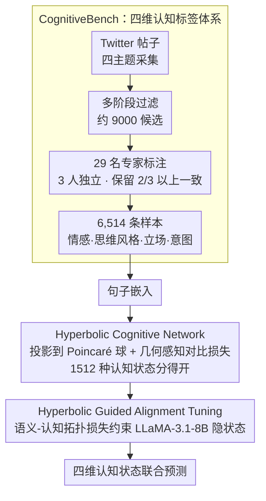

# Modeling Multi-Dimensional Cognitive States in Large Language Models under Cognitive Crowding

**会议**: ACL 2026  
**arXiv**: [2604.17174](https://arxiv.org/abs/2604.17174)  
**代码**: [GitHub](https://github.com/Chips98/HyCoLLM_for_ACL2026)  
**领域**: LLM评测  
**关键词**: 认知状态建模, 认知拥挤, 双曲空间, 多维度联合预测, CognitiveBench

## 一句话总结

本文发现 LLM 在联合预测情感-思维风格-立场-意图四个认知维度时准确率暴跌至 5.7%（"认知拥挤"效应），通过 Gromov δ-hyperbolicity 分析证明认知状态具有层次结构，提出 HyCoLLM 框架在双曲空间中建模认知状态，8B 模型超越 GPT-4o。

## 研究背景与动机

**领域现状**：LLM 在单独的情感分析、立场检测、意图识别等任务上表现良好，但这些任务通常被独立处理。心理学研究表明认知维度形成交互系统——例如对立立场可能源于深思熟虑的分析风格或愤怒情绪。

**现有痛点**：(1) 现有基准最多覆盖两个认知维度（如立场+情感），无法研究四维度交互；(2) 缺乏"思维风格"维度的标注——思维风格是连接情感到立场的关键桥梁；(3) LLM 在单任务表现好但联合多维度建模时性能暴跌——GPT-4o 四维度联合准确率仅 5.7%。

**核心矛盾**：认知状态具有层次/树状结构（Gromov δ ≈ 1%），需要指数级增长的表示空间，而 LLM 的欧氏表示空间仅多项式增长。这种"认知拥挤"导致不同认知状态在欧氏空间中重叠、无法区分。

**本文目标**：(1) 构建首个四维度认知基准 CognitiveBench；(2) 诊断并解释 LLM 的联合建模瓶颈；(3) 提出几何感知的解决方案。

**切入角度**：利用双曲空间天然的指数级体积增长和层次结构支持来缓解认知拥挤。

**核心 idea**：在双曲空间（Poincaré球）中建模认知状态，通过几何感知对比损失分离不同状态，再通过 Hyperbolic Guided Alignment Tuning 对齐 LLM 的内部表示。

## 方法详解

### 整体框架

HyCoLLM 把"四维认知状态联合预测"建模成一个先在双曲空间里铺开认知坐标系、再把 LLM 拉到这个坐标系上的两阶段过程。输入是一条社交帖子，第一阶段 Hyperbolic Cognitive Network (HCN) 把它的句子嵌入投影到 Poincaré 球上，用几何感知对比损失把 1512 种认知状态组合摊在双曲流形的不同区域；第二阶段 Hyperbolic Guided Alignment Tuning (HGAT) 在微调 LLaMA-3.1-8B-Instruct 时，用语义-认知拓扑损失约束模型隐状态去贴合 HCN 学好的几何，最终输出情感、思维风格、立场、意图四个维度的联合预测。

### 关键设计

**1. CognitiveBench：把"思维风格"补进四维认知标签体系**

现有基准最多只覆盖立场+情感两维，缺的恰恰是连接情绪到立场的"思维风格"桥梁，导致没法研究维度间交互。作者从 Twitter 围绕中美贸易、美国大选、DEI、美联储利率四个主题收集帖子，多阶段过滤得到约 9000 候选样本，再请 29 名心理学/情感计算背景的专家逐条标注。每条样本由 3 人独立标注、只保留 2/3 以上一致的，最终留下 6,514 条高质量样本。四个维度的标签体系都挂在成熟心理学理论上——情感用 Plutchik 情绪模型、思维风格用双过程理论（直觉 vs 分析）、立场用社会判断理论、意图用言语行为理论，保证标签不是凭空设计而是有据可循。

**2. Hyperbolic Cognitive Network：在双曲空间里给认知状态腾出指数级空间**

四个维度的标签组合数高达 $9\times8\times3\times7=1512$ 种，而欧氏空间的体积只随半径多项式增长，根本塞不下这么多层次化状态，不同认知状态会互相重叠分不开——这正是"认知拥挤"的几何根源。HCN 把句子嵌入映射到 Poincaré 球，用几何感知对比损失把同类认知状态拉近、不同状态推远。双曲空间体积随半径指数增长，天然适配树状层次结构（CognitiveBench 实测 Gromov 相对 $\delta\approx1\%$，确属强层次数据），因此 1512 种状态都能找到各自分得开的落点。

**3. Hyperbolic Guided Alignment Tuning：把双曲几何先验注入 LLM 的推理**

光在双曲空间里学好认知嵌入还不够，LLM 自己推理时仍走欧氏隐空间、用不上这套层次结构。HGAT 在微调阶段引入语义-认知拓扑损失（Semantic-Cognitive Topology Loss），约束 LLM 隐状态的拓扑结构与 HCN 学到的双曲认知空间保持一致，加上标准生成损失共同优化。这样几何先验被真正写进模型的推理过程，使其在联合预测时能依赖认知维度之间的层次关系，而不是把四个维度当成互相独立的分类头。

## 实验关键数据

### 主实验

| 模型 | 单维度平均准确率 | 四维度联合准确率 |
|------|----------------|----------------|
| GPT-4o | ~50-60% | 5.7% |
| LLaMA-3.1-8B (SFT) | ~45-55% | ~4% |
| **HyCoLLM-8B** | **提升** | **显著提升（超GPT-4o）** |

### 消融实验

| 配置 | 联合准确率 | 说明 |
|------|----------|------|
| HyCoLLM (Full) | 最高 | 完整框架 |
| w/o HCN | 下降 | 无双曲认知网络 |
| w/o HGAT | 下降 | 无对齐微调 |
| 欧氏对比学习替代 | 下降 | 验证双曲几何的必要性 |

### 关键发现

- GPT-4o 单维度表现合理，但四维度联合仅 5.7%——这不是能力不足，而是表示空间的几何限制
- Gromov δ-hyperbolicity 分析确认 CognitiveBench 的相对 δ ≈ 1%，强层次结构
- HyCoLLM 的 8B 模型在联合建模上超越 GPT-4o，证明几何先验的有效性
- 思维风格（thinking）维度的加入显著影响立场和意图的预测——四维度之间确实存在交互

## 亮点与洞察

- "认知拥挤"概念精准诊断了 LLM 多维度联合建模的瓶颈——不是能力问题而是几何限制
- 用 Gromov δ-hyperbolicity 分析数据结构的做法为"什么时候该用双曲空间"提供了数据驱动的判断依据
- 8B 超越 GPT-4o 的结果强有力地说明了几何先验的价值

## 局限与展望

- CognitiveBench 仅覆盖英文推特数据，跨文化和跨语言泛化未知
- 双曲空间操作增加了训练复杂度和数值不稳定风险
- 四维度的标签体系可能仍不够全面——性格、价值观等更深层认知维度未涉及
- 标注成本高（29名专家×两个月），可扩展性有限

## 相关工作与启发

- **vs SemEval-16**: 仅覆盖立场+情感两个维度，无思维风格
- **vs DoT (Chen et al.)**: DoT 关注单一认知扭曲检测，本文是多维度联合建模
- **vs 双曲嵌入**: 此前双曲空间在 NLP 中主要用于词嵌入和知识图谱，本文首次应用于认知状态建模

## 评分

- 新颖性: ⭐⭐⭐⭐⭐ 认知拥挤概念+双曲空间解决方案+四维度基准，高度原创
- 实验充分度: ⭐⭐⭐⭐ 消融充分，但仅一个基座模型
- 写作质量: ⭐⭐⭐⭐ 框架清晰，但部分技术细节密度高
- 价值: ⭐⭐⭐⭐⭐ 揭示了 LLM 认知建模的根本瓶颈并提供了有效解决方案

<!-- RELATED:START -->

## 相关论文

- [\[ACL 2026\] HumanLLM: Benchmarking and Improving LLM Anthropomorphism via Human Cognitive Patterns](humanllm_benchmarking_and_improving_llm_anthropomorphism_via_human_cognitive_pat.md)
- [\[ACL 2026\] SciImpact: A Multi-Dimensional, Multi-Field Benchmark for Scientific Impact Prediction](sciimpact_a_multi-dimensional_multi-field_benchmark_for_scientific_impact_predic.md)
- [\[ICML 2025\] MultiCogEval: Evaluating LLMs Across Multi-Cognitive Levels](../../ICML2025/llm_evaluation/evaluating_llms_across_multi-cognitive_levels_from_medical_knowledge_mastery_to_.md)
- [\[ACL 2026\] SessionIntentBench: A Multi-Task Inter-Session Intention-Shift Modeling Benchmark](sessionintentbench_a_multi-task_inter-session_intention-shift_modeling_benchmark.md)
- [\[ACL 2026\] K-MetBench: A Multi-Dimensional Benchmark for Fine-Grained Evaluation of Expert Reasoning, Locality, and Multimodality in Meteorology](k-metbench_a_multi-dimensional_benchmark_for_fine-grained_evaluation_of_expert_r.md)

<!-- RELATED:END -->
