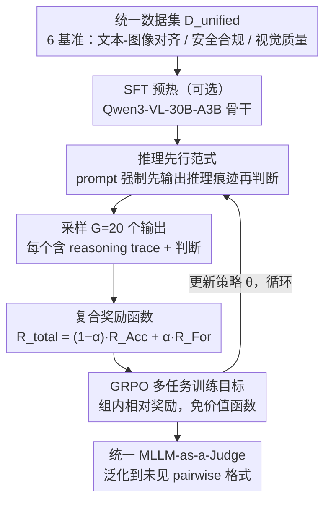

# Multi-Task Reinforcement Learning for Enhanced Multimodal LLM-as-a-Judge

**会议**: ACL 2026  
**arXiv**: [2603.11665](https://arxiv.org/abs/2603.11665)  
**代码**: 无  
**领域**: 多模态VLM / 自动评估  
**关键词**: MLLM-as-a-Judge, 多任务强化学习, GRPO, 统一评估, 分布外泛化

## 一句话总结

本文提出 MT-RL-Judge，一个多任务强化学习框架，通过 GRPO 联合优化多个评估任务训练统一的 MLLM-as-a-Judge 模型，在文本-图像对齐、安全合规和视觉质量评估等六个基准上一致超越 SFT 基线，并在未见过的 MJ-Bench 配对比较格式上展现出强大的分布外泛化能力（Safety 任务 82.23% vs SFT-Unified 的 49.40%）。

## 研究背景与动机

**领域现状**：MLLM-as-a-Judge 范式已成为大规模多模态内容评估的主流方案。现有方法分为两类：(1) 基于 prompt 的 Judge——直接使用现成 MLLM，通过 prompt 工程注入评估指南；(2) 微调 Judge——在特定评估数据集上 SFT 或 RL 训练，提升评估能力。

**现有痛点**：(1) 仅依赖 prompt 工程的 Judge 在复杂任务上表现不佳，需要任务特定训练；(2) 现有可训练 Judge 通常专注于单一任务（如安全合规或图像质量），无法泛化到多样化评估场景；(3) SFT 训练的 Judge 容易过拟合到特定指令格式——在 pointwise 评估上训练的模型无法处理 pairwise 比较任务，这在需求频繁变化的工业场景中极不实用；(4) 部署多个专用 Judge 模型维护成本高、推理开销大。

**核心矛盾**：SFT 的最大似然估计目标鼓励模型记忆输入-输出的表面统计关联，而非内化评估推理逻辑——导致模型在训练分布内表现良好，但对格式或任务的微小变化就会崩溃。

**本文目标**：构建一个统一的、RL 增强的 MLLM-as-a-Judge 框架，能够同时处理多样化评估任务，同时保持对未见任务格式的泛化能力。

**切入角度**：利用 RL（特别是 GRPO）鼓励模型在给出判断前先生成推理步骤，从而内化评估逻辑而非记忆表面模式。多任务训练让模型接触不同评估维度的共享标准，进一步增强泛化。

**核心 idea**：多任务 RL + 推理先行（reasoning-first）= 既准确又泛化的统一 Judge。

## 方法详解

### 整体框架

MT-RL-Judge 想训出一个"既准又泛化"的统一多模态评判模型，做法是把六个评估基准拼成一个统一数据集 $D_{unified}=\bigcup_{k=1}^{K}D_k$（覆盖文本-图像对齐的 SeeTRUE/ImageReward、安全合规的 UnsafeBench、视觉质量的 AGIN 三子集），在 Qwen3-VL-30B-A3B-Instruct 骨干上先做可选的 SFT 预热，再用多任务 GRPO 强化学习联合优化。训练时每条样本进来，模型被「推理先行」的 prompt 要求先吐出一段推理痕迹再给判断；对同一 prompt 采样多个输出后，由一个同时看格式和准确率的复合奖励打分，GRPO 用组内相对奖励更新策略并循环，从而把评估逻辑内化成推理能力而非记住某种 prompt 模板。

### 关键设计

**1. 推理先行范式：强制 Judge 先"想"再"判"**

SFT 的最大似然目标本质是模仿输入-输出的统计映射，没学到推理过程，所以输入从单图换成双图就崩。推理先行范式在 RL 的 prompt 里要求模型先输出 reasoning trace、再给出最终判断，并由后面的格式奖励 $R_{For}$ 强制执行这一结构。让模型必须在推理中把分析逻辑展开，它就更接近与人类偏好一致的评判逻辑；这种"思考能力"在遇到训练时没见过的任务格式（如 pairwise 比较）时尤为关键，是 RL 相比 SFT 能迁移到新格式的根本原因。

**2. 复合奖励函数：把"先推理后判断"和"判断对不对"绑在一个标量里**

只奖励准确率，模型会直接跳到结论、退化成记忆表面映射；只奖励格式又保证不了判断质量。作者把总奖励写成两项线性组合 $R_{total}=(1-\alpha)\cdot R_{Acc}+\alpha\cdot R_{For}$，其中 $R_{Acc}$ 在预测正确时为 1.0、否则 0.0，$R_{For}$ 在输出遵循上一步"推理优先"结构时为 1.0、否则 0.0，$\alpha$ 调节两者权重。格式奖励逼模型在下判断前先展开类似 CoT 的分析，既提升判断质量也带来可解释性；准确率奖励则直接对齐判断正确性，两者合起来让"会推理"和"判得准"同时被强化。

**3. GRPO 多任务训练目标：用组内相对奖励替掉价值函数，在统一数据集上联合优化**

单任务 RL 学到的标准容易绑死在某一类评估上，换个格式就失效。MT-RL-Judge 对统一数据集里的每个 prompt 从当前 Judge 采样 $G=20$ 个输出，按上面的复合奖励做组内相对的策略优化，免去显式价值函数，优化目标为最大化整个统一集上的期望奖励 $\theta^*=\arg\max_\theta\mathbb{E}_{(x,p,y)\sim D_{unified}}[R_{total}(M_\theta(x))]$。把多个评估域混在一起训练，模型被迫去捕捉跨域共享的评判标准和潜在关联，而不是过拟合到某个 prompt 模板，这正是后面分布外泛化的来源。

### 损失函数 / 训练策略

SFT 阶段用 AdamW，学习率 $1.0\times10^{-5}$、batch size 256、全参数微调。RL 阶段用 GRPO，rollout $N=20$、全局 batch size 256、rollout batch size 512。所有模型在验证集性能进入平台期后停止，选最优 checkpoint。

## 实验关键数据

### 主实验

**六个评估任务上的 Macro-F1 对比**

| 方法 | AGIN-Nat | AGIN-Tech | AGIN-Rat | SeeTRUE | ImageReward | UnsafeBench |
|------|----------|-----------|----------|---------|-------------|-------------|
| Off-the-shelf | 67.99 | 63.24 | 64.77 | 80.01 | 55.07 | 72.78 |
| SFT-Single | 78.64 | 77.04 | 78.08 | 80.41 | 64.95 | 90.28 |
| SFT-Unified | 81.75 | 81.22 | 81.31 | 82.32 | 63.34 | 89.49 |
| RL-Single | 80.50 | 80.77 | 82.71 | 83.41 | 65.07 | 86.92 |
| **MT-RL-Judge** | 81.63 | **81.37** | 81.58 | **83.67** | 64.97 | 85.22 |

### 消融实验

**MJ-Bench 分布外泛化（未见过的 pairwise 格式）**

| 方法 | Image-text Alignment | Safety Judge |
|------|---------------------|--------------|
| Off-the-shelf | 59.41 | 73.07 |
| SFT-Unified | 55.82 | 49.40 |
| **MT-RL-Judge** | **60.59** | **82.23** |

### 关键发现

- RL 一致优于 SFT：RL-Single 在 6 个任务中 5 个超过 SFT-Single，尤其在推理密集型任务上（SeeTRUE +3.0, AGIN-Rat +4.63）
- 统一训练不降反升：SFT-Unified 在多数任务上优于 SFT-Single，说明多任务暴露能让模型学习跨域的共享评估标准
- SFT 严重过拟合格式：SFT-Unified 在 MJ-Bench Safety 上崩溃至 49.40%，远低于零样本基线的 73.07%——尽管训练时见过安全评估任务，但仅因输入从单图变为双图就完全失效
- MT-RL-Judge 泛化能力显著：在完全未见的 pairwise 格式上，Safety 达 82.23%（超 SFT-Unified 32.83 个百分点），验证了 RL 驱动的推理能力可以迁移到新格式

## 亮点与洞察

- SFT-Unified 在 MJ-Bench 上的灾难性退化是论文最有说服力的证据——清楚展示了 SFT 记忆格式而非学习逻辑的根本缺陷
- 多任务 RL 的"1+1>2"效应：联合训练不仅不牺牲单任务性能，反而通过跨任务知识共享提升了整体表现
- 推理先行的设计理念与近期 reasoning model（如 DeepSeek-R1、QwQ）的趋势一致，但应用在评估场景中是首次
- 实验设计精到：SFT-Single vs SFT-Unified vs RL-Single vs MT-RL-Judge 的四组对比清晰分离了统一训练和 RL 各自的贡献

## 局限与展望

- 实验主要在二分类评估任务上进行，未涉及多级评分或开放式评估
- 基座模型为 Qwen3-VL-30B-A3B（MoE），未验证在其他架构上的效果
- 六个训练任务的覆盖面仍然有限，更多评估维度的加入可能带来更强的泛化
- 未分析推理痕迹的质量和多样性，推理过程是否真正反映了评估逻辑仍需进一步验证

## 相关工作与启发

- **vs SFT-based Judges（MLLM-as-a-Judge）**: SFT Judge 过拟合 prompt 模板，MT-RL-Judge 通过 RL 推理学习内化评估逻辑
- **vs Mr. Judge / Flex-Judge**: 现有工作多为单任务训练，MT-RL-Judge 首次实现统一多任务 RL Judge
- **vs Self-Consistency 方法**: 采样多个候选并投票的方法计算昂贵且可能包含相似错误，MT-RL-Judge 通过推理质量提升判断准确性

## 评分

- 新颖性: ⭐⭐⭐⭐ 首个统一多任务 RL 的 MLLM-as-a-Judge 框架，SFT 过拟合格式的发现有深刻洞察
- 实验充分度: ⭐⭐⭐ 六个任务基准充分，但缺少更多 OOD 泛化测试和推理质量分析
- 写作质量: ⭐⭐⭐⭐ 问题动机清晰，实验对比设计精巧，但方法细节偏简洁
- 价值: ⭐⭐⭐⭐ 为工业级多模态评估提供了统一且泛化的解决方案，MJ-Bench 泛化结果令人信服

<!-- RELATED:START -->

## 相关论文

- [\[ICML 2026\] Agent World Model: Infinity Synthetic Environments for Agentic Reinforcement Learning](../../ICML2026/llm_evaluation/agent_world_model_infinity_synthetic_environments_for_agentic_reinforcement_lear.md)
- [\[ACL 2026\] Contrastive Decoding Mitigates Score Range Bias in LLM-as-a-Judge](contrastive_decoding_mitigates_score_range_bias_in_llm-as-a-judge.md)
- [\[ACL 2026\] Reasoning Model Is Superior LLM-Judge, Yet Suffers from Biases](reasoning_model_is_superior_llm-judge_yet_suffers_from_biases.md)
- [\[ICML 2026\] Beyond Trajectory-Level Attribution: Graph-Based Credit Assignment for Agentic Reinforcement Learning](../../ICML2026/llm_evaluation/beyond_trajectory-level_attribution_graph-based_credit_assignment_for_agentic_re.md)
- [\[ACL 2026\] SessionIntentBench: A Multi-Task Inter-Session Intention-Shift Modeling Benchmark](sessionintentbench_a_multi-task_inter-session_intention-shift_modeling_benchmark.md)

<!-- RELATED:END -->
