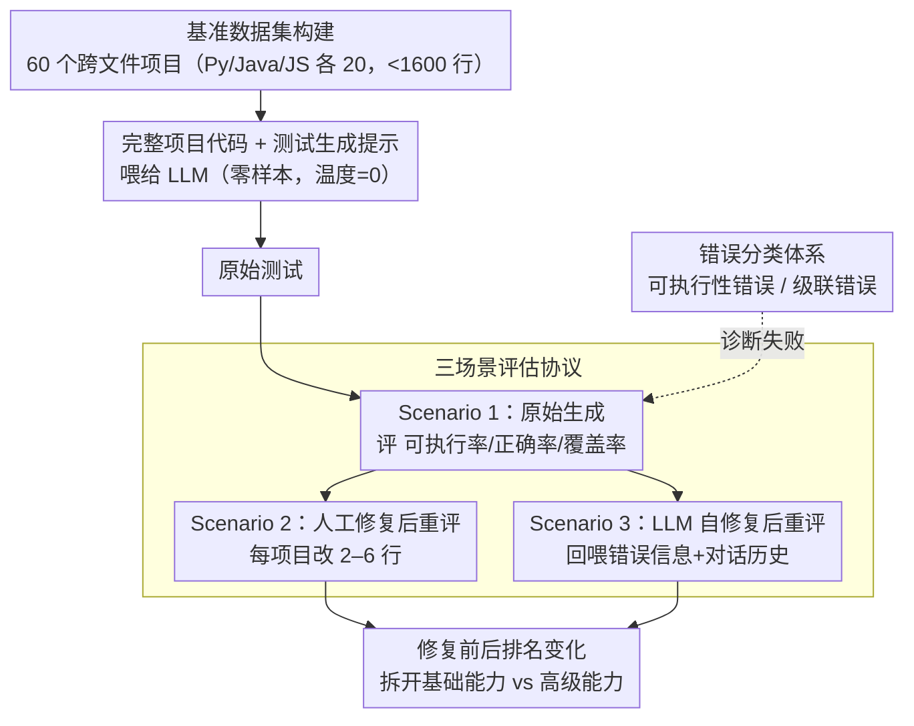

# MultiFileTest: A Multi-File-Level LLM Unit Test Generation Benchmark and Impact of Error Fixing Mechanisms

**会议**: ACL 2026  
**arXiv**: [2502.06556](https://arxiv.org/abs/2502.06556)  
**代码**: [GitHub](https://github.com/MultiFileTest)  
**领域**: LLM评测  
**关键词**: 单元测试生成, 多文件基准, 跨文件依赖, 错误修复, 代码质量

## 一句话总结
提出 MultiFileTest，首个多文件级别 LLM 单元测试生成基准，覆盖 Python/Java/JavaScript 各 20 个项目，评估 11 个前沿 LLM 并分析手动修复和自修复机制对测试质量的影响，揭示即使最强模型也存在大量基础可执行性错误。

## 研究背景与动机

**领域现状**：LLM 驱动的单元测试生成已成为代码辅助的重要用例，显著提升了测试的可读性和生成效率。现有基准主要评估函数级或类级（单文件）代码的测试生成能力。

**现有痛点**：(1) 真实项目中函数跨文件交互、依赖复杂，但现有基准忽略了多文件级别的测试生成挑战；(2) 唯一涉及多文件测试的 DevBench 仅有 16 个项目且设计目的是广度覆盖而非深度评估，缺乏对跨文件依赖和错误的系统分析；(3) LLM 生成的测试中大量基础错误（不可执行、级联失败）阻碍了对更高级能力（正确性、覆盖率）的评估。

**核心矛盾**：多文件测试生成的核心难点不在于生成测试逻辑本身，而在于正确理解跨文件依赖关系并正确设置测试环境——这恰恰是 LLM 推理能力的薄弱环节。

**本文目标**：(1) 构建高质量多文件测试基准；(2) 系统评估前沿 LLM 在此任务上的表现；(3) 分析错误类型并评估修复机制的效果。

**切入角度**：通过手动修复基础错误后重新评估，区分 LLM 的"基础能力不足"和"高级能力不足"，揭示不同模型的真实潜力差异。

**核心 idea**：分三个场景评估——原始生成（Scenario 1）、手动修复后（Scenario 2）、LLM 自修复后（Scenario 3），通过错误修复前后的排名变化揭示模型间的本质差异。

## 方法详解

### 整体框架

MultiFileTest 是一个评估基准而非训练方法，核心是用一套受控的项目集合 + 三场景协议把"LLM 在跨文件依赖下生成单元测试"这件事量化清楚。基准收录 60 个精选 GitHub 项目（Python/Java/JavaScript 各 20 个），每个项目 2–15 个文件、不到 1600 行且必含跨文件依赖。评估时把完整项目代码连同测试生成提示喂给 LLM，零样本、温度设为 0 拿到原始测试，先评一遍可执行率/正确率/覆盖率，再分别经过人工修复和 LLM 自修复后各重评一次，通过修复前后排名的变化把"基础能力不足"和"高级能力不足"拆开。

### 关键设计

**1. 基准数据集构建：把项目卡在上下文窗口内、又强制带跨文件依赖**

真实项目要么太大塞不进上下文、要么是单文件测不出多文件推理，难以公平比较。作者从 GitHub 按三条标准筛选：规模适中（2–15 文件、<1600 行）、文件之间存在依赖、star/fork 数高，对过大的项目则提取自包含子项目并相应调整依赖路径，所有项目还经过语法验证和多行语句合并。规模上限保证不同模型在同一上下文预算下比较，而"必须有跨文件依赖"这条硬约束让多文件推理成为完成任务的必要属性，而不是可绕过的加分项。

**2. 三场景评估协议：用"修复前后"剥离基础错误对能力评价的干扰**

一个缺失的 import 这类可执行性错误本身很简单，却会让正确率和覆盖率直接归零，把模型在测试逻辑设计上的真实差距全盖住。协议因此设三个场景：Scenario 1 评原始生成质量；Scenario 2 由 CS PhD 手动修复可执行性和级联错误（平均每项目只改 2–6 行），露出模型排除基础错误后的真实潜力；Scenario 3 则把错误信息和对话历史回喂给 LLM 让它自修复。三者对比既给出更公平的能力排名，又能量化各模型的自修复水平离人工修复有多远。

**3. 错误分类体系：把可执行性错误和级联错误分开统计**

不区分错误类型就没法理解模型到底栽在哪。基准把错误分成两类：可执行性错误指整个测试套件跑不起来（如 ModuleNotFoundError），级联错误指单一根因引发多个测试同时失败（如缺一个 NumPy import 就让一批测试集体报错）。把"整体不可执行"和"个别测试失败"拆开，既能解释为什么原始正确率被严重低估，也支撑了三场景协议里"手动修复少数几行就能大幅改变排名"的现象。

## 实验关键数据

### 主实验（Python，原始生成 Scenario 1）

| 模型 | 正确率(CR) | 可执行率(ER) | 行覆盖(LC) | 分支覆盖(BC) |
|------|-----------|-------------|-----------|-------------|
| Gemini-3.0-Pro | 77% | 85% | 76% | 73% |
| Claude-3.5-Sonnet | 64% | 70% | 51% | 47% |
| GPT-o1 | 60% | 65% | 56% | 54% |
| GPT-5-mini | 53% | 60% | 51% | 50% |
| GPT-4-Turbo | 47% | 65% | 40% | 36% |

### 跨语言对比

| 语言 | 最佳模型 | 最佳 CR | 说明 |
|------|---------|--------|------|
| Python | Gemini-3.0-Pro | 77% | 相对最容易 |
| Java | Gemini-3.0-Pro | 62% | 严格语法增加难度 |
| JavaScript | GPT-o1 | 最高 | 不同语言最优模型不同 |

### 关键发现
- 手动修复后模型排名发生显著变化，说明不同模型的错误分布和改进潜力差异很大
- 即使 Gemini-3.0-Pro（最强模型）在 Python 上仍有 15% 的项目不可执行，揭示了多文件理解的根本挑战
- Java 是最困难的语言，主要因为更严格的类型系统和语法要求
- LLM 自修复能力虽然有效但远不及人工修复质量

## 亮点与洞察
- 三场景评估设计非常巧妙——通过"修复基础错误后重评"区分了"简单修复可解决的问题"和"本质能力不足"，给出了更公平的模型评价
- 级联错误的概念对实际应用很重要：一个缺失的 import 可能导致 20 个测试同时失败，使错误数量膨胀
- 开源模型（CodeQwen、DeepSeek-Coder 等）在多文件测试生成上与闭源模型差距巨大，凸显了复杂推理能力的瓶颈

## 局限与展望
- 项目规模限制在 <1600 行以适配上下文窗口，真实大型项目的测试生成挑战更大
- 当前仅使用零样本评估，few-shot 或 agent 式的迭代生成策略可能显著提升性能
- 手动修复的标准化程度取决于标注者，虽然有协议但仍有主观成分

## 相关工作与启发
- **vs DevBench**: DevBench 仅 16 个多文件项目且不强制跨文件依赖；MultiFileTest 3.75 倍项目量且保证跨文件推理
- **vs HumanEval/MBPP**: 这些基准仅评估函数级代码生成，无法反映真实项目中的依赖理解能力
- **vs SWT-Bench**: SWT-Bench 聚焦 bug 修复而非测试生成，MultiFileTest 更聚焦于测试的完整性和覆盖率

## 评分
- 新颖性: ⭐⭐⭐⭐ 首个系统性多文件单元测试基准
- 实验充分度: ⭐⭐⭐⭐⭐ 11个模型、3种语言、3种场景、详细错误分析
- 写作质量: ⭐⭐⭐⭐ 结构清晰，错误分类直观
- 价值: ⭐⭐⭐⭐⭐ 填补了多文件测试评估的重要空白

<!-- RELATED:START -->

## 相关论文

- [\[ACL 2026\] SciImpact: A Multi-Dimensional, Multi-Field Benchmark for Scientific Impact Prediction](sciimpact_a_multi-dimensional_multi-field_benchmark_for_scientific_impact_predic.md)
- [\[ACL 2026\] AgentEval: DAG-Structured Step-Level Evaluation for Agentic Workflows with Error Propagation Tracking](agenteval_dag-structured_step-level_evaluation_for_agentic_workflows_with_error_.md)
- [\[ACL 2026\] HoWToBench: Holistic Evaluation for LLM's Capability in Human-level Writing using Tree of Writing](howtobench_holistic_evaluation_for_llms_capability_in_human-level_writing_using_.md)
- [\[ACL 2026\] Challenging the Boundaries of Reasoning: An Olympiad-Level Math Benchmark for Large Language Models](challenging_the_boundaries_of_reasoning_an_olympiad-level_math_benchmark_for_lar.md)
- [\[ACL 2026\] arXiv2Table: Toward Realistic Benchmarking and Evaluation for LLM-Based Literature-Review Table Generation](arxiv2table_toward_realistic_benchmarking_and_evaluation_for_llm-based_literatur.md)

<!-- RELATED:END -->
