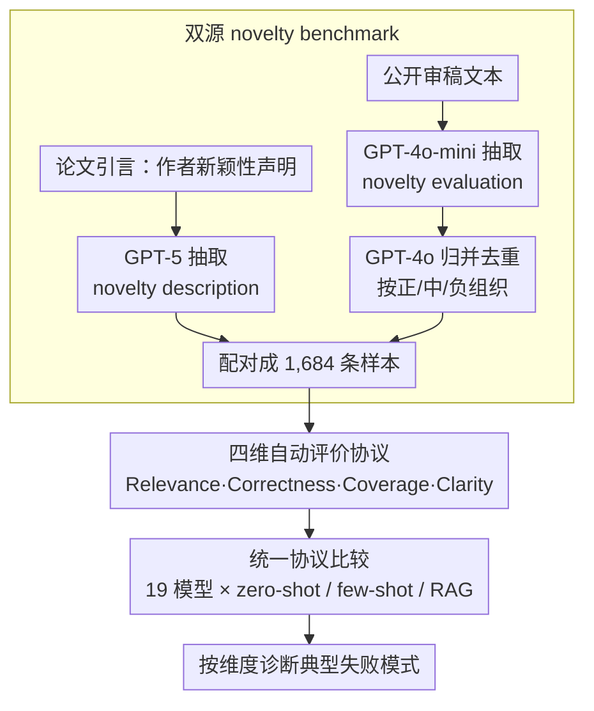

# NovBench: Evaluating Large Language Models on Academic Paper Novelty Assessment

**会议**: ACL2026  
**arXiv**: [2604.11543](https://arxiv.org/abs/2604.11543)  
**代码**: https://github.com/njust-winchy/llm4novelty  
**领域**: AIGC检测 / 自动同行评审 / 学术文本评估  
**关键词**: 学术新颖性评估, 自动同行评审, LLM评测, 评审文本生成, 语义评价指标

## 一句话总结
NovBench 把“论文引言中的新颖性主张”和“审稿人对新颖性的文字评价”配对成 1,684 条基准样本，并用相关性、正确性、覆盖度、清晰度四个维度系统揭示：当前通用 LLM 和审稿专用 LLM 都能写出流畅评价，但仍难以真正理解和完整判断学术新颖性。

## 研究背景与动机
**领域现状**：学术论文评审长期把 novelty 视为核心标准之一，尤其在 NLP、机器学习等投稿量快速增长的领域，审稿人需要判断一篇论文是否提出了新的任务、方法、资源、实验设置或理论观察。已有自动化同行评审研究主要关注总体评分、完整 review 生成或 paper-level recommendation，也有一些工作用 bibliometric 指标、文本嵌入或 LLM 给论文新颖性打分。

**现有痛点**：这些方法大多把“新颖性”处理成一个分数或泛化的评审片段，缺少对自由文本 novelty evaluation 的专门评测。ROUGE、BLEU、BERTScore 这类指标偏词面或句向量相似，不能判断模型是否覆盖了审稿人真正关心的新颖性点；LLM-as-judge 又不透明，容易把评价权交给另一个未校准模型。

**核心矛盾**：新颖性评价既要忠实理解作者在引言中声明的贡献，又要像审稿人一样判断这些贡献是否充分、是否只是常规组合、是否存在夸大或遗漏。模型如果只复述 introduction，会有高表面相关性但缺少审稿判断；如果模仿 review 语气，又可能产生看似专业但无依据的批评。

**本文目标**：作者希望把 novelty assessment 从宽泛的自动审稿任务中单独拆出来，建立一个可复现 benchmark；同时设计比词面重叠更可解释的评价维度，能分别检查模型是否理解来源文本、是否与人类审稿判断一致、是否覆盖人类指出的新颖性点，以及输出是否清楚具体。

**切入角度**：论文没有要求模型读完整论文，而是选择 introduction 中的 novelty description 作为输入，因为引言通常最明确地陈述论文声称的贡献；再把公开审稿文本中与 novelty 相关的评价抽取出来，作为人类判断的参考。这一设计牺牲了一部分全文信息，但换来了任务输入的标准化和大规模可构建性。

**核心 idea**：用“作者声称的新颖性”到“审稿人评价的新颖性”的配对数据，专门测 LLM 生成 novelty review text 的能力，而不是只看总体 review 或单个 novelty 分数。

## 方法详解

### 整体框架

NovBench 想回答的是一个被以往自动审稿研究混在一起的问题：LLM 到底会不会像审稿人那样评价一篇论文的新颖性。为此作者把任务输入收窄为论文引言里作者自己声明的 novelty description，输出定为按正/中/负情感组织的新颖性评价文本，并以审稿人真实写下的 novelty 评价作为参照。整条流水线由数据构建和评价协议两层组成：前者从论文引言和公开审稿文本中分别抽取作者声明与专家判断、配对成 1,684 条样本；后者不看生成文本与 gold review 的整体相似度，而是拆成 Relevance、Correctness、Coverage、Clarity 四个维度，让每个维度对应一种典型失败模式，再把 19 个模型放进 zero-shot / few-shot / RAG 同一协议下对比。

### 关键设计

**1. 双源 novelty benchmark：把作者的声明和审稿人的判断对齐**

新颖性评价的难点在于它有两个端点——作者在引言里说"我有什么创新"，审稿人则判断"这个创新是否真的成立"。只靠人工标注无法扩到上千篇论文，只靠引言又丢掉了专家判断，所以作者做双源构建。作者端先人工标注 COLING 2020 的 87 篇论文来挑选抽取方法，比较多种 prompt 后用带上下文 prompt 的 GPT-5 批量抽取 EMNLP 2023 引言中的 novelty sentences；审稿端复用已有 peer review aspect identification 资源里的 novelty aspect 数据，经评测后选 GPT-4o-mini 抽取审稿文本中的新颖性评价，最后由 GPT-4o 合并重复评价并按 positive / neutral / negative 组织。这样得到的样本同时保留了作者声明和外部评价，模型若只是流畅复述引言就无法过关。

**2. 四维自动评价协议：把混合分数拆成四种失败模式**

novelty evaluation 出错的方式并不单一：模型可能写得很相关却立场全反，可能立场对却漏掉关键 novelty point，也可能覆盖很多点却空泛。因此作者拒绝用一个混合分数，而是分维度诊断。Relevance 用 Maximum Matching Average IMS 衡量生成评价是否覆盖输入 novelty description，对每个来源句取最相似生成句的 IMS 后求平均；Correctness 用情感分布距离 $DistAcc=1-\sum_i |p_i-t_i|/2$ 比较模型与人类评价的正/中/负比例；Coverage 用句向量余弦相似度、以阈值 $\tau=0.7$ 检查有多少 human novelty evaluation 点被模型覆盖；Clarity 综合关键词覆盖、句长充分性和基于 perplexity 的流畅度。四个维度分开，才能让"立场像不像人"和"点覆没覆盖到"不被同一个相似度数字掩盖。

**3. 统一协议比较通用模型、审稿专用模型与提示策略**

自动审稿领域常默认"换更强的 LLM"或"用 review 数据微调"就会更像审稿人，但 novelty 是细粒度判断任务，必须在相同输入和相同指标下才能看清能力到底来自哪里。作者因此把 11 个通用模型（GPT-4o、GPT-5、Gemini-2.5-flash、DeepSeek-R1、Qwen3、gpt-oss 等）和 8 个审稿专用模型（CycleReviewer、DeepReviewer、Llama-OpenReviewer、Reviewer2、SEA-E、SEA-S 等）放进同一套协议，全部使用 greedy decoding、最大 4096 token，并在 zero-shot、few-shot、RAG 三种策略下生成同一格式的评价，从而把"现成 LLM 会不会评"、"审稿微调有没有用"、"few-shot/RAG 能不能补足"三个问题拆开来回答。

### 损失函数 / 训练策略

本文不训练新的 novelty 模型，也没有新的监督损失，相关设置都集中在数据抽取和基线推理上：抽取阶段固定 GPT-5 context prompt 抽 novelty description、GPT-4o-mini zero-shot 抽 novelty evaluation、GPT-4o 去重归并；评测阶段所有被测 LLM 统一用确定性 greedy decoding、最大 4096 token，以压低采样波动和截断干扰。RAG 的检索库取自 ACL Anthology 中 2019–2022 年 ACL、EMNLP、NAACL 的论文标题与摘要，每个样本检索 5 条作为额外上下文。

## 实验关键数据

### 主实验
NovBench 的最终数据来自 EMNLP 2023，共 1,684 篇论文；COLING 2020 的 87 篇子集主要用于人工标注和抽取方法选择。

| 数据资源 | 论文数 | 平均 novelty description 句数 | 平均 novelty evaluation 数 | 主要用途 |
|----------|--------|-------------------------------|-----------------------------|----------|
| COLING 2020 子集 | 87 | 6.1 | - | 人工标注抽取 novelty description，选择自动抽取模型 |
| NovBench / EMNLP 2023 | 1,684 | 5.3 | 7.7 | 正式 benchmark，配对作者创新声明与审稿人新颖性评价 |

核心模型结果显示，闭源通用模型在 Relevance 上整体强，SEA 系列等专用模型在 Coverage 和 DistAcc 上有优势，但没有任何模型在四个维度上全面接近理想 novelty reviewer。

| 模型 / 策略 | Relevance | Coverage | Clarity | DistAcc | 关键解读 |
|-------------|-----------|----------|---------|---------|----------|
| GPT-4o / zero-shot | 3.6983 | 0.2332 | 0.6595 | 0.6979 | 通用模型中相关性最强，能较好抓住引言中的创新声明 |
| GPT-4o / few-shot | 3.5609 | 0.2391 | 0.6587 | 0.7091 | few-shot 提升人类情感分布一致性，但相关性下降 |
| Gemini-2.5-flash / RAG | 3.5089 | 0.2270 | 0.6682 | 0.5923 | RAG 下清晰度较高，但 DistAcc 不突出 |
| SEA-S / zero-shot | 3.6304 | 0.2576 | 0.6630 | 0.7162 | 专用模型中综合表现强，尤其 DistAcc 较高 |
| SEA-E / RAG | 3.3807 | 0.2712 | 0.6585 | 0.5965 | Coverage 很高，说明能覆盖更多审稿人 novelty 点 |
| Reviewer2 / RAG | 0.1556 | 0.0000 | 0.0184 | 0.0709 | 指令跟随严重失败，几乎无法按任务输出有效评价 |

作者还用 100 个样本做人工偏好验证，证明四维自动指标不是单纯的工程拼凑，而是与人类判断有可观一致性。

| 验证项 | 数值 | 含义 |
|--------|------|------|
| 人类评估样本数 | 100 | 随机抽样比较两个模型输出优劣 |
| 评估者 | 4 名 NLP 专家 | 包括博士生、副教授和讲师 |
| Fleiss' $\kappa$ | 0.72 | 标注者之间达到 substantial agreement |
| Spearman $\rho$ | 0.61 | 自动指标与人类偏好显著相关，$p<0.001$ |
| Agreement | 78% | 自动指标选择的更优输出与多数人类判断一致 |

### 消融实验
论文没有对某个新模型做模块消融，而是把 prompting strategy 和模型类型作为核心分析变量。

| 配置 / 对比 | 关键指标变化 | 说明 |
|-------------|--------------|------|
| zero-shot | GPT-4o Relevance 3.6983，SEA-S Relevance 3.6304 | 多数模型在相关性上最好，说明直接让模型围绕 novelty description 评价时，最不容易偏离来源文本 |
| few-shot | GPT-4o DistAcc 0.7091，SEA-S DistAcc 0.7149，Qwen3-32B DistAcc 0.6944 | 示例能帮助模型模仿人类评价格式和情感分布，但也会让模型更像在学表达模板，而不是更深入理解 novelty |
| RAG | GPT-4o Relevance 从 zero-shot 3.6983 降到 3.4481，Gemini RAG Clarity 0.6682 | 检索内容让输出更清晰，但也可能把注意力从当前论文的新颖性主张上带偏 |
| 通用模型 vs 专用模型 | SEA-S/SEA-E 在 Coverage、DistAcc 上常优于同规模通用模型，但 Reviewer2 等模型崩溃 | 审稿数据微调能学习人类 review 风格，却不保证鲁棒指令跟随和真实 novelty 理解 |
| 人类 reviewer 的 Relevance | Human Relevance 2.7899 | 人类不会逐句复述引言，而是依赖领域知识做高层判断，所以自动相关性指标不能简单等同于审稿质量上限 |

### 关键发现
- LLM 的主要优势是信息抽取和表述清晰：它们可以从 novelty description 中抓住主要方法、任务或资源贡献，并写出结构化评价。
- 当前模型最明显的短板是“审稿式判断”：Coverage 普遍偏低，说明模型常漏掉审稿人关注的某些新颖性点，也不擅长区分不同类型 novelty 的权重。
- few-shot 更像让模型学会 human review 的口吻和情感分布；它提升 DistAcc 和部分 Coverage，但牺牲 Relevance，暗示模型可能在模拟样式而非增强理解。
- RAG 并不天然帮助 novelty assessment。外部论文标题和摘要会让生成文本更具体、更清楚，但如果检索结果与当前论文创新点不完全匹配，模型会出现 focus drift。
- 专用审稿模型的风险比预期更大：一些模型在特定 prompt 上微调后，遇到 NovBench 的结构化输出要求会重复、空输出或完全不按指令作答。

## 亮点与洞察
- 这篇论文最有价值的地方，是把“评 review 文本”这件事从总体自动审稿中剥离出来。相比判断一篇 review 好不好，单独看 novelty evaluation 更容易暴露模型是否真正理解学术贡献。
- NovBench 的双源设计很聪明：introduction 代表作者的显式创新声明，review text 代表专家对这些声明的外部判断。二者之间的张力正是 novelty assessment 的难点。
- 四维指标不是完美 gold standard，但比 ROUGE/BLEU 更贴近任务结构。尤其 DistAcc 和 Coverage 把“立场是否像人类”和“点是否覆盖人类”分开，避免一个高相似度分数掩盖不同错误。
- Human Relevance 低这个现象很有启发：好审稿不一定逐句贴合作者自述，真正的 novelty 判断往往依赖外部知识和领域经验。因此未来 benchmark 需要区分“忠实复述型评价”和“知识增强型审稿判断”。
- 对专用 LLM 的负面结果也很重要。审稿数据 fine-tuning 如果只学固定 prompt 和固定格式，可能牺牲通用指令跟随能力；自动审稿系统不能只看微调后在原任务上的分数。

## 局限与展望
- 最大局限是输入只使用 introduction。引言确实最集中地陈述贡献，但方法细节、实验设置和相关工作比较常常分散在全文其他部分，只看 introduction 可能低估或误判真实 novelty。
- 数据主要来自 COLING 和 EMNLP，且公开 review 多对应 accepted papers。这会带来选择偏差，也限制了结论向 ICLR、NeurIPS、跨学科会议或 rejected submissions 的推广。
- Benchmark 的 novelty 类型还比较粗。资源型论文、方法型论文、分析型论文的新颖性标准不同，而本文只做了较粗的 methodological/resource 额外分析，没有形成细粒度 taxonomy。
- 自动指标仍有近似性。Coverage 依赖 embedding 相似度和阈值，Clarity 中的关键词覆盖与 perplexity 也只是输出清晰度的代理，不能完全替代专家判断。
- RAG 设置比较朴素，只检索标题和摘要，没有系统探索多代理审稿、领域知识图谱、引用网络或全文 evidence retrieval。未来可以把 novelty claim 与相关工作证据显式对齐，减少模型凭空批评。
- 论文没有纳入 reviewer confidence score 到主评价中。事实上高置信审稿人和低置信审稿人的 novelty 判断权重应不同，这一点只在附录 disagreement analysis 中被初步观察。

## 相关工作与启发
- **vs 自动同行评审生成**: PeerRead、ReviewRobot、KID-review、MARG、AgentReview、TreeReview 等工作关注完整 review 或总体评分，本文只盯住 novelty 这一维，因此评测目标更窄但诊断更清楚。
- **vs 新颖性分数预测**: bibliometric novelty indicator、FastText + outlier detection、LLM novelty scoring 等方法通常输出数值分数，本文强调生成可解释文字评价，更接近真实审稿过程对作者有用的反馈。
- **vs LLM-as-judge 评测**: 许多自动审稿研究用另一个 LLM 评价生成 review 的质量，NovBench 选择可解释自动指标并做人类相关性验证，透明度更高，也便于定位错误类型。
- **vs aspect identification in peer review**: Lu et al. 的工作识别 review 中的方面标签，NovBench 在此基础上进一步把 novelty aspect 抽成可生成、可评测的 benchmark，可作为 aspect-level review generation 的后续任务。
- **启发**: 如果要构建更可靠的 AI 审稿助手，应让模型输出 evidence-grounded novelty claims、与相关工作差异、正/负/中性理由和置信度，而不是只生成一段流畅的总体评价。

## 评分
- 新颖性: ⭐⭐⭐⭐☆ 首个大规模专门评测 LLM 学术新颖性文字评价的 benchmark，问题切得准；但数据构建仍大量依赖 LLM 自动抽取。
- 实验充分度: ⭐⭐⭐⭐☆ 覆盖 19 个模型、3 种 prompting 策略和多项附加分析，并有人类一致性验证；不足是指标和数据源仍偏 NLP accepted-paper 场景。
- 写作质量: ⭐⭐⭐⭐☆ 论文结构清楚，数据构建、指标和实验分析都较完整；部分表格编号和文字存在小瑕疵，但不影响主线理解。
- 价值: ⭐⭐⭐⭐⭐ 对自动同行评审、LLM 科研辅助和学术文本评测都很有参考价值，尤其提醒社区不要把“写得像 review”误认为“真的会评 novelty”。

<!-- RELATED:START -->

## 相关论文

- [\[ACL 2026\] Zero-shot Large Language Models for Automatic Readability Assessment](zero-shot_large_language_models_for_automatic_readability_assessment.md)
- [\[ACL 2026\] EngiBench: A Benchmark for Evaluating Large Language Models on Engineering Problem Solving](engibench_a_benchmark_for_evaluating_large_language_models_on_engineering_proble.md)
- [\[ACL 2026\] SciCustom: A Framework for Custom Evaluation of Scientific Capabilities in Large Language Models](scicustom_a_framework_for_custom_evaluation_of_scientific_capabilities_in_large_.md)
- [\[ACL 2026\] Question Difficulty Estimation for Large Language Models via Answer Plausibility Scoring](question_difficulty_estimation_for_large_language_models_via_answer_plausibility.md)
- [\[ACL 2026\] SCAN: Structured Capability Assessment and Navigation for LLMs](scan_structured_capability_assessment_and_navigation_for_llms.md)

<!-- RELATED:END -->
