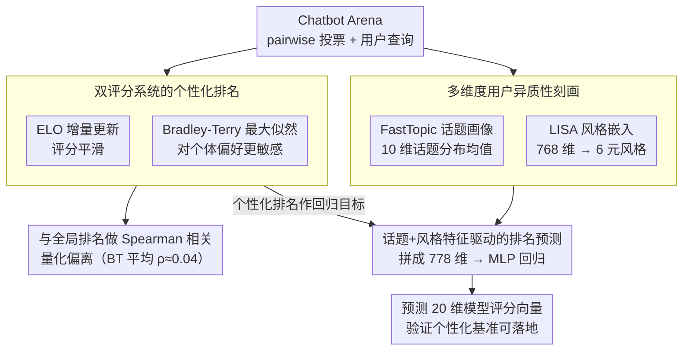

# Personalized Benchmarking: Evaluating LLMs by Individual Preferences

**会议**: ACL 2026 Findings  
**arXiv**: [2604.18943](https://arxiv.org/abs/2604.18943)  
**代码**: 无  
**领域**: LLM评估 / 个性化推荐  
**关键词**: 个性化基准评估, LLM排名, 用户偏好异质性, Bradley-Terry模型, 话题与风格分析

## 一句话总结

本文对 Chatbot Arena 的 115 名活跃用户进行个性化排名分析，发现 Bradley-Terry 个性化排名与全局排名的平均 Spearman 相关仅 ρ=0.04（57% 用户近零或负相关），证明聚合基准无法反映大多数用户的个体偏好，并通过话题+风格特征成功预测了用户特定的模型排名。

## 研究背景与动机

**领域现状**：Chatbot Arena、AlpacaEval、MT-Bench 等基准通过聚合所有用户的偏好投票来建立全局模型排名，隐式假设用户偏好是同质的。这些排名被广泛用于指导模型选择和开发方向。

**现有痛点**：(1) 用户需求千差万别——软件开发者偏好简洁精确的技术回答，创意写作者偏好丰富想象力的回答，聚合排名对两者都可能是次优推荐；(2) 随着 LLM 部署到越来越多样化的用户群体，聚合指标可能推荐一个对所有人"平庸"的模型，而非为特定用户群体找到"最佳"模型；(3) 缺乏量化证据来说明个体偏好到底偏离全局共识多远。

**核心矛盾**："一刀切"的模型排名 vs 用户偏好的根本异质性——用户不是围绕一个共同排序有微小偏差，而是有着与全局排名截然不同甚至相反的模型偏好。

**本文目标**：(1) 为每个用户计算个性化模型排名，量化其与全局排名的偏离程度；(2) 分析用户查询的话题和风格异质性；(3) 验证是否能用话题+风格特征预测用户特定的模型排名。

**切入角度**：利用 Chatbot Arena 现有的 pairwise 比较数据，分别用 ELO 和 Bradley-Terry 两种评分系统计算个性化排名，然后通过话题建模（FastTopic）和风格分析（LISA）表征用户异质性。

**核心 idea**：个性化基准评估——不再追求一个全局排名，而是为不同类型的用户提供不同的模型排名推荐，通过话题和风格特征作为桥梁连接用户特征和模型偏好。

## 方法详解

### 整体框架

这篇工作不训练新模型，而是把 Chatbot Arena 的 pairwise 投票当作显微镜，去检验"全局排名能不能代表个体用户"。整条分析分三步流入：先用 ELO 和 Bradley-Terry 两套评分系统，为 115 名活跃用户各自算出个性化模型排名，再与全局排名做 Spearman 相关，量化偏离有多大；然后用 FastTopic 话题建模和 LISA 风格嵌入，从"问什么"和"怎么问"两个维度刻画用户查询的异质性；最后把话题与风格特征拼成输入、用回归模型去预测每个用户的模型评分向量，验证个性化排名是否可以仅凭用户画像推断出来。

### 关键设计

**1. 双评分系统的个性化排名：用 ELO 和 Bradley-Terry 互相参照**

要说清"个体偏好偏离全局多远"，单一评分系统容易把结论锁死在某个算法的脾气上，所以作者同时跑两套。ELO 用增量更新维护每个模型的评分 $ELO_u(m_a) \leftarrow ELO_u(m_a) + K(1 - E_a)$（$K=32$），更新机制天然平滑偏好信号；Bradley-Terry 则用最大似然估计每个用户特定的模型强度 $\beta_{u,m}$，偏好概率 $P(m_a \succ_u m_b) = \frac{\beta_{u,m_a}}{\beta_{u,m_a} + \beta_{u,m_b}}$，对个体偏好变异更敏感。关键的是相关性只在用户真正评估过的模型上计算，避免未见模型注水。两套系统的差异本身就是发现——ELO 倾向高估与全局的一致性，BT 才更能暴露真实分歧。

**2. 多维度用户异质性刻画：话题与风格的正交画像**

要解释偏好分歧从何而来，需要把用户的查询行为表征成可比、可解释的特征。话题维度上，作者在所有用户查询的合集上训练一个全局 FastTopic 模型（10 个话题），每个用户的话题画像取其查询话题分布的均值 $\mathbf{t}_{u_i} \in \mathbb{R}^{10}$，全局话题空间保证了用户间直接可比；风格维度上，用 LISA 生成 768 维风格嵌入，经 LDA 压缩为 6 个元风格（Theatrical、Academic、Fervent、Hostile、Inquisitive、Fragmented），再用 HypoGeniC 生成自然语言风格假设。话题捕捉"用户问什么"、风格捕捉"用户怎么问"，二者正交互补，共同构成用户画像。

**3. 话题+风格特征驱动的排名预测：让个性化基准可落地**

如果个性化排名只能靠海量偏好投票才能得到，它就没有实用价值；所以作者要验证它能否从轻量画像里被预测出来。具体做法是把每个用户的话题画像和 LISA 风格嵌入拼接成 778 维输入 $\mathbf{x}_{u_i} = [\mathbf{t}_{u_i}; \mathbf{s}_{u_i}]$，回归目标是 20 维的模型评分向量；ELO 排名用 50 个 MLP 集成预测，BT 排名用单个 MLP 加 dropout 预测。一旦话题+风格能有效预测排名，就意味着个性化基准可以通过少量查询推断用户画像来实现，不必走繁重的偏好采集流程。

### 损失函数 / 训练策略

回归模型用 Adam 优化器，特征和目标都做标准化；ELO 预测用 50 个 MLP 集成加 early stopping 抑制过拟合，BT 预测则用单个 MLP 加 dropout。

## 实验关键数据

### 主实验

**个性化 vs 全局排名相关性**

| 评分系统 | 平均 ρ | 标准差 | 中位数 | 近零/负相关用户占比 |
|---------|-------|------|------|-------------------|
| ELO | 0.432 | 0.257 | 0.442 | 70% (ρ<0.5) |
| Bradley-Terry | 0.043 | 0.283 | 0.011 | 57% (ρ<0.1) |

### 消融实验

**排名预测 MAE**

| 模型 | ELO MAE | BT MAE |
|------|---------|--------|
| Mean-Predictor (全局均值) | 0.688 | 0.510 |
| Topic + Style (本文) | 0.450 (↓35%) | 0.450 (↓12%) |

### 关键发现

- BT 个性化排名的平均 ρ=0.043 在统计上与零不可区分（p=0.165），即对大多数用户来说个性化 BT 排名与全局排名无异于随机排序
- ELO 和 BT 的差异本身具有统计显著性（配对 Wilcoxon p<10⁻¹³），说明两者捕捉了根本不同的信号
- 用户话题多样性差异巨大——从仅 4 个主题集中到超过 20 个多样话题
- 6 个元风格（Theatrical、Academic 等）能有效区分用户群体，通过 k-means 聚类得到 3 个可解释的风格簇

## 亮点与洞察

- BT 模型比 ELO 更敏感地揭示了偏好分歧——这不是方法缺陷而是优势，因为 ELO 的增量更新机制天然平滑偏好信号。这提醒社区在选择排名算法时，算法本身会影响"个性化程度的可见性"
- 话题+风格特征的预测能力证明个性化基准是近期可实现的——只需从少量查询推断用户画像即可匹配模型，无需复杂的偏好采集流程
- 用户偏好不是围绕全局排名的"微小扰动"而是"根本不同的排序"——这挑战了当前 LLM 评估的基本范式

## 局限与展望

- 仅 115 名活跃用户（≥25 次投票），样本量有限
- 仅覆盖英文查询，跨语言异质性未知
- 分析为相关性而非因果性——话题/风格差异是否直接导致偏好差异需要进一步实验
- 可扩展到 Chatbot Arena 等平台的实时个性化推荐

## 相关工作与启发

- **vs Chatbot Arena**: 聚合所有用户偏好建立全局排名，本文证明这对 57% 的用户实际上是误导性的
- **vs HyPerAlign**: 关注可解释的个性化对齐，本文提供了量化偏好分歧的框架
- **vs RLHF**: 将人类偏好视为单一聚合信号，本文证明应建模个体差异

## 评分

- 新颖性: ⭐⭐⭐⭐⭐ 首次系统量化个性化vs全局排名分歧，发现具有冲击力
- 实验充分度: ⭐⭐⭐⭐ 双评分系统+话题/风格分析+回归预测，但样本量受限
- 写作质量: ⭐⭐⭐⭐⭐ 叙事流畅，论点层层推进，定量证据充分
- 价值: ⭐⭐⭐⭐⭐ 对LLM评估范式提出根本性挑战，实用路径清晰

<!-- RELATED:START -->

## 相关论文

- [\[ACL 2026\] ResearchBench: Benchmarking LLMs in Scientific Discovery via Inspiration-Based Task Decomposition](researchbench_benchmarking_llms_in_scientific_discovery_via_inspiration-based_ta.md)
- [\[ACL 2026\] BizCompass: Benchmarking the Reasoning Capabilities of LLMs in Business Knowledge and Applications](bizcompass_benchmarking_the_reasoning_capabilities_of_llms_in_business_knowledge.md)
- [\[ACL 2026\] RoleConflictBench: A Benchmark of Role Conflict Scenarios for Evaluating LLMs' Contextual Sensitivity](roleconflictbench_a_benchmark_of_role_conflict_scenarios_for_evaluating_llms39_c.md)
- [\[ICLR 2026\] Benchmarking Overton Pluralism in LLMs](../../ICLR2026/llm_evaluation/benchmarking_overton_pluralism_in_llms.md)
- [\[ACL 2026\] Do LLMs Overthink Basic Math Reasoning? Benchmarking the Accuracy-Efficiency Tradeoff](do_llms_overthink_basic_math_reasoning_benchmarking_the_accuracy-efficiency_trad.md)

<!-- RELATED:END -->
