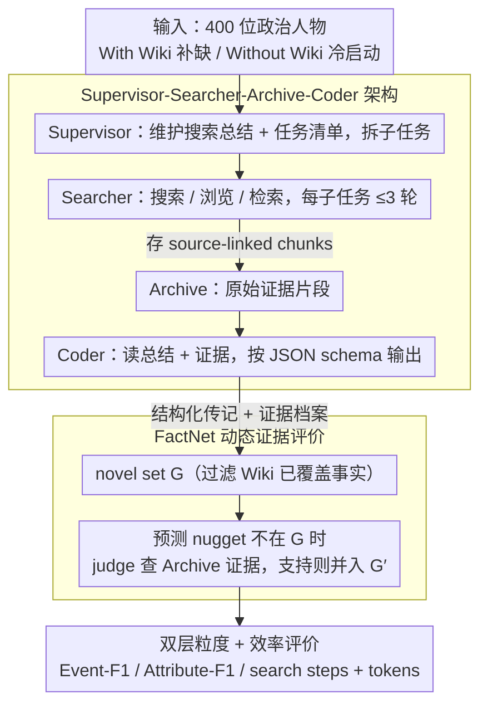

# PolitNuggets: Benchmarking Agentic Discovery of Long-Tail Political Facts

**会议**: ACL2026  
**arXiv**: [2605.14002](https://arxiv.org/abs/2605.14002)  
**代码**: https://github.com/yifeifrank/poli_searcher  
**领域**: information_retrieval  
**关键词**: agentic retrieval、政治传记、长尾事实、多语言检索、FactNet

## 一句话总结
PolitNuggets 提出一个面向 400 位全球政治人物、超过 1 万条政治履历事实的多语言 agentic discovery benchmark，并用 FactNet 动态证据验证协议发现：当前 agent 高精度但低召回，真正瓶颈是长尾事实发现、非英语证据和高效工具使用。

## 研究背景与动机
**领域现状**：长上下文 LRM 让模型能在给定材料里做 Reasoning in Context；工具增强 agent 又让模型可以主动搜索网页、读取资料、组织证据，逐步形成 Reasoning through Context。生产系统中的 Deep Research 已经展示出这种工作流的潜力。

**现有痛点**：很多已有 benchmark 仍偏向短程问答、单个事实查找或静态长文抽取。真实研究任务更像“重建一个人的职业轨迹”：事实分散在政府网页、新闻档案、非英语资料和旧版页面中，模型必须决定搜什么、读什么、何时停止、如何把片段证据合成结构化时间线。

**核心矛盾**：长上下文强并不等于 agentic discovery 强。模型也许能从一段干净证据里抽出事实，但当证据需要自己找、语言不统一、来源互相矛盾、相关事实弱连接时，失败往往发生在搜索策略和证据覆盖，而不是最终生成。

**本文目标**：作者希望建立一个可复现 benchmark，分别衡量政治长尾事实的发现能力、细粒度属性抽取能力和搜索成本，并进一步分析 agent 成功到底来自短上下文抽取、长上下文召回、参数知识、多语言能力还是工具调用可靠性。

**切入角度**：政治人物履历是一个很好的现实任务。Wikipedia 对美国和知名人物覆盖较好，但对非美国官员和细粒度任职月份、正式头衔、组织变动覆盖不足。PolitNuggets 把这些缺口视为 latent fact network，要求 agent 从开放网页中遍历弱连接事实节点。

**核心 idea**：用证据条件化的动态事实网络 FactNet 来评价 agent 是否真的发现了 Wikipedia 外的可验证政治履历 nugget，而不是只评价静态上下文问答或简单字符串匹配。

## 方法详解
PolitNuggets 一篇里塞了三样东西：benchmark 构建、agent 系统和评价协议。它的重点不是再发明一个检索算法，而是为“在开放网页里发现长尾事实”建一套更贴近真实研究工作流的测量方法。作者把政治履历建模成一串带时间戳的事件，每个事件含角色、组织和时间区间；Wikipedia 已覆盖的部分被过滤掉，真正要考的是那些没被覆盖、但能被证据验证的长尾事实。

### 整体框架
数据来自 WhoGov：200 位非美国 cabinet politicians 加 200 位美国 legislators/senators，共 400 个实体。系统在两种条件下跑：With Wiki enhancement 给出已有 Wikipedia 文本、让 agent 去补缺口；Without Wiki reconstruction 只给一个姓名，从开放网页冷启动重建整段履历。每个 agent run 产出一份 structured biography 和一份 evidence archive，随后 FactNet 判断预测的 nuggets 有没有被证据支持，并算出 Event-Level F1、Attribute-Level F1 和搜索成本。

### 关键设计

**1. Supervisor-Searcher-Archive-Coder 架构：把开放式搜索拆成规划、检索、存证、输出四个角色**

长尾事实常要多步查询、还得回看原文，只靠一份不断被压缩的 summary，细节很容易丢。系统因此把任务分给四个角色协同：Supervisor 维护全局 search summary 和任务清单，把一份大传记拆成子任务派下去；Searcher 执行搜索、浏览和页面检索，把相关 evidence chunks 存进 Archive；最后 Coder 同时读 Supervisor 的总结和 Archive 里的原始证据，按严格 JSON schema 输出。为控预算，每个子任务最多允许 3 次 focused search-retrieve、全局最多 100 次 LLM 调用。Archive 保留 source-linked chunks 这一手是关键——它既能避免“上下文失忆”，又给后面的动态验证留下了可查的证据。

**2. FactNet 动态证据评价：别把模型发现的真实新事实误判成 false positive**

开放世界的事实发现不可能事先穷尽所有正确答案，用一个静态答案集去卡，会把真发现也当错处理。FactNet 先从多轮 agent 运行里汇聚出 Consolidated Ground Truth，再过一道 Wikipedia coverage filter 得到 novel set $G=G_e\setminus W_e$。当系统预测的某个 nugget 不在当前 $G$ 里时，不直接扣分，而是触发一个 gpt-5-mini judge 去查这条 nugget 有没有被系统自己 Archive 里的证据支持；只要被支持、且不属于 Wikipedia 已覆盖，就把它加进动态 ground truth $G'$。这样 benchmark 既能奖励可验证的新发现，又始终要求每条 claim 有来源兜底，胡编的事实拿不到分。

**3. 双层粒度 + 效率评价：分清失败在“没找到”还是“没填准”，并把成本摆上台面**

政治履历任务里，模型常常知道某人当过部长，却说不出具体哪个月上任、正式头衔叫什么。把这两类能力混在一个分数里就看不出问题出在哪。于是评价拆成两层：Event-Level F1 只要 role、organization、year 对上，衡量有没有发现这个事件；Attribute-Level F1 进一步要 start/end month 和 exact title 都对上，衡量细粒度 slot filling。再加一个 Efficiency 维度，用平均 search steps 和 token usage 计量，让那种“召回堆上去了、但搜索成本爆炸”的系统也无所遁形。

### 一个完整示例：重建一位非美国部长的履历
以一位非美国 cabinet politician、Without-Wiki 条件为例：系统只拿到姓名。Supervisor 先把任务拆成“任职经历 / 组织变动 / 时间线”几个子任务派给 Searcher；Searcher 用 Serper 搜索、用 Jina 和 Exa 抓取政府公告和本地语言新闻，把命中段落作为 source-linked chunks 存进 Archive，每个子任务最多搜 3 轮；遇到一条 Wikipedia 没写、但本地新闻能佐证的任职记录时，Coder 把它写进结构化 JSON，FactNet 发现它不在初始 ground truth 里，便调 judge 回 Archive 核对证据、确认后并入 $G'$。整段重建可能走十几步搜索（Grok 的 Without-Wiki 平均约 14.5 步），最后既给出一条带证据的时间线，又留下了可复算的搜索成本。

### 损失函数 / 训练策略
本文是 benchmark 和评测系统，不训练新模型。实验评估 Grok-4-Fast、Gemini-2.5-Flash、Qwen-3-225B/80B 以及 Gemini DeepResearch；所有 agentic runs 通过 OpenRouter 记录 token usage，搜索用 Serper，页面检索用 Jina 和 Exa。静态 LRM baseline 复用 Grok-4-Fast With-Wiki run 收集的同一份证据，分别构造 Short Archive context、Long raw pages context 和 Memory-only bio 三种输入，用来把“主动搜索”和“被动长上下文抽取”的差异隔离开。

## 实验关键数据

### 主实验
主结果显示 Grok-4-Fast 是最强的 agentic setting，且在没有 Wikipedia 的冷启动条件下仍保持相近 F1；Gemini 在某些设置下接近，但搜索成本更高；Qwen 系列明显落后。Attribute-Level F1 普遍低于 Event-Level F1，说明细粒度月份和正式头衔抽取仍困难。

| Context | Model | Region | EventF1 | AttrF1 | 主要结论 |
|---------|-------|--------|---------|--------|----------|
| With Wiki | Gemini DR | US / Non-US | 0.778 / 0.701 | 0.505 / 0.489 | 高精度、偏保守 |
| With Wiki | Grok-4-Fast | US / Non-US | 0.768 / 0.712 | 0.501 / 0.475 | agentic setting 中综合最强 |
| With Wiki | Gemini | US / Non-US | 0.638 / 0.679 | 0.407 / 0.485 | 非美国 EventF1 不降反升，但成本较高 |
| With Wiki | Qwen-225B | US / Non-US | 0.499 / 0.440 | 0.335 / 0.306 | discovery 与 granularity 都偏弱 |
| Without Wiki | Grok-4-Fast | US / Non-US | 0.766 / 0.708 | 0.506 / 0.475 | 冷启动性能稳定但步骤增加 |
| Without Wiki | Gemini | US / Non-US | 0.671 / 0.618 | 0.439 / 0.468 | 需要更多搜索来维持表现 |

效率分析显示，去掉 Wikipedia 会显著增加搜索步骤和 token，但 F1 不一定崩溃。Grok 的 With-Wiki 平均 11.17 步，Without-Wiki 平均 14.52 步；Gemini 则从 13.53 步升至 18.04 步。作者把 Grok 描述为处在更好的 Pareto frontier 上，即用更少搜索取得更高 F1。

| 对比 | 指标 | With Wiki 均值 | Without Wiki 均值 | 增量 | 95% CI | 显著性 |
|------|------|----------------|-------------------|------|--------|--------|
| Gemini | steps | 13.533 | 18.043 | +4.510 | [3.032, 5.931] | 是 |
| Gemini | tokens | 770,151 | 1,062,534 | +292,383 | [143,694, 449,363] | 是 |
| Grok-4-Fast | steps | 11.169 | 14.519 | +3.350 | [2.314, 4.344] | 是 |
| Grok-4-Fast | tokens | 394,522 | 461,227 | +66,705 | [32,970, 99,278] | 是 |

### 消融实验
PolitNuggets 的关键消融是 Archive memory 与静态 LRM baseline。Archive 删除后 Event-Level F1 下降约 0.05，说明保留原始证据片段比只依赖摘要更可靠。静态长上下文 baseline 还揭示了一个反直觉现象：更长、更噪的 raw pages 不一定比短的 curated Archive 好。

| 配置 | 关键指标 | 说明 |
|------|----------|------|
| Full Supervisor-Searcher + Archive | Grok With-Wiki US EventF1 0.768 | Archive 保存原始 source-linked evidence，有助于细节填充 |
| No-Archive | Event-Level ΔF1≈-0.05 | 摘要丢失细粒度证据，出现 contextual amnesia |
| Short Archive LRM, Gemini | US/Non-US EventF1 0.667/0.674 | 干净短证据比长网页更适合抽取 |
| Long raw pages LRM, Gemini | US/Non-US EventF1 0.621/0.655 | 长上下文受噪声影响，未必提升 |
| Memory-only LRM, Gemini | US/Non-US EventF1 0.251/0.192 | 单靠模型记忆远不够，必须 evidence grounded |
| Grok short→long, US EventF1 | 0.626→0.538 | raw long context 比 Archive 低约 14.1% |

### 关键发现
- 当前 agent 的主要问题是 recall，而不是 precision。With-Wiki Grok-4-Fast 的 Event precision 为 US/Non-US 0.890/0.872，但 recall 只有 0.703/0.620；Attribute-Level recall 更低。
- 存在明显 International Evidence Gap。Grok-4-Fast With-Wiki 的 Non-US EventF1 比 US 低 0.0557，95% CI 不跨 0；Qwen-80B 的 US/Non-US EventF1 差距达到 -0.0989。
- 长上下文能力不是 agentic success 的充分条件。短证据抽取能力、工具调用可靠性、多语言鲁棒性和参数知识共同支撑开放搜索。
- Wiki removal 增加成本但不一定大幅降低 F1，说明 agent 能通过更长搜索轨迹补偿初始上下文缺失，但效率问题会放大。

## 亮点与洞察
- FactNet 的动态 ground truth 设计很适合开放世界任务。它既避免静态答案集惩罚真实新发现，又把“被自己的证据支持”作为硬门槛，减少胡编事实被奖励的风险。
- 论文把 Reasoning in Context 和 Reasoning through Context 分开测，这个分析非常重要。很多模型长上下文 benchmark 好看，但做开放网页研究时会输在查询规划、来源选择和工具稳定性上。
- 政治传记任务把多语言问题放到了评测核心。非美国实体不是“额外难例”，而是现实信息检索系统必须面对的主场景。
- 评价中同时报告 F1 和成本，避免只追逐高分。真实 Deep Research 系统最昂贵的部分往往是反复搜索和阅读网页，效率曲线比单点准确率更有产品价值。

## 局限与展望
- 受预算限制，论文没有评估最强和最昂贵的 frontier models，结论可能会随着模型和检索产品更新而变化。
- benchmark 依赖搜索引擎与网页状态，尽管作者释放 cached pages，真实在线运行仍会受 ranking drift、页面消失和内容更新影响。
- 静态 LRM baseline 使用 agent run 收集来的证据，因此不能严格证明 Reasoning through Context 优于 Reasoning in Context，只能说明在相同证据快照上的抽取差异。
- 评价使用 LLM judge 验证事实，虽然人工重评相关性达到 0.87，Exa 抽查误报约 3.66%，但跨语言头衔和历史组织名称仍可能有边界案例。
- 任务聚焦公开政治人物，技术上可迁移到私人画像或敏感 profiling，因此下游使用需要明确伦理边界和事实审计。

## 相关工作与启发
- **vs LongBioBench / HELMET / MRCR**: 这些 benchmark 偏向给定上下文内的长文理解；PolitNuggets 把难点移到主动发现、证据选择和开放网页合成。
- **vs GAIA / BrowseComp / WebSailor**: 这些任务强调工具使用或难找事实；PolitNuggets 更关注纵向、多事件、结构化 biography synthesis，并加入多语言政治事实场景。
- **vs Deep Research 系统评测**: 商业 Deep Research 往往黑盒且难复现；PolitNuggets 释放代码、缓存网页和 LRM evaluation package，复现性更强。
- **对检索 agent 的启发**: 未来系统应显式优化 query planning、evidence persistence、source diversity 和 multilingual routing，而不是只扩大上下文窗口。

## 评分
- 新颖性: ⭐⭐⭐⭐☆ 用政治长尾事实构造 evidence-conditional agentic benchmark，FactNet 动态评价很有价值。
- 实验充分度: ⭐⭐⭐⭐⭐ 数据规模、模型覆盖、效率统计、显著性检验、LRM baseline 和人工审计都比较扎实。
- 写作质量: ⭐⭐⭐⭐☆ 问题 framing 清晰，表格完整；部分模型和上下文条件较多，读者需要仔细对照。
- 价值: ⭐⭐⭐⭐⭐ 对 agentic search、Deep Research 评测、多语言事实发现和政治信息系统都有直接参考价值。

<!-- RELATED:START -->

## 相关论文

- [\[ACL 2026\] ResearchBench: Benchmarking LLMs in Scientific Discovery via Inspiration-Based Task Decomposition](researchbench_benchmarking_llms_in_scientific_discovery_via_inspiration-based_ta.md)
- [\[AAAI 2026\] Benchmarking LLMs for Political Science: A United Nations Perspective](../../AAAI2026/llm_evaluation/benchmarking_llms_for_political_science_a_united_nations_perspective.md)
- [\[ICML 2026\] PoliticsBench: Benchmarking Political Values in Large Language Models with Multi-Stage Roleplay](../../ICML2026/llm_evaluation/politicsbench_benchmarking_political_values_in_large_language_models_with_multi-.md)
- [\[ACL 2026\] Stress Testing Factual Consistency Metrics for Long-Document Summarization](stress_testing_factual_consistency_metrics_for_long-document_summarization.md)
- [\[ACL 2026\] AgentEval: DAG-Structured Step-Level Evaluation for Agentic Workflows with Error Propagation Tracking](agenteval_dag-structured_step-level_evaluation_for_agentic_workflows_with_error_.md)

<!-- RELATED:END -->
