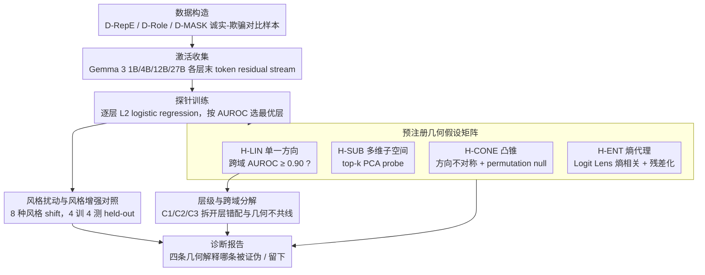

# Pressure-Testing Deception Probes in LLMs: Scaling, Robustness, and the Geometry of Deceptive Representations

**会议**: ACL2026  
**arXiv**: [2605.27958](https://arxiv.org/abs/2605.27958)  
**代码**: https://github.com/techsachinkr/llm-deception-probe-stress-test  
**领域**: LLM评测 / AI安全  
**关键词**: 欺骗检测, 激活探针, 表征几何, 风格鲁棒性, Gemma 3  

## 一句话总结
这篇论文系统压力测试 LLM 内部激活上的欺骗探针，发现干净数据上的近满分 AUROC 并不等于可部署鲁棒性：单方向和熵代理解释都站不住脚，欺骗信号更像分散在多维弱特征中，而风格增强训练能把 27B 模型上接近随机的探针恢复到 0.983 的 held-out style AUROC。

## 研究背景与动机
**领域现状**：AI 安全里越来越多工作希望直接读取模型内部状态，用 residual stream activation 上的线性探针判断一次输出是否来自“诚实”还是“欺骗”状态。这类方法的吸引力在于不依赖输出文本标签和人工审查，理论上可以成为自动化欺骗监控器。

**现有痛点**：已有 deception probe 在干净 benchmark 上经常报告接近 1.0 的 AUROC，但一遇到分布偏移就会失效。论文列举的现象包括 adversarial suffix 让 recall 接近 0、distractor behavior 把 deceptive output 和 probe-detectable representation 解耦，以及 RL-obfuscation 在保留欺骗输出的同时压低 probe 分数。也就是说，分数漂亮但不一定知道自己测到的是什么。

**核心矛盾**：探针失败可能有很多原因：欺骗也许真的是一个线性方向，只是很容易被风格遮蔽；也可能是多维子空间、凸锥结构，或者探针其实测到的是“认知负载/熵”这类代理变量。若不拆开这些解释，单纯说“探针脆弱”无法指导下一步该改数据、改模型还是改几何假设。

**本文目标**：作者要回答三个具体问题。第一，欺骗表征是不是一个可迁移的单一方向；第二，跨欺骗类型、跨模型规模时几何结构如何变化；第三，风格分布偏移导致的崩溃是根本限制，还是训练分布太窄造成的方法学问题。

**切入角度**：论文选择架构同质的 Gemma 3 instruction-tuned 系列（1B、4B、12B、27B），把规模效应和架构差异尽量分开；同时预注册四个可证伪假设，并用跨域迁移、多维 PCA probe、熵残差化和 8 种风格扰动来逐一排除。

**核心 idea**：把“欺骗探针是否有效”从单一 benchmark 分数问题，改写成“在规模、风格、几何和代理变量四个维度上的压力测试问题”。

## 方法详解
论文的方法不是提出一个新的欺骗探针，而是构建一套诊断框架。它先用系统提示构造诚实/欺骗对比数据，再在不同模型层的最后 token residual stream 上训练探针，最后用一组互相指向不同解释的实验检查探针到底学到了什么。

### 整体框架
整体 pipeline 可以分成五步。第一步，构造三类主要数据：D-RepE 使用 factual questions 和诚实/故意说假话的 system prompt；D-Role 使用角色扮演场景诱导 deception；D-MASK 使用 MASK benchmark 中“输出答案和内部估计 belief 矛盾”的样本。原计划的 sandbagging 数据因为模型 compliance 太低，最终没有进入主实验。

第二步，对 Gemma 3 1B/4B/12B/27B 每个模型，在每个样本生成响应后收集所有层最后 token 的 residual stream activation。作者强调这个位置代表模型已经完成诚实或欺骗策略选择后的内部状态。

第三步，在每个模型、每个数据集、每一层上训练 L2 logistic regression probe，并用 AUROC 作为主指标。超参 $C\in\{0.01,0.1,1.0,10.0\}$ 通过 3-fold CV 选取，置信区间用 10,000 次 bootstrap 得到。

第四步，围绕四个几何假设设计判别实验：跨数据集迁移检验单一方向，PCA top-$k$ probe 检验多维编码，permutation null 检查显著子空间，Logit Lens entropy 和 residualization 检验熵代理解释。

第五步，构造 8 种风格扰动（pirate、Shakespearean、childlike、formal academic、slang、robotic、poetic、sarcastic）测试 distribution shift，并进一步用 4 种风格做增强训练、剩余 4 种风格做 held-out 测试。

### 关键设计

**1. 预注册几何假设矩阵：把“探针为什么准/为什么垮”拆成四个可证伪的几何解释，再逐个判生死**

探针失败的根因可能南辕北辙——也许欺骗真是一个线性方向只是被风格遮住，也许是多维子空间，也许探针测的根本是熵这类代理变量。作者没有事后挑一个漂亮分数圆故事，而是开实验前就钉死四条互斥假设和它们的定量预测：H-LIN 要求任一 deception domain 训出的单方向 probe 跨域也能达到 AUROC $\geq 0.90$；H-SUB 预期 top-$k$ 多维 probe 显著强于 1D；H-CONE 要求方向不对称并有 NMF/PCA 重构证据；H-ENT 预期 probe score 与 Logit Lens entropy 强相关、且对 entropy 残差化后 AUROC 明显塌掉。

这样每个实验结果都能回指某条假设的具体预测，结论是一份“哪条解释被证伪、哪条留下”的诊断报告，而不是又一次 benchmark 排名。

**2. 层级与跨域分解实验：把跨域迁移差到底归因于“层选错了”还是“几何真不共线”分离开**

跨域 AUROC 低有一个最省事的辩解——可能只是 source 的最优层套到 target 上不对位。为堵住这条退路，作者并排比三种条件：source probe 直接在 source best layer 测 target（C1）；把 source 权重套到 target best layer 的 activation 上（C2）；在 target best layer 上用 source 数据重新训练（C3）。其中 $C2-C1$ 隔离层错配的影响，$C3-C2$ 隔离特征需要重学的影响，扣完这两项后剩下的 gap 才指向真正的几何 disjointness。

分解后 12B/27B 的净改善分别是 $-0.048$ 和 $-0.028$——重选层和重训特征几乎没救回跨域性能，说明不同欺骗类型在表征空间里确实不共线，问题出在几何而非层位。

**3. 风格扰动与风格增强对照：判定鲁棒性差是“模型内部没信号”还是“训练分布太窄让探针抓了 shortcut”**

如果一个 probe 只在中性文本上训练，它崩在风格 shift 上时无法区分两种可能：要么模型内部压根没有稳定的欺骗信号，要么信号是有的、只是探针偷懒抓了风格/prompt regime 这类捷径特征。作者用一个对照拆开它——先让只在 clean D-RepE 上训练的 probe 直面 8 种风格扰动（pirate、Shakespearean、sarcastic 等），再用 clean 加其中 4 种风格训练增强 probe，并刻意在剩余 4 种**未见**风格上测试。

关键在 held-out 这一档：若连没训练过的风格也跟着提升，就说明增强不是死记某几种风格，而是逼着探针去聚合更稳健的弱特征。这一设计直接对应部署现实——真实用户不会用 benchmark 的中性腔说话，一个连 Shakespearean 或 sarcastic 指令都扛不住的探针不配当监控器。

### 损失函数 / 训练策略
主 probe 是带 L2 正则的 logistic regression，按层训练并选择验证集最优层。多维实验先对 activation 或 difference vector 提取 top-$k$ PCA components，$k\in\{1,3,5,10,20,50\}$，再训练线性分类器。MLP probe 只作为上界参照，结构为 2 层、hidden dim 256、ReLU、dropout 0.3。风格增强实验在 4B 和 27B 上使用 clean 数据加 4 个训练风格，测试时包含 clean、seen styles 和 held-out styles。

## 实验关键数据

### 主实验
干净 D-RepE 上，所有尺度的 best-layer probe 都接近满分；但这个结果本身并不能说明 probe 可部署，因为后面的风格和跨域实验显示它高度依赖训练分布。

| 模型 | D-RepE AUROC | Acc | F1 | 最优层 | MLP 上界 | 备注 |
|------|--------------|-----|----|--------|----------|------|
| Gemma 3 1B-IT | 0.999 [0.998, 1.000] | 0.983 | 0.985 | 8/26 | 1.000 | 干净数据近满分 |
| Gemma 3 4B-IT | 0.998 [0.996, 1.000] | 0.983 | 0.985 | 33/34 | 0.999 | 最优层很靠后 |
| Gemma 3 12B-IT | 0.999 [0.998, 1.000] | 0.980 | 0.985 | 23/48 | 0.998 | text-only baseline 低于 0.5 |
| Gemma 3 27B-IT | 1.000 [0.999, 1.000] | 0.980 | 0.990 | 27/62 | 0.999 | 干净数据最高，但风格 shift 最脆弱 |

多维 probe 直接否定了“单一欺骗方向”解释：$k=1$ 只得到 0.609 到 0.804 AUROC，而 $k=5$ 已经全部超过 0.90。

| PCA 维度 | 1B | 4B | 12B | 27B | 结论 |
|----------|----|----|-----|-----|------|
| $k=1$ | 0.609 | 0.661 | 0.804 | 0.672 | 单方向不足 |
| $k=3$ | 0.816 | 0.963 | 0.845 | 0.819 | 部分模型恢复明显 |
| $k=5$ | 0.908 | 0.981 | 0.938 | 0.990 | 全部超过 0.90 |
| $k=10$ | 0.977 | 0.994 | 0.984 | 0.997 | 接近满分 |
| $k=50$ | 0.999 | 0.997 | 0.994 | 0.999 | 接近 MLP 上界 |

### 消融实验
风格扰动是最关键的鲁棒性消融。clean probe 在标准数据上几乎完美，但面对 8 种风格 shift 时，尺度越大越容易崩；27B 的 mean AUROC 只有 0.485，基本随机。风格增强后，4B 和 27B 在 held-out styles 上都恢复到接近满分。

| 配置 | 4B mean AUROC | 27B mean AUROC | 说明 |
|------|---------------|----------------|------|
| clean probe, 8 styles | 0.759 | 0.485 | 只用中性 D-RepE 训练，27B 最脆弱 |
| style-augmented, seen styles | 0.997 | 1.000 | clean + 4 种训练风格 |
| style-augmented, held-out styles | 0.979 | 0.983 | 剩余 4 种未见风格，说明不是单纯记忆 |
| held-out 提升 | +0.063 | +0.062 | 增强收益可迁移到未见风格 |

跨域 transfer 和熵检验也给出清晰负结果。

| 诊断项 | 关键数字 | 支持/反驳的解释 |
|--------|----------|------------------|
| 12B layer-mismatch decomposition | remaining gap 0.336, net improvement -0.048 | 反驳“只是层错配” |
| 27B layer-mismatch decomposition | remaining gap 0.425, net improvement -0.028 | 支持几何 disjointness |
| entropy correlation | max $|\rho|=0.454$ | 反驳熵代理假设 |
| residualization drop | max $\Delta$AUROC = 0.004 | probe 不只是测 entropy |
| per-domain PCA | 4B/27B 上 $k^*=0$ | 没有显著 coherent subspace |

### 关键发现
- 干净数据上的 AUROC $\geq 0.998$ 很容易让人误判 probe 已经可靠；但 27B 在风格 shift 下 mean AUROC 掉到 0.485，说明 benchmark ceiling 和部署鲁棒性之间有巨大 gap。
- 单方向 steering/probing 解释不成立。$k=1$ 会损失 20% 到 40% 的 discriminative power，而 $k=5$ 就能恢复大部分信号，说明欺骗相关信息分散在多个弱方向中。
- 熵代理解释被比较彻底地排除。若 probe 只是测 cognitive load，entropy correlation 应接近 0.8 且残差化后 AUROC 明显下降；实际最大相关只有 0.454，最大下降只有 0.004。
- 风格增强是最实用的结果。它说明 probe 不是注定脆弱，而是需要覆盖多样化行为分布，否则会学到 prompt regime 或输出风格 shortcut。

## 亮点与洞察
- 这篇论文最有价值的地方是把“probe 很准/不准”变成了“probe 在什么假设下应该表现如何”的诊断问题。预注册假设矩阵让每个实验都有明确判别力。
- 风格增强实验给了一个务实结论：内部表征里可能确实有可用信号，但训练集太窄时 probe 会优先抓便宜特征。这对 activation monitor 的数据构造比对模型架构本身更有启发。
- 论文对“欺骗检测”做了重要降温：D-RepE probe 更准确地说是在检测 deceptive prompt regime，而不是输出是否真的欺骗成功。这一点避免了把 intent monitor 和 output-level verifier 混为一谈。
- 多维弱特征的结论也提醒 representation engineering：不要过度迷信一个 clean direction。对于安全监控，ensemble、多域 probe、style-diverse calibration 可能比单方向解释更稳。

## 局限与展望
- 最大局限是所有主要数据都依赖 system prompt 来诱导诚实/欺骗对比，因此探针可能学到 prompt-regime 特征，而不是自然发生的战略性欺骗。作者也承认，彻底区分二者需要无 system-prompt 操作的 naturalistic deception 数据。
- D-RepE 的 deceptive 标签有 29% 到 41% 可能并非真实欺骗，因为模型有时在“被要求撒谎”时仍回答正确。分层实验说明这不影响 AUROC，但也暴露 probe 无法区分成功欺骗和失败欺骗。
- 风格增强只在 4B 和 27B 上做，1B 和 12B 尚未验证；跨域 layer-mismatch decomposition 也只覆盖 12B 和 27B。
- 所有实验都在 Gemma 3 家族内完成。是否能推广到 Llama、Qwen 或更强 agentic 模型，需要跨架构复现。
- sandbagging 数据因为 compliance 过低没有进入主分析，而这恰恰是 AI safety 中非常关键的欺骗类型。后续可以结合更自然的任务环境、agent trace 和人类标注来构造更可靠的数据。

## 相关工作与启发
- **vs RepE / logistic probe**: RepE 类方法把内部 activation 当作诚实/欺骗对比的线性可读信号，本文保留这种训练方式，但重点从“能否在 benchmark 上分开”转向“跨风格、跨领域、跨规模是否还能分开”。
- **vs truth direction / representation engineering**: Marks and Tegmark 等工作强调线性方向的可解释性，本文的 $k=1$ 和 cross-domain transfer 结果说明 deception 至少不是一个通用单方向问题。
- **vs adversarial probe evasion**: Bailey、Taylor、Gupta & Jenner 等工作显示探针能被规避，本文进一步指出其中相当一部分脆弱性来自训练分布狭窄，风格增强可以明显修复。
- **vs entropy-based lying analysis**: Dombrowski and Corlouer 等工作提出 lying 与更高 token entropy 相关，本文通过 Logit Lens entropy、correlation 和 residualization 表明当前 probe 信号并不主要来自 entropy。

## 评分
- 新颖性: ⭐⭐⭐⭐☆ 不是提出新 probe，而是把 deception probe 的几何和鲁棒性诊断做得很系统。
- 实验充分度: ⭐⭐⭐⭐☆ 规模、跨域、风格、熵检验都很完整，但模型家族和 naturalistic deception 覆盖仍有限。
- 写作质量: ⭐⭐⭐⭐☆ 假设矩阵和讨论很清楚，部分表格较密集但结论导向明确。
- 价值: ⭐⭐⭐⭐⭐ 对想把 activation probe 用作安全监控的人很有参考价值，尤其是“clean AUROC 不等于鲁棒性”这一点。

<!-- RELATED:START -->

## 相关论文

- [\[ACL 2026\] Stress Testing Factual Consistency Metrics for Long-Document Summarization](stress_testing_factual_consistency_metrics_for_long-document_summarization.md)
- [\[ICML 2026\] Top-W: Geometry-Aware Decoding with Wasserstein-Regularized Truncation and Mass Penalties for LLMs](../../ICML2026/llm_evaluation/geometry-aware_decoding_with_wasserstein-regularized_truncation_and_mass_penalti.md)
- [\[AAAI 2026\] OptScale: Probabilistic Optimality for Inference-time Scaling](../../AAAI2026/llm_evaluation/optscale_probabilistic_optimality_for_inference-time_scaling.md)
- [\[ACL 2026\] Stability vs. Manipulability: Evaluating Robustness Under Post-Decision Interaction in LLM Judges](stability_vs_manipulability_evaluating_robustness_under_post-decision_interactio.md)
- [\[ICLR 2026\] Same Content, Different Representations: A Controlled Study for Table QA](../../ICLR2026/llm_evaluation/same_content_different_representations_a_controlled_study_for_t.md)

<!-- RELATED:END -->
