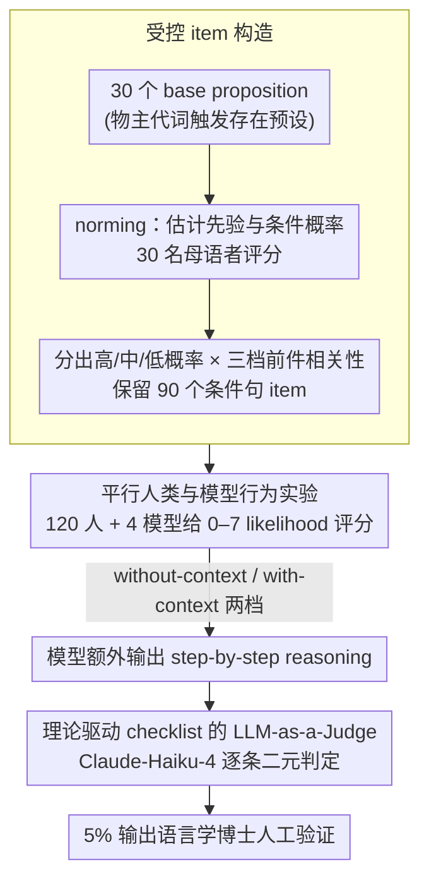

# Presupposition and Reasoning in Conditionals: A Theory-Based Study of Humans and LLMs

**会议**: ACL2026  
**arXiv**: [2605.18352](https://arxiv.org/abs/2605.18352)  
**代码**: https://github.com/proviso-bench/Presupposition-and-Reasoning-in-Conditionals  
**领域**: LLM评测 / 语义语用推理  
**关键词**: 预设投射, 条件句推理, 语用能力评测, 人机对比, LLM-as-a-Judge  

## 一句话总结
这篇论文用基于语言学理论的条件句预设投射任务对比人类和四个 LLM，发现人类会联合使用概率、前件-预设相关性和上下文线索，而 LLM 的评分相似性与理论化推理质量明显脱钩，很多看似贴近人类的判断可能来自表层模式匹配。

## 研究背景与动机
**领域现状**：LLM 语义和语用能力评测正在从简单 NLI 或分类题走向更细的语言现象，例如 implicature、presupposition、reference 和 discourse context。预设投射尤其适合作为压力测试，因为它要求模型同时处理形式语义、语用 accommodation、世界知识和概率推理。

**现有痛点**：已有 presupposition benchmark 多关注 entailment 或简单触发词识别，很少把人类行为数据和模型行为放在同一个受控实验里比较。更重要的是，模型给出一个接近人类的最终分数，并不代表它真的在按语言学理论推理；它也可能只是抓住了词汇共现或常识关联。

**核心矛盾**：条件句中的 proviso problem 本身就没有简单答案。对于“If A, Bp”这类句子，听者可能把 consequent 中的预设 $p$ 理解成无条件成立，也可能理解成只在 $A$ 成立时成立。这个选择取决于 $Pr(p\mid c)$ 和 $Pr(p\mid A,c)$ 的关系、前件与预设的相关性，以及上下文如何约束可能世界。

**本文目标**：论文希望回答四个问题：人类在条件句预设判断中如何使用前件-预设相关性；LLM 的 Likert 判断和人类有多接近；最小上下文会如何影响人类和模型；模型解释是否真正体现了 presupposition projection 和 pragmatic reasoning。

**切入角度**：作者把传统心理语言学实验和 LLM benchmark 结合起来。先用 norming study 构造低/中/高概率和 relevant/somewhat relevant/irrelevant 三档关系，再让 120 名人类参与者和四个 LLM 在同一批 90 个 item 上给 0-7 分，最后用理论驱动 checklist 评估模型 reasoning trace。

**核心 idea**：不要只问“LLM 的答案像不像人”，而要同时比较行为分布和理论化推理过程，看二者是否一致。

## 方法详解
这篇论文的方法可以理解为一个双层评测：第一层是行为层，比较人类和模型对目标预设为真的 likelihood rating；第二层是解释层，用 LLM-as-a-Judge 检查模型生成的 reasoning 是否满足语义/语用理论中的关键约束。

### 整体框架
首先，作者围绕 possessive pronoun trigger 构造 30 个 base propositions，例如“某人有 guitar / apron / boat / smartphone / sibling”。这些命题覆盖高概率、中概率和低概率拥有关系，并配上中性上下文约束。

然后，每个 proposition 被扩展成四种 norming 条件：baseline 测 $Pr(p\mid c)$，以及高/中/低前件相关性条件测 $Pr(p\mid A,c)$。norming 由 30 名英语母语参与者完成，确认低、中、高概率条件确实单调分离后，作者保留 90 个 conditional items 进入主实验。

主实验中，120 名人类参与者和四个模型（GPT-5、Gemini-2.5-flash、Llama-3.1-8B-Instruct、Qwen2.5-7B-Instruct）看到同样的条件句，判断目标 presupposition 为真的可能性，量表为 0 到 7。实验有 without-context 和 with-context 两个条件；with-context 只额外给一个最小身份背景，例如某人来自哪里。

LLM 除了给数值判断，还需要输出 step-by-step reasoning。随后，Claude-Haiku-4 作为 judge，用专家设计的 checklist 对 reasoning trace 逐条判断是否满足理论标准。最后，作者抽样 5% 输出交给两名语言学博士人工验证 judge 结果。

### 关键设计

**1. 概率与相关性的受控 item 构造：把 proviso problem 里“前件到底让不让预设更可能成立”做成可控变量**

条件句“If A, Bp”里那个预设 $p$ 该不该投射，本来就没有简单答案——它取决于前件 $A$ 有没有把 $p$ 抬得更可信。如果只凭研究者拍脑袋说某句“相关/不相关”，后面的人机对比就立在沙地上。作者改用 norming 把它量化：对每个预设 $p$，分别估计 baseline $Pr(p\mid c)$ 和条件概率 $Pr(p\mid A,c)$，若 $A$ 显著抬高 $p$ 的可能性就归为 relevant 条件，弱关联或无关联则归为 somewhat relevant 和 irrelevant。

这样三档相关性和高/中/低三档先验概率都来自 30 名母语者的 normed 评分，而非直觉标注，后续 human-LLM comparison 才有干净的受控刺激可比。

**2. 平行的人类与模型行为实验：把人和模型摆进同一任务、同一量表、同一上下文里直接对账**

很多 LLM 语用评测只判模型答得对不对，看不出它是否接近人类那种分级的、有把握程度差异的判断。这里让 120 名人类和四个模型对同样 90 个“If A, Bp”句子给 0–7 的 likelihood rating，模型额外吐出 reasoning；并配 without-context 与 with-context 两档对照，看仅补一句最小身份背景会不会改变它们整合概率与相关性的方式。

之所以用连续评分而非对错，是因为预设投射本就是渐变现象，用 Spearman 相关和 MAE 才抓得住人机之间细微的行为分布差，而不是粗暴的命中率。

**3. 理论驱动 checklist 的 LLM-as-a-Judge：不看最终分数，专查模型的推理过程合不合语用理论**

模型给出一个贴近人类的数字，并不代表它真按语言学理论推理，也可能只是蹭到了词汇共现或常识关联——行为对齐和解释质量完全可能脱钩。为把这层捅开，作者让 Claude-Haiku-4 当 judge，拿一份专家设计的 yes/no checklist 逐条核对模型的 reasoning trace，维度覆盖 Accuracy、Context、Pragmatic、Presupposition Handling、Coherence；with-context 条件有 59 个判定项，without-context 有 52 个。每条 response 的得分是满足条目的平均比例

$$S=\frac{1}{|K|}\sum_j J\big((c,s,\tau,r),\kappa_j\big)$$

用结构化的二元判定而不是让 judge 拍一个总体偏好分，能把解释空间压窄，让评分更像一份“模型在哪个推理环节合理、哪个环节虚”的诊断，而不是又一次模糊的好感打分。

### 损失函数 / 训练策略
这篇论文不是训练新模型，而是设计评测流程。统计分析使用线性混合效应模型，固定效应包括 proposition probability、A-p relevance 及其交互，participant 作为随机截距。模型侧生成不做 self-consistency 或重复采样；开源模型使用 temperature 0.7、top_p 0.9、max_new_tokens 1024，本地 bfloat16 推理；闭源模型通过官方 API 使用相同的 temperature 和 token 设置。judge 模型每个 checklist 条目输出二元判断，作者抽样验证其可靠性：两名人工标注者 inter-annotator exact match 为 89%，与 judge 的一致率为 79.46%。

## 实验关键数据

### 主实验
norming study 先证明数据构造有效：低/中/高概率项的人类平均评分单调上升。主实验的人类结果显示，人类不仅看 proposition 本身有多常见，还会看 antecedent 是否让 presupposition 更有理由成立。

| 实验部分 | 关键结果 | 解释 |
|----------|----------|------|
| Norming low probability | M = 2.76 | 低概率拥有关系评分最低 |
| Norming mid probability | M = 4.38 | 中概率居中 |
| Norming high probability | M = 5.52 | 高概率最高 |
| low → mid | $\beta=1.62$, $p<.001$ | 概率等级显著提升评分 |
| low → high | $\beta=2.75$, $p<.001$ | 高概率与低概率显著分离 |

人类 mixed-effects 结果表明，without-context 时 irrelevant 关系会强烈压低低/中概率项；with-context 时，人类更稳定地区分 probability 和 relevance 两种线索。

| 条件 | 截距/清晰案例 | 重要负效应 | 交互效应 | 含义 |
|------|---------------|------------|----------|------|
| With-context | Intercept 5.377 | low: -0.977, irrelevant: -0.377, somewhat relevant: -0.258 | low × irrelevant: -0.310, mid × irrelevant: -0.493 | 上下文让概率和相关性都被更细致使用 |
| Without-context | Intercept 5.340 | low: -0.347, irrelevant: -0.356 | low × irrelevant: -0.734, mid × irrelevant: -0.572 | 无上下文时 irrelevant 更像 gating factor |

### 消融实验
模型行为和模型解释出现明显脱钩。Qwen2.5-7B-IT 在 Likert rating 上最接近人类，但 checklist reasoning compliance 最低；闭源大模型 reasoning 更合理论，但最终评分未必更像人。

| 模型 | 人类对齐表现 | MAE / 相关性 | With-context checklist total | 观察 |
|------|--------------|--------------|------------------------------|------|
| Qwen2.5-7B-IT | 最稳定接近人类排序 | $\rho=0.25$ 无上下文，$\rho=0.38$ 有上下文；MAE 1.32 | 39.08% | 行为像人，但理论 reasoning 最弱 |
| Llama3.1-8B-IT | 中等且稳定对齐 | $\rho=0.21$ 无上下文，$\rho=0.30$ 有上下文；MAE 1.14 | 40.53% | MAE 最低，但 checklist 仍低 |
| Gemini-2.5-flash | 依赖上下文才显著对齐 | 有上下文 $\rho=0.26$；MAE 1.90 | 60.81% | reasoning 较强，行为误差较大 |
| GPT-5 | 整体相关不显著 | MAE 1.34 | 63.18% | checklist 最高之一，但 Likert 分布不贴近人类 |

checklist 的维度结果也说明，大模型并非全维度提升；with-context 有时会引入 reasoning noise。

| 模型 | Accuracy | Pragmatic | Presupposition | Context Util. | Total |
|------|----------|-----------|----------------|---------------|-------|
| Gemini-2.5-flash | 61.39% | 82.84% | 61.11% | 30.10% | 60.81% |
| GPT-5 | 60.74% | 78.89% | 71.02% | 28.18% | 63.18% |
| Llama3.1-8B-IT | 16.67% | 54.94% | 49.35% | 14.75% | 40.53% |
| Qwen2.5-7B-IT | 22.96% | 56.42% | 42.04% | 12.42% | 39.08% |

### 关键发现
- 人类判断不是单纯的 prior probability，也不是单纯的 relevance，而是二者交互。没有上下文时，irrelevant 前件会让人更多回退到 presupposition 的先验概率；有上下文时，人类更一致地整合概率和相关性。
- Qwen2.5-7B-IT 和 Llama3.1-8B-IT 在行为分布上更接近人类，但它们的 checklist compliance 只有约 39%-41%。这说明“像人类一样打分”不等于“按人类可解释的语用理论推理”。
- GPT-5 和 Gemini 的 reasoning 更符合 checklist，却没有在 Likert judgment 上更接近人类。论文把这解释为 behavior alignment 和 explicit reasoning quality 的 dissociation。
- LLM-as-a-Judge 的成本相对可控：约 40,000 个 checklist item 的 Claude-Haiku-4 评估成本约 55 CAD，说明这种细粒度语用评测并非只适合大实验室。

## 亮点与洞察
- 这篇论文的最大亮点是把语言学理论真正落到 benchmark 设计中。它不是问模型是否“知道预设”，而是构造了概率、相关性和上下文三种可解释变量。
- 行为-解释脱钩的结论很有启发。很多 LLM 评测默认 CoT 越漂亮越好，但这里显示最终行为像人和解释合理论可能是两回事。
- checklist 评测不是简单让 judge 给一个总分，而是把 presupposition handling、context integration、coherence 等维度拆开。这种设计可以迁移到 implicature、anaphora、discourse coherence 等其他语用任务。
- 论文也提醒我们：小模型可能通过表层分布知识逼近人类评分，大模型可能通过更流畅的形式化解释获得高 checklist 分数，但两者都不一定等于稳定语用能力。

## 局限与展望
- 任务范围较窄，只覆盖“If A, Bp”结构和 possessive pronoun triggers，例如 his/her/their 引出的简单存在预设。结果未必能推广到 factive verbs、change-of-state verbs 或更复杂嵌套结构。
- 人类数据来自英语母语者，且国家范围有限，因此跨语言和跨文化泛化仍不清楚。不同语言的预设触发和 accommodation 策略可能显著不同。
- LLM-as-a-Judge checklist 主要编码 satisfaction-theoretic 和形式语义/语用原则，可能没有完全捕捉人类实际使用的启发式、概率性过程。
- human validation 只覆盖 5% 输出，尽管标注者一致率较高，但未来可以扩大人工验证，尤其是验证 judge 在不同 checklist 维度上的偏差。
- CoT 本身可能是 post-hoc rationalization。模型解释质量低不一定代表内部没有相关能力，解释质量高也不一定代表真实推理过程正确。

## 相关工作与启发
- **vs IMPPRES / NOPE / PROPRES**: 这些数据集更多考察 entailment 或 presupposition trigger 在分类设置下的表现，本文则转向 graded likelihood judgment 和人类行为对齐。
- **vs CONFER / proviso problem 相关工作**: 既有工作指出模型在复杂条件句预设上泛化不足，本文进一步用 normed probability/relevance 操作和 checklist reasoning 分析解释这种不足。
- **vs Pragmatics Understanding Benchmark**: PUB 提供更广泛的理论驱动语用评测，本文更窄但更深，聚焦条件句预设投射并做平行人类实验。
- **vs 通用 LLM-as-a-Judge**: 常规 judge 评测容易只给整体偏好分，本文用专家设计的 yes/no checklist 降低解释空间，让 judge 更像结构化诊断工具。

## 评分
- 新颖性: ⭐⭐⭐⭐☆ 结合理论语言学、人类实验和 LLM reasoning 诊断，任务设计比一般语用 benchmark 更细。
- 实验充分度: ⭐⭐⭐⭐☆ norming、人类主实验、四模型对比、judge validation 都较完整，但语言和触发词范围有限。
- 写作质量: ⭐⭐⭐⭐☆ 研究问题清楚，方法细节充分，表格密集但支持结论。
- 价值: ⭐⭐⭐⭐☆ 对语义语用评测和“答案对齐 vs 推理能力”讨论很有参考价值。

<!-- RELATED:START -->

## 相关论文

- [\[ACL 2026\] BizCompass: Benchmarking the Reasoning Capabilities of LLMs in Business Knowledge and Applications](bizcompass_benchmarking_the_reasoning_capabilities_of_llms_in_business_knowledge.md)
- [\[ACL 2026\] Do LLMs Overthink Basic Math Reasoning? Benchmarking the Accuracy-Efficiency Tradeoff](do_llms_overthink_basic_math_reasoning_benchmarking_the_accuracy-efficiency_trad.md)
- [\[ACL 2026\] Are They Lovers or Friends? Evaluating LLMs' Social Reasoning in English and Korean Dialogues](are_they_lovers_or_friends_evaluating_llms39_social_reasoning_in_english_and_kor.md)
- [\[AAAI 2026\] Where Norms and References Collide: Evaluating LLMs on Normative Reasoning](../../AAAI2026/llm_evaluation/where_norms_and_references_collide_evaluating_llms_on_normative_reasoning.md)
- [\[ACL 2026\] SCAN: Structured Capability Assessment and Navigation for LLMs](scan_structured_capability_assessment_and_navigation_for_llms.md)

<!-- RELATED:END -->
