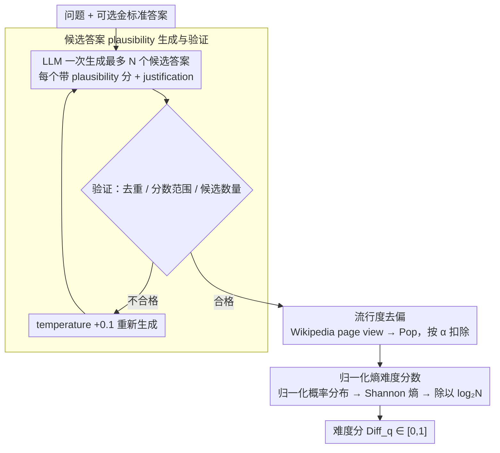

# Question Difficulty Estimation for Large Language Models via Answer Plausibility Scoring

**会议**: ACL2026  
**arXiv**: [2605.12398](https://arxiv.org/abs/2605.12398)  
**代码**: https://github.com/DataScienceUIBK/Q-DAPS  
**领域**: 可解释性 / 问答难度估计  
**关键词**: 问题难度, 答案似然性, 熵, 流行度偏置, 幻觉风险

## 一句话总结
Q-Daps 通过生成多个候选答案并计算去流行度偏置后的 plausibility 分布熵来估计 LLM 问答难度，在 TriviaQA、NQ、MuSiQue、QASC 上系统优于可读性、检索复杂度、prompt 打分和不确定性基线。

## 研究背景与动机
**领域现状**：问题难度估计常用于教育测评、信息检索和 QA 系统评估。传统方法多依赖文本可读性、问题流行度、检索结果质量，或直接让模型给问题打难度分。

**现有痛点**：这些信号往往是面向人类读者或检索系统设计的，未必反映现代 LLM 在回答时真正遇到的歧义和推理风险。对 LLM 来说，一个问题难不难，常取决于错误答案是否也很“像真的”。

**核心矛盾**：难题并不一定长，也不一定少见；简单的表面特征无法捕捉候选答案空间中的不确定性。当多个错误答案都很有说服力时，模型更容易幻觉或选错。

**本文目标**：提出一种可解释、可扩展、与 LLM 行为更一致的问题难度度量，并验证它能区分 easy/hard 问题、对人类判断有一致性、对无金标准答案和不同模型设置保持鲁棒。

**切入角度**：作者从“答案 plausibility 分布”入手。若一个问题只有少数候选答案看起来可信，plausibility 分布会很尖锐，难度较低；若多个候选答案都差不多可信，分布熵高，难度较高。

**核心 idea**：用候选答案 plausibility 的熵作为 LLM-oriented difficulty score，并用 Wikipedia page view 对候选答案的流行度偏置做轻量校正。

## 方法详解
Q-Daps 的方法由三段组成：候选答案生成、流行度去偏、熵评分。它不是直接让 LLM 给问题打难度分，而是让 LLM 列出多个 plausible but incorrect 的候选答案及其 plausibility，再从候选答案空间的形状推断难度。

### 整体框架
给定问题和可选的 gold answer，Q-Daps 首先用 LLaMA 3.3 等 LLM 生成最多 20 个候选答案，每个候选答案带 plausibility score 和 justification；然后用验证模块去重、检查分数范围和候选数量；接着查询候选答案对应的 Wikipedia page view，得到 popularity score，并按超参数 $\alpha$ 从 plausibility 中扣除流行度影响；最后把 debiased plausibility 归一化为概率分布，计算 Shannon entropy，并除以 $log_2 N$ 归一化到 $[0,1]$。

### 关键设计

**1. 候选答案 plausibility 生成与验证：先把一道题的“竞争答案空间”铺开，让难度来自候选之间的相对可信度**

对 LLM 来说一道题难不难，往往不在题面长短，而在错误答案是否也很“像真的”。可标准的 distractor generation 只判断干扰项对错，给不出“多像正确答案”这种连续信号。Q-Daps 改用一个 listwise prompt 一次性吐出最多 $N$ 个候选答案，每个带 plausibility score 和 justification；再过一道验证模块检查候选有没有重复、分数是否落在 0 到 100、数量是否够，一旦不合格就把 temperature 加 0.1 重新生成。

这样得到的不是“正确/错误”的离散标签，而是一整片带可信度刻度的答案分布，后面才有东西可以算熵。

**2. 基于 Wikipedia page view 的流行度去偏：把 LLM 偏爱知名实体的 bias 从难度信号里扣掉**

LLM 生成候选时倾向更早抛出、并给更高 plausibility 的，往往是更出名的实体，这会让难度分被实体知名度污染，而不是反映真正的语义竞争。作者对每个候选抓取 2015-01-01 到 2024-12-31 的 Wikipedia 月度 page view，归一化到 $[0,1]$ 并用 IQR 剔异常值得到 popularity score $Pop_i$，再按超参 $\alpha$ 从 plausibility 里扣除流行度的拉抬：

$$DePls_i = Pls_i \times (1 - \alpha \times Pop_i)$$

扣完之后，“知名但其实是错的”答案不再被过度放大，熵评分关注的才是候选之间到底有多难分。

**3. 归一化熵难度分数：把候选 plausibility 的不确定性压成一个 $[0,1]$ 的可解释难度**

有了去偏后的可信度，难度其实就写在这片分布的形状里——少数答案一枝独秀（分布尖锐）就容易，多个答案旗鼓相当（分布平坦）就难。作者先把 $DePls_i$ 归一成概率分布 $DePls_i^{norm}=DePls_i / \sum_i DePls_i$，再算 Shannon 熵 $H(q)=-\sum_i DePls_i^{norm}\log_2 DePls_i^{norm}$，最后除以 $\log_2 N$ 压到 $[0,1]$ 得到 $Diff_q=H(q)/\log_2 N$。

高熵意味着好几个候选都同样可信、模型难以稳定区分、幻觉风险高；低熵意味着答案明显突出、问题容易。归一化让不同候选数 $N$ 的题目之间也能直接比难度。

### 损失函数 / 训练策略
Q-Daps 是评估与打分方法，不训练目标 QA 模型。实验侧比较三种 plausibility elicitation：Pointwise、Pairwise 和 Listwise。Pointwise 对每个候选单独打分，复杂度 $O(n)$；Pairwise 做两两比较并用 Bradley-Terry 聚合，复杂度 $O(n^2)$；Listwise 一次生成候选及分数，复杂度 $O(1)$，也是主配置。难度评估使用两个指标：Spearman 相关衡量难度分与能答对的 LLM 数量之间的负相关；Cohen's d 衡量 Q-Daps 划分 easy/hard 后，不同 LLM 在两组上的准确率差距。

## 实验关键数据

### 主实验

| 类别 | 方法 | MuSiQue d / rho | QASC d / rho | NQ d / rho | TriviaQA d / rho |
|------|------|-----------------|--------------|------------|------------------|
| Readability | Flesch-Kincaid | -0.543 / 0.5545 | 0.1496 / 0.1909 | -0.424 / 0.6363 | -0.2689 / 0.5181 |
| Prompt-based | LLaMA 3.3 70B | 0.2453 / -0.109 | 0.2032 / -0.2909 | 0.0307 / -0.3363 | 0.4566 / -0.4272 |
| Retriever-based | Retrieval Complexity | 0.1284 / -0.3451 | 0.2225 / -0.3126 | 0.2781 / -0.4518 | 0.4394 / -0.5129 |
| Uncertainty | LLaMA 3.3 70B | 0.4219 / -0.5518 | 0.2119 / -0.5621 | 0.3265 / -0.5071 | 0.4823 / -0.452 |
| Q-Daps | Avg-Plausibility | -0.2242 / 0.0272 | 0.4784 / -0.3 | 0.1869 / -0.2545 | 0.564 / -0.509 |
| Q-Daps | Entropy-Plausibility | 1.0888 / -0.9001 | 0.803 / -0.6181 | 0.9448 / -0.9636 | 0.7498 / -0.8818 |

### 消融实验

| 配置 | MuSiQue d | QASC d | NQ d | TriviaQA d | 说明 |
|------|-----------|--------|------|------------|------|
| Without gold answer | 0.8325 | 0.5144 | 0.6319 | 0.6647 | 无金答案时仍优于全部基线 |
| With gold answer | 1.0888 | 0.803 | 0.9448 | 0.7498 | 候选生成质量更高 |
| Without debiasing | 0.894 | 0.5614 | 0.88 | 0.6511 | 熵信号仍强，但略弱 |
| With debiasing | 1.0888 | 0.803 | 0.9448 | 0.7498 | page view 去偏带来显著提升 |
| Qwen 2.5 7B core | 0.8434 | 0.1465 | 0.2465 | 0.3162 | 小模型可用但波动更大 |
| LLaMA 3.1 8B core | 0.5467 | 0.2484 | 0.3886 | 0.3481 | 资源友好配置 |
| LLaMA 3.3 70B core | 1.0888 | 0.803 | 0.9448 | 0.7498 | 最强主配置 |

### 关键发现
- Entropy-Plausibility 明显优于 Avg-Plausibility，说明难度更来自 plausibility 分布的不确定性，而不是候选答案平均可信度。
- Listwise 比 Pointwise 和 Pairwise 更有效也更便宜：只需一次 prompt，而 Pairwise 在完整数据上会产生数百万次比较。
- Q-Daps 不依赖 gold answer：没有 gold answer 时 Cohen's d 仍在 MuSiQue/QASC/NQ/TriviaQA 上分别达到 0.8325、0.5144、0.6319、0.6647。
- 去流行度偏置有统计显著收益，paired t-test 为 p=0.0356、t=3.6474。
- 人类评估中，6 名评估者在 Q-Daps 标记为 hard 的问题上平均识别准确率为 0.74，在 easy 上为 0.68，说明难题标签更一致。

## 亮点与洞察
- 这篇论文把“难度”从表面文本复杂度转到答案空间结构上，很贴近 LLM 出错机制：当多个错误答案都合理时，幻觉风险自然更高。
- 结果中 prompt-based 直接打分表现不稳定，说明“问 LLM 难不难”不如让它显式展开候选答案竞争空间。
- Popularity debiasing 是一个细但重要的设计。LLM 候选生成会偏向知名实体，若不校正，难度分可能把“知名但错误”的答案过度放大。
- Q-Daps 输出候选答案、plausibility 和 difficulty score，解释性比单一不确定性分数更好，方便做人工审核或 QA 路由。

## 局限与展望
- 方法更适合能构造紧凑候选答案集的问题，例如实体、时间、数字、布尔、类别、多选；开放式长答案或主观题可能难以生成合适候选集。
- 实验仅覆盖英文问题，多语言和低资源语言中的候选生成、Wikipedia popularity 与 plausibility 校准都未验证。
- Pipeline 依赖 LLM 生成候选答案和 plausibility，底层模型偏见会影响最终难度分。
- Popularity 依赖 Wikipedia page view，对于医学、金融、企业内部知识等领域可能没有合适外部 popularity proxy。
- 当数据集 gold label 本身有隐含定义或历史约定时，低 entropy 不一定保证问题真的容易，论文错误分析也指出了这类 divergence。

## 相关工作与启发
- **vs readability metrics**: Flesch-Kincaid 和 Gunning-Fog 只看句长、词长等表面特征，Q-Daps 直接刻画答案竞争空间，更适合 LLM QA。
- **vs PopQA**: PopQA 用实体流行度近似难度，Q-Daps 反而把流行度视为偏置源，用它校正候选答案 plausibility。
- **vs retrieval complexity**: 检索复杂度关注 passage 是否足够支持答案，Q-Daps 关注即便有问题本身，错误候选是否也很可信。
- **vs uncertainty-based scoring**: 生成正确答案的 loss 能反映模型信心，但不展示具体混淆项；Q-Daps 的候选答案列表更可解释。

## 评分
- 新颖性: ⭐⭐⭐⭐ 用候选答案 plausibility entropy 做 LLM-oriented 难度估计，角度清楚。
- 实验充分度: ⭐⭐⭐⭐⭐ 四个 QA 数据集、十类模型、三种打分范式、人类评估和多组消融都很扎实。
- 写作质量: ⭐⭐⭐⭐ 方法图和表格完整，个别附录结果较多但主线明确。
- 价值: ⭐⭐⭐⭐ 对 hallucination risk、问题路由、模型选择和教育测评都有应用潜力。

<!-- RELATED:START -->

## 相关论文

- [\[ICLR 2026\] RankLLM: Weighted Ranking of LLMs by Quantifying Question Difficulty](../../ICLR2026/llm_evaluation/rankllm_weighted_ranking_of_llms_by_quantifying_question_difficulty.md)
- [\[ACL 2026\] ReTraceQA: Evaluating Reasoning Traces of Small Language Models in Commonsense Question Answering](retraceqa_evaluating_reasoning_traces_of_small_language_models_in_commonsense_qu.md)
- [\[ACL 2026\] Zero-shot Large Language Models for Automatic Readability Assessment](zero-shot_large_language_models_for_automatic_readability_assessment.md)
- [\[ACL 2026\] NovBench: Evaluating Large Language Models on Academic Paper Novelty Assessment](novbench_evaluating_large_language_models_on_academic_paper_novelty_assessment.md)
- [\[ACL 2026\] SciCustom: A Framework for Custom Evaluation of Scientific Capabilities in Large Language Models](scicustom_a_framework_for_custom_evaluation_of_scientific_capabilities_in_large_.md)

<!-- RELATED:END -->
