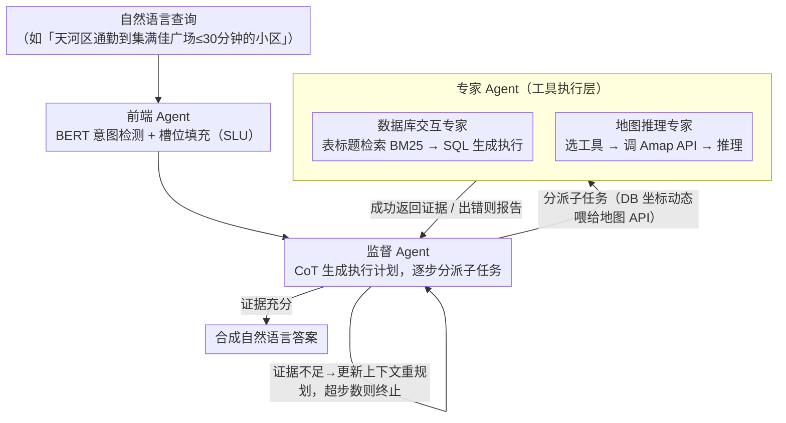

# ReCoQA: A Benchmark for Tool-Augmented and Multi-Step Reasoning in Real Estate Question and Answering

**会议**: ACL 2026  
**arXiv**: [2604.17944](https://arxiv.org/abs/2604.17944)  
**代码**: [https://github.com/Husky-989/ReCoQA](https://github.com/Husky-989/ReCoQA)  
**领域**: LLM推理  
**关键词**: 工具增强推理, 多步推理, 房地产问答, 多Agent框架, 基准数据集

## 一句话总结
本文构建了 ReCoQA——一个包含 29,270 个房地产问答对的大规模基准，要求模型融合数据库查询和地图 API 调用进行混合多源推理，并提出层次化多 Agent 框架 HIRE-Agent 作为强基线，系统性地揭示了现有 LLM 在垂直领域复杂推理中的瓶颈。

## 研究背景与动机

**领域现状**：在房地产决策中，用户需要在多个平台间切换——在一个网站比较房源、在地图应用计算通勤时间、在政府网站查看学区信息。这种碎片化的信息获取方式造成了巨大的时间成本和认知负荷。AI Agent 是解决这一问题的有力方案，但现有的 QA 基准无法有效评估这种混合推理能力。

**现有痛点**：经典数据集如 Spider 只关注结构化查询，近期的 Agent 基准评估通用工具使用，但它们都将数据库查询和外部 API 调用视为独立能力。现有基准无法模拟实际场景中的混合工作流——比如数据库查询的输出（候选小区列表）需要动态地作为 API 调用（距离计算）的输入。此外，大多数地图 QA 数据集假设地理信息是静态的，忽略了通勤时间等动态值。

**核心矛盾**：真实世界的垂直领域决策需要异构信息源的紧密耦合和多步推理，但缺乏系统性评估这种能力的基准。

**本文目标**：（1）构建一个涵盖静态数据库查询、动态 API 调用和多步推理的端到端基准；（2）建立分层多 Agent 基线并系统分析各模块的瓶颈。

**切入角度**：以房地产购房咨询为切入点——这是一个天然需要数据库查询（房源属性）和地图 API（通勤距离、周边设施）紧密结合的垂直场景。

**核心 idea**：设计包含三种递进难度问题类型的大规模基准（简单查询、联合查询、多步推理），并用"理解-规划-执行"的层次化 Agent 架构作为强基线。

## 方法详解

### 整体框架

ReCoQA 同时交付一个评测基准和一套强基线。基准侧覆盖 8 个中国城市的小区、POI 与位置配对数据，统一存入 PostgreSQL 并配套 4 类地图 API，问题按"简单查询→联合查询→多步推理"三级难度组织，每条样本都带 SLU 标签、SQL 语句与 API 调用序列的完整中间标注。基线侧的 HIRE-Agent 把"自然语言查询→结构化理解→任务编排→工具执行→答案"拆成前端 Agent、监督 Agent、专家 Agent 三层，关键在于让数据库查询的输出能动态喂给地图 API，从而完成需要跨源耦合的链式推理。

### 关键设计

**1. 三级递进难度的问题类型：把推理链拆开给评测看**

Type 1（简单查询）仅需对数据库直接查询；Type 2（联合查询）需要数据库和地图 API 协同；Type 3（多步推理）则要求链式推理——先查库拿到坐标，再调 API 算距离，最后基于 API 结果做比较。每条样本都附带完整的中间步骤标注（SLU 标签、SQL 语句、API 调用序列）。这种由浅入深的设计能精确定位模型究竟在推理链的哪一环失败，中间标注则把评测从"答案对错"升级为"过程可解释"。

**2. 前端 Agent：先把自然语言压成意图与槽位**

该层微调 BERT 同时做意图检测（16 种预定义意图）和槽位填充（19 种槽位类型、IOB 标注），把"天河区通勤到集满佳广场 30 分钟以内"解析成地点、交通方式、时间约束的结构化表示。把意图理解与执行解耦并非锦上添花：消融显示去掉 SLU 标签后 Type 3 准确率平均仅 0.2921，加回后跃升到 0.6535，说明大量错误其实源于查询根本没被读懂。

**3. 监督 Agent：用 CoT 编排多步执行并允许重规划**

拿到结构化输入后，监督 Agent 以 CoT 提示生成执行计划，依次把子任务分派给专家 Agent，再按反馈动态调整——成功就继续，失败就重规划，并设最大步数上限防止死循环。集中式编排保证了多步推理的全局一致性，重规划机制则在单步出错时给系统第二次机会，这正是 Type 3 长链条任务稳定性的来源。

**4. 专家 Agent：异构工具的实际执行与跨源耦合的落点**

监督 Agent 把子任务分派给两类专家落地执行。数据库交互专家先用表标题检索（TCR）锁定正确的表 schema——它先让 LLM 把查询和槽位改写成一段"理想表标题"摘要，再用 BM25 去匹配真实表标题；定位后由 SQL 生成模块（ICL 5-shot）合成并执行 SQL，对含坐标的结果额外抽取地点名回传。地图推理专家则先选工具、生成 API 参数、调用高德（Amap）API，必要时再做一步推理（如比较两点距离）。整体框架强调的"数据库输出动态喂给地图 API"正是落在这一层：数据库专家回传的坐标经监督 Agent 转交后，成为地图专家 API 调用的输入。消融把瓶颈精确定位到这里——给定 GT SQL 标签后 Qwen2.5-72B 提升 +0.1407、给定 GT API 标签后 Qwen3-8B 提升 +0.0660，说明 SQL 生成与工具调用分别是不同模型的主要失败点。

### 一个完整示例

以 Type 3 问题"天河区有哪些小区通勤到集满佳广场不超过 30 分钟？"为例：前端 Agent 先把它解析为意图"通勤筛选"和槽位 {区域=天河区, 目的地=集满佳广场, 时限=30min}；监督 Agent 据此规划——① 查数据库取天河区候选小区及坐标 → ② 把坐标列表逐个喂给地图 API 算通勤时间 → ③ 过滤出 ≤30min 的小区。数据库的输出在这里动态成为 API 的输入，最后由监督 Agent 汇总成自然语言答案；任一环出错，重规划机制就回退重试。

### 损失函数 / 训练策略

SLU 模块使用交叉熵损失微调 BERT；LLM Agent 部分使用 ICL（5-shot）引导，不做额外训练。API 结果通过预缓存实现确定性与零成本执行。

## 实验关键数据

### 主实验

| 模型 | 方法 | Type 1 Acc | Type 2 Acc | Type 3 Acc | Overall Acc |
|------|------|-----------|-----------|-----------|-------------|
| Qwen2.5-72B | Standard | 0.8082 | 0.7110 | 0.3973 | 0.5855 |
| Qwen2.5-72B | HIRE-Agent | 0.8862 | 0.6581 | **0.6211** | **0.6989** |
| Qwen3-30B A3B | Standard | 0.7394 | 0.5871 | 0.3512 | 0.5131 |
| Qwen3-30B A3B | HIRE-Agent | 0.7659 | **0.8645** | **0.8371** | **0.8260** |
| 平均 | Standard | 0.7741 | 0.6090 | 0.3559 | 0.5299 |
| 平均 | HIRE-Agent | **0.8453** | **0.7658** | **0.6535** | **0.7323** |

### 消融实验（瓶颈分析）

| 组件 | 关键指标 | 说明 |
|------|---------|------|
| 无 SLU → 有 SLU | Type 3: 0.2921 → 0.6535 | SLU 模块贡献最大，提升 +0.3614 |
| GT SQL 标签 | Qwen2.5-72B 提升 +0.1407 | SQL 生成是该模型的主要瓶颈 |
| GT API 标签 | Qwen3-8B 提升 +0.0660 | 工具调用是该模型的主要瓶颈 |
| 全部 GT 标签 | 平均准确率仅 0.8864 | 暴露了全局规划和最终推理的合成差距 |

### 关键发现
- 层次化架构平均提升 Overall 准确率 20.24 个百分点，在 Type 3 多步推理上提升最大（+29.76 个百分点）
- 即使提供全部中间步骤的 GT 标签，准确率仍只有 0.8864，说明存在"合成差距"——模型无法完美整合多个子任务的结果
- Qwen3-30B 出现了"过度思考"现象：在简单问题上表现反而差（复杂推理能力干扰了简单查询的直接执行）
- 各模型的瓶颈不同：Qwen2.5-72B 瓶颈在 SQL 生成，Qwen3-8B 瓶颈在工具调用，揭示了模型能力的异质性

## 亮点与洞察
- **渐进式瓶颈分析方法**极具价值——通过逐步替换 GT 标签来定位各模块的性能贡献，这种诊断方法可以迁移到任何多模块系统的评估
- **API 缓存策略**实现了基准的可复现性和零成本使用——将实时 API 调用结果预存储为本地数据库查询，既保证了结果的确定性又消除了 API 费用
- 发现了大模型的"过度思考"现象——强推理能力在简单任务上反而成为负担，这对 Agent 设计有重要启示

## 局限与展望
- 数据集目前仅覆盖中国 8 个城市的房地产场景，地理和文化局限性较大
- 问题基于 41 个模板生成，虽然经过改写但仍可能存在模式重复
- API 缓存策略虽然提高了可复现性，但无法反映实时 API 的延迟和错误处理
- 未来可以扩展到更多垂直领域（医疗、法律、金融），验证框架的通用性

## 相关工作与启发
- **vs Spider**: Spider 只评估 Text-to-SQL，不涉及外部 API 调用和多源融合；ReCoQA 要求数据库和 API 的紧密耦合
- **vs RETQA**: RETQA 引入了 SLU 但局限于静态数据库，不支持动态地理信息查询
- **vs MACT**: MACT 展示了复杂 Agent 协作，但依赖 Pandas 进行数据操作，存在内存和扩展性问题；HIRE-Agent 使用 SQL + API 的组合更具扩展性

## 评分
- 新颖性: ⭐⭐⭐⭐ 首个系统性评估混合数据库-API 推理的垂直领域基准
- 实验充分度: ⭐⭐⭐⭐⭐ 4 个 LLM、多层消融、瓶颈分析、真实场景测试，极为详尽
- 写作质量: ⭐⭐⭐⭐ 结构清晰、分析深入
- 价值: ⭐⭐⭐⭐ 数据集和分析方法对 Agent 研究社区有重要参考价值

<!-- RELATED:START -->

## 相关论文

- [\[ACL 2026\] Beyond Itinerary Planning: A Real-World Benchmark for Multi-Turn and Tool-Using Travel Tasks](beyond_itinerary_planning-a_real-world_benchmark_for_multi-turn_and_tool-using_t.md)
- [\[ACL 2026\] ReTraceQA: Evaluating Reasoning Traces of Small Language Models in Commonsense Question Answering](retraceqa_evaluating_reasoning_traces_of_small_language_models_in_commonsense_qu.md)
- [\[ACL 2026\] DiningBench: A Hierarchical Multi-view Benchmark for Perception and Reasoning in the Dietary Domain](diningbench_a_hierarchical_multi-view_benchmark_for_perception_and_reasoning_in_.md)
- [\[NeurIPS 2025\] DSAS: A Universal Plug-and-Play Framework for Attention Optimization in Multi-Document Question Answering](../../NeurIPS2025/llm_evaluation/dsas_a_universal_plug-and-play_framework_for_attention_optimization_in_multi-doc.md)
- [\[ACL 2025\] YESciEval: Robust LLM-as-a-Judge for Scientific Question Answering](../../ACL2025/llm_evaluation/yescieval_llm_judge_science.md)

<!-- RELATED:END -->
