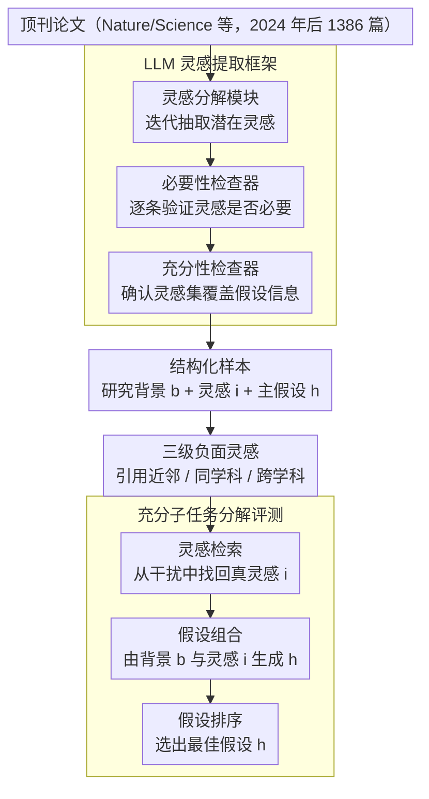

# ResearchBench: Benchmarking LLMs in Scientific Discovery via Inspiration-Based Task Decomposition

**会议**: ACL 2026  
**arXiv**: [2503.21248](https://arxiv.org/abs/2503.21248)  
**代码**: 无  
**领域**: 科学发现  
**关键词**: 科学发现, 灵感检索, 假设生成, LLM基准, 跨学科

## 一句话总结

提出 ResearchBench，首个大规模评估LLM科学发现能力的基准，基于"灵感驱动假设生成"的理论分解，覆盖12个学科1386篇论文，将科学发现分解为灵感检索、假设组合、假设排序三个充分子任务，发现LLM在跨学科灵感检索上表现出色。

## 研究背景与动机

**领域现状**：LLM已展现出辅助科学研究的潜力，但其发现有效新假设的能力尚缺乏系统性评估基准。

**现有痛点**：（1）缺乏专门的科学发现基准——现有基准（Chatbot Arena、MixEval）评估通用能力而非发现能力；（2）IdeaBench仅覆盖生物医学的假设生成，不评估完整的发现子任务集；（3）DiscoveryBench和ScienceAgentBench关注特定子任务（如写代码），不分析科学发现的基本分解。

**核心矛盾**：科学发现过程的不可分解性使评估困难——需要一个理论上"充分"的子任务分解，使得完美解决这些子任务等价于完美解决整体发现任务。

**本文目标**：构建首个跨学科、大规模的科学发现能力基准，基于理论上充分的子任务分解。

**切入角度**：基于认知科学发现——创意通常源于两个看似无关知识的组合联想——将假设生成分解为灵感检索→假设组合→假设排序。

**核心idea**：大多数假设 $h = f(b, i_1, ..., i_k)$ 可视为研究背景 $b$ 与灵感知识 $i$ 的组合，据此分解为三个可独立评估的子任务，完美解决这三个子任务即完美解决发现任务。

## 方法详解

### 整体框架

ResearchBench 是一条"采数据→拆假设→造干扰→评模型"的评测流水线。它先从 Nature、Science 等顶刊抓取 1386 篇 2024 年后的论文，用 LLM agentic 框架自动从中抽出研究问题、背景综述、灵感知识与主假设，再为每条灵感构造引用邻近、同学科、跨学科三级负面样本，最后在灵感检索、假设组合、假设排序三个子任务上评测 LLM。整套设计的出发点是一个可证充分的分解：把"发现新假设"拆成这三步，完美解决它们即等价于完美完成发现。

### 关键设计

**1. 理论上充分的子任务分解：让局部评测能反推整体能力**

基于 $P(h|b) \approx \prod_{j=1}^{k} P(i_j|b,h_{j-1},I) \cdot P(h_j|b,h_{j-1},i_j)$，论文把假设生成视为研究背景 $b$ 与一组灵感知识 $i$ 的链式组合，对应三个子任务：灵感检索（找到 $i_j$）、假设组合（由背景与灵感生成 $h_j$）、假设排序（选出最佳 $h$）。这种分解的关键性质是"充分"——完美解决三个子任务即完美解决整体发现，因而子任务上的得分能可靠地推广到发现能力。其依据来自认知科学"想法不过是旧元素的新组合"，并经 12 个学科与专家验证确认普适。

**2. LLM 灵感提取框架：自动且可随时间更新**

框架分三段协作：灵感分解模块迭代抽出潜在灵感（以被引论文的标题加摘要表示），必要性检查器逐条验证该灵感对主假设是否必要，充分性检查器再确认抽出的灵感集合足以覆盖假设的信息范围，专家复核准确率达 91.9%。全自动设计的好处不止省人力——它能随 LLM 预训练截止日期推移自动换上更新的论文，从而持续规避数据泄露。

**3. 三级负面灵感：给灵感检索铺一条难度梯度**

干扰项按区分难度分三档：Level 1 是被该论文引用或标题语义相近的近邻论文，最难甄别；Level 2 是同学科论文，难度居中；Level 3 是完全不同学科的论文，最易排除。简单负样本只会让所有模型都轻松满分、失去区分度，三级梯度则能细粒度地刻画 LLM 究竟能在多近的距离上把真灵感从干扰中挑出来。

## 实验关键数据

### 主实验（灵感检索 - 选择top 4%候选）

| 模型 | 总体准确率 |
|------|----------|
| GPT-4o | 45.7% |
| GPT-4o-mini | 42.3% |
| Qwen2.5-72B | ~40% |
| Llama-3.1-70B | ~35% |

### 关键发现
- LLM在灵感检索上表现出人意料地好——选择top 4%候选时真正灵感被包含的概率达45.7%
- 灵感检索本质上是OOD（分布外）任务——灵感应该是"不被认为与研究问题相关但实际有用"的知识，LLM能找到这种非显而易见的关联
- 假设组合和排序任务上LLM也表现不错
- 跨12个学科结果一致，验证了基于灵感的分解框架的普适性
- 将LLM定位为"研究假设矿山"——性能更好的LLM是更富的矿，更多推理计算等于更多矿工

## 亮点与洞察
- **理论基础扎实**：基于认知科学的充分分解，不是ad hoc的评估设计
- **OOD灵感检索的发现意义深远**：说明LLM具备发现非显而易见的知识关联的能力
- **12学科覆盖**：从物理到法学，验证了方法的广泛适用性
- **自动可更新**：框架可随时间自动提取新论文，避免数据泄露

## 局限与展望
- **假设的评估依赖语义匹配**：难以评估真正全新的假设
- **灵感提取准确率91.9%**：仍有改进空间
- **仅评估假设发现**：不评估假设的实验验证
- 未来方向：与实验Agent结合完成完整科学发现循环、评估假设新颖性和影响力

## 相关工作与启发
- **vs IdeaBench**：仅覆盖生物医学、无灵感检索评估、规则提取（非LLM）、单一领域
- **vs DiscoveryBench/ScienceAgentBench**：关注代码编写等特定子任务，不分析发现的基本分解
- **vs MOOSE-Chem**：提出灵感驱动发现框架但仅限化学和材料科学，ResearchBench扩展到12学科

## 评分
- 新颖性: ⭐⭐⭐⭐⭐ 首个基于理论充分分解的跨学科科学发现基准，灵感检索作为OOD任务的洞察独特
- 实验充分度: ⭐⭐⭐⭐ 12学科覆盖、多模型对比、专家验证，但某些任务的评估细节较少
- 写作质量: ⭐⭐⭐⭐ 理论框架阐述清晰，反向传播的灵感例子直观
- 价值: ⭐⭐⭐⭐⭐ 为AI辅助科学发现提供了首个系统性评估框架，"研究假设矿山"的定位有启发性

<!-- RELATED:START -->

## 相关论文

- [\[ICML 2025\] LLM-SRBench: A New Benchmark for Scientific Equation Discovery with LLMs](../../ICML2025/llm_evaluation/llm-srbench_a_new_benchmark_for_scientific_equation_discovery_with_large_languag.md)
- [\[ACL 2026\] PolitNuggets: Benchmarking Agentic Discovery of Long-Tail Political Facts](politnuggets_benchmarking_agentic_discovery_of_long-tail_political_facts.md)
- [\[ACL 2026\] E2EDev: Benchmarking Large Language Models in End-to-End Software Development Task](e2edev_benchmarking_large_language_models_in_end-to-end_software_development_tas.md)
- [\[ACL 2026\] Personalized Benchmarking: Evaluating LLMs by Individual Preferences](personalized_benchmarking_evaluating_llms_by_individual_preferences.md)
- [\[ACL 2026\] Reward Modeling for Scientific Writing Evaluation](reward_modeling_for_scientific_writing_evaluation.md)

<!-- RELATED:END -->
