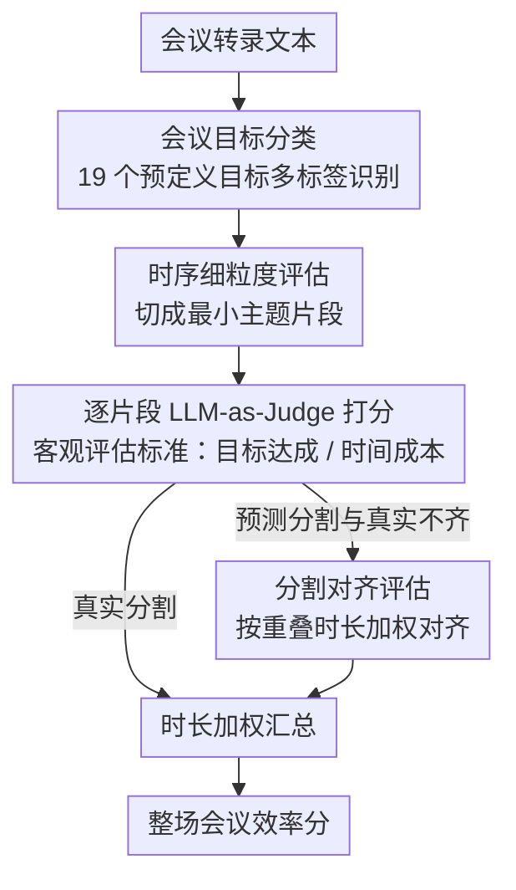

# Rethinking Meeting Effectiveness: A Benchmark and Framework for Temporal Fine-grained Automatic Meeting Effectiveness Evaluation

**会议**: ACL 2026  
**arXiv**: [2604.17260](https://arxiv.org/abs/2604.17260)  
**代码**: [GitHub](https://github.com)  
**领域**: LLM评测  
**关键词**: 会议效率评估, 时序细粒度评估, LLM-as-Judge, 主题分割, 多方对话

## 一句话总结

本文重新定义会议效率评估——提出"目标达成率/时间成本"的客观标准和时序细粒度评估范式，构建了包含 130 场会议 2,459 个标注片段的 AMI-ME 数据集，并开发了基于 LLM 的自动评估框架，在 Spearman 相关系数上达到 0.64。

## 研究背景与动机

**领域现状**：会议是组织协作的基石，但其效率评估长期依赖事后调查问卷，产生整场会议的单一粗粒度分数。这种评估方式成本高、难以规模化、缺乏可复现性。

**现有痛点**：(1) 单一分数无法捕捉会议的动态本质——一场会议可能有高效和低效交替的阶段；(2) 现有评估标准各异且常基于主观感受，缺乏普适性；(3) 会议数据稀缺且涉及隐私，阻碍了大规模定量分析。

**核心矛盾**：需要一种既客观普适又能捕捉会议时序动态的评估方法，同时克服人工标注的可扩展性瓶颈。

**本文目标**：(1) 定义客观、普适的会议效率评估标准；(2) 提出时序细粒度评估方法；(3) 构建元评估数据集；(4) 开发 LLM 自动评估框架。

**切入角度**：将会议分割为连续的主题片段，对每个片段独立评估效率，既提高标注可靠性，又大幅增加数据量（从 130 个数据点扩展到 2,459 个）。

**核心 idea**：将会议效率定义为"目标达成/时间成本"，在细粒度主题片段上用 LLM-as-a-Judge 自动评估。

## 方法详解

### 整体框架

评估框架把"会议好不好"拆成一条可自动执行的三步流水线。给定会议转录文本，先做会议目标分类——从 19 个预定义目标中多标签识别这场会议到底想达成什么；再做主题分割，把长转录切成连续的细粒度主题片段；最后逐片段用 LLM-as-a-Judge 打分，衡量它对整体目标的贡献与时间利用率，并按时长加权汇总成整场会议的效率分。当片段来自模型预测、与真实片段对不齐时，还要先做分割对齐再汇总。

### 关键设计

**1. 客观评估标准：把效率定义成目标达成与时间成本之比**

论文舍弃"参与者满意度"这类主观量，转而用"效率 = 目标达成 / 时间成本"。这里的"目标"不取事先计划的议程，而是会议结束后从实际内容里综合涌现的目标，以容纳议题在过程中自然漂移的常态。这样定义的好处是可独立评估——满意度必须问人，而目标是否达成可以直接从转录内容判定，从而摆脱对事后问卷的依赖。

**2. 时序细粒度评估：在最小主题单元上捕捉会议动态**

框架采用参考引导的分割——以 AMI 原始标注为参照，让 Gemini-2.5-Pro 产出更细、且不可再分的最小主题片段，整场效率取各片段分数的时长加权平均。这一步同时解决三件事：短片段更容易被准确标注、把 130 场会议放大成 2459 个数据点、并让"高效与低效阶段交替"的会议动态首次变得可观测。

**3. 分割对齐评估：让模型分割与真实分割不一致时仍能公平打分**

模型切出的片段在数量和边界上通常与真实片段对不齐，无法一对一比较。论文对每个真实片段，用与之重叠的所有预测片段做时长加权平均：$\hat{e}_{t_i}^{t_{i+1}} = \sum_j \hat{e}_j \cdot \Delta_{i,j} / \sum_j \Delta_{i,j}$，其中 $\Delta_{i,j}$ 是两片段的重叠时长。由此把"边界错位"这一固有噪声从评估误差中剥离出来，让模型分数可比。

### 损失函数 / 训练策略

纯评估框架，不涉及训练。标注由 6 名经培训的专业标注员完成（分两组），5 分量表，ICC 达到 0.82-0.88（"好"级别可靠性）。

## 实验关键数据

### 主实验

| 模型 | Spearman (所有会议) | Kendall (所有会议) |
|------|-------------------|------------------|
| Qwen3-32B (非推理) | **0.6445** | **0.4803** |
| GPT-4o | 0.6341 | 0.4756 |
| Llama3.3-70B | 0.6072 | 0.4854 |
| DeepSeek-R1-70B | 0.6132 | 0.4663 |
| Gemini-2.5-Flash | 0.5624 | 0.4122 |

### 消融实验

| 设置 | Spearman | 说明 |
|------|----------|------|
| 真实分割+真实目标 | 0.6445 | 上限 |
| 预测分割 | 0.2256 | 分割误差大幅降低性能 |
| 端到端（语音→评估） | 0.2180 | ASR 错误影响小（与预测分割接近） |
| 理论上界 | 0.6417 | 分割不一致的固有惩罚 |

### 关键发现

- 主题分割质量是瓶颈——从真实分割到预测分割，Spearman 从 0.64 降到 0.23
- ASR 错误对效率评估影响很小（0.23 vs 0.22），表明 LLM 对噪声文本有鲁棒性
- Gemini-2.5-Flash 表现最差，因其倾向于过度使用最低分
- 推理模型（DeepSeek-R1）不一定优于非推理模型（Qwen3 非推理模式表现最好）

## 亮点与洞察

- "效率=目标达成/时间"的定义简洁且普适——将模糊的"会议好不好"转化为可量化的比率
- 时序细粒度评估一举三得——更准确标注+更多数据+动态分析
- 分割对齐机制优雅地解决了评估中的边界不一致问题

## 局限与展望

- 当前主题分割质量严重限制了端到端性能（0.64→0.23）
- 仅在 AMI 语料库上验证，会议类型有限
- 每场会议最多 3 个目标的限制可能不适用于复杂会议
- 未考虑多模态信号（视频、共享屏幕等）对效率的影响

## 相关工作与启发

- **vs 传统会议评估**: 传统方法产生单一分数且依赖问卷；本文首次实现自动化的时序细粒度评估
- **vs G-Eval**: 评估部分借鉴 G-Eval 的 CoT 和表单填写范式，但面向完全不同的任务
- **vs 多方对话研究**: 为多方对话 agent 的主动干预提供了评估基础

## 评分

- 新颖性: ⭐⭐⭐⭐ 评估范式新颖，但核心方法（LLM-as-Judge）是标准做法
- 实验充分度: ⭐⭐⭐⭐⭐ 端到端评估、跨会议类型、分割影响分析，非常全面
- 写作质量: ⭐⭐⭐⭐⭐ 逻辑清晰，问题定义精确，数据集构建过程透明
- 价值: ⭐⭐⭐⭐ 为会议分析提供了新范式和基准，但实际应用需解决分割瓶颈

<!-- RELATED:START -->

## 相关论文

- [\[ACL 2026\] K-MetBench: A Multi-Dimensional Benchmark for Fine-Grained Evaluation of Expert Reasoning, Locality, and Multimodality in Meteorology](k-metbench_a_multi-dimensional_benchmark_for_fine-grained_evaluation_of_expert_r.md)
- [\[ACL 2026\] IF-Critic: Towards a Fine-Grained LLM Critic for Instruction-Following Evaluation](if-critic_towards_a_fine-grained_llm_critic_for_instruction-following_evaluation.md)
- [\[ICML 2026\] On Effectiveness and Efficiency of Agentic Tool-calling and RL Training](../../ICML2026/llm_evaluation/on_effectiveness_and_efficiency_of_agentic_tool-calling_and_rl_training.md)
- [\[ACL 2026\] LoCar: Localization-Aware Evaluation of In-Vehicle Assistants through Fine-Grained Sociolinguistic Control](locar_localization-aware_evaluation_of_in-vehicle_assistants_through_fine-graine.md)
- [\[ACL 2026\] Comprehensiveness Metrics for Automatic Evaluation of Factual Recall in Text Generation](comprehensiveness_metrics_for_automatic_evaluation_of_factual_recall_in_text_gen.md)

<!-- RELATED:END -->
