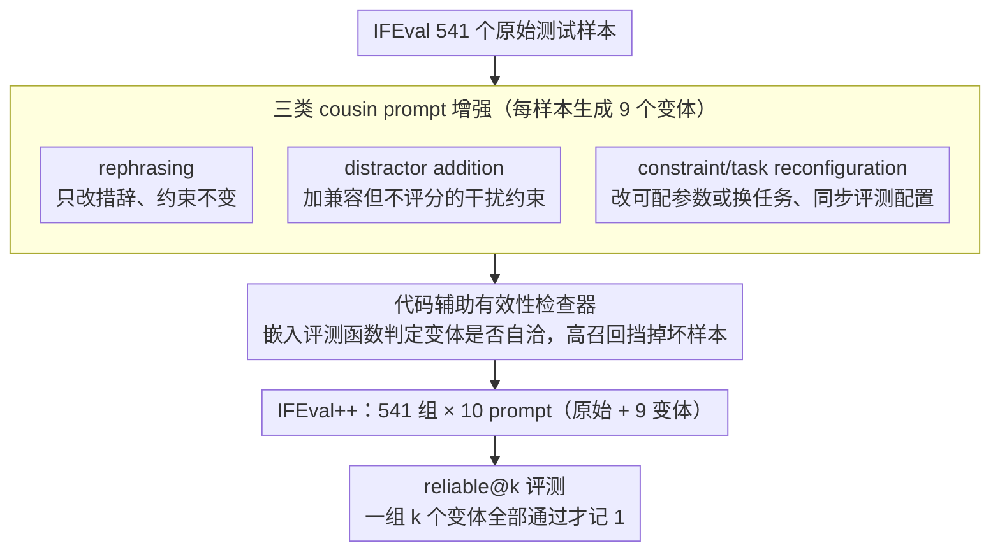

# Revisiting the Reliability of Language Models in Instruction-Following

**会议**: ACL2026  
**arXiv**: [2512.14754](https://arxiv.org/abs/2512.14754)  
**代码**: https://github.com/jianshuod/IFEval-pp  
**领域**: LLM评测  
**关键词**: 指令遵循、可靠性评测、IFEval++、cousin prompts、reliable@k

## 一句话总结
本文提出 nuance-oriented reliability 和 reliable@k，用 IFEval++ 检验模型能否稳定处理语义相近但细节不同的 cousin prompts，发现即便高分模型在细微提示变化下也会显著掉线。

## 研究背景与动机
**领域现状**：指令遵循能力通常通过 IFEval、FollowBench、CFBench 等 benchmark 评测，关注模型是否能满足格式、长度、关键词、结构等显式约束。随着模型迭代，许多强模型已经在 IFEval 上接近饱和，例如 GPT-5 的 IFEval accuracy 达到 95.9%。

**现有痛点**：高 benchmark accuracy 并不等于真实服务可靠。用户在实际使用中会改变措辞、上下文框架、数字约束或任务实例，而很多评测只看单个 prompt 的成败，没有衡量模型在一组相近 prompt 上是否一致可靠。

**核心矛盾**：一个模型可能在原始 prompt 上答对，却在只改动少量细节的 cousin prompt 上失败。传统准确率把每条 prompt 当成独立样本，无法区分“覆盖很多类型”和“对同一意图稳定可靠”这两个维度。

**本文目标**：作者希望构造一个能够评估细微变化稳定性的测试框架，回答当前 LLM 在指令遵循中是否具备 nuance-oriented reliability，并进一步分析这种可靠性如何随模型规模、时间迭代、推理能力和改进策略变化。

**切入角度**：论文从 IFEval 出发，对每个原始测试样本自动生成多个 cousin prompts。它们保留相近用户意图，但通过改写、增加兼容干扰约束、重配置任务或约束来制造细节差异。然后要求模型在同一组 prompt 上全部通过，才算该样本可靠。

**核心 idea**：把“单题是否答对”升级为“一组语义邻近题是否全答对”，用 reliable@k 衡量模型对细微提示变化的稳定性。

## 方法详解
本文的核心不是提出一个新模型，而是提出一个评测维度、一个 benchmark 构造流水线和一组系统实验。它把 instruction-following 的可靠性拆成两个正交维度：comprehensiveness-oriented reliability 关注任务和约束覆盖面，nuance-oriented reliability 关注同一意图在不同表达下是否稳定。

### 整体框架
整体流程从 IFEval 的 541 个原始测试样本开始。对每个样本，系统生成 9 个 cousin prompts，加上原始 prompt 组成 10 个 prompt 的测试组。每个 cousin prompt 属于三类增强之一：rephrasing、distractor addition、constraint/task reconfiguration。生成后，代码辅助的 validity checker 会检查 prompt 和评测配置是否一致、是否能被 IFEval 的自动评测函数验证。

最终得到的 IFEval++ 包含 541 个测试组，每组 10 个 prompt。模型评估时，作者报告原始 IFEval accuracy，也报告不同增强子集上的 reliable@2、reliable@4，以及整个 IFEval++ 上的 reliable@10。

### 关键设计

**1. 三类 cousin prompt 增强：从三个角度制造细微但合理的指令扰动**

要测“同一能力稳不稳”，扰动必须贴近真实用户而不是换成全新任务。作者把每个原始样本扩成一组变体，归为三类：rephrasing 只改措辞、约束不变，对应用户换种说法；distractor addition 添加与原约束兼容、但不参与评分的干扰约束，对应用户顺带提的额外要求；constraint/task reconfiguration 改动可配置参数或更换任务场景、同时同步更新评测配置，对应任务实例的变化。三类分别覆盖“说法变、要求变、实例变”，比直接换题更能逼问模型对同一意图的稳固程度。

**2. 代码辅助有效性检查器：先保证变体合法，失败才能归因到模型**

如果某个 cousin prompt 本身就不合法或配置错位，那 reliable@k 的失败就不能怪模型不可靠，指标会被污染。检查器的做法是把评测函数的实现和配置说明一起嵌进 prompt，让 LLM 判断增强样本是否与可执行的评测逻辑自洽；策略上刻意偏高召回，宁可多标几个可疑样本，也要尽量把坏样本挡在外面。这套检查器在 900 个注入错误样本上召回 99.7%，在额外 3000 个 flawed cases 上召回 99.9%，足以支撑后续把失败干净地归到模型身上。

**3. reliable@k 指标：把“单题答对”升级成“一组邻近题全对”**

传统 accuracy 把每条 prompt 当独立样本，看不出模型对同一意图是否稳定——它能区分“覆盖很多类型”，却区分不了“对同一意图反复可靠”。reliable@k 直接把这种局部稳定性写进指标：对一组 $k$ 个 cousin prompt 的输出，只有当全部通过各自的自动评测函数时该组才记 1，哪怕只有一个失败整组就记 0。当 $k=1$ 时它退化为普通 accuracy，因此 reliable@k 可以看成 accuracy 的二阶推广，专门暴露原句答对、变体就崩的脆弱性。

### 损失函数 / 训练策略
评测部分不涉及训练。改进实验中，作者测试三条路径：预测 prompt 是否会被遵循、用目标相近数据做 SFT、通过推理努力或 rejection sampling 扩展 test-time compute。训练实验中使用 Qwen2.5-7B-Instruct，分别在 Alpaca 和去污染的 IFEval cousin prompts 上 SFT 312 steps，对比可靠性变化。

## 实验关键数据

### 主实验
作者评估 46 个模型，包括 20 个专有模型和 26 个开源模型，覆盖不同规模、厂商、推理模式和年代。

| 模型 | IFEval Accuracy | IFEval++ reliable@10 | 相对下降 | 观察 |
|--------|------|------|----------|------|
| GPT-5 | 95.9 | 78.4 | -18.3% | 最可靠，但仍明显下降 |
| o3 | 94.3 | 75.0 | -21.3% | 推理模型表现强 |
| LLaMA-3.3-70B-Instruct | 92.1 | 71.0 | -22.9% | 最强开源模型之一 |
| Gemma-3-IT-27B | 84.3 | 61.6 | -27.0% | accuracy 排名低，但 reliable@10 排名上升 |
| Qwen3-0.6B | 58.0 | 22.2 | -61.8% | 小模型在细微变化下最脆弱 |
| GPT-3.5-turbo-1106 | 61.6 | 27.9 | -54.7% | 旧专有模型下降显著 |

结果说明，IFEval accuracy 与 IFEval++ reliable@10 高度相关但不等价。某些模型在原始 IFEval 上排名不突出，却在 cousin prompts 上更稳定，说明 nuance-oriented reliability 是独立于单点准确率的能力。

### 消融实验
论文围绕可靠性提升测试了预测、训练和 test-time scaling 三类方法。

| 配置 / 方法 | 关键指标 | 说明 |
|------|---------|------|
| verbalized confidence | AUROC 0.549 / 0.518 | Qwen3-8B 与 Qwen2.5-7B 接近随机，模型自信度不可靠 |
| prompt perplexity | AUROC 0.497 / 0.529 | prompt 熟悉度不能预测是否遵循 |
| hidden-state probing | AUROC 0.757 / 0.759 | 中间隐藏状态能提供一定预测信号 |
| Alpaca SFT | reliable@10 轻微下降 | 一般 instruction 数据未必改善细微稳定性 |
| curated cousin-prompt SFT | 200 steps 后超过 45% | 语义邻近数据更有效 |
| rejection sampling | n 增大到约 12 后趋于平台 | 若有 response selector，可靠性显著提升 |

### 关键发现
- 细微变化造成的可靠性下降非常普遍，最高可达 61.8%。这说明 instruction-following benchmark 饱和并不代表真实稳定性饱和。
- rephrasing 通常最容易，distractor 和 constraint/task reconfiguration 更难，因为它们增加了 response planning 和约束执行压力。
- 模型规模总体有帮助，但不是唯一因素。Qwen3-14B 在某些可靠性指标上超过更大的 Qwen3-32B，说明训练方法和数据质量同样关键。
- 推理能力通常提升可靠性，但不是充分必要条件。LLaMA-3.3-70B-Instruct 不是 reasoning model，却是开源模型中最强之一。
- reliable@10 与 pass@10 不同。前者测语义邻近 prompt 的稳定性，后者测同一 prompt 多次采样的随机稳定性；在 LLaMA-3.3-70B 上，accuracy 92.1、reliable@10 71.0、pass@10 85.6，差异很清楚。

## 亮点与洞察
- 论文把“可靠性”从一个泛泛概念拆成可执行指标，这是最大贡献。reliable@k 简单但很有诊断力，尤其适合揭示 benchmark overfitting 和 prompt sensitivity。
- cousin prompt 的构造比传统 paraphrase robustness 更宽。它不仅看同义改写，也看兼容干扰和微调约束后的稳定性，更接近真实用户的多样表达。
- 训练实验给出一个很实用的信号：提升可靠性不一定靠更多通用 instruction 数据，而需要围绕语义邻近样本做有针对性的训练。
- test-time scaling 的分析也很现实。只要有可程序验证的 selector，rejection sampling 可以显著提升可靠性；但这也说明可验证任务和开放式任务之间存在重要差异。

## 局限与展望
- IFEval++ 的完整评测成本是 IFEval 的 10 倍，需要生成更多响应。未来需要更高效地选择最有区分度的 cousin prompts。
- 评测主要关注格式和约束遵循，没有同时评估内容质量。模型可能满足格式但回答内容一般，这在真实服务中仍然不够。
- 本文主要基于英文 IFEval。方法可以迁移到多语言，但需要翻译、约束函数适配和语言特定的有效性检查。
- validity checker 虽然召回很高，但仍依赖 LLM 判断，可能带来细微偏差。更强的程序化检查或人工抽检可以进一步增强可信度。
- 改进策略只覆盖代表性方法，没有系统复现所有 instruction-following enhancement 技术，无法断言哪类训练或对齐策略最优。

## 相关工作与启发
- **vs IFEval**: IFEval 评估单条 prompt 是否满足约束，IFEval++ 在其基础上评估同一意图的多种细微表达是否都能满足。
- **vs 多约束 benchmark**: FollowBench、CFBench、ComplexBench 更强调约束类型和复杂度覆盖；本文强调语义邻近样本间的一致性。
- **vs pass@k**: pass@k 是同一 prompt 多次采样的稳定性，reliable@k 是不同 cousin prompts 的稳定性，两者捕捉不同风险。
- **启发**: 未来构建 LLM 评测时，应给每个核心样本配套一个局部扰动族。模型分数不应只看“答对多少题”，还要看“同一能力是否稳”。

## 评分
- 新颖性: ⭐⭐⭐⭐⭐ reliable@k 概念简单有力，把 prompt-level 稳定性变成可规模化评测。
- 实验充分度: ⭐⭐⭐⭐⭐ 覆盖 46 个模型，并分析规模、时间、推理、增强类型和改进路径。
- 写作质量: ⭐⭐⭐⭐☆ 结构清楚，例子直观；长表格信息密集，需要读者关注指标定义。
- 价值: ⭐⭐⭐⭐⭐ 对 LLM 评测、模型发布报告和可靠服务监控都有直接参考价值。

<!-- RELATED:START -->

## 相关论文

- [\[ACL 2026\] IF-RewardBench: Benchmarking Judge Models for Instruction-Following Evaluation](if-rewardbench_benchmarking_judge_models_for_instruction-following_evaluation.md)
- [\[ACL 2026\] Revisiting a Pain in the Neck: A Semantic Reasoning Benchmark for Language Models](revisiting_a_pain_in_the_neck_a_semantic_reasoning_benchmark_for_language_models.md)
- [\[ACL 2026\] IF-Critic: Towards a Fine-Grained LLM Critic for Instruction-Following Evaluation](if-critic_towards_a_fine-grained_llm_critic_for_instruction-following_evaluation.md)
- [\[ACL 2025\] StructFlowBench: A Structured Flow Benchmark for Multi-turn Instruction Following](../../ACL2025/llm_evaluation/structflowbench_a_structured_flow_benchmark_for_multi-turn_instruction_following.md)
- [\[ACL 2026\] The Silent Vote: Improving Zero-Shot LLM Reliability by Aggregating Semantic Neighborhoods](the_silent_vote_improving_zero-shot_llm_reliability_by_aggregating_semantic_neig.md)

<!-- RELATED:END -->
