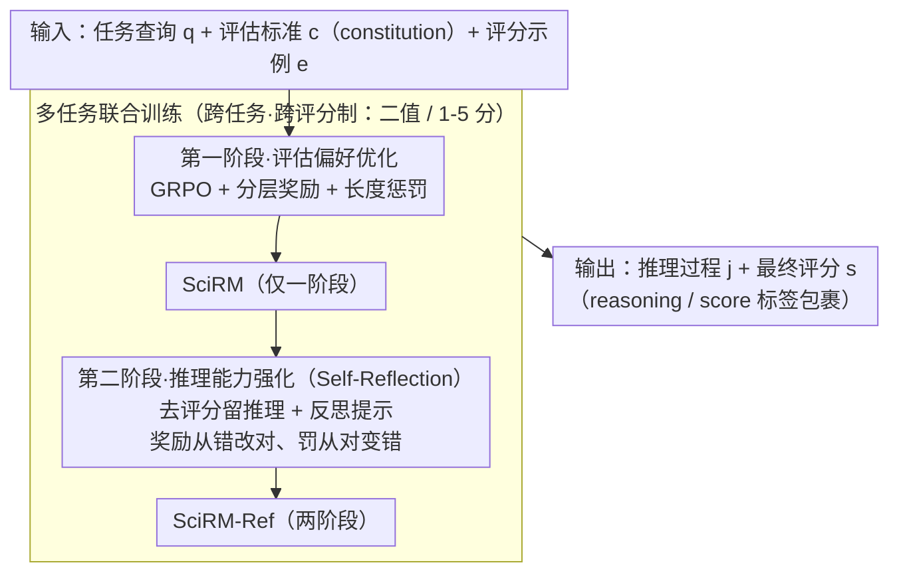

# Reward Modeling for Scientific Writing Evaluation

**会议**: ACL 2026  
**arXiv**: [2601.11374](https://arxiv.org/abs/2601.11374)  
**代码**: [https://github.com/UKPLab/acl2026-expert-rm](https://github.com/UKPLab/acl2026-expert-rm)  
**领域**: LLM对齐 / 科学写作评估  
**关键词**: 奖励模型, 科学写作评估, GRPO, 多方面评估, 推理增强

## 一句话总结

本文提出 SciRM 和 SciRM-Ref 两个针对科学写作评估的开源奖励模型，通过两阶段强化学习（GRPO）分别优化评估偏好和推理能力，实现了在多种科学写作任务上的细粒度多方面评估，并能泛化到未见过的评估任务和标准。

## 研究背景与动机

**领域现状**：LLM 在科学文本生成（相关工作撰写、审稿生成、论文修改等）方面已有广泛应用，但评估这些生成结果仍是开放难题。目前最常用的方法是 LLM-as-a-judge，直接用 LLM 打分评估。

**现有痛点**：(1) 通用 LLM 法官在处理科学写作评估时，难以推理领域知识和任务特定偏好，经常产生自相矛盾的评估（如图 1 所示）；(2) 现有奖励模型针对通用基准优化（数学推理、代码、helpfulness 等），不适用于科学写作的细微需求；(3) 大多数奖励模型使用成对比较（pairwise），无法基于显式标准进行独立评估；(4) 现有模型对固定评分标准优化，换一套标准性能就下降。

**核心矛盾**：科学写作评估需要动态适应不同任务、不同方面、不同评分标准（甚至同一文本的不同方面可能有矛盾的标准），但现有模型将评估偏好固化在训练中，缺乏推理时的灵活适应能力。

**本文目标**：构建能在推理时根据显式 constitution（评估标准+评分规则+示例）动态适应的开源科学写作评估奖励模型。

**切入角度**：将评估视为条件生成任务——模型接受 constitution 作为上下文条件，通过推理过程解释和遵循评估标准。两阶段训练分别教模型"按标准评分"和"反思标准修正自己的推理"。

**核心 idea**：用两阶段 GRPO 训练奖励推理模型：第一阶段学会遵循 constitution 进行评估，第二阶段学会反思和自我修正，联合多任务训练提升跨任务泛化能力。

## 方法详解

### 整体框架

SciRM 把科学写作评估看成一个条件生成任务：输入是任务查询 $q$（待评估的科学文本）、评估标准 $c$（constitution，包含评分规则与标准描述）和评分示例 $e$，模型输出用 `<reasoning>` 包裹的推理过程 $j$ 和用 `<score>` 包裹的最终评分 $s$。训练分两阶段走 GRPO：第一阶段教模型按 constitution 准确评分，第二阶段在此基础上追加反思步骤、教它重新审视标准后修正自己的推理；训练数据跨多个任务（相关工作评估的二值标签、审稿质量的 1-5 分制）联合混训，以换取跨任务泛化。

### 关键设计

**1. 第一阶段·评估偏好优化：用分层奖励区分错误的严重程度**

这一阶段用 GRPO 教模型按给定 constitution 准确评分，关键是奖励函数设成分层结构：格式错误（无 `<score>` 标签）得 -0.5，输出非数字得 0，是数字但不在合法范围得 0.25，合法但错误得 0.5，正确得 1.5。这样能把"格式坏"和"语义错"这两种性质不同的错误拉开，引导模型逐步改善。另外引入长度惩罚函数 $f(L,T)$，当输出过短或过长时施加二次惩罚，专治模型只输出评分、跳过推理的奖励 hacking。

**2. 第二阶段·推理能力强化（Self-Reflection）：奖励"从错改对"，惩罚"从对变错"**

第二阶段取第一阶段模型的输出，去掉评分只保留推理，追加反思提示要求模型重新审视标准后给出最终评分。奖励同时看初始评分 $s_i$ 和最终评分 $s_f$：自我修正（$s_i \neq s^*$ 且 $s_f = s^*$）得最高奖励 1.0，退化（$s_i = s^*$ 且 $s_f \neq s^*$）受最重惩罚 -1.0。这样鼓励模型在推理中主动修错，又压住不稳定的摇摆行为，从而解决 constitutional AI 把规则内化进权重、无法动态适配新标准的问题。

**3. 多任务联合训练：跨评分标准逃避过拟合特定模式**

单任务训练容易把某套标准记死，一换标准性能就崩。本文把多种科学写作任务（相关工作评估的一致性/定位类型/定位一致性，审稿质量的可操作性/依据/可验证性/有用性）、跨不同评分制（二值 vs 1-5 分）放在一起联合训练，逼模型学到"评估的元能力"而非记忆特定模式，从而能泛化到未见的评分方面和任务。

### 损失函数 / 训练策略

基于 Qwen2.5-7B 用 LoRA 微调，两个阶段均用 GRPO。推理温度 1.0、top-p 0.95，每个实验重复 5 次报均值和标准差。仅经第一阶段训练的模型称为 SciRM，两阶段训练的称为 SciRM-Ref。

## 实验关键数据

### 主实验

| 任务 | SciRM-Ref | Qwen2.5-7B | Qwen3-8B | GPT-5.2 | Prometheus |
|------|-----------|------------|----------|---------|------------|
| 审稿-可操作性 | **最优** | 低 | 中 | 高 | 低 |
| 审稿-可验证性提取 | **最优** | 中 | 中 | 高 | 中 |
| 相关工作-一致性 | **最优** | 低 | 中 | 中 | 低 |
| 相关工作-定位一致性 | **近完美** | 中 | 中 | 高 | 低 |

### 消融实验（未见方面/任务泛化）

| 配置 | 效果 | 说明 |
|------|------|------|
| SciRM-Masked（去掉 2 个方面） | 在未见方面仍超多数基线 | 证明泛化而非过拟合 |
| 未见任务-新颖性评估 | 0.71+ alignment acc | 泛化到完全未见任务 |
| 未见任务-修改评估 | 超越多数基线 | 跨任务迁移有效 |

### 关键发现

- 两阶段训练一致提升性能，第二阶段（反思）在需要强推理的任务上帮助最大
- SciRM-Masked 在未见评估方面仍超越大部分基线，证明模型学到了评估的通用结构而非过拟合特定方面
- 在完全未见的新颖性评估和论文修改评估任务上，SciRM 仍优于通用基线，展示了强泛化能力
- Qwen3 和 o3-mini 等推理模型在个别方面（如 Grounding）表现异常好，可能归功于其推理能力

## 亮点与洞察

- "Constitution-conditioned evaluation"的设计理念很有价值——不把评估标准内化到权重中，而是作为推理时的显式条件。这使得同一个模型可以用不同标准评估不同任务，极大提升了实用性
- 第二阶段的反思奖励设计很精巧：不仅看最终是否正确，还看是否从错误中修正（奖励 1.0）或从正确退化（惩罚 -1.0），有效鼓励了稳定的自我修正行为
- 分层奖励函数的设计思路可以迁移到其他需要结构化输出的 RLHF 任务——不同严重程度的错误给不同惩罚

## 局限与展望

- 仅基于 7B 模型，更大模型可能有不同的 scaling 表现
- 训练数据仍以 NLP/ML 领域的科学文献为主，对其他学科（如生物、物理）的泛化效果未验证
- Constitution 的质量直接影响评估效果，低质量标准可能误导模型
- 长度惩罚的超参数 $k$ 需要人工调节，自适应方案可能更好

## 相关工作与启发

- **vs Prometheus/Selene**: 通用 LLM-as-judge 模型，未针对科学写作优化。SciRM 通过领域特定训练数据和 constitution 条件化设计显著超越
- **vs DeepSeek-GRM**: 通用奖励模型，采用 pairwise 评估，无法基于显式标准做 pointwise 评估。SciRM 的多方面独立评估更适合科学写作场景

## 评分

- 新颖性: ⭐⭐⭐⭐ 首次将奖励推理模型专门用于科学写作评估，两阶段训练设计新颖
- 实验充分度: ⭐⭐⭐⭐⭐ 覆盖 seen/unseen 方面和任务、多基线、多指标，分析详尽
- 写作质量: ⭐⭐⭐⭐ 结构清晰，motivation 论证充分
- 价值: ⭐⭐⭐⭐ 为科学写作自动评估提供了实用的开源解决方案

<!-- RELATED:START -->

## 相关论文

- [\[ACL 2026\] HoWToBench: Holistic Evaluation for LLM's Capability in Human-level Writing using Tree of Writing](howtobench_holistic_evaluation_for_llms_capability_in_human-level_writing_using_.md)
- [\[ACL 2026\] SciCustom: A Framework for Custom Evaluation of Scientific Capabilities in Large Language Models](scicustom_a_framework_for_custom_evaluation_of_scientific_capabilities_in_large_.md)
- [\[ACL 2026\] Modeling Multi-Dimensional Cognitive States in Large Language Models under Cognitive Crowding](modeling_multi-dimensional_cognitive_states_in_large_language_models_under_cogni.md)
- [\[ACL 2026\] SessionIntentBench: A Multi-Task Inter-Session Intention-Shift Modeling Benchmark](sessionintentbench_a_multi-task_inter-session_intention-shift_modeling_benchmark.md)
- [\[ACL 2026\] ResearchBench: Benchmarking LLMs in Scientific Discovery via Inspiration-Based Task Decomposition](researchbench_benchmarking_llms_in_scientific_discovery_via_inspiration-based_ta.md)

<!-- RELATED:END -->
