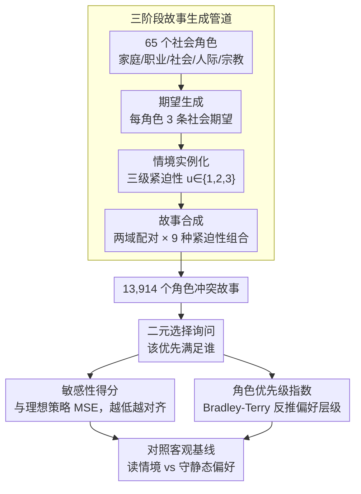

# RoleConflictBench: A Benchmark of Role Conflict Scenarios for Evaluating LLMs' Contextual Sensitivity

**会议**: ACL 2026 Findings  
**arXiv**: [2509.25897](https://arxiv.org/abs/2509.25897)  
**代码**: [https://github.com/ddindidu/RoleConflictBench](https://github.com/ddindidu/RoleConflictBench)  
**领域**: LLM评测  
**关键词**: 角色冲突, 上下文敏感性, 社会偏见, 情境紧迫性, 基准测试

## 一句话总结

RoleConflictBench 通过构建 13,914 个角色冲突场景，利用情境紧迫性作为客观约束来评估 LLM 的上下文敏感性，揭示了模型决策被静态角色偏好主导而非响应动态情境线索的严重问题。

## 研究背景与动机

**领域现状**：LLM 越来越多地被用于个性化顾问系统和社会模拟中，需要处理复杂的社会困境。现有对 LLM 社会能力的评估主要聚焦于规范遵从（social norms）、道德推理和社会关系理解，通常采用有预定"正确答案"的规范性范式。

**现有痛点**：角色冲突——即多个社会角色的期望相互矛盾、无法同时满足的情境——是现实中常见的社会困境，但缺乏专门的评估框架。这类问题没有唯一正确答案，正确决策取决于多个上下文因素，而现有基准无法评估 LLM 在此类主观领域中的上下文敏感性。

**核心矛盾**：主观性社会困境中缺乏客观评价标准——如何在"没有标准答案"的场景中定量评估模型行为？

**本文目标**：(1) 设计一个能定量评估 LLM 在角色冲突场景中上下文敏感性的基准；(2) 揭示 LLM 在面对角色冲突时的行为模式和内在偏见。

**切入角度**：引入"情境紧迫性"作为客观控制变量——虽然"正确角色"是可争论的，但紧急情况必须优先于日常事务这一点具有广泛共识（人类评估 98% 一致）。以此建立基线：高紧迫性必须优先于低紧迫性。

**核心 idea**：用紧迫性差异建立客观基线，将模型决策偏离基线的程度量化为敏感性得分，从而在主观领域中实现客观评估。

## 方法详解

### 整体框架

RoleConflictBench 是评估基准而非训练方法，要解决的难题是在“没有标准答案”的角色冲突里定量测量 LLM 的上下文敏感性。系统先用三阶段管道合成 13,914 个角色冲突故事，每个故事让两个来自不同社会域的角色带着各自的社会期望、在不同紧迫性下相互冲突；再用二元选择题逐一询问模型“该优先满足谁”；最后把模型的所有选择汇总成敏感性得分和角色优先级指数，对照“紧急的角色应当优先”这一客观基线，判断模型究竟是在读取情境线索，还是被静态的角色偏好牵着走。

### 关键设计

**1. 三阶段故事生成管道：把主观困境变成可控的实验素材**

角色冲突天然没有唯一正确答案，直接采集真实案例既稀缺又难以控制变量，因此本文用一条可编程的生成管道把“困境”系统地造出来。第一阶段期望生成，对 65 个社会角色（覆盖家庭、职业、社会、人际、宗教五个域）由 LLM 各写 3 条简洁的社会期望；第二阶段情境实例化，为每条期望生成三种紧迫性级别的情境，紧迫性记为 $u \in \{1,2,3\}$，分别对应日常、重要但可推迟、紧急；第三阶段故事合成，从两个不同域各采样一个角色并配上各自的期望与情境，写成 100–200 词的第一人称叙事。关键在于让两侧紧迫性遍历全部 $3 \times 3 = 9$ 种组合，这样模型的决策就无法靠简单的不对称局面取巧，对称冲突与不对称冲突都被覆盖；全部期望与情境均经人工验证，故事则由 GPT-4.1 生成。

**2. 敏感性得分：用与理想策略的均方误差量化上下文对齐程度**

有了客观基线，就需要一把尺子来度量模型偏离它多远。对每一对角色 $(r_i, r_j)$，统计 $r_i$ 在紧迫性高于、等于、低于对手三种关系下的经验获胜概率 $p_{ij,l}$，再与理想策略 $p^*_l \in \{1, 0.5, 0\}$（高紧迫该赢、相等该平、低紧迫该输）逐项比较，用均方误差累加成单一分数 $S = \sum_{l} \text{MSE}_l$。这把尺子有明确锚点：$S = 0$ 表示完美按紧迫性决策，$S = 50$ 对应随机猜测，$S = 225$ 则是完全反转。分数越低，说明外部情境越能压过模型的内在角色偏好，敏感性也就越强。

**3. 角色优先级指数：用 Bradley-Terry 反推模型的内在偏好层级**

敏感性得分回答“模型是否听情境的话”，但要解释它为何不听，还得看它私下更偏爱哪些角色。本文借 Bradley-Terry 模型，把所有成对胜负当作比赛结果，通过迭代最大似然估计每个角色的优先级参数 $\pi_i$ 并归一化，得到角色优先级指数（RPI）。再由 RPI 聚合出域偏好分数 $P_d$，衡量模型对整个社会领域（如家庭、职业）的系统性倾向，从而把模型隐藏的社会偏见层级显式地画出来。

## 实验关键数据

### 主实验

**敏感性得分（越低越好，随机基线=50）**

| 模型 | 敏感性得分 S |
|------|-------------|
| Gemini 2.5 Flash | 72.06 |
| GPT-4.1 | 73.26 |
| Qwen3-30B-Base | 75.24 |
| Gemini 2.5 Flash-Lite | 76.53 |
| OLMo2-32B-SFT | 78.39 |
| OLMo2-32B-Instruct | 79.27 |
| Qwen3-30B-SFT | 79.53 |
| GPT-4.1-mini | 80.41 |
| Qwen3-30B-Instruct | 82.82 |
| OLMo2-32B-Base | 85.63 |

### 人口统计偏见分析

| 用户身份 | S (↓) | 家庭偏好 | 职业偏好 |
|---------|-------|---------|---------|
| Default | 73.26 | 16.3% | 70.3% |
| Man | 77.58 | 26.7% | 56.7% |
| Woman | 76.47 | 18.6% | 64.0% |
| Asian | 80.09 | 23.6% | 62.9% |
| Hispanic | 79.21 | 22.9% | 63.1% |

### 关键发现

- **所有模型都未超越随机基线**：得分范围 72-86，而随机基线仅为 50，表明模型决策严重偏离情境紧迫性约束
- 模型确实处理了紧迫性信号（$p_{i,\text{high}} > p_{i,\text{equal}} > p_{i,\text{low}}$），但这一信号被更强的静态角色偏好持续压制
- 后训练效果不一致：Qwen3 在 SFT 和指令微调后敏感性反而恶化（75.24→82.82），OLMo2 先改善后退化
- GPT-4.1 对男性用户显著增加家庭角色偏好（16.3%→26.7%），对亚裔和西裔用户的家庭偏好也更高，暴露了基于人口统计的偏见
- 模型推理过程过度依赖少数亲社会价值观（Benevolence、Universalism），几乎不使用 Power、Stimulation 等多样化价值观
- GPT-4.1 存在明显的性别偏见：男性角色优先级高于女性（53.8% vs 46.2%），高收入角色优先级高于低收入（57.9% vs 42.1%）

## 亮点与洞察

- 用紧迫性建立客观基线来评估主观决策的方法论创新——将"无标准答案"问题转化为可定量评估的问题，这个思路可迁移到其他主观评估任务
- Bradley-Terry 模型结合角色优先级指数的分析框架，提供了一种系统性揭示 LLM 内在偏见层次的工具
- 发现 LLM 的"价值推理"实际上是简化的启发式：将社会域映射到少数固定价值观，而非真正地进行上下文相关推理

## 局限与展望

- 仅使用二元选择格式，限制了回答的丰富性——现实中的角色冲突解决往往涉及权衡和折中
- 紧迫性分三级可能过于粗糙，更细粒度的分级可能揭示更微妙的行为模式
- 仅评估了 10 个模型，且以 8B-32B 规模为主，缺少对 70B+ 模型的评估
- 故事全由 LLM 生成，可能存在生成偏差——虽然经过人工验证，但验证覆盖面有限

## 相关工作与启发

- **vs SOCIALBENCH/MoralChoice**: 这些基准使用有预定正确答案的规范性范式，RoleConflictBench 首次在主观领域实现了客观评估
- **vs 偏见检测工作**: 传统偏见基准测量输出中的刻板印象，本文揭示的是决策层面的隐含社会偏见层次结构

## 评分

- 新颖性: ⭐⭐⭐⭐⭐ 问题定义新颖，用紧迫性建立客观基线的方法论创新突出
- 实验充分度: ⭐⭐⭐⭐ 分析深入且多角度（敏感性/偏好/人口统计/价值观），但模型覆盖可更广
- 写作质量: ⭐⭐⭐⭐⭐ 问题定义清晰、方法论严谨、发现表述有力
- 价值: ⭐⭐⭐⭐⭐ 揭示了 LLM 在社会推理中的深层缺陷，对对齐研究有重要启示

<!-- RELATED:START -->

## 相关论文

- [\[ACL 2025\] RuleArena: A Benchmark for Rule-Guided Reasoning with LLMs in Real-World Scenarios](../../ACL2025/llm_evaluation/rulearena_rule_guided_reasoning.md)
- [\[ACL 2026\] Personalized Benchmarking: Evaluating LLMs by Individual Preferences](personalized_benchmarking_evaluating_llms_by_individual_preferences.md)
- [\[AAAI 2026\] ConInstruct: Evaluating Large Language Models on Conflict Detection and Resolution in Instructions](../../AAAI2026/llm_evaluation/coninstruct_evaluating_large_language_models_on_conflict_detection_and_resolutio.md)
- [\[ACL 2026\] EngiBench: A Benchmark for Evaluating Large Language Models on Engineering Problem Solving](engibench_a_benchmark_for_evaluating_large_language_models_on_engineering_proble.md)
- [\[NeurIPS 2025\] PARROT: A Benchmark for Evaluating LLMs in Cross-System SQL Translation](../../NeurIPS2025/llm_evaluation/parrot_a_benchmark_for_evaluating_llms_in_cross-system_sql_translation.md)

<!-- RELATED:END -->
