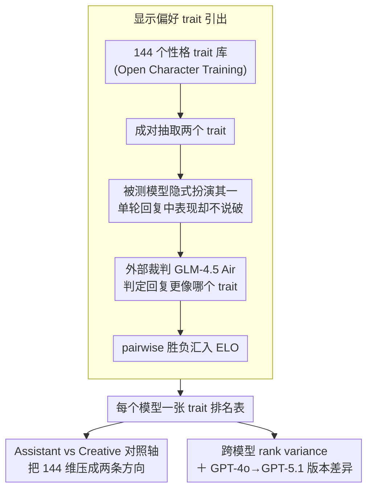

# Same Voice, Different Lab: On the Homogenization of Frontier LLM Personalities

**会议**: ACL2026  
**arXiv**: [2605.02897](https://arxiv.org/abs/2605.02897)  
**代码**: https://github.com/p3rciv3l/character_elicitation  
**领域**: LLM 评测 / 人机交互 / 模型人格  
**关键词**: LLM personality、trait ELO、人格同质化、character training、用户体验

## 一句话总结
本文用 144 个性格 trait 的外部 ELO 偏好评测发现，九个前沿 LLM 虽来自不同实验室，却普遍收敛到 structured、systematic、precise 等“Assistant-like”人格，而差异主要集中在 poetic、playful 等中位风格特征上。

## 研究背景与动机
**领域现状**：用户对 LLM 的感知质量不只取决于数学、代码或事实能力，也高度受模型“说话方式”和人格风格影响。模型版本更新后，用户常会明显感到回复变冷、变机械或更少表达性。

**现有痛点**：早期 LLM personality 研究常直接套用 Big Five、MBTI 等人类心理量表，或直接询问模型自我描述。这些方法容易受拟人化假设、模型迎合倾向和量表构念失配影响，未必能真实反映模型在交互中实际表达的 trait 偏好。

**核心矛盾**：模型开发者都在追求 helpful、safe、reliable 的助手体验，但如果各家优化目标、标注者偏好和安全约束趋同，前沿模型可能会失去风格多样性。用户体验上，这会表现为“不同实验室，同一种声音”。

**本文目标**：作者希望用更接近 revealed preference 的方式，测量不同前沿模型在大量互动风格 trait 上的相对偏好，并回答三件事：模型人格是否趋同；差异主要出现在哪些 trait；同一公司模型更新会如何改变人格轮廓。

**切入角度**：论文借鉴 Open Character Training 的 pairwise trait elicitation，让被测模型在两个 trait 中隐式选择其一来进行单轮对话，再由外部 base model judge 判断其表达了哪个 trait，最后用 ELO 形成 trait ranking。

**核心 idea**：不要问模型“你是什么人格”，而是通过大量成对 trait 选择和外部裁判，反推出模型在交互风格上的 revealed preference。

## 方法详解

### 整体框架

本文是一套评测方法，要测的是九个前沿 LLM 在交互风格上的“显示偏好”，而不是它们的能力高低。整条流程围绕 Open Character Training 提供的 144 个性格 trait 展开：对每个被测模型，在单轮对话里给出两个候选 trait，要求它隐式地选一种风格并贯彻到回复中却不说破；随后由相对中立的 base model 裁判 GLM-4.5 Air 判定回复更像哪个 trait，这一对 pairwise 胜负进入 ELO 计算。海量比对汇总后，每个模型都得到一张 trait 排名表，进而可以横向比较谁更趋同、差异落在哪里。九个模型（GPT-5.1、Claude Haiku 4.5、Gemini 3 Flash Preview、Qwen3 VL 235B A22B Thinking、DeepSeek-V3.2、Grok 4 Fast、Kimi K2 Thinking、Ministral-14b-2512、Trinity-Mini）共生成 102,560 条单轮响应，harness 与数据均开源。

### 关键设计

**1. revealed preference 式 trait elicitation：从行为而非自评反推人格**

直接问模型“你是什么人格”会踩进迎合、复述量表定义、过度解释的陷阱，得到的并不是它真实交互时的风格。本文改用显示偏好：每轮抛给模型两个 trait，让它在系统提示里隐式扮演其一并在回复中表现出来，外部裁判只看输出来判断哪个 trait 被表达，所有胜负关系汇入 ELO。这样测到的是模型“实际怎么说话”的倾向，比心理量表更贴合语言模型的行为本质，也更难被模型的自我描述污染。

**2. Assistant traits 与 Creative traits 对照轴：把 144 维压成可解释方向**

单看 144 个 trait 的排名很难讲清“模型更像严谨助手还是更有创造力”这种用户直觉。本文把 trait 空间投影到两条对照轴上：Assistant 组包含 systematic、structured、precise、methodical、analytical、focused 等，Creative 组包含 creative、imaginative、poetic、artistic、playful、humorous、bold、visionary 等，再比较各模型在两组上的平均 ELO。如此一来，“更机械”或“更有趣”就成了可量化的风格取向，模型间的人格差异也能被解释为方向性偏好，而非一堆孤立的 trait 名次。

**3. 跨模型 rank variance 与版本差异分析：定位趋同与分化发生在哪**

仅靠模型间的整体相关只能说“大家差不多”，却看不出共识与个性各自藏在哪段分布。本文对每个 trait 计算它在九个模型中的排名标准差，并按平均 rank 分层，从而暴露哪些 trait 已是行业共识（方差低）、哪些仍保留实验室特色（方差高）；统计上以 Spearman 相关衡量模型间 ranking 一致性，以 PCA 分析差异主要聚集在哪类 trait cluster。同时纵向对比 GPT-4o 与 GPT-5.1 的 trait rank shift，把同一提供商版本更新带来的风格漂移也纳入观察。

## 实验关键数据

### 主实验

| 分析项 | 结果 | 含义 |
|--------|------|------|
| 模型间 Spearman 相关 | 0.636 到 0.906，均值 0.763 | 前沿模型人格 ranking 整体高度相似 |
| 最高相关模型对 | Claude 4.5 vs GPT-5，ρ=0.906 | 不同实验室也可能形成非常接近的助手风格 |
| 最低相关模型对 | Qwen 3 vs Trinity，ρ=0.636 | 仍存在部分风格差异 |
| 中位 traits 方差 | ranks 51-100 的 σ=22.5 | 个性差异主要集中在中位风格特征 |
| 风格差异解释率 | stylistic differences 占模型间 variation 的 64.2% | 差异更多是表达风格而不是能力维度 |
| 总响应量 | 102,560 条单轮响应 | 规模足以支撑 trait-level 排名分析 |

### 消融实验

本文没有传统意义上的模型消融，但有多组分层与对照分析，可以看作评测设计的分析表。

| 分析配置 | 关键指标 | 说明 |
|------|---------|------|
| Top 20 traits | 平均 σ=9.2 | 模型最常表达的 traits 高度趋同，如 structured、systematic、precise |
| ranks 21-50 | 平均 σ=18.5 | 技术性、详尽性、自信度等仍较一致 |
| ranks 51-100 | 平均 σ=22.5 | reflective、decisive、verbose 等中位 traits 分歧最大 |
| ranks 100-144 | 平均 σ=15.7 | 模型对不想表达的 traits 也较趋同，如 foolish、sycophantic |
| Creative vs Assistant | 所有模型 Assistant ELO 高于 Creative ELO | 行业默认风格更偏结构化、客观、克制 |
| GPT-4o vs GPT-5.1 | Spearman ρ=0.831，但 poetic 从 29 降到 124 | 同一系列更新也会显著改变表达风格 |

### 关键发现
- 前沿模型普遍偏好 structured、systematic、precise 等 Assistant-like traits，并抑制 foolish、sycophantic 等 traits，说明 character training 存在跨实验室的隐性共识。
- 趋同呈反 U 型：最常表达和最少表达的 traits 方差低，中间层 traits 方差最高。模型“个性”主要来自中位分布的 poetic、contemplative、simplistic、playful 等风格 trait。
- xAI、Alibaba、Mistral 的模型相对更 Creative，Creative ELO 更接近中性 1000；GPT-5 的 Creative 平均 ELO 最低，为 757。
- GPT-5.1 相比 GPT-4o 更专业和保守：patient 上升 62 个 rank，conservative 上升 61 个 rank，structured 从第 9 到第 1；同时 poetic 从第 29 降到第 124，idealistic、nostalgic、enthusiastic 也明显下降。
- 模型提供商对 sycophancy 的抑制可能推动了更结构化、更克制的风格，但也可能牺牲表达性和创造性。

## 亮点与洞察
- 论文没有直接套人类心理量表，而是用行为偏好评测 LLM 风格，这比 MBTI/Big Five 式测试更适合语言模型。
- “反 U 型人格差异”是很有解释力的发现：行业共识会塑造模型最常用和最避免的表达方式，而剩下的中间区域才是实验室风格空间。
- GPT-4o 到 GPT-5.1 的对比把抽象人格分析落到具体用户感知上，解释了为什么用户会觉得新版模型更冷、更窄、更任务导向。
- 论文提醒我们，模型对齐不仅是安全与事实性问题，也是交互审美和文化偏好的集合优化问题。

## 局限与展望
- 结论依赖 GLM-4.5 Air judge，尽管作者选择 base model 降低偏差，但 judge 仍可能带有隐含风格偏好。
- 实验只覆盖单轮对话，而模型人格可能随多轮上下文、用户语气、任务压力和记忆状态发生变化。
- trait 列表来自 Open Character Training，虽然覆盖广，但并非完整人格空间；不同文化语境下的 trait 解释也可能不同。
- 部分模型使用较小版本以节省成本，作者认为同家族可泛化，但模型尺寸和产品配置仍可能影响风格。
- ELO 将复杂表达压缩为 pairwise 排名，难以解释 trait 之间的组合效应和语境依赖。

## 相关工作与启发
- **vs Big Five / MBTI 测试**: 人类心理量表假设人格构念在人类群体中成立，但 LLM 输出不一定满足这些 factor structure；本文更关注可观察回复风格。
- **vs LLM output homogeneity**: 既有工作常讨论答案内容同质化，本文把同质化对象转向 character training 和交互人格。
- **vs Open Character Training**: 本文复用其 revealed preference 方法，但扩展到 2026 年前沿模型横向比较和 GPT 系列版本分析。
- **启发**: 未来 LLM 评测应把“能力排行榜”和“风格坐标系”分开报告，让用户和开发者清楚模型在创造性、克制性、直白性等维度上的取向。

## 评分
- 新颖性: ⭐⭐⭐⭐☆ 方法源于已有 revealed preference 框架，但对前沿模型人格同质化的系统分析很有新意。
- 实验充分度: ⭐⭐⭐⭐☆ 覆盖九个模型、144 traits 和十万级响应，但多轮与跨文化验证不足。
- 写作质量: ⭐⭐⭐⭐☆ 叙事清楚，图表抓住核心现象，个别论断仍依赖 judge 假设。
- 价值: ⭐⭐⭐⭐☆ 对 LLM 产品体验、模型评测和 character training 设计都有现实参考价值。

<!-- RELATED:START -->

## 相关论文

- [\[ICLR 2026\] Same Content, Different Representations: A Controlled Study for Table QA](../../ICLR2026/llm_evaluation/same_content_different_representations_a_controlled_study_for_t.md)
- [\[ACL 2026\] Stability vs. Manipulability: Evaluating Robustness Under Post-Decision Interaction in LLM Judges](stability_vs_manipulability_evaluating_robustness_under_post-decision_interactio.md)
- [\[ACL 2026\] Statistically Reliable LLM-Based Ranking Evaluation via Prediction-Powered Inference](statistically_reliable_llm-based_ranking_evaluation_via_prediction-powered_infer.md)
- [\[ACL 2026\] 正确信念的瓦解：临床压力下 LLM 的认知韧性研究](when_correct_beliefs_collapse_epistemic_resilience_of_llms_under_clinical_pressu.md)
- [\[ACL 2026\] Contrastive Decoding Mitigates Score Range Bias in LLM-as-a-Judge](contrastive_decoding_mitigates_score_range_bias_in_llm-as-a-judge.md)

<!-- RELATED:END -->
