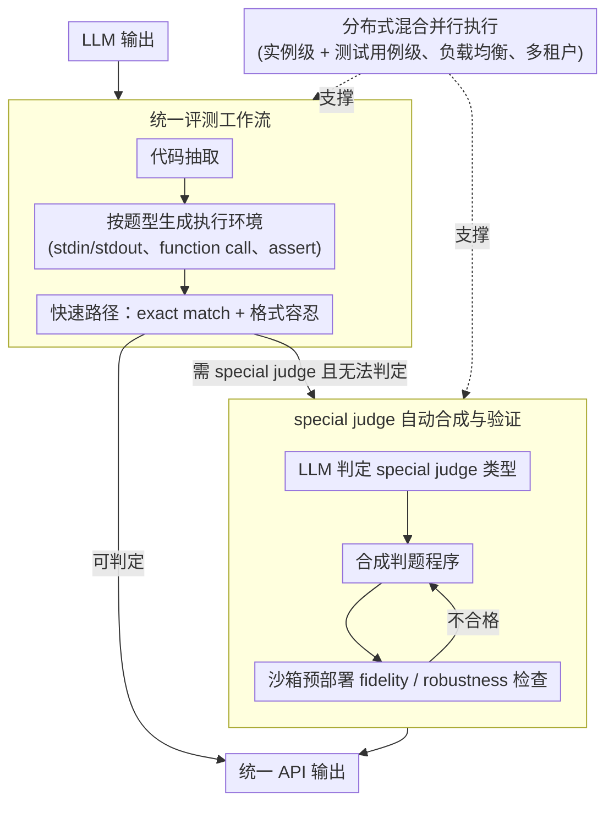

# ScaleBox: Enabling High-Fidelity and Scalable Code Verification for Large Language Models

**会议**: ACL2026  
**arXiv**: [2604.27467](https://arxiv.org/abs/2604.27467)  
**代码**: https://github.com/icip-cas/ScaleBox  
**领域**: LLM 评测 / 代码验证 / RLVR 基础设施  
**关键词**: 代码沙箱、special judge、RLVR、奖励噪声、分布式评测

## 一句话总结
ScaleBox 通过自动 special judge 合成、统一验证流程和分布式细粒度并行，提高 LLM 代码训练与评测中的验证精度和吞吐，并在 LiveCodeBench RLVR 实验中带来更稳定的 Pass@1 提升。

## 研究背景与动机
**领域现状**：代码能力是当前 LLM 训练和评测的重要方向。无论是 HumanEval、MBPP、LiveCodeBench 这类 benchmark，还是 RLVR 训练，都依赖沙箱系统执行模型生成的程序并返回可验证反馈。

**现有痛点**：主流代码沙箱常用 exact match 或简单 heuristic 比较输出。这种验证假设每道题只有唯一标准输出，但真实编程题经常允许多种合法解、任意有效路径或浮点误差容忍。论文对 34,757 道题的分析显示，14.57% 的任务需要 special judge，而这些任务中 59.01% 的正确参考解会被 exact match 错误拒绝。

**核心矛盾**：RLVR 训练需要高吞吐反馈，否则 GPU/NPU 会被 CPU 侧执行拖慢；但高质量验证又不能只靠快速 exact match。若奖励信号含大量 false negative，策略会把正确探索当失败，训练稳定性和最终代码能力都会受损。

**本文目标**：作者希望构建一个既高保真又可扩展的代码验证系统，能够支持 exact match、function call、assert、special judge 等多种评测形式，并能在大规模 RL 训练中提供稳定、高吞吐的反馈。

**切入角度**：ScaleBox 把问题分成两层：验证精度层面，用自动 special judge 合成和管理弥补 exact match 缺陷；系统效率层面，用多节点部署、实例级与测试用例级混合并行提升 CPU 侧吞吐。

**核心 idea**：代码 RL 的关键瓶颈不是只在模型侧，而在 reward infrastructure；如果验证器既误判又慢，训练出来的策略会被错误奖励和系统吞吐共同限制。

## 方法详解

### 整体框架

ScaleBox 是一套面向大规模代码训练与评测的分布式沙箱系统，要同时解决两个被代码 RL 长期忽视的瓶颈：验证器既会误判（exact match 把合法多解当错），又跑不快（CPU 侧执行拖慢 GPU/NPU）。它在 SandboxFusion 的执行底座上叠加三类能力——端到端评测工作流、分布式部署、special judge 支持。一次验证的数据流是：从 LLM 输出中抽取代码，按题型生成对应的测试执行环境，先走轻量 exact match 与常见格式容忍规则的快速路径；只有当题目被识别为需要 special judge 且初步检查无法判定时，才调用可编程判题逻辑返回结果，全部统一在同一 API 下输出。系统层面则由 NGINX 负载均衡、Docker 健康检查、多租户 worker 和测试用例级并行共同支撑高并发的 RL 训练。

### 关键设计

**1. 统一评测工作流：把异构 benchmark 与输出格式收敛到单一接口**

LLM 的输出格式五花八门，各 benchmark 的测试约定也彼此不同，若每个数据集都配一套评测脚本，结果既难复现又易出错。ScaleBox 把请求路由、代码抽取、测试用例分发、并行执行、多阶段验证串成一条固定流水线，自动识别 stdin/stdout、function call、assert 等测试形式并生成相应的执行封装。统一入口让 HumanEval、MBPP、LiveCodeBench、AetherCode 等都走同一套逻辑，显著减少了脚本碎片化，提升了跨 benchmark 的可复现性。

**2. special judge 自动合成与验证：让高保真奖励可规模化**

论文统计 34,757 道题中有 14.57% 需要 special judge，而这些题里 59.01% 的正确参考解会被 exact match 误拒——这正是 RL 奖励噪声的主要来源。人工编写 special judge 精度高却无法覆盖数千级训练数据，于是 ScaleBox 走自动合成三段式：先由 LLM 判断题目是否属于多合法输出、数值容忍等 special judge 类型，再合成判题程序，最后在沙箱中用正确解和已知错误输出做 fidelity 与 robustness 检查，不合格就重新生成或丢弃。这种“LLM 负责扩展覆盖、沙箱预部署验证负责把关质量”的分工，让高保真奖励既能铺到大规模数据，又把错误判题的风险控制在部署之前。

**3. 分布式混合并行执行：缓解 RL 训练中的 host-accelerator 失衡**

代码 RL 会产生突发、高频的验证请求，如果只在题目实例这一粒度排队，CPU 资源会被浪费、模型训练被拖慢。ScaleBox 在实例级之外再加一层测试用例级并行——单道题的多个 test case 也能同时执行，从而大幅压低单题验证延迟；多节点由负载均衡协调，worker 支持多租户执行，dashboard 实时监控资源与日志。验证吞吐跟上之后，加速器才不会空等 CPU，高保真与高吞吐得以兼得。

### 损失函数 / 训练策略

ScaleBox 本身是验证系统，不提出新的模型训练损失。在用于检验它的 RL 实验中，作者以 Qwen3-8B non-thinking 为 base policy，在 verl 框架中使用 GRPO；训练数据取自 PrimeIntellect/verifiable-coding-problems，筛出 26K 个 Python 问题，其中 2.8K 被识别为需要 special judge，1.2K 属于“exact match 会拒绝参考解、但 special judge 能正确验证”的关键子集，用来隔离奖励保真度对训练的影响。

## 实验关键数据

### 主实验

| 实验项 | 指标 | 结果 | 说明 |
|--------|------|------|------|
| EM 脆弱性分析 | 需 special judge 题目比例 | 14.57% / 34,757 | 多解或浮点容忍等题型 |
| EM false negative | 正确解被拒比例 | 59.01% | 奖励噪声来源 |
| 单节点效率 | ScaleBox 39.31 tasks/s | verl Prime 为 24.73，SandboxFusion 为 14.92 | 比 verl 快 1.59×，比 SandboxFusion 快 2.63× |
| 三节点效率 | 62.10 tasks/s | 相对 verl 单节点 2.51× | 具备多节点扩展性 |
| special judge fidelity | TPR ≥ 90.0%，TNR ≥ 84.0% | 27 个 AetherCode 复杂题，529 个提交 | 自动合成判题器总体可靠 |

### 消融实验

| 训练集 | Reward 类型 | LCB-v5 Pass@1 | LCB-v6 Pass@1 | 说明 |
|------|---------|------|------|------|
| Base Model | - | 25.09 | 27.21 | Qwen3-8B 初始策略 |
| 1.2K SPJ subset | w/o SPJ (EM) | 27.24 | 27.94 | exact match 奖励含大量 false negative |
| 1.2K SPJ subset | w/ SPJ (Ours) | 33.15 | 32.35 | LCB-v5 提升 +5.91，LCB-v6 提升 +4.41 |
| 26K full dataset | w/o SPJ (EM) | 37.19 | 34.12 | 大规模混合训练 |
| 26K full dataset | w/ SPJ (Ours) | 38.17 | 36.03 | 即使 SPJ 题只约 10%，仍提升 LCB-v6 +1.91 |

### 关键发现
- special judge 不只是评测修饰项，而会改变 RL reward density。对 1.2K 关键子集，EM 会把合法探索当作失败，SPJ 能显著提高训练 reward 和最终 Pass@1。
- 高保真奖励提升训练稳定性。论文图示显示 SPJ-enhanced model 在训练过程中持续保持性能领先，说明更干净的奖励降低了 credit assignment 方差。
- 系统效率和验证精度需要同时优化。若只提高 special judge 精度但吞吐不足，会拖慢 RL；若只追求速度而依赖 EM，则奖励噪声会限制模型能力。
- ScaleBox 的 one-click workflow 支持 HumanEval、MBPP、HumanEval+、MBPP+、LiveCodeBench、AetherCode 等 benchmark，说明它并非只为单一数据集定制。

## 亮点与洞察
- 论文非常清楚地指出代码 RL 的“奖励基础设施”问题：模型训练质量受验证器误判率直接限制，这一点常被模型算法论文低估。
- special judge synthesis 的三阶段设计兼顾自动化和质量控制。LLM 负责扩展覆盖，沙箱验证负责在部署前过滤低质量判题器。
- Short-circuit verification 是工程上很实用的折中：能用简单规则判对的样本先快速通过，复杂样本再交给高成本判题逻辑。
- 实验同时展示系统吞吐、判题准确性和 RL 性能，证明 ScaleBox 的价值不只是“跑得快”，而是能产生更有用的训练信号。

## 局限与展望
- 当前大规模验证主要集中在特定模型规模、Python 题目和若干主流 benchmark 上，多语言、多范式和更大规模 RL 训练仍需进一步验证。
- 自动 special judge 依赖 LLM 合成与筛选，虽然 TPR/TNR 较高，但在更复杂交互式题目或隐藏约束题目上仍可能出错。
- 系统关注代码训练和 benchmark 评测，尚未充分扩展到多轮代码 agent、自动软件工程或长时任务环境。
- special judge 覆盖约 10% full dataset 却带来显著收益，但也意味着其收益受数据集中复杂题比例影响，低复杂度 benchmark 上增益可能较小。
- 论文没有深入讨论沙箱安全隔离细节和资源滥用防护边界，真实生产部署仍需要额外系统安全评估。

## 相关工作与启发
- **vs SandboxFusion**: SandboxFusion 提供代码执行基础，但 ScaleBox 更强调 RL 训练中的高并发、多节点扩展和 special judge 原生支持。
- **vs verl native execution**: verl 原生执行能支持 RL 流程，但吞吐低于 ScaleBox；ScaleBox 通过混合并行和批处理缓解 CPU 侧瓶颈。
- **vs Judge / 人工 special judge**: 人工 special judge 精度高但不可规模化，ScaleBox 用自动合成与预验证扩大覆盖。
- **vs EM / heuristic matching**: EM 快但会系统性拒绝多解题正确程序；ScaleBox 的核心价值是把“语义正确”纳入可验证奖励。
- **启发**: 对代码模型训练，未来评价算法改进时应同时报告 reward verifier fidelity；否则性能差异可能部分来自评测噪声而非模型学习能力。

## 评分
- 新颖性: ⭐⭐⭐⭐☆ 系统设计整合度高，special judge 自动合成与 RLVR 基础设施结合很有价值，但单个组件并非完全从零提出。
- 实验充分度: ⭐⭐⭐⭐☆ 有效率、fidelity、RL 性能三类证据，仍需更多语言和更大规模训练验证。
- 写作质量: ⭐⭐⭐⭐☆ 问题定义和系统架构清晰，实验数字有说服力。
- 价值: ⭐⭐⭐⭐⭐ 对代码 LLM 训练和评测基础设施非常实用，尤其能直接减少奖励噪声。

<!-- RELATED:START -->

## 相关论文

- [\[ACL 2025\] CodeMEnv: Benchmarking Large Language Models on Code Migration](../../ACL2025/llm_evaluation/codemenv_benchmarking_large_language_models_on_code_migration.md)
- [\[ACL 2026\] Zero-shot Large Language Models for Automatic Readability Assessment](zero-shot_large_language_models_for_automatic_readability_assessment.md)
- [\[ACL 2026\] NovBench: Evaluating Large Language Models on Academic Paper Novelty Assessment](novbench_evaluating_large_language_models_on_academic_paper_novelty_assessment.md)
- [\[ACL 2026\] Question Difficulty Estimation for Large Language Models via Answer Plausibility Scoring](question_difficulty_estimation_for_large_language_models_via_answer_plausibility.md)
- [\[ACL 2026\] SciCustom: A Framework for Custom Evaluation of Scientific Capabilities in Large Language Models](scicustom_a_framework_for_custom_evaluation_of_scientific_capabilities_in_large_.md)

<!-- RELATED:END -->
