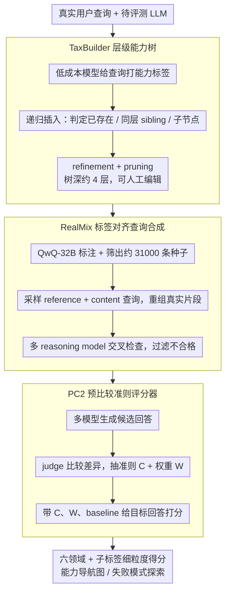

# SCAN: Structured Capability Assessment and Navigation for LLMs

**会议**: ACL2026  
**arXiv**: [2505.06698](https://arxiv.org/abs/2505.06698)  
**代码**: https://github.com/liudan193/SCAN  
**领域**: LLM评测 / 能力画像  
**关键词**: 细粒度评测、能力分类树、合成评测数据、LLM-as-a-Judge、模型诊断

## 一句话总结
SCAN 将大模型评测从单一排行榜推进到可导航的能力画像：它自动构建层级能力标签、用 RealMix 生成覆盖长尾能力的真实感查询，并用 PC2 judge 提升自动评分可靠性，从而在 21 个主流 LLM 上揭示总分掩盖的细粒度强弱项。

## 研究背景与动机
**领域现状**：LLM 评测长期依赖 Chatbot Arena、MT-Bench、AlpacaEval 等排行榜式基准。它们能快速给出模型整体排名，也能用少量自动评测样本近似人类偏好，因此对模型发布和横向比较很有帮助。

**现有痛点**：排行榜回答的是“谁更强”，但开发者真正需要的是“这个模型在哪些能力上强、在哪些子能力上弱、弱点是否可定位”。例如一个模型可能总分很高，却在 Java、C、生物工程知识或角色扮演中表现不稳；单一平均分会把这些局部失败压平。

**核心矛盾**：细粒度评测需要覆盖大量能力标签，长尾标签又缺少足够样本；自动评分需要扩展到很多模型和问题，但经典 pointwise judge 不够可靠，pairwise judge 又有二次复杂度。SCAN 的目标就是同时解决“覆盖广”“粒度细”“样本足”“评分准”“可解释导航”这几件事。

**本文目标**：作者希望构建一个能从真实用户查询出发、自动生成能力分类树、为每个标签补足评测查询、并把评测结果可视化为能力地图的框架。最终使用者不是只看一个排名，而是能沿着能力树下钻，找出模型的具体短板。

**切入角度**：论文观察到真实用户查询本身包含大量能力信号，比如“Python 编程”“物理问答”“角色扮演设定”等。与其人工穷举能力维度，不如从真实查询中抽取标签，再用树结构组织它们；与其随机合成题目，不如把真实查询中的内容片段重新组合到指定标签下。

**核心 idea**：用“真实查询驱动的能力树 + 标签对齐的数据合成 + 预比较准则抽取的 judge”替代静态排行榜，把评测结果转化为可检索、可诊断、可扩展的模型能力画像。

## 方法详解

SCAN 是一条从“真实用户需求”到“模型能力导航图”的评测流水线，目标是把单一排行榜替换成可下钻、可诊断的能力画像。它先用 TaxBuilder 从海量真实查询中抽取并组织出一棵层级能力树，再用 RealMix 为树上每个能力标签补足真实感评测问题，最后用 PC2 评分器在可扩展成本下给模型回答打分，并把结果汇总成每个模型在六大领域及其子标签上的细粒度强弱项。

### 整体框架

输入是一批真实用户查询和一组待评测 LLM，输出是每个模型在 writing、roleplay、knowledge、coding、mathematics、reasoning 六个领域及其子标签上的细粒度得分、排名和失败模式。整个系统沿三层组织：taxonomy 层（TaxBuilder）负责把非结构化查询标签插入可编辑的层级树；data 层（RealMix）用真实查询片段和标签约束合成评测查询，保证每个标签都有统计意义上的样本量；evaluation/navigation 层（PC2）用预比较得到的查询特定准则给回答打分，再通过仪表盘和失败模式探索器把分数展示成可检索的能力地图。SCAN-V0 由此构建了 2,082 个标签、3,343 条评测查询，并评测了 21 个主流 LLM。

### 关键设计

**1. TaxBuilder 层级能力树：把树构建拆成局部判断**

如果直接让 LLM 在一棵大树里定位新标签，上下文会越来越长、推理也越来越难。TaxBuilder 先用低成本模型给大量真实查询打能力标签，再逐个把新标签插入树中：插入时不把整棵树塞进去，而是递归遍历当前层节点，让 LLM 只判断三种关系——该标签已存在、应作为同层 sibling、还是应成为某个子节点。这样长上下文问题被拆解为一连串短上下文的局部决策。

随后再叠加三道清理：节点 refinement 修正父子关系、节点 pruning 拆分把多个概念混在一起的标签、层级 pruning 合并重复节点，并把树深控制在约 4 层。整棵树因此既可被 LLM 持续扩展，也保留了人工检查和编辑的入口，便于后续吸收新任务、新领域和新用户需求。

**2. RealMix 标签对齐查询合成：在真实内容上做可控重组**

长尾能力标签往往缺少现成评测题，直接复用已有数据既覆盖不足又有污染风险，而随机拼凑标签又容易造出现实中不存在的任务。RealMix 先用 QwQ-32B 给真实用户查询标注领域、标签和质量，筛出约 31,000 条高质量种子；合成时采样一个 reference query 和三个 content queries，让生成模型从中抽取合适的真实内容片段，重组成符合 reference 标签的新查询。

生成之后再用多个 reasoning model 交叉检查标签一致性与质量，不合格样本直接过滤。这样合成题目既继承了真实查询的内容和标签分布，又能定向补齐长尾能力，比纯模板题更接近真实使用场景。

**3. PC2 预比较准则评分器：在 pointwise 成本下吸收 pairwise 的可靠性**

pairwise 评测之所以可靠，是因为比较会暴露回答间的差异；pointwise 之所以不准，是因为缺少对照。PC2 把“发现差异”这一步前置：对一条指令先让多个模型产生候选回答，再让 judge 比较这些回答、抽取出“本题应该看什么”的查询特定评分准则及权重 $W$，约束 $\sum_i w_i = 100$，形式上即 $J(\{y^1,\dots,y^n\}\mid x,p_c,p_w)$ 输出准则集合 $C$ 与权重 $W$。

正式打分时 judge 不再孤立面对单个回答，而是带着准则 $C$、权重 $W$ 和 baseline answer $y_b$ 的参考评价为目标回答评分，即 $J(y\mid x,p_c,y_b,C,W)\to s$。这样既保留了 pairwise 的差异敏感性，又避免了对所有模型两两比较的二次复杂度，使评测可以规模化扩展到更多模型和问题。

## 实验关键数据

### 主实验
SCAN-D-V0 的数据规模显示它不是一个小型 prompt 集，而是一个围绕能力树构造的细粒度评测集。

| 领域 | 样本数 | 标签数 | 每标签最少样本 | 平均长度 |
|------|--------|--------|----------------|----------|
| Writing | 1,108 | 594 | 19 | 772.57 |
| Roleplay | 470 | 429 | 19 | 1008.46 |
| Knowledge | 540 | 315 | 20 | 608.57 |
| Coding | 636 | 369 | 19 | 1232.03 |
| Mathematics | 344 | 189 | 20 | 817.02 |
| Reasoning | 245 | 186 | 19 | 904.81 |
| Total | 3,343 | 2,082 | 19 | 880.92 |

PC2 judge 在多个 judge backbone 上都显著优于 naive pointwise，说明“先抽准则再打分”不是只对某一个模型有效。

| Judge / 方法 | Accuracy |
|--------------|----------|
| Deepseek-R1 naive | 0.5694 |
| Deepseek-R1 direct metric decomposition | 0.6134 |
| Deepseek-R1 diverse pre-comparison | 0.6466 |
| Deepseek-R1 ours | 0.6962 |
| Qwen3-32B naive | 0.5181 |
| Qwen3-32B ours | 0.6535 |
| Claude-3.7-Sonnet naive | 0.5959 |
| Claude-3.7-Sonnet ours | 0.7453 |
| GPT-4.1 naive | 0.6116 |
| GPT-4.1 ours | 0.7201 |

### 消融实验
论文的核心消融集中在 PC2 的组成部分。以 Deepseek-R1 为 judge 时，从 naive pointwise 到 diverse pre-comparison 再到完整方法，准确率逐步提升。

| 配置 | Accuracy | 说明 |
|------|----------|------|
| naive pointwise | 0.5694 | 单独给回答打分，缺少比较参照 |
| direct metric decomposition | 0.6134 | 让 judge 直接拆评分维度，有中等提升 |
| metric decomposition (single model) | 0.5974 | 单模型预比较不够多样，收益有限 |
| metric decomposition (diverse model) | 0.6466 | 多模型回答提供更丰富差异 |
| ours | 0.6962 | 加入准则权重和 baseline answer 后最好 |

### 关键发现
- 细粒度分析会揭示总分无法看到的“能力尖峰”。GPT-OSS-120B 总体表现强，但 roleplay 只排第 7；GPT-OSS-20B 总体较弱，却在 coding 领域排第 2。
- 编程能力不能只看 aggregate coding score。GPT-OSS-120B 在 Python、JavaScript、Go、Rust 上强，但 C 和 Java 较弱；GPT-OSS-20B 在 Python、Rust 排第 2，并且在 C、C# 上超过 120B 版本。
- 知识域也呈现明显不均匀性。GPT-OSS-120B 在 technical engineering 中的 computer science 和 aerospace engineering 可排第 1，但 bioengineering 跌到第 11，说明预训练知识覆盖存在局部空洞。

## 亮点与洞察
- 这篇论文最有价值的地方是把评测对象从“模型排名”换成“能力地形图”。这个视角对模型开发更实用，因为训练数据配比、后训练策略和部署场景都需要知道具体弱点，而不是只知道平均分。
- TaxBuilder 的递归插入很朴素但有效。它没有试图让 LLM 一次性理解整棵能力树，而是把树构建变成局部决策，适合以后持续吸收新任务、新领域和新用户需求。
- RealMix 体现了评测数据合成的一条好原则：不要凭空造题，而是在真实用户内容上做可控重组。这样既降低数据污染风险，也比纯模板题更接近真实使用场景。
- PC2 的启发很强：pairwise 的优势不一定必须通过二次复杂度实现，关键是先得到“本题差异在哪里”。这一思路可以迁移到安全评测、事实性评测、长文本评测等需要 query-specific rubric 的任务。

## 局限与展望
- 作者明确指出当前 SCAN 主要面向语言模型，不支持多模态模型。对于 VLM、具身智能或语音模型，能力标签和数据合成机制都需要扩展，论文称未来会探索 SCAN-Anything。
- 当前实现尚未覆盖安全、诚实性、事实性、幻觉、公平性等 AI 机制类评测维度。这些维度往往不是普通任务能力，而是行为约束和风险属性，需要额外 taxonomy 和 judge 设计。
- 自动构建能力树仍然依赖 LLM 标注与判断，可能继承模型偏差。虽然 pruning 和人工可编辑性缓解了问题，但树结构本身的正确性仍需要持续审计。
- 评测查询来自合成过程，即使 RealMix 使用真实查询片段，也不能完全代表高风险部署场景。后续可以把线上失败案例、用户反馈、红队样本持续并入能力树。

## 相关工作与启发
- **vs Chatbot Arena**: Chatbot Arena 用大量人类偏好提供可信排名，SCAN 则用更小但结构化的数据集提供细粒度能力画像。前者适合宏观比较，后者更适合模型诊断和训练反馈。
- **vs AlpacaEval / MT-Bench**: 这些自动评测更关注整体指令跟随或多轮对话表现，SCAN 强调从真实查询中抽取标签，并沿能力树拆解表现，因此解释性更强。
- **vs pairwise LLM-as-a-Judge**: pairwise 更可靠但成本高，PC2 把 pairwise 的“差异发现”前置为准则抽取，再用 pointwise 形式打分，在规模化评测时更可用。
- **启发**: 对任何“平均指标掩盖局部失败”的系统，都可以借鉴 SCAN：先构建任务 taxonomy，再保证每个节点有足够样本，最后把结果做成可导航的 failure map。

## 评分
- 新颖性: ⭐⭐⭐⭐☆ 不是第一个自动评测框架，但把 taxonomy、合成数据、PC2 judge 和可视化诊断组合成了完整评测范式。
- 实验充分度: ⭐⭐⭐⭐☆ 数据规模、judge 对比和 21 个模型分析较扎实，但更细的人工评测和跨领域验证还可加强。
- 写作质量: ⭐⭐⭐⭐☆ 方法动机清楚，图表支撑到位；附录信息较多，部分细粒度结果需要去项目页查看。
- 价值: ⭐⭐⭐⭐⭐ 对模型开发者很有实际价值，尤其适合从“排行榜优化”转向“弱点定位与数据闭环”。

<!-- RELATED:START -->

## 相关论文

- [\[ACL 2026\] Exploring the Capability Boundaries of LLMs in Mastering of Chinese Chouxiang Language](exploring_the_capability_boundaries_of_llms_in_mastering_of_chinese_chouxiang_la.md)
- [\[ACL 2026\] TaxPraBen: A Scalable Benchmark for Structured Evaluation of LLMs in Chinese Real-World Tax Practice](taxpraben_a_scalable_benchmark_for_structured_evaluation_of_llms_in_chinese_real.md)
- [\[ACL 2026\] Zero-shot Large Language Models for Automatic Readability Assessment](zero-shot_large_language_models_for_automatic_readability_assessment.md)
- [\[ACL 2026\] NovBench: Evaluating Large Language Models on Academic Paper Novelty Assessment](novbench_evaluating_large_language_models_on_academic_paper_novelty_assessment.md)
- [\[ACL 2026\] LLMs as annotators of credibility assessment in Danish asylum decisions: evaluating classification performance and errors beyond aggregated metrics](llms_as_annotators_of_credibility_assessment_in_danish_asylum_decisions_evaluati.md)

<!-- RELATED:END -->
