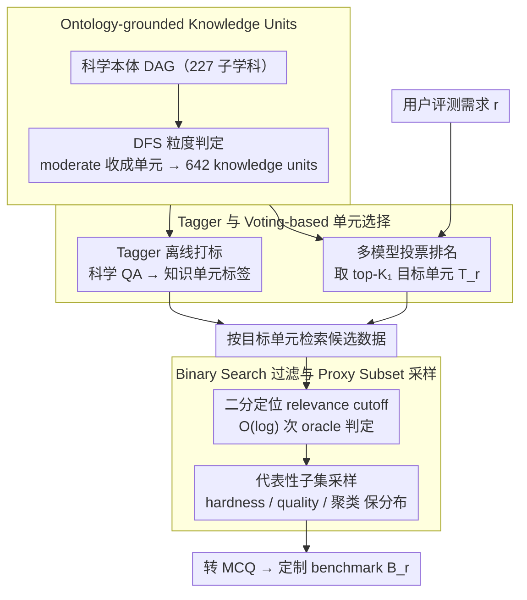

# SciCustom: A Framework for Custom Evaluation of Scientific Capabilities in Large Language Models

**会议**: ACL2026  
**arXiv**: [2605.19357](https://arxiv.org/abs/2605.19357)  
**代码**: https://github.com/yjwtheonly/SciCustom  
**领域**: LLM评估 / 科学能力评测 / 自动化Benchmark构建  
**关键词**: 科学LLM评估, 自定义benchmark, ontology, knowledge units, ranking consistency

## 一句话总结
SciCustom 将科学评测需求拆成可复用的本体知识单元，并通过 tagger、multi-model voting、binary-search relevance filtering 和 proxy subset selection 自动构建领域定制 benchmark，在 10/11 个化学与医疗子任务上取得最高 Spearman 排名一致性。

## 研究背景与动机
**领域现状**：LLM 正被用于科学研究，从文献理解、实验假设生成到医疗和化学问答。用户真正关心的通常不是模型在一个宽泛科学 benchmark 上的平均分，而是它在某个具体应用场景里的能力，例如技术化学、药物发现或临床相关知识。

**现有痛点**：通用 benchmark 如 GPQA、MMLU-Pro 或 SimpleQA 不一定能预测模型在细分科学任务上的表现；人工定制 benchmark 成本高、迭代慢；直接让 LLM 合成问题又可能缺少 grounded validity，无法保证科学事实来自可靠数据。

**核心矛盾**：科学任务既高度交叉又需要事实 grounding。为每个新需求从零构建 benchmark 会造成重复劳动，但简单语义检索或合成题目又无法精确捕捉“这个需求到底需要哪些科学知识”。

**本文目标**：作者希望构建一个无需专家标注、无需纯合成问题、可根据用户需求自动生成应用特定科学 benchmark 的框架，并且生成的 benchmark 能复现专家 benchmark 对 10 个 LLM 的排名。

**切入角度**：SciCustom 的假设是，复杂科学应用可以近似看作若干细粒度知识单元的组合。只要把大规模科学 QA 数据预先映射到这些 knowledge units，就可以在新需求到来时复用这些单元来动态构建 benchmark。

**核心 idea**：离线用科学本体组织数据，在线用需求相关 knowledge units 检索、过滤和采样 grounded data，再转成多选题进行高效评测。

## 方法详解
SciCustom 分为离线索引和在线构建两阶段。离线阶段从科学本体中抽取适中粒度的 knowledge units，并训练 tagger 把大规模科学 QA 映射到这些单元。在线阶段接收用户需求，先用 multi-model voting 找相关单元，再用二分过滤与 proxy selection 生成小而有区分度的 benchmark。

### 整体框架
输入是用户评测需求 $r$ 和大型科学语料 $\mathcal{D}$，输出是对应 benchmark $\mathcal{B}_r$。框架先把 227 个科学子学科的本体 DAG 转成 642 个 knowledge units；然后用 tagger 给每条数据打上知识单元标签；当用户提出需求时，多个 LLM 对知识单元相关性投票排序，选出 target units；系统从已打标语料中检索候选数据，用 binary search 找 relevance cutoff，再采样代表性 proxy subset，最后把原始 QA 转成可自动评测的 MCQ。

### 关键设计

**1. Ontology-grounded Knowledge Units：用本体把科学能力切成可复用、可组合的语义骨架**

为每个新需求从零建 benchmark 会重复造轮子，而粒度选错又会失效——概念太粗无法区分细分能力，太细又难以在不同需求间复用。SciCustom 先整合多个权威科学本体，拼出覆盖 227 个科学子学科的 DAG，再用 DFS 遍历每个节点，让 LLM 判断节点粒度：判为 coarse 就继续往下走，判为 moderate 就收成一个 knowledge unit，判为 fine 就直接剪枝。最终得到 641 个科学单元，加上一个 Non-Scientific 共 642 个。这种粒度大致相当于“教材章节标题”，既能解释清楚一个能力，又能让多个单元组合出新的需求。

**2. Tagger 与 Voting-based Unit Selection：把语料离线归档进知识空间，再把用户需求映射成目标单元**

光有单元还不够，得让海量科学数据能被反复复用、并把用户的自然语言需求翻译成具体哪些单元。作者训练一个 tagger 来给每条数据打知识单元标签，其训练数据由两部分拼成：一部分从 knowledge units 里采样 1 到 5 个单元、结合 descendant keywords 让 LLM 合成 query，另一部分补充真实 scientific instruction 数据并由 LLM 标注对应 units。在线阶段，面对一个需求时让多个异构 LLM 各自给候选 units 排名，系统取平均 rank、选 top-$K_1$ 作为目标单元集合 $\mathcal{T}_r$。离线 tagger 保证同一批数据能服务不同需求，而 multi-model consensus 则摊平了单个 LLM 对需求理解的偏差。

**3. Binary Search Filtering 与 Proxy Subset Selection：在海量候选里既挑相关、又挑有区分度的样本**

把目标单元对应的候选数据全量逐条用 LLM 判相关，成本顶不住；而且最相关的样本往往是 textbook 高频知识，区分不出模型强弱，反而带来 ceiling effect。SciCustom 先按候选与目标 units 的交集大小和平均 rank 排序，再假设排序后相关性整体单调递减，用二分搜索定位“最后一个仍被多数模型判为相关”的 cutoff，把所需 oracle judgments 从线性压到 $O(\log(|\mathcal{D}'_r|))$。拿到相关区间后，再用 hardness score、quality score 和 embedding clustering 采出一个 proxy subset，让子集的分布尽量贴近全集。二分 cutoff 适当放宽相关边界、代表性采样保住分布，两者合起来避开了“样本过于 canonical”导致的天花板效应。

### 损失函数 / 训练策略
论文没有给出复杂的新损失，关键训练对象是 tagger。实现上作者微调 LLaMA-3-8B 作为 tagging model，使用 50,000 条合成科学 queries 和 30,000 条真实科学 queries，训练 22 epochs，学习率为 $2e^{-5}$，在 8 张 NVIDIA A100 上训练。最终科学 corpus 来自 SciRIFF、SciInstruct、Mol-Instruct、MultiMedQA、SciEval、MMLU-Pro、GPQA、IfBench、SimpleQA 等，共 2,000,367 个实例，并过滤与专家 ground-truth benchmark 重叠的数据以避免泄漏。

## 实验关键数据

### 主实验
主指标是 SciCustom 构建的 benchmark 对 10 个 LLM 的排名，与专家 ground-truth benchmark 排名之间的 Spearman / Kendall correlation。下面列出 Spearman 主结果。

| 领域任务 | GPQA | MMLU / MedQA | GPT-5 synthetic | Embedding | SciCustom |
|----------|------|--------------|-----------------|-----------|-----------|
| Analytical chemistry | 0.61 | 0.21 | -0.11 | -0.34 | 0.86 |
| Inorganic chemistry | 0.52 | 0.27 | 0.05 | -0.59 | 0.67 |
| Material science | 0.21 | -0.61 | -0.04 | -0.39 | 0.42 |
| Organic chemistry | 0.72 | 0.21 | 0.38 | 0.11 | 0.89 |
| Physical chemistry | 0.21 | 0.52 | 0.24 | -0.73 | 0.74 |
| Technical chemistry | 0.03 | 0.31 | -0.07 | -0.41 | 0.86 |
| Virology | -0.11 | 0.44 | 0.25 | 0.18 | 0.55 |
| Human aging | -0.10 | 0.62 | 0.20 | 0.21 | 0.49 |
| Medical genetics | -0.09 | 0.35 | 0.09 | -0.21 | 0.42 |
| Anatomy | 0.48 | -0.19 | 0.11 | -0.32 | 0.62 |
| Nutrition | 0.18 | 0.45 | 0.52 | 0.27 | 0.78 |

### 消融实验
组件分析说明，ontology-driven units、binary-search cutoff 和 subset selection 都不可替代。

| 配置 | 关键指标 | 说明 |
|------|----------|------|
| SciCustom | 10/11 个任务 Spearman 最优 | Human aging 上 MedQA 为 0.62，高于 SciCustom 0.49 |
| SciCustom top-1 选择 | 8/11 与 ground-truth benchmark 一致 | 能帮助用户选择具体需求下的最优模型 |
| Tagger | Macro F1 75.2%, Micro F1 78.6% | 在 1,000 个 unseen compositional queries 上评估 |
| Human evaluation | Correctness 0.92, Relevance 0.70 | 50 个 chemistry 问题，3 名 AI4Chemistry 硕士标注 |
| Greedy Search | Virology 0.21, Anatomy 0.24, Nutrition 0.31 | 简单选 top relevant 样本区分度不足 |
| SciCustom binary strategy | Virology 0.55, Anatomy 0.62, Nutrition 0.78 | 比 greedy 更接近专家排名 |

### 关键发现
- 通用 benchmark 与专业任务排名常不一致，甚至出现负相关；这说明 GPQA 或 MMLU 的高分不能直接代表细分科学能力强。
- 完全 synthetic 的 GPT-5 benchmark 表现不稳定，Embedding baseline 也弱，说明 grounded data 和 ontology structure 缺一不可。
- Material science 的 Spearman 只有 0.42，看似较低，但作者进一步发现两个专家 benchmark 之间也只有 $\rho=0.31, \tau_b=0.22$，说明该领域本身评测协议差异大。
- Pericyclic Reaction case study 展示了 SciCustom 在没有现成 benchmark 的细分需求上也能定位 Cyclization、Aromatic hydrocarbon、Ring compound 等相关知识锚点。

## 亮点与洞察
- 这篇论文把“评测定制”从题目生成问题转成知识组织问题。真正的难点不是让 LLM 写几道题，而是知道哪些 grounded data 能代表某个科学能力。
- Knowledge units 的粒度选择很有启发：太粗不区分能力，太细不可复用；中等粒度让新需求可以由多个单元组合出来。
- Binary search 的非直觉收益很有意思。最相关样本可能太常见，反而不能区分模型；适当扩大 cutoff 能得到更有挑战、更有排名分辨率的 benchmark。
- 以模型排名一致性作为主指标，比单看题目质量更贴近 benchmark 的实际用途：用户最终关心的是选哪个模型，而不是某道题写得多漂亮。

## 局限与展望
- 当前 ontology 主要来自 OBO、BioPortal 和 OLS，覆盖更偏生物医学与化学，数学、理论物理等领域尚未纳入。
- SciCustom 依赖源科学语料 $\mathcal{D}$ 的覆盖度。低资源 knowledge units 可能因为数据稀疏而无法构建高质量 benchmark。
- Healthcare 子集只用于文本 QA 评测，作者强调不涉及任何可操作的生物安全威胁；未来若进入更敏感的实验设计或临床决策场景，需要额外治理。
- 相关性排序不严格满足单调性，论文用实验证明 binary search 比 greedy 更好，但理论上仍有进一步分析空间。

## 相关工作与启发
- **vs GPQA / MMLU-Pro / MedQA**: 这些是固定 benchmark，适合总体能力评估；SciCustom 面向用户需求动态构建 benchmark，更适合应用场景选型。
- **vs 纯 LLM 合成 benchmark**: GPT-5 synthetic baseline 缺少 grounded data，排名一致性不稳定；SciCustom 用真实科学 QA 作为基础，避免凭空编题。
- **vs Embedding retrieval**: 语义向量检索能找到表面相关数据，但缺少科学本体结构，难以捕捉跨学科组合需求。
- **启发**: 领域评测系统可以先建设“知识单元索引层”，把 benchmark 生成、模型选型和能力诊断都建立在同一个可解释知识空间上。

## 评分
- 新颖性: ⭐⭐⭐⭐☆ 本体知识单元 + 自定义评测的组合很扎实，问题定义清楚。
- 实验充分度: ⭐⭐⭐⭐☆ 化学、医疗、case study、tagger、人评和消融都有，但跨更多科学大类还需验证。
- 写作质量: ⭐⭐⭐⭐☆ 结构清楚，主指标合理，binary search 的动机和局限都有说明。
- 价值: ⭐⭐⭐⭐⭐ 对科学 LLM 选型、领域 benchmark 自动构建和应用能力诊断都有直接价值。

<!-- RELATED:START -->

## 相关论文

- [\[ACL 2026\] Capabilities and Evaluation Biases of Large Language Models in Classical Chinese Poetry Generation: A Case Study on Tang Poetry](capabilities_and_evaluation_biases_of_large_language_models_in_classical_chinese.md)
- [\[ACL 2026\] Reward Modeling for Scientific Writing Evaluation](reward_modeling_for_scientific_writing_evaluation.md)
- [\[ACL 2025\] AbGen: Evaluating Large Language Models in Ablation Study Design and Evaluation for Scientific Research](../../ACL2025/llm_evaluation/abgen_evaluating_large_language_models_in.md)
- [\[ACL 2026\] Zero-shot Large Language Models for Automatic Readability Assessment](zero-shot_large_language_models_for_automatic_readability_assessment.md)
- [\[ACL 2026\] NovBench: Evaluating Large Language Models on Academic Paper Novelty Assessment](novbench_evaluating_large_language_models_on_academic_paper_novelty_assessment.md)

<!-- RELATED:END -->
