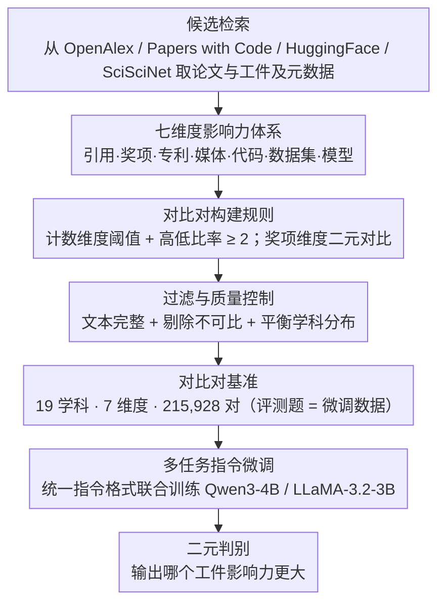

# SciImpact: A Multi-Dimensional, Multi-Field Benchmark for Scientific Impact Prediction

**会议**: ACL 2026 Findings  
**arXiv**: [2604.17141](https://arxiv.org/abs/2604.17141)  
**代码**: [项目主页](https://flypig23.github.io/sciimpact-homepage/)  
**领域**: LLM评测  
**关键词**: 科学影响力预测, 多维度基准, 引用预测, 学术奖项, 多任务指令微调

## 一句话总结

本文构建 SciImpact——首个跨 19 个学科领域、涵盖 7 个影响力维度（引用、奖项、专利、媒体、代码、数据集、模型）的大规模科学影响力预测基准，包含 215,928 个对比论文对，通过多任务微调使 4B 模型超越 o4-mini 等大模型。

## 研究背景与动机

**领域现状**：科学文献指数级增长，需要自动化方法评估和预测研究影响力。现有工作主要关注引用数预测。

**现有痛点**：(1) 引用数仅是影响力的一个代理指标，无法捕捉奖项认可、公众关注、技术转化等其他维度；(2) 现有数据集通常只覆盖计算机科学和生物医学，缺乏跨学科覆盖；(3) 没有统一基准支持多维度、多领域的系统性比较。

**核心矛盾**：科学影响力是多维度的，但评估基准是单维度的。

**本文目标**：构建覆盖 7 个影响力维度和 19 个学科领域的统一预测基准。

**切入角度**：将影响力预测建模为对比对分类（给定两篇论文/工件，判断哪个影响力更大），整合异构数据源（OpenAlex、Papers with Code、HuggingFace、SciSciNet）。

**核心 idea**：通过多任务指令微调在所有维度上联合训练，使小模型在多维度影响力预测上超越大模型。

## 方法详解

SciImpact 把“科学影响力预测”重新表述成一个可对比、可统一评测的分类问题：给定两篇论文或工件，判断哪个在某一维度上影响力更大。整条构建流水线先从异构数据源检索候选，再按维度特定规则配出有意义的对比对，最后经过滤与质量控制得到跨 19 个学科、7 个维度、215,928 对的基准，并在其上做多任务指令微调，让小模型学会跨维度的影响力判别。

### 整体框架

构建分三阶段。候选检索阶段从 OpenAlex、Papers with Code、HuggingFace、SciSciNet 等数据源获取论文和工件及其元数据；影响力标注与对比对生成阶段按每个维度的规则把候选两两配成“谁影响力更大”的对比对；过滤与质量控制阶段确保文本完整、剔除不可比样本并平衡各学科分布。得到的对比对既是评测题，也是微调数据——模型以指令形式读入两个工件的文本，输出二元判别，训练和评估共用同一套对比对格式。

### 关键设计

**1. 七维度影响力体系：把单一引用数展开成七种影响**

现有工作几乎只看引用数，但引用只是学术影响力的一个代理，无法刻画荣誉认可、技术转化或公众关注。SciImpact 因此把影响力拆成七个维度，各自对应一种可量化信号：引用（学术引用次数）、奖项（最佳论文奖 / 诺贝尔奖 / MDPI 奖）、专利（被专利引用数）、媒体（新闻和社交媒体提及数）、代码（GitHub 星标数）、数据集与模型（HuggingFace 下载数）。

这七维分别映射到学术影响（引用）、荣誉认可（奖项）、技术转化（专利）、公众关注（媒体）和实践采用（代码 / 数据 / 模型），让基准能在一个统一框架下比较“学术圈认可”和“工业界采用”这类本质不同的影响力，也为跨学科比较提供了共同坐标。

**2. 对比对构建规则：让每一对都反映有意义的差距**

如果直接拿任意两篇论文比较，会混入两类噪声：0 引用 vs 100 引用这类过于琐碎的对比，以及不同年份、不同 venue 论文之间本就不可比的对比。SciImpact 对计数类维度要求两个工件都超过最小阈值（如引用 $\geq 10$）且高低比率 $\geq 2$，保证差距既真实又显著；奖项维度则设计为二元对比，即同一 venue 下获奖论文 vs 未获奖论文。

为了让差距确实来自“内容质量”而非外部因素，配对时还附加同年、同 venue、同作者等约束控制混淆变量。这样得到的对比对剔除了平凡和不可比样本，使模型必须从论文内容本身去判别影响力高低。

**3. 多任务指令微调：让小模型在维度间互相借力**

七个维度若各训一个模型，既低效又无法利用维度间的共性。SciImpact 把所有维度的对比对聚合起来，用统一的指令格式表示不同维度的预测任务，在 Qwen3-4B 和 LLaMA-3.2-3B 上联合微调。

这样做的前提假设是不同影响力维度之间存在可迁移的模式——例如判断“工作是否扎实、是否解决重要问题”的线索在引用、专利、代码采用上是相通的。联合训练让模型把这些共享信号学到一起，最终使 4B 模型在多维度影响力预测上反超 o4-mini 这类更大的零样本模型。

### 损失函数 / 训练策略

采用标准指令微调（SFT），以交叉熵损失优化二元判别目标；评估则统一用二元分类准确率衡量每个维度上“判对哪个影响力更大”的比例。

## 实验关键数据

### 主实验

| 模型 | 引用 | 奖项 | 专利 | 媒体 | 代码 | 数据集 | 模型 | 平均 |
|------|------|------|------|------|------|--------|------|------|
| o4-mini | 中等 | 中等 | 中等 | 中等 | 中等 | 中等 | 中等 | ~65% |
| Qwen3-4B (原始) | 低 | 低 | 低 | 低 | 低 | 低 | 低 | ~55% |
| **SFT-Qwen3-4B** | **高** | **高** | **高** | **高** | **高** | **高** | **高** | **最高** |

### 消融实验

| 分析维度 | 结果 |
|----------|------|
| 单任务 vs 多任务 | 多任务一致优于单任务 |
| 模型规模 | 4B SFT > 30B 零样本 |
| 维度间难度 | 奖项和模型下载预测最难 |

### 关键发现

- 现成 LLM 在科学影响力预测上表现差异大，且各维度间不一致
- 多任务 SFT 一致性地提升所有维度，4B 模型超越 o4-mini
- 奖项预测是最难的维度——因为奖项决策涉及政治、人脉等非内容因素

## 亮点与洞察

- 将科学影响力从单一引用数扩展到七个维度是重要的概念贡献
- 多任务微调的有效性表明不同影响力维度之间存在可迁移的模式
- 跨 19 个学科领域的覆盖为跨学科比较研究提供了基础

## 局限与展望

- 对比对构建依赖于可获取的元数据，数据覆盖不均匀
- 预测仅基于文本内容，未利用引用网络等图结构信息
- 影响力随时间变化，当前基准是静态快照

## 相关工作与启发

- **vs SciSciNet**: SciSciNet 是数据湖，SciImpact 是评估基准；两者互补
- **vs 引用预测工作**: 本文将预测范围从引用数扩展到七个维度

## 评分

- 新颖性: ⭐⭐⭐⭐ 多维度影响力预测基准，概念贡献显著
- 实验充分度: ⭐⭐⭐⭐ 11个模型、7维度、19领域，覆盖全面
- 写作质量: ⭐⭐⭐⭐ 数据构建过程清晰透明
- 价值: ⭐⭐⭐⭐ 为科学计量学提供了标准化评估工具

<!-- RELATED:START -->

## 相关论文

- [\[ACL 2026\] K-MetBench: A Multi-Dimensional Benchmark for Fine-Grained Evaluation of Expert Reasoning, Locality, and Multimodality in Meteorology](k-metbench_a_multi-dimensional_benchmark_for_fine-grained_evaluation_of_expert_r.md)
- [\[ACL 2026\] MultiFileTest: A Multi-File-Level LLM Unit Test Generation Benchmark and Impact of Error Fixing Mechanisms](multifiletest_a_multi-file-level_llm_unit_test_generation_benchmark_and_impact_o.md)
- [\[ACL 2026\] Modeling Multi-Dimensional Cognitive States in Large Language Models under Cognitive Crowding](modeling_multi-dimensional_cognitive_states_in_large_language_models_under_cogni.md)
- [\[ACL 2026\] SessionIntentBench: A Multi-Task Inter-Session Intention-Shift Modeling Benchmark](sessionintentbench_a_multi-task_inter-session_intention-shift_modeling_benchmark.md)
- [\[AAAI 2026\] BCWildfire: A Long-term Multi-factor Dataset and Deep Learning Benchmark for Boreal Wildfire Risk Prediction](../../AAAI2026/llm_evaluation/bcwildfire_a_long-term_multi-factor_dataset_and_deep_learning_benchmark_for_bore.md)

<!-- RELATED:END -->
