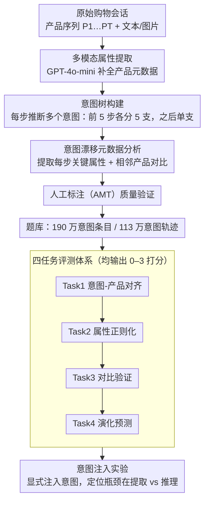

# SessionIntentBench: A Multi-Task Inter-Session Intention-Shift Modeling Benchmark

**会议**: ACL 2026 Findings  
**arXiv**: [2507.20185](https://arxiv.org/abs/2507.20185)  
**代码**: 无  
**领域**: LLM评测  
**关键词**: 购物意图, 会话建模, 电商推荐, 意图漂移, 大语言模型评测

## 一句话总结

本文提出 SessionIntentBench，一个评估 L(V)LM 理解电商购物会话中跨步骤意图漂移能力的多任务基准，包含四个递进式子任务（意图购买似然估计、属性正则化、意图验证对比、意图演化建模），构建了 190 万条意图条目和 113 万条意图轨迹，实验表明当前 20+ 个 L(V)LM 在捕获复杂会话意图方面表现不佳。

## 研究背景与动机

**领域现状**：电商场景中用户意图建模至关重要。现有方法要么分析用户画像和购买记录，要么利用产品标题和价格等表面信息进行单次购买意图推断。购物会话（session）记录了用户在一系列浏览活动中的交互行为。

**现有痛点**：(1) 现有工作仅覆盖会话或意图的单一维度，未能联合建模；(2) 仅使用产品标题和图片作为推理线索，遗漏了丰富的产品元数据；(3) 缺乏自动化意图数据构建流水线和系统的评测基准。

**核心矛盾**：在复杂的多步骤购物会话中，用户意图是动态变化的（如从红色运动鞋→白色休闲鞋→低价鞋），但 LLM 无法有效连接会话中的散落信息来追踪这种意图漂移。

**本文目标**：(1) 设计意图树概念和自动化数据构建流水线；(2) 构建多任务基准评估 L(V)LM 的跨会话意图理解能力；(3) 验证注入显式意图信息对 LLM 性能的提升效果。

**切入角度**：将意图建模分解为四个递进式子任务——从验证意图-产品对齐、到检查关键属性、到对比相邻产品、到预测未来探索方向。

**核心 idea**：用意图树（intention tree）结构化地表示会话中意图的分支和演化，通过 L(V)LM 多步骤提示自动生成意图元数据，构建可扩展的意图建模基准。

## 方法详解

SessionIntentBench 想考的是一件 LLM 容易做不好的事：在多步骤购物会话里，用户意图会从“红色运动鞋”漂移到“白色休闲鞋”再到“低价鞋”，模型能不能把散落在各步骤的线索连起来、追踪这种漂移。为此本文用一条自动化流水线，从原始会话出发逐步推断意图、结构化成意图树，再把意图理解拆成四个递进式子任务来评测，并通过意图注入实验定位模型的真正瓶颈。

### 整体框架

构建流水线分四阶段。多模态属性提取阶段用 GPT-4o-mini 从产品文本和图片中提取标准化属性，补上以往只用标题和图片所遗漏的产品元数据；意图生成阶段沿会话时间线逐步推断用户意图列表，并组织成意图树；意图漂移元数据分析阶段提取每步的关键属性和相邻产品对比；人工标注阶段由 AMT 标注员对采样子集做质量验证。流水线最终产出 190 万条意图条目和 113 万条意图轨迹，作为四任务评测的题库；其上再叠加意图注入实验，定位模型瓶颈究竟在意图提取还是推理。

### 关键设计

**1. 意图树构建：把隐式心理状态结构化成可计算的树**

真实用户在同一段交互历史下的购买意图往往是多元的，单条意图序列表达不了这种分支。意图树以会话中的产品序列 $P_1, P_2, \dots, P_T$ 为骨架，在每个时间步用 LLM 推断多个可能意图，形成从根到叶的树状结构，每条根到叶路径就是一种“在该交互历史下成立的合理意图假设”。

为了控制指数膨胀，构建时只在前 5 步每步分 5 支，之后每步仅推断 1 个意图。这样既保留了早期意图的多样性，又把规模收敛到可处理的范围，最终得到 113 万条意图轨迹。

**2. 四任务评测体系：从四个互补角度逼问意图理解**

单一任务无法全面考察意图理解，于是本文把它拆成四个层层递进、均输出 0–3 打分的子任务。Task 1 检验已推断意图与新产品是否匹配（意图-产品对齐）；Task 2 检验意图里的关键属性是否在新产品中体现（属性正则化）；Task 3 检验相邻产品的对比能否合理解释意图转变（对比验证）。

Task 4 则要求预测下一步方向——应继续推荐同类产品、同类别但不同特征的产品，还是跨类别探索（演化预测）。四个任务从对齐、属性、对比到预测形成闭环，任何一环薄弱都会暴露模型在追踪意图漂移上的具体短板。

**3. 意图注入实验：定位瓶颈在“提取”还是“推理”**

模型在四任务上表现差，可能是因为读不懂意图，也可能是因为根本提不出意图。意图注入实验把这两种可能分开：在提示中显式加入已推断的意图信息（如“用户可能在寻找低价白色运动鞋”），对比有 / 无该信息时模型在四个任务上的表现差异。

如果注入意图后性能显著提升，就说明模型并非不会推理，而是缺乏从原始会话中自主提取意图的能力——瓶颈被定位在意图提取这一步。这一设计把基准从“测分数”升级为“测能力来源”，为后续改进指明方向。

### 损失函数 / 训练策略

基准评测主要采用零样本和少样本提示，不涉及专门训练；微调实验用 SFT 在训练集上微调 Llama-3.1-8B 和 Llama-3.2-3B。人工标注通过 Amazon Mechanical Turk 多轮筛选保证质量。

## 实验关键数据

### 主实验

**零样本 L(V)LM 性能（Accuracy %）**

| 模型 | Task 1 Acc | Task 2 Acc | Task 3 Acc | Task 4 Acc |
|------|-----------|-----------|-----------|-----------|
| Random | 50.00 | 50.00 | 50.00 | 54.38 |
| Majority | 62.30 | 54.35 | 71.80 | 63.15 |
| Qwen-2.5-7B | 58.62 | 51.02 | 70.59 | 40.07 |
| LLaVA-v1.6-vicuna-7b | 62.01 | 46.93 | 71.27 | 37.21 |
| Mistral-7B-v0.3 | 62.17 | 47.65 | 71.30 | 39.61 |

### 消融实验

| 配置 | 效果 | 说明 |
|------|------|------|
| 零样本 | 基线水平 | 大多数模型接近或低于 majority |
| 少样本 | 小幅提升 | 但部分任务反而下降 |
| 微调（SFT） | 混合效果 | 部分任务提升但无法全面改善 |
| + 意图注入 | 显著提升 | 证明显式意图信息的价值 |

### 关键发现

- 20+ L(V)LM 在四个任务上的表现普遍接近或低于 majority 基线，说明当前模型确实无法有效理解会话意图
- Task 2（属性正则化）最具主观性，标注者间一致性也最低
- 多模态模型（LVLM）并未比纯文本 LLM 表现更好，产品图像信息未被有效利用
- 意图注入实验证明：当显式提供意图信息时，LLM 性能显著提升，说明瓶颈在于意图提取而非推理
- 微调效果不一致，可能因为会话意图理解需要更深层的推理能力而非模式记忆

## 亮点与洞察

- 意图树概念将隐式的用户心理状态结构化为可计算的树结构，为意图建模提供了新的表示范式
- 四任务评测体系设计巧妙，从对齐→验证→对比→预测形成递进式评估
- 数据规模庞大（190 万意图条目）但构建成本可控（利用 LLM 自动化 + 人工抽样验证）

## 局限与展望

- 意图生成依赖 LLM（GPT-4o-mini），其质量受 LLM 能力限制
- 人工标注仅覆盖采样子集，完整数据质量未经全面验证
- 四个任务的 0-3 评分标准的主观性较强，尤其是 Task 2
- 未来可探索将意图建模融入推荐系统的端到端训练

## 相关工作与启发

- **vs Amazon-M2 (Jin et al., 2023)**: Amazon-M2 提供原始会话数据，SessionIntentBench 在其基础上增加了意图元数据和评测任务
- **vs Sun et al. (2024)**: 他们用意图排名提示优化推荐，本文专注于评估 LLM 的意图理解能力
- **vs Xu et al. (2024)**: 他们建模共购行为意图但仅覆盖单次交互，本文建模跨会话的意图演化

## 评分

- 新颖性: ⭐⭐⭐⭐ 意图树和四任务评测体系是有意义的新贡献
- 实验充分度: ⭐⭐⭐⭐⭐ 20+ 模型、多种评测设定、人工标注验证
- 写作质量: ⭐⭐⭐⭐ 任务定义清晰，但符号较多
- 价值: ⭐⭐⭐⭐ 为电商意图建模提供了首个系统化基准

<!-- RELATED:START -->

## 相关论文

- [\[ACL 2025\] EcomScriptBench: A Multi-task Benchmark for E-commerce Script Planning via Step-wise Intention-Driven Product Association](../../ACL2025/llm_evaluation/ecomscriptbench.md)
- [\[ACL 2026\] SciImpact: A Multi-Dimensional, Multi-Field Benchmark for Scientific Impact Prediction](sciimpact_a_multi-dimensional_multi-field_benchmark_for_scientific_impact_predic.md)
- [\[ACL 2026\] Multi-Task Reinforcement Learning for Enhanced Multimodal LLM-as-a-Judge](multi-task_reinforcement_learning_for_enhanced_multimodal_llm-as-a-judge.md)
- [\[ACL 2026\] Modeling Multi-Dimensional Cognitive States in Large Language Models under Cognitive Crowding](modeling_multi-dimensional_cognitive_states_in_large_language_models_under_cogni.md)
- [\[ACL 2026\] ResearchBench: Benchmarking LLMs in Scientific Discovery via Inspiration-Based Task Decomposition](researchbench_benchmarking_llms_in_scientific_discovery_via_inspiration-based_ta.md)

<!-- RELATED:END -->
