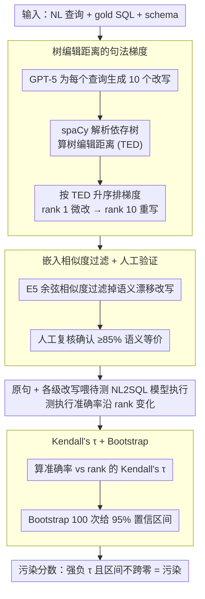

# SPENCE: A Syntactic Probe for Detecting Contamination in NL2SQL Benchmarks

**会议**: ACL 2026  
**arXiv**: [2604.17771](https://arxiv.org/abs/2604.17771)  
**代码**: 无  
**领域**: 可解释性  
**关键词**: 数据污染检测, NL2SQL, 句法探针, 基准泄露, 泛化评估

## 一句话总结

SPENCE 通过对 NL2SQL 基准查询进行系统性句法改写并测量执行准确率随句法距离的衰减程度，检测和量化 LLM 在 NL2SQL 基准上的数据污染行为，发现越老的基准（如 Spider）污染信号越强，而较新的 BIRD 基准几乎不受影响。

## 研究背景与动机

**领域现状**：LLM 在 NL2SQL 基准（Spider、SParC、CoSQL、BIRD）上取得了很高的执行准确率，但学术界对这些分数是否反映了真正的泛化能力日益产生质疑。数据污染和基准泄露已被广泛研究，多种方法（如 ConStat、Data Contamination Quiz、Min-K% Prob）从不同角度检测 LLM 的记忆化行为。

**现有痛点**：现有的污染检测方法要么依赖字符串重叠检查，无法捕获结构性记忆化；要么需要访问模型内部参数，对黑盒模型不适用。在 NL2SQL 场景中，尚缺乏专门针对 SQL 生成任务的系统性污染检测框架——已有的 Ranaldi et al. (2024) 只在数据集层面对比 seen vs. unseen 数据库，未在句法轴上做精细探测。

**核心矛盾**：报告的高准确率可能来自模型对基准查询表面形式的记忆，而非真正的组合性泛化能力。如果模型只是记住了原始查询的句法模式，那么对语义等价但句法不同的改写查询应该表现更差。关键问题是：如何区分"记忆化"和"泛化性不足"，且这种行为是否与基准的发布时间相关。

**本文目标**：设计一个受控的句法探测框架，通过生成距离递增的句法改写来量化 NL2SQL 模型的污染敏感性，并跨四个基准进行对比分析。

**切入角度**：利用句法依存树编辑距离（TED）对改写进行排序，将"污染程度"操作化为"准确率随句法距离的下降速率"，并用 Kendall's τ 统计量化趋势的显著性。

**核心 idea**：句法改写 + 距离排序 + 准确率衰减分析 = 污染探针。越老的基准衰减越陡，指示污染越严重。

## 方法详解

### 整体框架

SPENCE 把"污染检测"操作化为一个受控的句法扰动实验：给定测试集里的自然语言查询、gold SQL 和数据库 schema，先用 LLM 为每个查询生成一组语义等价但句法逐渐远离原句的改写，按句法距离排成一条梯度，再把原句和各级改写分别喂给待测 NL2SQL 模型执行，观察执行准确率沿这条梯度如何变化。如果模型记住的是基准查询的表面句法模式而非真正的组合泛化，准确率就会随句法距离单调下滑；最后用 Kendall's τ 把这条下滑趋势压成一个可统计检验的污染分数。

### 关键设计

**1. 基于树编辑距离的句法梯度：把"句法远近"做成连续标尺**

污染检测最难的是缺一个可控的连续变量——简单的词汇重叠只能反映表面同义替换，捕捉不到从句重排这类深层结构变化。SPENCE 用 GPT-5 为每个查询生成 10 个改写，再用 spaCy 把改写和原句都解析成依存树，以树编辑距离 $\text{TED}_i = \text{TreeEditDistance}(T_{p_i}, T_q)$ 度量两者的结构差异，允许的操作是依存树节点的插入、删除和替换。按 TED 升序排名后，rank 1 是最贴近原句的微改（低 TED、表面词汇变化），rank 10 是结构离得最远的重写（高 TED、从句重排）。这样就把"句法远近"变成了一条可控梯度，探测的是真正的句法鲁棒性，而不是被词汇相似度污染的伪信号。

**2. 嵌入相似度过滤加人工验证：堵住语义漂移这个混淆源**

如果某个改写其实换了语义，那它带来的准确率下降就分不清是污染信号还是语义变化，整条梯度都会失真。SPENCE 对每个改写计算它与原句之间的 E5-base-v2 嵌入余弦相似度，低于阈值的直接剔除；再对 100 个 Spider 样例跨 rank 1/5/10 做人工复核，确认 85% 以上的改写确实语义等价。经过这一步，沿梯度观察到的准确率衰减就只能归因于句法变化本身，排除了语义漂移的干扰。

**3. Kendall's τ 秩相关加 Bootstrap 置信区间：把下滑趋势变成可检验的统计量**

仅凭肉眼看曲线"好像在下降"不足以下结论，需要一个统计可靠的污染度量。SPENCE 对每个模型-数据集对计算准确率与改写 rank 之间的 Kendall's τ $= (n_c - n_d) / \tfrac{1}{2}n(n-1)$，其中 $n_c$、$n_d$ 分别是一致对与不一致对的数量；再用 $B=100$ 次 bootstrap 重抽样给出 95% 置信区间。强负 τ 意味着准确率随句法距离单调下降，是明确的污染信号，τ 接近零则说明模型对句法扰动不敏感；置信区间不跨越零，趋势才算统计显著。

本文是评估框架，不涉及任何模型训练。

## 实验关键数据

### 主实验（Kendall's τ，跨 6 个模型平均）

| 数据集 | 发布时间 | τ (全部 rank) | τ (rank ≥ 3) |
|--------|---------|---------------|--------------|
| Spider | 2018.09 | -0.89 | -0.88 |
| SParC | 2019.06 | -0.76 | -0.63 |
| CoSQL | 2019.10 | -0.71 | -0.64 |
| BIRD | 2023.05 | -0.35 | -0.37 |

### 控制实验排除替代解释

| 控制变量 | 方法 | 结论 |
|---------|------|------|
| 查询长度 | 比较 rank 1/5/10 的长度分布 | 分布相似，排除长度效应 |
| 词汇重叠 | Jaccard 分层后重新计算 τ | 负相关持续存在，排除词汇效应 |
| Schema linking | 人工检查失败案例 | 未发现 schema 链接断裂 |
| 改写生成器 | 换用 LLaMA-4 Maverick 替代 GPT-5 | 衰减模式和斜率一致 |

### 关键发现
- **时间梯度清晰**：越老的基准 τ 绝对值越大，污染信号越强。Spider（2018）最强（-0.89），BIRD（2023）最弱（-0.35）
- Spider 上所有模型在 rank 8-10 时准确率下降超过 10-15 个百分点，BIRD 上则保持稳定甚至略有提升
- 即使只看 rank ≥ 3 的远距离改写，Spider/SParC/CoSQL 的负相关仍然显著（τ 在 -0.57 到 -1.00 之间）
- 更大的模型（如 LLaMA-3.1-405B）在 SParC 上衰减较慢，但没有模型免疫

## 亮点与洞察
- **句法探针的设计非常巧妙**：通过控制改写的句法距离构建连续梯度，将污染检测从二元判断（是/否泄露）转化为连续度量（衰减速率），信息量更大
- **四个控制实验全面排除替代解释**：逐一排除查询长度、词汇重叠、schema linking、改写生成器偏差的影响，方法论严谨
- 该方法可迁移到其他 NLP 基准的污染检测：任何可以进行语义保持改写的任务（QA、文本分类等）都可以套用 SPENCE 框架

## 局限与展望
- 时间梯度是相关性而非因果性：老基准可能在难度、标注风格、分布特性上与新基准不同
- 仅评估通用 LLM，未涵盖 SQL 专用系统（如 OmniSQL、Arctic-Text2SQL-R1）
- 改写生成本身依赖 LLM（GPT-5），虽然换用 LLaMA-4 结果一致，但无法完全排除生成器偏差
- 对话式基准（SParC、CoSQL）仅改写最后一轮用户问题，未扩展到更早的对话轮次
- 未来可结合 ConStat 的 sample-specific 探针，捕获更深层次的污染形式

## 相关工作与启发
- **vs ConStat**: ConStat 将污染定义为不可泛化的性能膨胀，从 syntax/sample/benchmark 三个维度检测。SPENCE 专注于 syntax 轴，但提供更精细的距离梯度控制
- **vs Ranaldi et al.**: 他们通过对比 Spider vs. 新数据集 Termite 检测数据集级污染。SPENCE 在同一数据集内通过句法变换检测，粒度更细
- **vs Min-K% Prob**: 需要模型内部 token 概率，是白盒方法。SPENCE 完全黑盒，只需观察输出

## 评分
- 新颖性: ⭐⭐⭐⭐ 句法距离梯度 + Kendall's τ 的组合用于 NL2SQL 污染检测是新颖的，但探针式评估的大框架不算全新
- 实验充分度: ⭐⭐⭐⭐⭐ 四个基准、六个模型、四种控制实验、bootstrap 置信区间、换改写生成器验证，非常全面
- 写作质量: ⭐⭐⭐⭐ 结构清晰，图表信息量大，但篇幅较长，可适当精简
- 价值: ⭐⭐⭐⭐ 为 NL2SQL 社区提供了可操作的污染检测工具，且方法可推广到其他任务

<!-- RELATED:START -->

## 相关论文

- [\[ACL 2026\] CLARITY: A Framework and Benchmark for Conversational Language Ambiguity and Unanswerability in Interactive NL2SQL Systems](clarity_a_framework_and_benchmark_for_conversational_language_ambiguity_and_unan.md)
- [\[ACL 2025\] AntiLeakBench: Preventing Data Contamination by Automatically Constructing Benchmarks with Updated Real-World Knowledge](../../ACL2025/llm_evaluation/antileakbench_preventing_data_contamination_by_automatically_constructing_benchm.md)
- [\[ACL 2026\] BenchMarker: An Education-Inspired Toolkit for Highlighting Flaws in Multiple-Choice Benchmarks](benchmarker_an_education-inspired_toolkit_for_highlighting_flaws_in_multiple-cho.md)
- [\[ACL 2026\] Beyond Static Benchmarks: Synthesizing Harmful Content via Persona-based Simulation for Robust Evaluation](beyond_static_benchmarks_synthesizing_harmful_content_via_persona-based_simulati.md)
- [\[ICLR 2026\] Preference Leakage: A Contamination Problem in LLM-as-a-judge](../../ICLR2026/llm_evaluation/preference_leakage_a_contamination_problem_in_llm-as-a-judge.md)

<!-- RELATED:END -->
