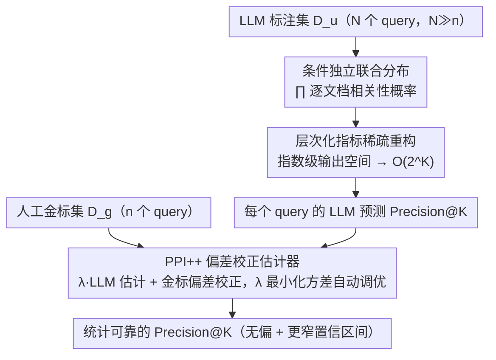

<!-- 由 src/gen_stubs.py 自动生成 -->
# Statistically Reliable LLM-Based Ranking Evaluation via Prediction-Powered Inference

**会议**: ACL2026
**arXiv**: [2606.05308](https://arxiv.org/abs/2606.05308)
**代码**: 待确认
**领域**: LLM评测
**关键词**: PPI, LLM-as-Judge, 偏差校正, 排名评估, Precision@K, 半监督估计

## 一句话总结

PRECISE 将 Prediction-Powered Inference (PPI) 扩展到排名评估指标，通过少量人工标注 + 大量 LLM 判断的组合，在纠正 LLM 系统性偏差的同时降低指标估计方差，实现统计可靠的排名系统评估。

## 研究背景与动机

LLM-as-a-Judge 评估方法虽然可以大幅降低人工标注成本，但存在系统性偏差，直接替代人工标注会扭曲评估指标。现有工作主要通过 prompt 工程、微调或多智能体辩论来构建更好的 judge，但偏差依然存在。本文采取正交思路：接受 LLM judge 存在偏差，用统计方法纠正。

核心挑战在于层次化指标（如 Precision@K）存在粒度不匹配问题：人工标注是 per-document 的，但指标是 per-query 计算的。标准 PPI 无法处理这一问题，因为朴素输出空间为 $O(2^{|C|})$，当语料库规模达百万级时计算不可行。

## 方法详解

### 整体框架

PRECISE 基于 PPI++（Prediction-Powered Inference++）半监督估计框架：输入一个小规模人工金标集 $\mathcal{D}_g$（n 个 query 的人工相关性标注）和一个大规模未标注集 $\mathcal{D}_u$（N 个 query 的 LLM 判断，N >> n）。难点在于 LLM 只能逐文档判断相关性，而 Precision@K 这类层次化指标是按 query 计算的——存在粒度不匹配，且朴素枚举一个 query 全部相关性标签组合的输出空间高达指数级。PRECISE 先把 LLM 的逐文档概率桥接成 per-query 的指标预测（条件独立联合分布 + 稀疏重构），再用 PPI++ 估计器把金标与 LLM 信号组合起来：用大量 LLM 预测降低方差、用少量金标校正 LLM 的系统性偏差，最终得到统计可靠（无偏、置信区间更窄）的指标估计。

### 关键设计

1. **条件独立的联合分布建模**：层次化指标按 query 计算，但 LLM 只能逐文档给相关性判断，二者粒度不匹配。PRECISE 假设 LLM 对每个 query 的 K 个文档独立给出相关性概率 $\tilde{p}'(d_k)$，将其组成该 query 标签向量 $y$ 的联合分布 $\tilde{p}(y) = \prod_{k=1}^{K} \tilde{p}'(d_k)^{y_k}(1-\tilde{p}'(d_k))^{(1-y_k)}$，从而把 per-document 的 LLM 输出桥接到 per-query 的指标计算上。
2. **层次化指标的稀疏重构**：朴素枚举一个 query 的全部相关性标签组合，输出空间为 $O(2^{|C|})$（$|C|$ 为语料库规模，可达百万级），完全不可计算。PRECISE 利用 Precision@K 只依赖 top-K 检索文档这一事实，把非检索文档的概率质量折叠到全零 K 向量上，将输出空间压缩到 $O(2^K)$；K ≤ 10 时可精确枚举联合分布，使 PPI 在真实排名评估场景下可行。
3. **PPI++ 偏差校正估计器**：在上述 per-query 指标预测之上，估计器组合金标与 LLM 信号 $\hat{\mu}_{PPI} = \frac{\lambda}{N}\sum_{i=1}^{N}\tilde{\mu}_u^{(i)} + \frac{1}{n}\sum_{i=1}^{n}[\phi_i - \lambda\tilde{\mu}_g^{(i)}]$，第一项用大规模 LLM 估计降方差，第二项用 n 个金标样本校正 LLM 的系统性偏差。参数 $\lambda \in [0,1]$ 控制 LLM 信号权重——LLM 校准好时 $\lambda \approx 1$ 充分利用未标注数据，偏差大时 $\lambda \approx 0$ 回退到纯金标估计；$\lambda$ 通过最小化 $\hat{\mu}_{PPI}$ 的方差自动调优，且对任意 $\lambda > 0$ 估计都保持无偏。

### 损失函数/训练策略

无训练过程。$\lambda$ 通过最小化 $\hat{\mu}_{PPI}$ 的方差自动调优，估计器对任意 $\lambda > 0$ 均保持无偏。

## 实验关键数据

### 主实验

在 ESCI 检索基准上评估 Precision@4（n=30 金标，N=60K LLM 标注）：

| 估计器 | Bias (↓) | Std. Err. (↓) | 推理成本 |
|---|---|---|---|
| Gold only (n=30) | 1.04 | 4.45 | — |
| + Claude 3 Sonnet | 0.70 | 3.50 | $946 |
| + Claude 3 Haiku | 0.29 | 3.86 | $79 |

### 消融实验

- **未标注/金标比例**：框架在 100× 比例时饱和，N=3,000 LLM 查询与 N=60,000 提供近乎相同的标准误差。
- **生产 A/B 测试**：使用 n=100 人工标注 + N=8,400 LLM 判断，在 2 小时内完成三个系统变体排名（T1 >> T2 >> Control），T1 在日销售额上提升 +407 bps、CTR 提升 +571 bps。LLM-only 估计因系统性上偏无法区分变体，PPI 校正后恢复了区分能力。

### 关键发现

- PPI 的采样分布比纯金标更窄（方差更低），且始终以真实值为中心（无偏）。
- Haiku 以 12× 更低成本实现最低偏差（0.29），是性价比最优选择。

## 亮点与洞察

- **统计学 vs. 工程学思路**：不追求更好的 LLM judge，而是接受偏差并统计校正——只要有少量金标就能保证无偏，且每增加一个 LLM 标注只降方差不引入新偏差。
- **稀疏重构的工程意义**：将层次化指标的输出空间从指数级降到可枚举，使 PPI 适用于真实排名评估场景。
- **生产验证**：在真实搜索系统中 2 小时内完成评估并通过 A/B 测试确认，证明实际可用性。

## 局限与展望

- 仅在 Precision@K 上验证了层次化 PPI，其他层次化指标（如 per-claim 事实性、per-turn 对话质量）未测试。
- 条件独立假设在多样性敏感排名场景（文档相关性相互依赖）可能不成立。
- 金标集与未标注集需同分布，时间漂移可能削弱偏差校正效果。

## 相关工作与启发

- **PPI/PPI++**（Angelopoulos et al., 2023/2024）：本文的理论基础，将半监督估计方法应用于排名评估。
- **LLM-as-a-Judge 偏差研究**（Chen et al., 2024）：证实 LLM judge 存在系统性偏差，为本文的偏差校正动机提供支撑。
- **Doubly Robust Estimation**（Oosterhuis, 2023）：共享理论基础，可能为实时在线评估提供路径。

## 评分

| 维度 | 分数 (1-10) |
|---|---|
| 创新性 | 7 |
| 实用性 | 9 |
| 清晰度 | 8 |
| 实验充分度 | 6 |

## 评分
- 新颖性: 待评
- 实验充分度: 待评
- 写作质量: 待评
- 价值: 待评

<!-- RELATED:START -->

## 相关论文

- [\[ICML 2026\] Margin-Adaptive Confidence Ranking for Reliable LLM Judgement](../../ICML2026/llm_evaluation/margin-adaptive_confidence_ranking_for_reliable_llm_judgement.md)
- [\[ICLR 2026\] Multi-LLM Adaptive Conformal Inference for Reliable LLM Responses](../../ICLR2026/llm_evaluation/multi-llm_adaptive_conformal_inference_for_reliable_llm_responses.md)
- [\[ACL 2025\] JuStRank: Benchmarking LLM Judges for System Ranking](../../ACL2025/llm_evaluation/justrank_llm_judge_system_ranking.md)
- [\[AAAI 2026\] LLM-as-a-Judge for Scalable Test Coverage Evaluation](../../AAAI2026/llm_evaluation/llm-as-a-judge_for_scalable_test_coverage_evaluation_accuracy_operational_reliab.md)
- [\[ACL 2026\] SciImpact: A Multi-Dimensional, Multi-Field Benchmark for Scientific Impact Prediction](sciimpact_a_multi-dimensional_multi-field_benchmark_for_scientific_impact_predic.md)

<!-- RELATED:END -->
