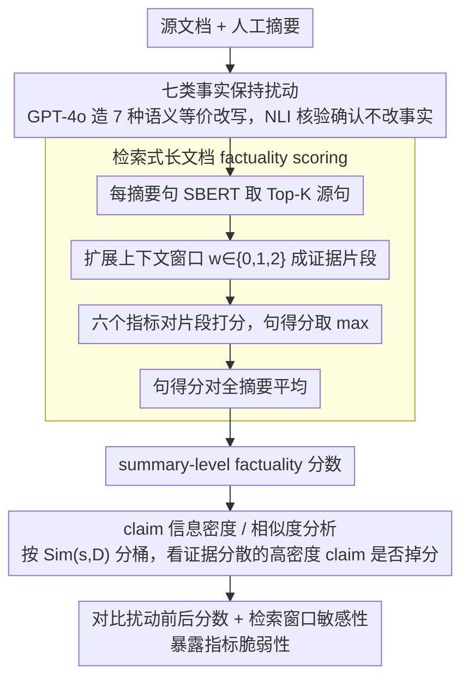

# Stress Testing Factual Consistency Metrics for Long-Document Summarization

**会议**: ACL2026  
**arXiv**: [2511.07689](https://arxiv.org/abs/2511.07689)  
**代码**: https://github.com/zainmujahid/metricEval-longSum  
**领域**: 文本生成 / 摘要评测  
**关键词**: 事实一致性, 长文档摘要, 鲁棒性评测, 检索式评分, 指标压力测试  

## 一句话总结
这篇论文把六个常用 reference-free factuality metrics 放到长文档摘要中做压力测试，发现它们会被事实保持的改写、检索窗口大小和高信息密度 claim 显著影响，说明短摘要指标不能直接信任地迁移到长文档场景。

## 研究背景与动机
**领域现状**：抽象摘要系统越来越流畅，但 factual consistency 仍然是核心风险。传统 ROUGE/BLEU 只能看表面重叠，不能判断摘要事实是否被源文档支持。因此近年来出现了很多 reference-free factuality metrics，例如 NLI 型 SummaC、QA 型指标、生成概率型 BARTScore，以及 MiniCheck、AlignScore、UniEval 等更综合的指标。

**现有痛点**：这些指标多数是在短文档摘要上提出和验证的，默认源文档和摘要可以一起编码，或证据可以在局部上下文中找到。长文档摘要不同：证据可能跨越数百到数千 token，摘要中的一个句子可能压缩了多个段落甚至多个文档的信息，指标常常需要先检索证据片段再判断一致性。

**核心矛盾**：一个事实一致的摘要在改写、简化、压缩或同义替换后，事实性不应该改变；但很多 factuality metrics 可能依赖局部词汇匹配、句法形式或检索片段，导致对事实保持的表面变化产生分数波动。

**本文目标**：作者要回答三个问题：现有 factuality metrics 在事实保持扰动下是否稳定；长文档检索上下文窗口会怎样影响指标；摘要 claim 的信息密度和证据分散程度会不会让指标失效。

**切入角度**：论文没有提出新指标，而是设计了一个 stress-testing protocol。它在三个长文档摘要数据集上对原始摘要生成七类 meaning-preserving perturbations，再用统一的 retrieval-based scoring 框架调用六个指标，对比原始和扰动后的 factuality 分数。

**核心 idea**：如果一个 factuality metric 真正评估事实一致性，它应该对语义等价的扰动保持稳定，并能在长文档中随检索窗口和 claim 密度变化给出合理分数；反之，分数大幅波动就是指标脆弱性的证据。

## 方法详解
这项工作的方法重点是评测协议。它把扰动生成、检索式评分和 claim density 分析组合起来，专门暴露长文档摘要场景下的指标失真。

### 整体框架
输入是源文档和人工摘要。首先，作者用 GPT-4o 为每个摘要生成七种事实保持扰动版本，包括 paraphrased、simplified、synonym replaced、less diverse、logically equivalent negated、summarized、added source text。然后，对原摘要和扰动摘要的每个句子，从源文档中检索 Top-K 相似句子，并扩展周围窗口作为证据 snippet。每个 factuality metric 对摘要句和候选证据 snippet 打分，取最大值作为该句得分，再对所有摘要句平均得到 summary-level 分数。最后，作者比较扰动前后分数差异，分析 retrieval window size 和 claim similarity 对指标的影响。

### 关键设计

**1. 七类事实保持扰动：用语义等价但表面不同的改写，探指标是不是真在测事实**

长文档摘要的事实评测最怕被文风、句法或轻微压缩牵着走——如果一个指标对这些表面变化敏感，那它测的其实是局部形式匹配，而非事实是否被源文档支撑。为此作者对每条原摘要造出七种「事实不变、表面变」的版本：Paraphrased 改写句法措辞，Simplified 把复杂结构拆短，Synonym Replaced 替换近义词，Less Diverse 压低词汇多样性，Negated 用逻辑等价的否定表达，Summarized 进一步压缩，Added Source Text 插入源文档里真实但与主摘要关系较弱的句子。为确认这些扰动确实保事实，作者再用 NLI-based faithfulness check 做 sanity check，结果显示除 Negated 外多数扰动的 contradiction rate 都很低。这样一来，扰动前后分数若大幅波动，就只能归因于指标自身脆弱，而不是事实真的变了。

**2. 检索式长文档 factuality scoring：把只能吃短输入的指标搬上长文档，并顺带观察检索粒度的影响**

短输入指标默认源文档和摘要能一起编码，可长文档的证据往往跨越数百到数千 token，必须先检索证据片段再判断一致性。作者对每个摘要句 $s_j$ 用 SBERT embedding 与源文档每个句子算相似度，取 Top-K 源句，并把每个命中句扩展成窗口 $w$ 的上下文片段 $d_{j,k}^{(w)}$；指标 $M$ 分别给 $s_j$ 和这些 snippet 打分，句子得分取 $\max_k M(s_j, d_{j,k}^{(w)})$，摘要分数再对所有句子平均。实验里 $w$ 取 $0,1,2$，专门看更大上下文能否带来更高、更稳的分数。这个设计的巧处在于：长文档证据常常不落在单句内，固定只检索一句容易误判；但如果某个指标根本不会利用额外上下文，那窗口再大也救不了它——窗口敏感性本身就成了诊断指标可靠性的探针。

**3. claim information density / similarity 分析：量化「压缩且证据分散」的 claim，看指标在分布式证据上是否失效**

长摘要里最难评的不是单点事实，而是把多个段落揉成一句的概括性 claim。作者用每个摘要句与源文档所有句子的平均余弦相似度 $Sim(s_j,D)=\frac{1}{n}\sum_i \cos(e_j, e_i^D)$ 来刻画这种 claim：相似度高，说明这句话和文档很多位置都有语义重叠，往往更泛化、更压缩、证据也更分散；相似度低，则通常是具体、局部、好验证的 claim。按 similarity bin 分组后再看各指标的平均 factuality 分数，就能把「长文档难评估」这个笼统印象落到「证据分散的高密度 claim 让指标掉分」这个可观测的现象上，而不只是泛泛抱怨上下文太长。

### 损失函数 / 训练策略
本文不训练模型。它评测六个公开 factuality metrics：BARTScore、MiniCheck、SummaC-Conv、SummaC-ZS、AlignScore 和 UniEval。所有指标使用公开版本，不做任务特定微调或校准，以模拟研究和工程中“直接拿指标评估长文档摘要”的常见做法。实验在 SQuALITY、LexAbSumm、ScholarQABench 三个长文档摘要数据集上进行，覆盖科幻小说、法律判决和科研多文档问答摘要。

## 实验关键数据

### 主实验
三个数据集差异很大：LexAbSumm 文档最长且法律语言最结构化，ScholarQABench 摘要最长且是多文档科学场景。

| 数据集 | 样本数 | 平均摘要句数 | 平均摘要 tokens | 平均文档句数 | 平均文档 tokens | 摘要类型 |
|--------|--------|--------------|-----------------|--------------|-----------------|----------|
| SQuALITY | 260 | 12.5 | 273 | 456.6 | 6,131 | 人写摘要 |
| LexAbSumm | 351 | 4.2 | 169 | 385.9 | 10,840 | 人写摘要 |
| ScholarQABench | 100 | 43.2 | 1,158 | 575.4 | 14,652 | 人写摘要 |

### 消融实验
这里的核心“消融”是 retrieval window size。扩大窗口通常提高 factuality score，尤其对法律领域明显；但 NLI 类 SummaC 对窗口不太敏感。

| 指标 | ScholarQA w=0 | ScholarQA w=2 | SQuALITY w=0 | SQuALITY w=2 | LexAbSumm w=0 | LexAbSumm w=2 | 观察 |
|------|---------------|---------------|--------------|--------------|---------------|---------------|------|
| BARTScore | 0.03 | 0.02 | 0.03 | 0.03 | 0.15 | 0.16 | 整体分数低，窗口收益很小 |
| MiniCheck | 0.17 | 0.15 | 0.11 | 0.19 | 0.47 | 0.60 | SQuALITY 和法律域明显受益 |
| SummaC-Conv | 0.22 | 0.25 | 0.22 | 0.24 | 0.33 | 0.34 | 变化较小 |
| SummaC-ZS | 0.14 | 0.20 | 0.11 | 0.14 | 0.36 | 0.39 | 有小幅提升 |
| AlignScore | 0.15 | 0.27 | 0.10 | 0.24 | 0.36 | 0.64 | 对窗口最敏感之一 |
| UniEval | 0.72 | 0.74 | 0.67 | 0.70 | 0.81 | 0.84 | 基线高且稳定 |

### 扰动鲁棒性结果
下表摘录三个数据集的 per-dataset scores，可以看到 Negated 对 UniEval/MiniCheck 打击很大，LexAbSumm 中 AlignScore 和 BARTScore 对改写/压缩更脆弱。

| 数据集 | 指标 | Original | Paraphrased | Simplified | Negated | Summarized | Added Source Text | 观察 |
|--------|------|----------|-------------|------------|---------|------------|-------------------|------|
| LexAbSumm | BARTScore | 0.16 | 0.09 | 0.11 | 0.07 | 0.08 | 0.23 | 法律域表面改写导致明显下降 |
| LexAbSumm | MiniCheck | 0.84 | 0.85 | 0.85 | 0.40 | 0.84 | 0.78 | 除逻辑否定外很稳 |
| LexAbSumm | AlignScore | 0.52 | 0.38 | 0.56 | 0.38 | 0.42 | 0.58 | 对 paraphrase / negation 敏感 |
| ScholarQABench | UniEval | 0.73 | 0.73 | 0.72 | 0.32 | 0.72 | 0.73 | 多数扰动稳定，否定失败 |
| SQuALITY | SummaC-ZS | 0.13 | 0.12 | 0.14 | 0.11 | 0.10 | 0.19 | 整体分数低且波动 |
| SQuALITY | MiniCheck | 0.56 | 0.56 | 0.55 | 0.30 | 0.53 | 0.57 | 相对稳定但仍怕 negation |

### 关键发现
- MiniCheck 和 UniEval 整体最稳，但它们同样处理不好 logically equivalent negations。UniEval 在三个数据集上 Negated 分数都大幅下降到约 0.32-0.39。
- LexAbSumm 是最不稳定的领域。法律文本的长句、术语和逻辑结构让 AlignScore、SummaC-ZS、UniEval 等在 mean absolute score change 上更敏感。
- 扩大检索窗口通常有帮助，尤其是 LexAbSumm；但这也说明指标很依赖检索配置，不能把 metric score 当作独立于上下文选择的事实真值。
- claim similarity 分析显示，LexAbSumm 和 SQuALITY 中高相似度、信息密度更高的 claim 分数更低，说明压缩性强、证据分散的句子更难评估。ScholarQABench 反而常出现上升趋势，可能因为多文档中重复证据更多。

## 亮点与洞察
- 论文没有追求提出第七个指标，而是系统展示“现有指标在长文档下到底哪里不可靠”。这对实际使用 factuality metrics 很有价值。
- 扰动选择覆盖面较广：从同义替换、简化到额外插入源句，能区分指标是怕词汇变化、逻辑变化还是内容压缩。
- Claim similarity 这个分析很聪明。它把“长文档摘要难评估”具体化为证据分散和语义 hubness，而不只是泛泛说上下文太长。
- Added Source Text 是一个现实的扰动：插入的句子来自源文档、事实上真实，但和摘要主线可能无关。这能测试指标是否区分“真实”与“合适”。

## 局限与展望
- 扰动由 GPT-4o 自动生成，作者只用 NLI 做 sanity check，没有大规模人工确认每个扰动都全局等价。Negated 尤其容易被句级 NLI 误判或真的改变局部含义。
- 论文没有把 metric output 和长文档人类 factuality judgment 直接对齐，因此只能说明指标稳定性问题，不能完整判断哪个指标最接近人类。
- 检索策略固定为 SBERT 相似度和 Top-K 句子窗口，未探索 query-aware retrieval、multi-hop evidence retrieval 或 cross-encoder reranking。
- 只覆盖英语的科幻、法律和科学数据，医学、金融、新闻、多语言场景可能有不同失败模式。

## 相关工作与启发
- **vs LongDocFACTScore**: 本文沿用检索式句级评估思想，但重点不是提出新评分，而是分析不同 metric 在检索上下文变化下是否稳定。
- **vs Ramprasad and Wallace 的短文档鲁棒性测试**: 本文把事实保持扰动迁移到长文档场景，并额外加入检索窗口和 claim density 分析，揭示长上下文特有失败模式。
- **vs MiniCheck / UniEval**: MiniCheck 和 UniEval 在扰动下相对稳，但对 negation 和特定领域仍有缺陷，说明高性能指标也需要长文档校准。
- **对摘要系统评测的启发**: 不能只报告一个 factuality 分数。更合理的做法是同时报告扰动稳定性、检索窗口敏感性和高密度 claim 子集表现。

## 评分
- 新颖性: ⭐⭐⭐⭐☆ 贡献在评测协议和失败模式刻画，问题选得准。
- 实验充分度: ⭐⭐⭐⭐☆ 六个指标、七类扰动、三个长文档数据集和窗口/claim 分析覆盖较全。
- 写作质量: ⭐⭐⭐⭐☆ 逻辑清晰，实验设计解释充分，部分图表结果需要结合附录阅读。
- 价值: ⭐⭐⭐⭐⭐ 对长文档摘要评测和 factuality metric 使用者非常有警示意义。

<!-- RELATED:START -->

## 相关论文

- [\[ACL 2026\] Comprehensiveness Metrics for Automatic Evaluation of Factual Recall in Text Generation](comprehensiveness_metrics_for_automatic_evaluation_of_factual_recall_in_text_gen.md)
- [\[ACL 2026\] Pressure-Testing Deception Probes in LLMs: Scaling, Robustness, and the Geometry of Deceptive Representations](pressure-testing_deception_probes_in_llms_scaling_robustness_and_the_geometry_of.md)
- [\[ACL 2026\] PolitNuggets: Benchmarking Agentic Discovery of Long-Tail Political Facts](politnuggets_benchmarking_agentic_discovery_of_long-tail_political_facts.md)
- [\[ACL 2026\] StratMem-Bench: Evaluating Strategic Memory Use in Virtual Character Conversation Beyond Factual Recall](stratmem-bench_evaluating_strategic_memory_use_in_virtual_character_conversation.md)
- [\[ACL 2026\] Evaluating Temporal Consistency in Multi-Turn Language Models](evaluating_temporal_consistency_in_multi-turn_language_models.md)

<!-- RELATED:END -->
