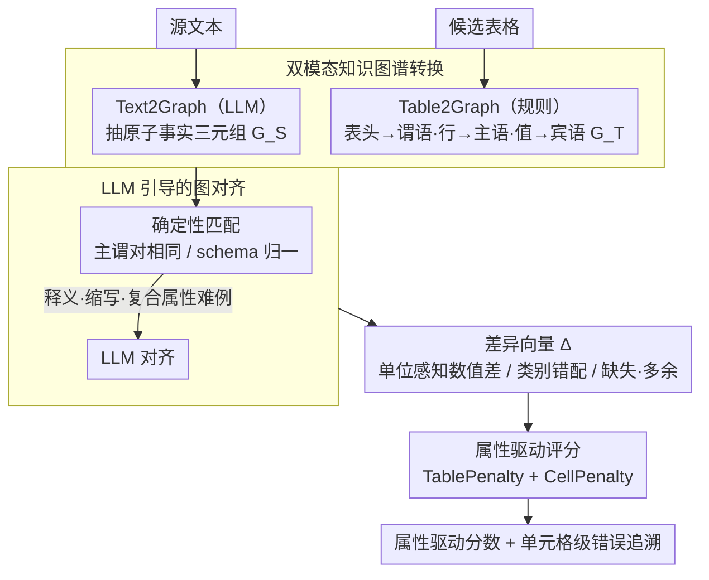

# TabReX: Tabular Referenceless eXplainable Evaluation

**会议**: ACL 2026  
**arXiv**: [2512.15907](https://arxiv.org/abs/2512.15907)  
**代码**: [GitHub](https://github.com/TabReX)  
**领域**: 可解释性  
**关键词**: 表格评估指标, 无参考评估, 知识图谱对齐, 可解释评估, 结构化生成

## 一句话总结

提出 TabReX，一种基于图推理的无参考表格生成评估框架，将源文本和生成表格转化为知识图谱三元组并对齐，计算可解释的属性驱动分数，在人类判断相关性上大幅超越现有方法；同时构建 TabReX-Bench 大规模基准。

## 研究背景与动机

**领域现状**：随着 LLM 越来越多地被用于生成或转换结构化输出（如将报告转为财务表格、合成患者数据），自动评估表格质量成为关键需求。现有评估指标主要有几类：n-gram 指标（BLEU、ROUGE）、嵌入指标（BERTScore、BLEURT）、token 级精确匹配（Exact Match、PARENT），以及基于 QA 的无参考指标（QuestEval）和最近的 LLM 评判指标（TabEval、TabXEval）。

**现有痛点**：(1) N-gram 和嵌入指标将表格展平为文本，完全忽略行列结构和单位语义；(2) Token 级方法无法区分无害的格式调整和真正的事实错误；(3) QA 指标过度惩罚布局变化（如行重排序）；(4) 大多数指标需要参考表格，限制了通用性；(5) 现有基准规模小、扰动类型单一，无法全面测试指标鲁棒性。

**核心矛盾**：表格评估需要同时考虑结构保真度和事实准确性，还要区分数据保持变换（如行重排、单位转换）和数据更改变换（如数值篡改、行列增删），但现有指标都无法在这两个维度上同时表现良好。

**本文目标**：设计一种无参考、属性驱动、可解释的表格评估框架，能够提供单元格级别的错误追溯和可调节的灵敏度-特异性 trade-off。

**切入角度**：将表格评估转化为图对齐问题——源文本和生成表格都可以表示为知识图谱三元组 [主语, 谓语, 宾语]，对齐这些三元组就可以精确定位匹配、缺失和多余的信息。

**核心 idea**：用 Text2Graph 和 Table2Graph 将两种模态统一到三元组空间，通过 LLM 引导的图对齐找到对应关系和差异，然后用属性驱动的评分函数计算可解释的分数。

## 方法详解

### 整体框架

TabReX 把"表格质量好不好"这个模糊问题改写成一道图对齐题：输入是源文本和待评候选表格，输出则是一个属性驱动的分数外加单元格级别的错误追溯。它先用 Text2Graph 和 Table2Graph 把两种模态分别压成知识图谱三元组，再让 LLM 引导两套三元组对齐、标出匹配与差异，最后由确定性评分函数把这些差异折算成结构惩罚与内容惩罚。整个管线无需参考表格，也无需训练，LLM 只在抽三元组和对齐两处出现。

### 关键设计

**1. 双模态知识图谱转换：把文本和表格压到同一个三元组空间**

n-gram、嵌入这些指标的通病是把表格展平成一串文本，行列结构和单位语义全丢了；TabReX 的第一刀就是不再比文本，而是比图。源文本一侧交给 LLM 按实体中心语法抽取原子事实三元组 $\mathcal{G}_S = \{(s_i, p_i, o_i)\}$，并强制统一粒度、规范化谓语、把数值连同单位一起编码；表格一侧则不动用 LLM，而是用轻量规则确定性地生成三元组——表头当谓语、行标识当主语、单元格值当宾语。一旦两种模态落到同一表示空间，模态差异带来的偏差自然消失，而表格端的纯规则路径还顺带保证了速度和可复现性。

**2. LLM 引导的图对齐：先确定性匹配，再让 LLM 收拾硬骨头**

对齐分两步走，目的是把"能机械对上的"和"需要语义理解的"分开处理。第一步是确定性匹配，凡是主语-谓语对完全相同、或经 schema 归一化后相同的三元组直接配对，又快又稳；第二步才请 LLM 出场，专门消化释义、缩写和复合属性这类难例（比如把 "GDP growth (YoY)" 对到 "growth_rate_2021"）。每配成一对，都附带一个差异向量 $\Delta$，记录单位感知的数值差、类别是否错配、以及缺失/多余标记——这些差异正是下一步评分的原料，也让分数天然带上可追溯性。

**3. 属性驱动评分：可解释、且灵敏度-特异性可调**

评分函数从对齐结果里读出两类惩罚：TablePenalty 衡量行/列级的缺失实体（MI）和多余实体（EI）的归一化比例，CellPenalty 衡量单元格级的缺失、多余以及部分匹配（用数值偏差 $\Gamma$ 刻画），最终分数为 $\mathcal{S}_{\text{TabReX}} = \text{TablePenalty} + \text{CellPenalty}$。真正的实用之处在权重参数 $(\alpha, \beta)$：调大 $\beta_{\text{MI}}$ 会让指标偏向灵敏度、奖励信息覆盖全面，调大 $\beta_{\text{EI}}$ 则偏向特异性、严惩幻觉。金融场景要的是精确、临床场景要的是召回，同一套框架靠这组权重就能切换语义，而不必换指标。

### 损失函数 / 训练策略

TabReX 无需训练，是纯推理时的评估框架：LLM 仅参与 Text2Graph 与图对齐两步，评分函数完全确定性，因而不引入任何可学习参数。

## 实验关键数据

### 主实验

与人类排名的相关性对比（Table 2）：

| 指标类别 | 方法 | Spearman ρ (↑) | Kendall τ (↑) | Tie ratio (↓) |
|---------|------|---------------|-------------|-------------|
| 非LLM (有参考) | EM | 45.88 | 39.38 | 58.40 |
| 非LLM (有参考) | BERTScore | 36.21 | 30.66 | 0.92 |
| LLM (有参考) | TabXEval | **80.27** | **72.37** | 45.33 |
| 无参考 | QuestEval | 62.93 | 52.29 | 3.03 |
| 无参考 | **TabReX** | **74.51** | **64.24** | **13.59** |

TabReX 在无参考条件下接近最强有参考方法 TabXEval 的相关性，且 tie ratio 大幅更低（13.6% vs 45.3%）。

### 消融实验

| 集成方法 | Spearman ρ | Kendall τ | 说明 |
|---------|-----------|----------|------|
| Lex-Emb (Mean) | 38.43 | 32.65 | 词法+嵌入集成 |
| LLM (Harmonic) | 56.00 | 46.93 | LLM指标集成 |
| Hybrid (Harmonic) | 54.03 | 42.71 | 混合集成 |
| **TabReX** | **74.51** | **64.24** | 单一方法 |

### 关键发现

- TabReX 单一指标超越所有集成方法，说明图对齐范式本身就比简单聚合更有效
- 从 easy 到 hard 扰动，TabReX 的灵敏度-特异性 trade-off 保持稳定（箭头移动小），而 EM、H-Score 等大幅退化
- TabXEval 虽然相关性最高但 tie ratio 达 45.3%，意味着近一半的不同变体被打相同分——判别精度不足
- TabReX-Bench（710 表 × 12 扰动 = 9120 实例，6 领域，3 难度级）是当前最大的表格评估基准

## 亮点与洞察

- **知识图谱三元组作为中间表示**的设计非常优雅——将模态对齐问题简化为图匹配问题，天然支持结构和语义的双重评估
- **可调 trade-off 的实用价值**突出——金融领域可以加大 $\beta_{\text{EI}}$ 严惩幻觉，临床领域可以加大 $\beta_{\text{MI}}$ 确保信息完整性
- **planner-driven 扰动生成**确保基准的多样性和可复现性——单次 LLM 调用生成 12 种扰动，比逐个生成更一致

## 局限与展望

- Text2Graph 依赖 LLM 提取三元组，对复杂嵌套表格或非标准格式可能不够健壮
- 评估成本取决于 LLM 调用次数，大规模使用时成本和延迟不可忽略
- 仅评估了 GPT-5-nano 作为 backbone，换用开源模型后的效果有待验证
- 对跨表格推理（需要联合多个表格的事实）尚未覆盖

## 相关工作与启发

- **vs TabXEval**: TabXEval 有参考且相关性最高，但 tie ratio 过高导致判别精度不足；TabReX 无参考且判别更细粒度
- **vs QuestEval**: 都是无参考方法，但 QuestEval 基于通用 QA 信号，对表格特有的结构变换（如行重排）过度惩罚；TabReX 的图对齐天然排除格式变化的影响
- **vs PARENT/BLEU**: 这些指标在结构化输出评估中几乎无效，TabReX 代表了评估范式的根本转变

## 评分

- 新颖性: ⭐⭐⭐⭐⭐ 图对齐的无参考表格评估范式是全新思路，属性驱动评分机制设计精巧
- 实验充分度: ⭐⭐⭐⭐⭐ TabReX-Bench 规模大且设计严谨，对比基线全面，人类评估充分
- 写作质量: ⭐⭐⭐⭐ 框架描述清晰，但公式较多需要仔细阅读
- 价值: ⭐⭐⭐⭐⭐ 对结构化生成评估领域有重要推动，框架设计通用可扩展

<!-- RELATED:START -->

## 相关论文

- [\[ICLR 2026\] Human-LLM Collaborative Feature Engineering for Tabular Learning](../../ICLR2026/llm_evaluation/human-llm_collaborative_feature_engineering_for_tabular_data.md)
- [\[NeurIPS 2025\] ConTextTab: A Semantics-Aware Tabular In-Context Learner](../../NeurIPS2025/llm_evaluation/contexttab_a_semantics-aware_tabular_in-context_learner.md)
- [\[ACL 2026\] VC-Inspector: Advancing Reference-free Evaluation of Video Captions with Factual Analysis](vc-inspector_advancing_reference-free_evaluation_of_video_captions_with_factual_.md)
- [\[ACL 2026\] Reward Modeling for Scientific Writing Evaluation](reward_modeling_for_scientific_writing_evaluation.md)
- [\[ACL 2026\] IF-RewardBench: Benchmarking Judge Models for Instruction-Following Evaluation](if-rewardbench_benchmarking_judge_models_for_instruction-following_evaluation.md)

<!-- RELATED:END -->
