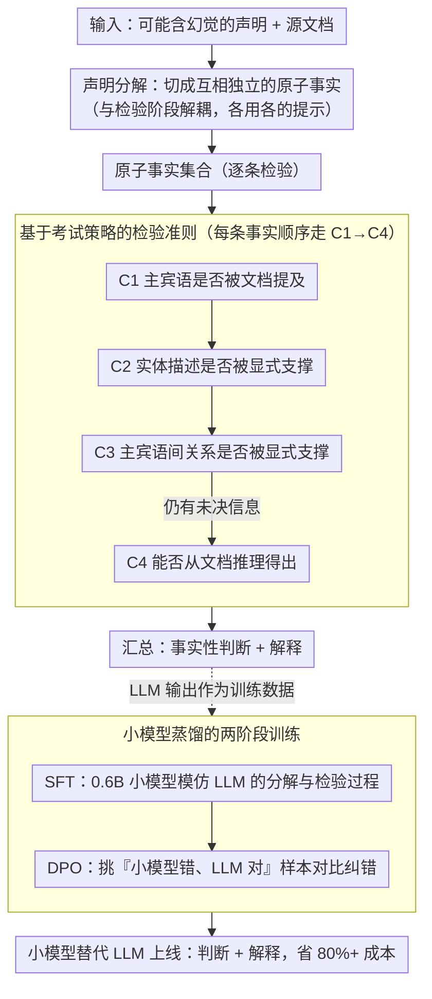

# Teaching Language Models to Check Grounded Claim Factuality with Human Test-Taking Strategies

**会议**: ACL2026  
**arXiv**: [2605.29712](https://arxiv.org/abs/2605.29712)  
**代码**: https://github.com/Haruhi07/Test-Taking  
**领域**: LLM 评估  
**关键词**: 事实核查、接地事实检验、LLM幻觉检测、读理解策略、小型语言模型蒸馏

## 一句话总结

将接地声明事实性检验重新表述为真/假阅读理解任务，通过融入人类考试答题策略设计结构化提示，使LLM能以最少的推理步骤高效准确地检验声明，同时通过监督微调与直接偏好优化训练小型语言模型替代大模型实现80%以上的推理成本节省。

## 研究背景与动机

**领域现状**：大语言模型（LLM）被广泛应用于摘要、问答等生成任务，但生成的内容经常包含"幻觉"现象——即生成的声明不受源文档支撑。这对检索增强生成（RAG）等应用的可信度造成致命威胁。现有事实性评估方法主要分为两类：一是基于文本蕴含（entailment）分类器的方法，虽然轻量高效，但需要针对具体数据集进行阈值调优，通用性差；二是直接提示LLM做判断的"LLM即评判者"范式，但缺乏对模型推理过程的显式指导，推理步骤冗长且成本高昂。

**现有痛点**：文本蕴含方法需要对文档进行截断或分块处理，易导致信息丢失；LLM直接判断时未能充分利用模型的推理能力——模型要么生成过长的自由推理、要么在没有结构指导下产生不一致的判断；跨数据集泛化能力弱。

**核心矛盾**：如何在不增加推理成本的前提下，让模型系统地、可解释地进行事实性检验？模型的复杂性与推理效率之间存在难以协调的tension——大模型虽然能力强但成本高，小模型推理快但理解能力有限。

**本文目标**：设计一个两阶段管道，将声明逐步分解为原子事实，然后针对每个事实进行系统检验；同时开发一套方法将LLM蒸馏为小模型，实现成本与性能的均衡。

**切入角度**：作者观察到人类在参加英语语言考试时处理真/假阅读理解题的方法具有系统性：先验证显式提及的信息，再推理隐含信息。这个考试策略对LLM做事实检验同样适用——可以将其转化为一组显式的检验准则，引导模型的推理过程。

**核心 idea**：将事实性检验问题重新定义为阅读理解任务，用一套基于考试策略的4个检验准则（C1-C4）替代自由形式的推理，使LLM能以结构化、可控的方式生成判断与解释，显著降低推理成本。

## 方法详解

### 整体框架

这套方法把"声明是否被源文档支撑"的检验拆成两个串联阶段：输入一条可能含幻觉的声明和对应源文档，先让 LLM 做"声明分解"，把复杂声明切成若干互相独立的原子事实；再对每个原子事实做"事实检验"，用一套基于人类考试策略的准则逐条核对证据，最后汇总成判断与解释输出。这么设计的关键洞察是——复杂声明往往把多个信息片段散落在文档不同位置，整体直接检验容易漏证或混淆，而先拆后查能让每一步都聚焦单一目标。在此之上，作者再用 SFT+DPO 把大模型的检验能力蒸馏进 0.6B 小模型，换取八成以上的推理成本节省。

### 关键设计

**1. 基于考试策略的检验准则：把模糊判断改写成一棵决策树**

"声明是否接地"本身太模糊，模型要么生成冗长自由推理、要么在没有结构指导下给出前后不一的判断。作者借鉴人类做真/假阅读理解题的套路——先找显式证据、再做推理——把它固化成 4 条按序执行的准则：C1 先看声明里的主宾语是否在文档中被提及，C2 再看这些实体的描述是否被显式支撑，C3 接着看主宾语之间的关系是否被显式支撑，C4 最后才判断尚未验证的信息能否从文档推理得出。四条准则首尾相接构成一棵决策树，模型不再盲目搜索，先用显式证据快速结案、把代价高的推理留到最后一步，准确率和计算量因此同时受益。

**2. 声明分解与原子事实检验的解耦：两个子任务各用各的提示**

把"拆"和"查"塞进同一次调用，并行度低且错误容易在两个目标间互相传染。本文索性让两阶段彻底解耦：第一步用少样本提示让 LLM 把"冰可以变成液态水，液态水可以变成水蒸气，反之亦然"这类声明拆成"冰可以变成水""水可以变成水蒸气""水蒸气可以变成冰"等原子事实；第二步再对每个原子事实套用 C1–C4 准则。好处有二——模型在分解时只管逻辑分割、在检验时只管证据查找，互不干扰；模块边界清晰后，后续还能分别用不同大小的模型替换这两个阶段，为蒸馏埋好接口。

**3. 小模型蒸馏的两阶段训练策略：先模仿，再从错误里改正**

小模型缺世界知识也缺推理力，硬蒸馏容易学个皮毛。作者用 SFT+DPO 两段式来补：第一阶段 SFT 让 0.6B 小模型模仿 LLM 生成的原子事实和检验过程，把基本步骤学下来；第二阶段 DPO 专挑"小模型错、LLM 对"的样本，把 LLM 输出当作选中完成、小模型的错误输出当作拒绝完成做对比学习。DPO 之所以比继续 SFT 更管用，在于它直接最大化正确与错误样本之间的概率边际 $\beta[s_\theta(x, y_c) - s_\theta(x, y_r)]$，而非笼统模仿所有输出——这恰好对应人类"先学步骤、再反复纠错"的学习过程，让小模型在推理成本骤降的同时逼近大模型的准确率。

### 一个完整示例

以声明"冰可以变成液态水，液态水可以变成水蒸气，反之亦然"为例：分解阶段先把它切成"冰可以变成水""水可以变成水蒸气""水蒸气可以变成冰"等原子事实；检验阶段对每条事实依次走 C1→C4——C1 确认"冰""水""水蒸气"是否都在文档出现，C2 核对它们的描述，C3 验证"变成"这层关系是否被显式支撑，若仍有未决信息（如"反之亦然"暗含的逆向相变）才进入 C4 做推理判定；逐条结果汇总后即得整条声明的事实性判断与解释。

### 损失函数与训练策略

SFT 目标（声明分解）：$L(\theta) = \mathbb{E}_{(c,\{f_{\text{ref}}\}) \sim D_{\text{De}}}[\log P_\theta(\{f_{\text{ref}}\} | c)]$，其中 $c$ 为声明，$\{f_{\text{ref}}\}$ 为 LLM 生成的参考事实集合。

SFT 目标（事实检验）：$L(\theta) = \mathbb{E}_{D_{\text{Re\_SFT}}}[\log P_\theta(r_{\text{ref}} | x)]$，其中 $x$ 包含源文档和原子事实，$r_{\text{ref}}$ 为 LLM 生成的参考解释。

DPO 目标（mistake revision）：$L(\theta) = -\mathbb{E}_{D_{\text{Re\_DPO}}}[\log \sigma[\beta(s_\theta(x, y_c) - s_\theta(x, y_r))]]$，其中 $y_c$ 为 LLM 的正确输出，$y_r$ 为小模型的错误输出，$s_\theta$ 为模型分配的对数概率，$\beta$ 为温度参数。

## 实验关键数据

### 主实验

在两个标准数据集上测试：**FacTax-Benchmark**（新闻和对话摘要事实检验）和**LLM-AggreFact**（多源类型、更多LLM生成声明）。评估指标为**平衡准确度**（BAcc），因为数据集中真假声明不均衡：$\text{BAcc} = \frac{1}{2}(\text{TP}/(\text{TP}+\text{FN}) + \text{TN}/(\text{TN}+\text{FP}))$。

| 方法 | 模型大小 | FacTax基准 | LLM-AggreFact | 平均排名 |
|------|---------|-----------|---------------|---------|
| ChatGPT-3.5 (ZS) | - | 70.1 | 70.1 | 13.8 |
| TrueTeacher | 11B | 73.0 | 73.3 | 8.4 |
| FactCG | 0.4B | 67.0 | 75.6 | 5.8 |
| MiniCheck-BeSpoke | 7B | 71.4 | 77.4 | 3.3 |
| Qwen3-4B-Instruct (本文) | 4B | 73.0 | 75.6 | 7.1 |
| Qwen3-30B-Instruct (本文) | 30B | **78.0** | 76.3 | **3.6** |
| Qwen3-0.6B+SFT (本文) | 0.6B | 68.9 | 71.3 | 12.1 |
| Qwen3-0.6B+SFT+DPO (本文) | 0.6B | 72.6 | 73.6 | 7.2 |

本文的 Qwen3-30B-Instruct 在 FacTax-Benchmark 上达到**新的最优**（78.0），在 LLM-AggreFact 上排名第二。重要的是，即使用 0.6B 小模型经过 SFT+DPO 训练后，也能接近 ChatGPT-3.5 水平，性能可媲美 TrueTeacher（11B）。

### 消融实验

| 配置 | FacTax | LLM-AggreFact | 说明 |
|------|--------|---------------|------|
| 完整模型 | 73.0 | 75.6 | 声明分解+检验策略 |
| 去掉分解 | 72.3 | 74.6 | 仅用检验准则，不分解声明 |
| 去掉检验策略 | 71.6 | 73.1 | 声明分解后直接检验（无C1-C4引导） |
| 去掉两者 | 69.4 | 72.1 | 直接提示检验原始声明 |

**关键发现**：(1) **声明分解贡献稳定**——去掉分解后准确率下降 0.7-1.0%，说明分解是必要的但不是主要贡献者；(2) **检验策略为主要贡献**——去掉策略后准确率下降 1.4-2.5%，说明用 C1-C4 准则引导推理才是这个方法的核心价值；(3) **令牌使用显著降低**——与"thinking"模式对比，本方法在 FacTax 上令牌用量仅为 10.4%-10.5%，在 LLM-AggreFact 上仅为 12.5%-17.7%，节省**超过 80%** 的推理成本。(4) **小模型训练充分**——通过分别对两个数据集进行 leave-one-out 测试，发现去掉来自某数据集的训练数据后性能大幅下降（如去掉 LLM-AggreFact 训练数据后在 LLM-AggreFact 测试上从 71.3% 掉到 62.1%），说明小模型泛化能力有限，需要充分的多源数据。

## 亮点与洞察

- **考试策略的巧妙迁移**：用人类参加语言测试时的"先找显式证据再做推理"这一通用策略来指导机器学习任务，体现了跨领域知识迁移的价值。这个策略本身简洁高效，避免了动辄生成长链推理的低效做法，令牌节省 80% 以上是实实在在的收益。
- **解耦设计的实用意义**：将复杂任务分解为两个独立模块（声明分解与事实检验），既便于模块级优化，也为后续用不同大小的模型组合打开了空间。这种模块化思想值得在其他多步骤推理任务中借鉴。
- **蒸馏策略的创新应用**：结合 SFT 和 DPO，让小模型先学标准答案再从错误中改正，比单纯 SFT 效果更好。这个两阶段训练框架模拟了有监督学习与强化学习的优点结合，对于资源受限场景有重要参考价值。
- **跨数据集鲁棒性**：方法在两个差异较大的数据集上都取得了有竞争力的结果（FacTax 排名 3.6，LLM-AggreFact 排名 4），说明设计的通用性强。

## 局限性与展望

- **小模型泛化能力有限**：实验表明小模型需要充分的多源训练数据才能泛化到新数据集，这限制了其在低资源场景的适用性。未来可探索元学习或少样本适应的方向。
- **复杂文档上表现不稳定**：在 LFQA（长篇论文 QA）和 TOFUEVAL-MediaS（大型多媒体数据集）等包含复杂、长文档的数据集上，连 LLM 教师模型也表现下降，说明当前方法对长文档的理解能力仍有瓶颈。考虑采用检索增强或信息压缩的方向。
- **严格性与推理的 trade-off**：消融实验表明，模型在应用 C3 和 C4 准则时有时过度严格，将措辞轻微差异也视为不匹配（案例分析中模型因"vice versa"的歧义性误判）。未来可考虑动态调整准则严格性，或融入上下文感知的相似度度量。
- **推理链长度的影响**：虽然令牌用量降低，但仍未探索更激进的压缩空间——比如能否用一步到位的关键词提取替代逐准则检验。

## 相关工作与启发

- **vs 文本蕴含方法**（Zha et al., 2023; Laban et al., 2022）：蕴含分类器轻量但需阈值调优且易受文档长度限制；本文避免了阈值问题，直接输出二元判断，并通过准则引导提高了准确率。
- **vs LLM 直接判断**（Luo et al., 2023; Xu et al., 2024）：之前工作让模型自由推理或仅提供错误类型定义；本文的创新在于用一套**系统化的检验流程**替代自由形式推理，既提高了准确率又大幅降低了成本。
- **vs QA-based 方法**（Fabbri et al., 2022; Wang et al., 2020）：QA 方法需复杂的多步骤管道；本文简化为声明分解+准则检验两步，更易实现且可复用。
- **vs 知识蒸馏用于推理**（QwenTeam, 2025; DeepSeek-AI, 2025）：前人已证明蒸馏可提升小模型在数学、推理上的能力；本文的贡献是将蒸馏+DPO 组合应用于**事实检验领域**的首次尝试，展示了小模型在检查领域的潜力。

## 评分

- **新颖性**: ⭐⭐⭐⭐ 将考试策略引入事实检验、通过显式准则引导模型推理的思路虽然直观，但在正式学术工作中的系统化应用仍是创新之处；SFT+DPO 的组合在这个任务上也是相对新颖的应用。
- **实验充分度**: ⭐⭐⭐⭐⭐ 在两个标准数据集上充分对标多个基线，且进行了多层次的消融（去掉分解、去掉准则、精细化对 C1-C4 的逐个分析）、超参敏感性测试、提示改写鲁棒性验证，数据质量有保障。
- **写作质量**: ⭐⭐⭐⭐ 逻辑清晰、案例生动（冰→水蒸气推理例子），图表设计直观。唯独略显冗长，某些消融实验可精简。
- **价值**: ⭐⭐⭐⭐⭐ 解决了 RAG 中的实际问题（幻觉检测），提供了可即插即用的无需训练的 LLM 评估方法，同时为低成本部署指出了方向。这对工业应用和学术研究都有重要参考价值。

<!-- RELATED:START -->

## 相关论文

- [\[ACL 2026\] Teaching Language Models to Forecast Research Success Through Comparative Idea Evaluation](teaching_language_models_to_forecast_research_success_through_comparative_idea_e.md)
- [\[ACL 2026\] Revisiting the Reliability of Language Models in Instruction-Following](revisiting_the_reliability_of_language_models_in_instruction-following.md)
- [\[ACL 2026\] NovBench: Evaluating Large Language Models on Academic Paper Novelty Assessment](novbench_evaluating_large_language_models_on_academic_paper_novelty_assessment.md)
- [\[ACL 2026\] Revisiting a Pain in the Neck: A Semantic Reasoning Benchmark for Language Models](revisiting_a_pain_in_the_neck_a_semantic_reasoning_benchmark_for_language_models.md)
- [\[ACL 2026\] Zero-shot Large Language Models for Automatic Readability Assessment](zero-shot_large_language_models_for_automatic_readability_assessment.md)

<!-- RELATED:END -->
