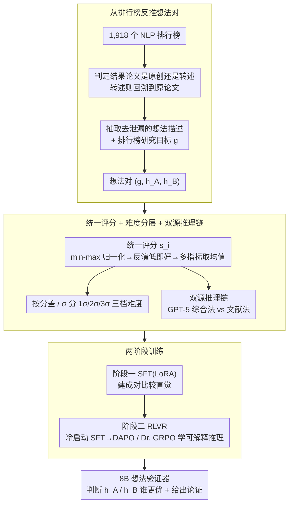

# Teaching Language Models to Forecast Research Success Through Comparative Idea Evaluation

**会议**: ACL 2026 Findings  
**arXiv**: [2605.21491](https://arxiv.org/abs/2605.21491)  
**代码**: 待发布  
**领域**: LLM 评估 / LLM 推理  
**关键词**: 比较预测, LLM 评估, 研究想法排序, 强化学习推理

## 一句话总结

本文研究语言模型能否学会预测研究想法的经验成功，通过构建含 11,488 个想法对的数据集（基于 PapersWithCode 客观成果），用 SFT 和 RLVR 训练 8B 模型达到 77.1% 准确率，超过 GPT-5 的 61.1%，成为自动科研发现中的有效想法验证器。

## 研究背景与动机

**领域现状**：近年来，LLM 开始充当自主科研智能体，能够自动生成假说、实现实验和分析结果。一个典型模式是"高通量想法生成"：给定研究目标，模型可生成数百个候选方法。然而当前的想法评估完全依赖 LLM 的主观判断（新颖性、激动度、可行性等），这些指标往往只是代理——一个想法可能新颖有趣，但在实践中根本跑不通。

**现有痛点**：(1) 评估缺乏客观性：现有系统用 LLM 打分时基于虚构标准，不是真实实验结果；(2) 评估效率瓶颈：数百个想法无法逐个实验验证；(3) 缺乏可解释性：黑盒评分无法告诉研究者为什么某想法更好。

**核心矛盾**：如何在不运行实验的情况下，用客观的经验结果来预测哪个想法会表现更好？

**本文目标**：探索 LM 是否能学会预测研究想法的经验成功，并用可解释的推理链支撑预测。

**切入角度**：将问题框架为"比较经验预测"——给定研究目标和两个想法，预测哪个在基准上会更好。关键观察是：虽然精确预测很难，但研究人员日常就是通过对比已有工作来形成直觉的，LM 能否学到这种直觉？

**核心 idea**：从 PapersWithCode 基准排行榜中提取基于客观结果的想法对数据集，用 SFT 和 RL（配合可验证奖励）训练小 LM 做比较评估和推理，实现比 GPT-5 更好的性能。

## 方法详解

### 整体框架

本文把"预测想法能否成功"重新框定为一个可验证的比较任务：输入是研究目标 $g$ 加上两个去标识化的想法描述 $h_A, h_B$，输出是哪一个会在基准上取得更好的客观成绩。要让这个任务可学习，作者先从 PapersWithCode 的排行榜里挖出大量"已经分出胜负"的想法对，配上由真实实验结果推导的统一胜负标签和难度等级，再用这批数据走"SFT 建直觉 + RLVR 学推理"的两阶段训练，最终把一个 8B 模型调成既能下判断、又能给出可解释论证的想法验证器。

### 关键设计

**1. 从排行榜反推想法对：让标签来自真实实验而非主观打分。** 

想法评估之所以不可靠，根源在于训练信号本身是虚构的——以往都用 LLM 按"新颖度/可行性"主观打分。本文转而从 1,918 个 NLP 排行榜里抓取客观成果：每条排行榜记录指向一篇报告结果的论文（RR paper），先用 LLM 判断它是方法的原创者还是单纯的转述者，若是后者就回溯到真正提出方法的原论文，再从原论文中抽取出只含算法与数学细节、剔除结果/作者/年份等泄漏信息的想法描述，并从排行榜官方说明中提取研究目标（如"检测网络威胁"）。逐想法的人工校验显示描述 92% 准确（4% 不完整、8% 完全错误），保证了训练对的可信度。

**2. 统一评分 + 难度分层 + 双源推理链：把异质基准对齐成可比的监督信号。** 

跨基准的指标天然不可比——有的越高越好、有的（如困惑度）越低越好，量纲也各异。作者对同一基准内的所有指标做 min-max 归一化并反演"低即好"项，多指标取均值得到统一评分 $s_i$，再按两个想法分差相对标准差 $\sigma$ 的大小切成 1σ（难）、2σ（中）、3σ（易）三档，便于后续按难度拆解模型能力。为了让模型学会"怎么论证"而不仅是"选哪个"，准备了两类相反来源的推理链：综合法用 GPT-5 在 2,125 对上生成结构化推理痕迹、筛出判断正确的 1,369 对、位置交换后扩到 2,738 例；文献法则直接从"同一论文内对比多个方法"的原文实验讨论里抽取现成论证。两类数据相互对照，可用来检验 RL 习得的推理能力究竟来自哪种来源。

**3. SFT 建直觉、RLVR 学可解释推理的两阶段训练。** 

直接让小模型自由生成推理反而会掉点，因此训练拆成两步走。第一步标准 SFT 在 8B 模型上用 LoRA（rank=64, lr=2e-4）做全量微调，优化分类损失 $\mathcal{L}_{SFT}=-\log P(y\mid g,h_A,h_B)$，先把比较直觉打牢。第二步先用 170 个有标签对做冷启动 SFT 教会科学论证的文体，再用 DAPO 与 Dr. GRPO 跑 RLVR，奖励由正确性（对 +3、错 −3）和格式（思考标记、答案标记各 +0.5）组成；约束论证风格加上格式奖励抑制了奖励黑客，而 Dr. GRPO 修正了 GRPO 标准差项带来的长度偏差。这套组合让小模型既保留了成对比较的判断力，又能输出连贯可读的解释。

## 实验关键数据

### 主实验：基础性能

| 模型 | 1-σ | 2-σ | 3-σ | 总体 | 跨域测试 |
|------|-----|-----|-----|------|---------|
| Qwen3 基础 | 18.4% | 26.1% | 11.0% | 20.1% | 3.6% |
| Direct-SFT | 70.9% | 85.6% | 84.6% | **77.1%** | 45.7% |
| Reason-SFT-DrGRPO | 66.2% | 76.4% | 83.5% | 71.4% | 49.1% |
| GPT-5（高推理） | 61.9% | 61.3% | 56.0% | 61.1% | 46.0% |

**关键发现**：(1) SFT 戏剧性提升 8B 模型性能从 20% 到 77%，超过 GPT-5 的 61.1%；(2) 难度分层有效，1σ < 2σ < 3σ；(3) RL 虽精度略低但跨域泛化更好。

### 独立测试集与鲁棒性

| 模型 | 准确率 |
|------|--------|
| Qwen3 Direct-SFT | 63.4% |
| Qwen3 Reason-SFT-DrGRPO | **67.5%** |
| GPT-4.1 + 检索 | 51.4% |

**关键发现**：

- 8B 模型在独立数据集上胜过 GPT-4.1 16 个百分点，证明学到的是可迁移的比较推理能力。
- 位置偏差一致性超 85%，不依赖输入顺序。
- 无长度偏差，不倾向于选长描述。
- 用 Gemini-2.5 改写后准确率无显著下降，说明模型理解内容。

## 亮点与洞察

- **小模型胜大模型的范例**：8B SFT 后胜 GPT-5 达 16 个百分点，展示了特定任务微调的威力。
- **RL 推理链的巧妙设计**：不直接用自生推理（会降性能），而是用有标签冷启动后再 RL 探索。两阶段策略避免奖励黑客并生成连贯解释。
- **统一评分解决异质性**：min-max 归一化 + 方向检查 + 平均值，优雅地处理不同基准的多指标问题。

## 局限与展望

**作者承认的局限**：

- 数据可能继承 PapersWithCode 噪声。
- 没有充分验证这个方案在实际想法筛选工作流中的效果。
- 数据集仅限 NLP，扩展到其他领域需要额外工作。

**补充观察**：合成推理链效果不如文献推理链；Dr. GRPO 比 DAPO 更稳定地生成连贯解释。

## 相关工作与启发

- **vs 绝对评分**（Baek et al. 2025）：相对比较比绝对打分更客观且对应实验成功。
- **vs 前序比较工作**（Wen et al. 2025）：本文更细粒度、小模型胜大模型、推理可解释。
- **vs LLM 事件预测**（Halawi et al. 2024）：将事件预测应用到科研想法对比，更专业化。

## 评分

- 新颖性: ⭐⭐⭐⭐ 比较框架新颖，想法数据集特色显著，但增量有限。
- 实验充分度: ⭐⭐⭐⭐⭐ 多测试集、详细消融、鲁棒性压力测试完整。
- 写作质量: ⭐⭐⭐⭐ 论文清晰深入，技术细节放在附录是小缺憾。
- 价值: ⭐⭐⭐⭐⭐ 直接支持自主科研系统的想法筛选，小模型高效方案对应用有吸引力。

<!-- RELATED:START -->

## 相关论文

- [\[ACL 2026\] Teaching Language Models to Check Grounded Claim Factuality with Human Test-Taking Strategies](teaching_language_models_to_check_grounded_claim_factuality_with_human_test-taki.md)
- [\[ACL 2026\] Aggregate vs. Personalized Judges in Business Idea Evaluation: Evidence from Expert Disagreement](aggregate_vs_personalized_judges_in_business_idea_evaluation_evidence_from_exper.md)
- [\[ACL 2026\] Enhancing Linguistic Competence of Language Models through Pre-training with Language Learning Tasks](enhancing_linguistic_competence_of_language_models_through_pre-training_with_lan.md)
- [\[ACL 2025\] AbGen: Evaluating Large Language Models in Ablation Study Design and Evaluation for Scientific Research](../../ACL2025/llm_evaluation/abgen_evaluating_large_language_models_in.md)
- [\[ACL 2026\] Language Models Don't Know What You Want: Evaluating Personalization in Deep Research Needs Real Users](language_models_dont_know_what_you_want_evaluating_personalization_in_deep_resea.md)

<!-- RELATED:END -->
