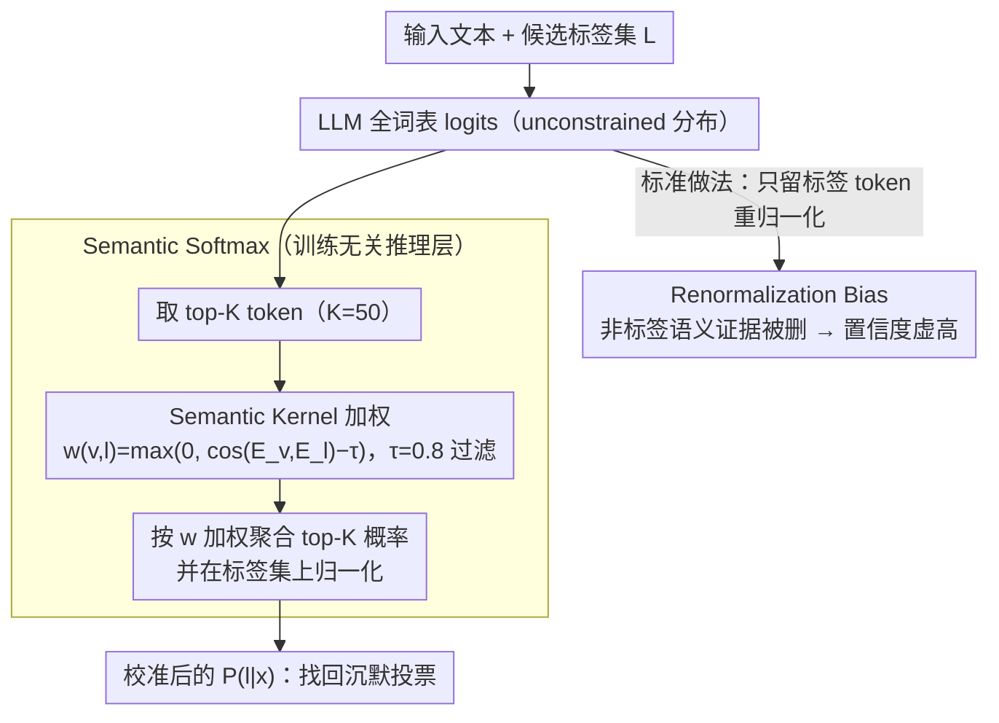

# The Silent Vote: Improving Zero-Shot LLM Reliability by Aggregating Semantic Neighborhoods

**会议**: ACL 2026  
**arXiv**: [2605.09739](https://arxiv.org/abs/2605.09739)  
**代码**: 无  
**领域**: LLM 评估 / 校准 / 零样本分类  
**关键词**: 语义软最大、校准误差、约束解码、语义邻居、不确定性估计  

## 一句话总结
这篇论文指出零样本 LLM 分类中的 constrained softmax 会丢掉标签同义词附近的概率质量，提出无需训练的 Semantic Softmax，把 top-K 词表 token 的“沉默投票”聚合回目标标签，从而显著降低 ECE 和 Brier Score 并提升 AUROC/F1。

## 研究背景与动机
**领域现状**：LLM-as-a-classifier 已经成为很多文本分类任务的常用范式。实际部署时，为了让模型只输出合法类别，系统通常会把词表限制在几个标签 token 上，然后只在这些 token 之间做 softmax。

**现有痛点**：这种 constrained decoding 虽然保证格式正确，却会扭曲概率。模型可能认为一个输入更接近 “thrilling”“delightful” 或 “toxic-ish” 这样的相关词，但这些词不在候选标签集合中，softmax 前被直接 mask 掉。

**核心矛盾**：分类标签是离散的，但 LLM 的语义证据分布在词表的连续语义邻域里。把所有非标签 token 都视为无关，会让剩下的标签概率被重新归一化到过高置信度，形成作者称为 Renormalization Bias 的系统误差。

**本文目标**：作者希望在不微调模型、不改模型结构的情况下，让零样本分类概率更接近模型真实的不确定性，尤其是在情绪和毒性这类天然存在标注分歧的任务上。

**切入角度**：论文观察到模型输出 embedding 空间已经包含“标签 token 与相近语义 token 的关系”。如果能把这些相近 token 的概率质量按语义权重汇总给目标标签，就可以恢复被 constrained softmax 丢掉的 Silent Vote。

**核心 idea**：不要只看标签 token 自己的 logit，而是看整个 top-K 词表候选中哪些 token 语义上支持该标签，再把这些 token 的概率按 embedding 相似度加权聚合。

## 方法详解
论文的方法非常轻量，核心是把传统 constrained softmax 替换为一个 inference-time aggregation layer。它不需要重新训练模型，也不需要外部同义词词典，而是直接使用模型自身的输出 embedding 来定义 token 与标签之间的语义相似度。

### 整体框架
给定输入文本和候选标签集合 $\mathcal{L}=\{l_1,l_2,\ldots,l_n\}$，标准做法会拿到模型对整个词表 $\mathcal{V}$ 的 logit 向量 $z$，然后只保留标签 token，并计算 $P(l_j \mid x)=\exp(z_{l_j}) / \sum_{l'\in\mathcal{L}}\exp(z_{l'})$。这个概率看似规范，实际上已经把所有非标签 token 的质量删掉了。

Semantic Softmax 的流程分三步。第一步，不在全词表上盲目聚合，而是从 unconstrained distribution 中取概率最高的 top-K token，主实验使用 $K=50$。第二步，用模型输出 embedding $E$ 计算每个 top-K token $v$ 与标签 token $l$ 的相似度，并用阈值 $\tau=0.8$ 过滤噪声：$w(v,l)=\max(0, \cos(E_v,E_l)-\tau)$。第三步，把 top-K token 概率按 $w(v,l)$ 加权累加，再在标签集合上归一化。

这个设计的效果是：如果模型把概率分散给多个与“joy”接近的词，Semantic Softmax 会把这些词的票重新汇总到 joy；如果模型在多个语义邻域之间摇摆，最终分布也会更柔和，从而更像人类标注者的分歧。

### 关键设计

**1. Renormalization Bias 形式化：点明 constrained softmax 为何会系统性过度自信**

很多人以为校准差是因为模型「不知道答案」，但作者指出问题常出在推理层：标准做法只在标签集合 $\mathcal{L}$ 内重新归一化，所有 $v\notin\mathcal{L}$ 的 token 不管语义多接近标签都被直接删掉。于是一个原本只弱支持某类的标签，只要其它候选更弱，也会被归一化抬到接近 1 的置信度——格式约束被误当成了概率估计。作者把这种由 mask + 重归一化制造的系统误差形式化为 Renormalization Bias，等于为后面「找回被删概率」立了一个明确的靶子。

**2. Semantic Kernel 聚合：把标签 token 周围语义邻居的概率质量纳入分类分数**

既然被删掉的 token 里藏着模型真实的语义证据，那就该按语义把这些票收回来。对每个 top-K token $v$ 和标签 $l$，作者用模型输出 embedding 的余弦相似度定义权重，并减去阈值 $\tau$ 作为 noise filter：$w(v,l)=\max(0,\cos(E_v,E_l)-\tau)$；最终 $P_{sem}(l\mid x)$ 是所有 top-K token 概率 $P(v)$ 与权重 $w(v,l)$ 的加权和，再在标签集合上归一化。用模型自身 embedding 的好处是部署简单、不依赖人工同义词表，能随底座模型的语义空间自动适配；而阈值过滤挡住那些「泛化相关但并不真正支持该标签」的 token，避免噪声邻居把分布带偏。

**3. 训练无关的校准层：让方法能直接插进现有 LLM 分类服务**

企业部署最怕高风险改动，而 Semantic Softmax 只发生在下一 token 分布算出来之后，不改 prompt、不更新参数、不需要任务训练集，更不需要 labeled calibration set。作者在 Qwen-3-1.7B 和 Phi-4-mini 上用完全相同的逻辑跑通，说明它不是某个模型的特定 trick。相比温度缩放或重新微调，这种纯 inference-time 的可插拔层在没有校准集的零样本场景里更容易落地，也更贴合实际线上服务的诉求。

### 损失函数 / 训练策略
本文没有训练损失。所有操作都在推理时完成，关键超参是 top-K token 数量 $K$ 和语义阈值 $\tau$。主实验采用 $K=50$、$\tau=0.8$；附录表明在较大 $K$ 范围内结果对 $K$ 不敏感，但对 $\tau$ 较敏感，过低会引入噪声邻居，过高会错过有用同义词票。

## 实验关键数据

### 主实验
实验覆盖两个模型和两个数据集：GoEmotions 用来测试细粒度情绪标签的语义邻域恢复，Civil Comments ambiguous subset 用来测试对人类毒性均值和标注分歧的校准。指标包括 ECE、Brier Score、AUROC 和 Macro-F1。

| 模型 | 数据集 | 方法 | ECE ↓ | Brier ↓ | AUROC ↑ | F1 ↑ |
|------|--------|------|-------|---------|---------|------|
| Qwen-3-1.7B | GoEmotions | Standard | 0.574 | 0.842 | 0.712 | 0.229 |
| Qwen-3-1.7B | GoEmotions | Semantic Softmax | 0.069 | 0.591 | 0.763 | 0.267 |
| Qwen-3-1.7B | Civil Comments | Standard | 0.482 | 0.571 | 0.784 | 0.412 |
| Qwen-3-1.7B | Civil Comments | Semantic Softmax | 0.108 | 0.517 | 0.882 | 0.451 |
| Phi-4-mini | GoEmotions | Standard | 0.421 | 0.795 | 0.744 | 0.236 |
| Phi-4-mini | GoEmotions | Semantic Softmax | 0.065 | 0.588 | 0.756 | 0.253 |
| Phi-4-mini | Civil Comments | Standard | 0.395 | 0.542 | 0.812 | 0.421 |
| Phi-4-mini | Civil Comments | Semantic Softmax | 0.092 | 0.498 | 0.835 | 0.451 |

### 消融实验
附录给出了 $K$ 与 $\tau$ 的敏感性分析。下面摘取能体现规律的结果：当 $\tau=0.8$ 时，ECE 基本最低；继续提高到 0.85 以上会显著恶化 ECE，说明过严的相似度过滤会丢掉有用语义邻居。

| K | τ=0.75 ECE ↓ | τ=0.80 ECE ↓ | τ=0.85 ECE ↓ | τ=0.80 F1 ↑ | 结论 |
|---|--------------|--------------|--------------|------------|------|
| 50 | 0.1497 | 0.1145 | 0.1840 | 0.4325 | 主实验附近的阈值最稳 |
| 100 | 0.1514 | 0.1145 | 0.1923 | 0.4308 | 增大 K 不会明显改善 ECE |
| 300 | 0.1491 | 0.1144 | 0.1987 | 0.4308 | $\tau=0.8$ 仍保持最低 ECE |
| 600 | 0.1498 | 0.1130 | 0.1986 | 0.4308 | 最低 ECE 出现在中等阈值 |
| 1000 | 0.1499 | 0.1162 | 0.1993 | 0.4317 | top-K 很大时也没有失控 |

### 关键发现
- Semantic Softmax 对 ECE 的改善远大于对 F1 的改善，说明它最主要解决的是概率可靠性，而不是单纯分类边界。
- 方法没有牺牲判别能力。四个模型-数据集组合中 AUROC 和 Macro-F1 都同步上升，说明恢复语义邻居票也带来了额外分类信号。
- Civil Comments 的定性例子显示，标准 constrained decoding 在模糊文本上常给出 0.9 以上极端分数，而 Semantic Softmax 更接近人类 toxicity mean。
- $\tau$ 是关键超参。过低会让弱相关 token 混入，过高会退化成近似只看标签 token；$\tau=0.8$ 在论文实验中是较好的平衡点。

## 亮点与洞察
- “Silent Vote”这个命名抓住了 LLM 分类中一个很具体但容易被忽视的问题：模型不是没有表达不确定性，而是我们把它的词表级表达删掉了。
- 方法巧妙地复用了输出 embedding，而不是引入外部词典或同义词资源。这让 Semantic Softmax 能随着底座模型的语义空间自动适配。
- 论文把校准和 discriminative performance 同时报告是正确的。很多校准方法会让分布变软但损害准确性，而这里通过找回真实语义质量反而提升了 AUROC/F1。
- 这个思路可以迁移到多标签分类、情绪强度估计和安全审核，只要任务标签能映射到词表 token 或 label verbalizer，就能尝试邻域投票。

## 局限与展望
- 当前方法主要面向“从预定义标签中选一个”的 LLM-as-classifier 场景，不适合直接用于长文本生成，因为每步 top-K 检索和相似度计算会累积延迟。
- 实验只覆盖 Qwen-3-1.7B 和 Phi-4-mini 这类小/中型模型，还需要验证在更大模型、闭源 API 和 instruction-tuned 模型上的 scaling behavior。
- 方法假设输出 embedding 空间中语义相近 token 的几何邻近可靠。如果模型 embedding 各向异性强或同义词聚类差，邻居聚合可能引入噪声。
- 实验集中在英文 GoEmotions 与 Civil Comments。多语言场景中，同义词可能跨语言、跨 tokenization 片段分布，Semantic Kernel 可能需要语言感知设计。

## 相关工作与启发
- **vs constrained decoding**: 传统 constrained decoding 关注格式合法性，本文指出格式约束不等于概率校准，mask 后的 softmax 会系统性制造 overconfidence。
- **vs temperature scaling**: 温度缩放需要校准集且只是全局拉平分布，Semantic Softmax 则利用样本级语义邻域，把被丢掉的概率质量按标签语义重新分配。
- **vs verbalizer-based prompting**: prompt/verbalizer 方法通常纠结标签词选哪个，本文提供了另一种思路：即使标签词不完美，也可以聚合其语义邻域来降低单 token 选择的脆弱性。
- **对后续研究的启发**: 做 LLM 零样本分类时，应该同时报告 constrained softmax 和 full-vocabulary semantic aggregation 的校准指标，尤其是在高风险审核、情绪识别和医学分诊场景。

## 评分
- 新颖性: ⭐⭐⭐⭐☆ 问题切得很准，Semantic Softmax 简单但有效，核心创新在于把词表语义邻域用于校准。
- 实验充分度: ⭐⭐⭐⭐☆ 两个模型、两个数据集、校准与判别指标、定性案例和超参敏感性都覆盖到，但大模型和多语言还缺验证。
- 写作质量: ⭐⭐⭐⭐☆ 论证线清楚，Renormalization Bias 与 Silent Vote 的概念解释直观，公式也足够轻量。
- 价值: ⭐⭐⭐⭐☆ 对零样本分类服务很实用，尤其适合需要可靠置信度而不是只要 hard label 的部署场景。

<!-- RELATED:START -->

## 相关论文

- [\[ACL 2026\] HumanLLM: Benchmarking and Improving LLM Anthropomorphism via Human Cognitive Patterns](humanllm_benchmarking_and_improving_llm_anthropomorphism_via_human_cognitive_pat.md)
- [\[ACL 2026\] Zero-shot Large Language Models for Automatic Readability Assessment](zero-shot_large_language_models_for_automatic_readability_assessment.md)
- [\[ACL 2025\] Language Complexity Measurement as a Noisy Zero-Shot Proxy for Evaluating LLM Performance](../../ACL2025/llm_evaluation/language_complexity_measurement_as_a_noisy_zero-shot_proxy_for_evaluating_llm_pe.md)
- [\[ACL 2026\] Revisiting the Reliability of Language Models in Instruction-Following](revisiting_the_reliability_of_language_models_in_instruction-following.md)
- [\[ICCV 2025\] A Conditional Probability Framework for Compositional Zero-shot Learning](../../ICCV2025/llm_evaluation/a_conditional_probability_framework_for_compositional_zerosh.md)

<!-- RELATED:END -->
