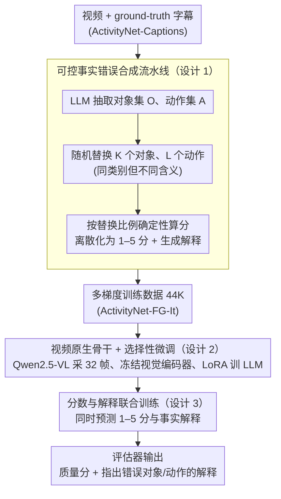

# VC-Inspector: Advancing Reference-free Evaluation of Video Captions with Factual Analysis

**会议**: ACL 2026  
**arXiv**: [2509.16538](https://arxiv.org/abs/2509.16538)  
**代码**: [https://dipta007.github.io/VC-Inspector](https://dipta007.github.io/VC-Inspector)  
**领域**: 视频理解 / 字幕评估  
**关键词**: 视频字幕评估, 无参考评估, 事实准确性, 大型多模态模型, 幻觉检测

## 一句话总结

本文提出 VC-Inspector，一个基于开源轻量级多模态模型（Qwen2.5-VL 3B/7B）的无参考视频字幕评估指标，通过可控事实错误合成流水线生成训练数据，在 VATEX-Eval 上达到 $\tau_b$=42.58 的人类判断相关性，超越依赖 GPT-4o 的 G-VEval（$\tau_b$=39.40），且在幻觉检测基准上达到 99.6% 准确率。

## 研究背景与动机

**领域现状**：视频字幕评估主要依赖参考字幕的文本匹配指标（BLEU、ROUGE、CIDEr），但这些指标代价高昂、难以捕捉语义等价性。无参考评估是更实用的方向，但发展滞后。

**现有痛点**：(1) 基于预训练视觉-语言嵌入的无参考指标（如 EMScore、CLIPScore）受限于文本编码器上下文长度，且缺乏一致的评分尺度——同一视频不同字幕的分数差异很小，难以区分质量；(2) 使用 GPT-4o 等大型专有模型（如 G-VEval）评分的方法依赖 prompt 工程且不可复现；(3) 大多数现有方法以图像为中心，无法建模视频的时序动态。

**核心矛盾**：可靠的字幕评估应以事实准确性为核心——对象和动作的错误应按严重程度线性降低分数，但现有指标连基本的事实不一致（如错误对象）都检测不到。

**本文目标**：构建一个基于事实准确性的、可解释的、开源轻量级的视频字幕无参考评估指标。

**切入角度**：观察到训练事实感知评估器的主要瓶颈是缺乏不同事实质量等级的标注字幕——现有字幕要么正确要么错误，没有中间梯度。作者设计了一个基于 LLM 的可控事实错误合成流水线来解决这一数据瓶颈。

**核心 idea**：用 LLM 系统化替换 ground truth 字幕中的对象和动作来生成不同错误程度的伪字幕，配以确定性评分和解释性标注，用于微调轻量级多模态模型作为评估器。

## 方法详解

### 整体框架

VC-Inspector 想做的是一个无参考、以事实准确性为核心的视频字幕评估器，输入一段视频和一句候选字幕，输出 1–5 分的质量分以及指出哪些对象/动作有误的文本解释。它绕开了"缺乏多梯度事实质量标注"这一最大瓶颈：先从 ActivityNet-Captions 的 ground-truth 字幕出发，用 LLM 可控地替换其中的对象和动作来批量合成不同错误程度的伪字幕，并按替换比例确定性地算出分数与解释；再把这批数据喂给 Qwen2.5-VL（3B/7B）做 LoRA 微调，冻结视觉编码器只训 LLM 部分，让评估器学会"看视频、对事实、给分数加理由"。

### 关键设计

**1. 可控事实错误合成流水线：用确定性扰动造出多梯度质量数据。** 

训练事实感知评估器的真正障碍不是模型而是数据——现有字幕非对即错，缺少中间档次，模型学不到"错得多严重"的尺度。本文给定 ground-truth 字幕 $X$，先用 LLM 抽出对象集 $\mathcal{O}$ 与动作集 $\mathcal{A}$，再随机采样 $K \sim \text{Unif}(0,M)$ 个对象和 $L \sim \text{Unif}(0,N)$ 个动作做替换，且要求替换成同类别但不同含义的词（如 car→truck 而非 car→building），保证扰动现实可信。分数不交给模型主观判断，而是按替换比例确定性计算 $score = 1 - |\mathcal{R}|/(|\mathcal{O}|+|\mathcal{A}|)$ 再离散化为 1–5 分，从而避开了 LLM 比较浮点数时的不可靠性。每条 ground truth 生成 10 个伪字幕、均衡采样后得到 44K 实例（ActivityNet-FG-It）。相比 PAC-S/FactVC 只造二元正负样本，这种多梯度数据让评估器能分辨更细的质量差异。

**2. 视频原生骨干 + 选择性微调：用时序上下文支撑长视频推理。** 

以图像编码器为基础的指标（如基于 CLIP 的 EMScore）看不到动作和事件顺序，而 G-VEval 依赖 GPT-4o 却只能拼 3 帧、不可复现。VC-Inspector 直接以原生支持视频、32K 上下文的 Qwen2.5-VL 为骨干，每段视频均匀采 32 帧、分辨率 224×224，冻结视觉编码器与投影层、仅用 LoRA（$\alpha=r=32$, dropout=0.05）微调 LLM 部分，从而在保留预训练视觉表示的同时把算力集中在学习事实判断上；推理时取 temperature=0 保证结果可复现。

**3. 分数与解释联合训练：把可解释性变成事实锚定的监督信号。** 

只输出一个标量分无法说明判断依据，也难以纠错。VC-Inspector 让模型在预测 $S \in \{1,...,5\}$ 的同时生成解释 $E$，指明哪些对象/动作出了错。这段解释不只是给人看，更作为辅助监督迫使模型把分数锚到具体的事实证据上：消融显示加入解释后 VATEX-Eval 的 $\tau_b$ 从 34.29 升到 37.99（+3.7）。更进一步，这些解释还能反过来当作改写反馈——实验中用 VC-Inspector 的解释引导 Qwen2.5-VL 迭代修订字幕，可在多个维度上同步提升字幕质量。

### 损失函数 / 训练策略

采用标准语言建模损失（next-token prediction）配合 LoRA 微调，全局 batch size 128、学习率 1e-4，在 4×A100 上训练约 32 GPU 小时。

## 实验关键数据

### 主实验

**VATEX-Eval 无参考设定下的人类判断相关性**

| 方法 | $\tau_b$ | $\rho$ | 模型规模 | 开源 |
|------|---------|--------|---------|------|
| VC-Inspector-7B | **42.58** | **45.99** | 7B | ✓ |
| G-VEval | 39.40 | - | GPT-4o | ✗ |
| VC-Inspector-3B | 37.99 | 42.45 | 3B | ✓ |
| Qwen2.5-VL-7B | 34.70 | 39.40 | 7B | ✓ |
| ViCLIPScore | 30.92 | 39.86 | - | ✓ |
| EMScore | 22.88 | 29.79 | - | ✓ |
| CLIPScore | 22.33 | 29.09 | - | ✓ |

**Flickr8K-Expert/CF 无参考设定（$\tau_b$）**

| 方法 | Expert | CF |
|------|--------|-----|
| VC-Inspector-7B | **63.4** | **46.0** |
| VC-Inspector-3B | 59.9 | 39.0 |
| HICE-S | 55.9 | 37.2 |
| PAC-S | 53.9 | 36.0 |
| CLIPScore | 51.1 | 34.4 |

### 消融实验

| 配置 | $\tau_b$ (VATEX-Eval) | 说明 |
|------|----------------------|------|
| 改对象+动作 (完整) | 37.99 | 最佳 |
| 仅改对象 | 36.40 | -1.59 |
| 仅改动作 | 33.23 | -4.76 |
| 无解释训练 | 34.29 | 解释带来 +3.7 提升 |

**幻觉检测准确率**

| 方法 | FOIL-COCO | ActivityNet-FOIL |
|------|-----------|-----------------|
| VC-Inspector-3B | **99.6** | **99.3** |
| FLEUR | 96.8 | - |
| PAC-S | 90.2 | 91.0 |

### 关键发现

- VC-Inspector-7B 在无参考设定下不仅超越所有无参考方法，甚至超过大多数需要参考字幕的指标
- 对象和动作错误都很重要，但对象错误对评估质量的贡献更大（仅改对象的 $\tau_b$=36.40 vs 仅改动作的 33.23）
- 解释辅助训练的提升显著（+3.7 $\tau_b$ 点），且解释可用于迭代改进字幕质量
- 计算效率优于现有方法：0.30秒/视频 vs EMScore 的 0.42秒（单 A100）

## 亮点与洞察

- 确定性评分机制（基于替换比例）优于让模型/人类打分——避免了主观性和不一致性，同时确保分数在 0-1 固定区间内，保持序关系
- 解释不仅是可解释性工具，更是有效的训练信号——这种"评分+解释"的联合训练范式可迁移到其他评估任务（如文本摘要评估、对话质量评估）
- 在 Flickr8K 上将图像视为单帧视频处理仍然取得最佳结果，说明模型学到的事实锚定能力具有跨模态泛化性

## 局限与展望

- 目前仅关注对象和动作两种事实错误类型，未覆盖属性（颜色、大小）、空间关系、时序顺序等更细粒度的错误
- 训练数据来自 ActivityNet，在高度专业化视频（医学、工业）上的泛化能力有待验证
- 评估维度可进一步扩展到时序一致性、详细程度、风格适配等

## 相关工作与启发

- **vs EMScore**: 基于 CLIP 图像编码器的帧级/视频级嵌入匹配，受限于上下文长度且缺乏事实锚定。VC-Inspector 用 LMM 直接推理事实正确性
- **vs G-VEval**: 依赖 GPT-4o，仅拼接 3 帧，不可复现。VC-Inspector 开源轻量（3B/7B），原生视频编码，且性能更优
- **vs PAC-S/FactVC**: 只做二元正/负数据合成，VC-Inspector 生成多梯度质量数据实现更细腻的评估

## 评分

- 新颖性: ⭐⭐⭐⭐ 可控事实错误合成+联合分数解释训练是巧妙的组合设计
- 实验充分度: ⭐⭐⭐⭐⭐ 五个评测基准、多种设定、消融和计算效率分析面面俱到
- 写作质量: ⭐⭐⭐⭐ 动机清晰，实验逻辑严密
- 价值: ⭐⭐⭐⭐⭐ 提供了首个开源视频字幕事实评估工具，可直接用作 RL 奖励模型

<!-- RELATED:START -->

## 相关论文

- [\[ACL 2026\] Comprehensiveness Metrics for Automatic Evaluation of Factual Recall in Text Generation](comprehensiveness_metrics_for_automatic_evaluation_of_factual_recall_in_text_gen.md)
- [\[ICLR 2026\] Talk, Evaluate, Diagnose: User-aware Agent Evaluation with Automated Error Analysis](../../ICLR2026/llm_evaluation/talk_evaluate_diagnose_user-aware_agent_evaluation_with_automated_error_analysis.md)
- [\[ACL 2026\] TabReX: Tabular Referenceless eXplainable Evaluation](tabrex_tabular_referenceless_explainable_evaluation.md)
- [\[ACL 2026\] Stress Testing Factual Consistency Metrics for Long-Document Summarization](stress_testing_factual_consistency_metrics_for_long-document_summarization.md)
- [\[ACL 2026\] Identifying the Achilles' Heel: An Iterative Method for Dynamically Uncovering Factual Errors in Large Language Models](identifying_the_achilles_heel_an_iterative_method_for_dynamically_uncovering_fac.md)

<!-- RELATED:END -->
