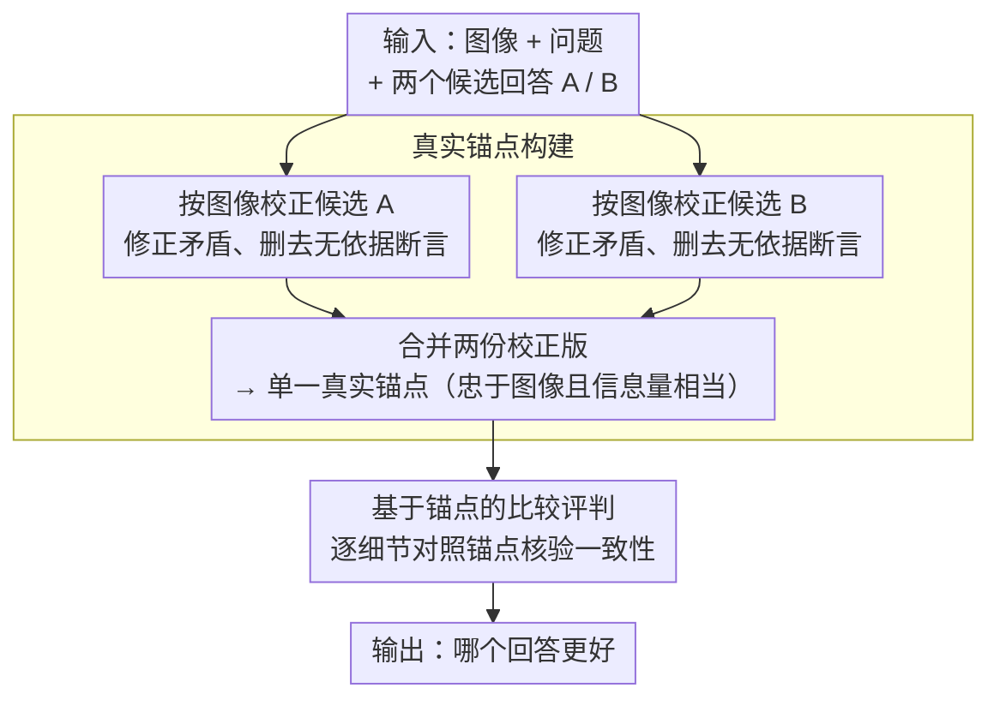

# When Vision-Language Models Judge Without Seeing: Exposing Informativeness Bias

**会议**: ACL 2026  
**arXiv**: [2604.17768](https://arxiv.org/abs/2604.17768)  
**代码**: 无  
**领域**: 多模态VLM  
**关键词**: VLM评判器, 信息量偏见, 图像锚定, 评估可靠性, 多模态评估

## 一句话总结

揭示 VLM-as-a-Judge 系统存在严重的"信息量偏见"（informativeness bias）——评判器倾向于选择更详细丰富的回答，即使该回答与图像内容矛盾，提出 BIRCH 范式通过先校正候选答案再进行比较，将偏见减少最高 17%，性能提升最高 9.8%。

## 研究背景与动机

**领域现状**：VLM-as-a-Judge（用视觉语言模型作为自动评判器）已成为评估 VLM 输出质量的主流方法。它借鉴 LLM-as-a-Judge 的思路，让一个强大的 VLM 对多个候选回答进行打分或排序，替代昂贵的人工评估。

**现有痛点**：作者的分析揭示了一个令人担忧的问题——VLM 评判器在做决策时往往对图像关注不足。它们倾向于盲目偏好信息量更大、描述更详细的回答，即使这些回答的内容与图像实际内容相矛盾。更令人惊讶的是，即使评判器能识别出某个回答与图像不一致，它仍然可能因为该回答"看起来更丰富"而选择它。

**核心矛盾**：VLM 评判器面临一个隐式的 trade-off——信息量（informativeness）vs 正确性（correctness）。现有评判范式将这两个维度混在一起评估，导致评判器的注意力从图像基准事实（visual grounding）偏移到文本表面质量。

**本文目标**：（1）系统量化 VLM-as-a-Judge 中信息量偏见的严重程度；（2）设计一种新的评判范式，使评判器的关注焦点从信息量转移到基于图像的正确性。

**切入角度**：作者提出将评判过程分为两步——先将候选答案中与图像不一致的内容校正（消除信息量差异的干扰），再基于校正后的版本进行比较。这样评判器就只需关注"谁更正确"而非"谁说得更多"。

**核心 idea**：通过引入"真实锚点"——先生成与图像一致的校正版本（Truthful Anchor），然后让评判器在信息量平衡的条件下比较正确性。

## 方法详解

### 整体框架

VLM 评判器之所以偏好"更详细"的回答，是因为现有范式把信息量和正确性两个维度混在一起评估，评判器的注意力很容易从图像基准事实滑向文本表面质量——作者实测发现评判器几乎不看图（加入图像只带来不到 3~5% 的准确率提升），却有 30~50% 的信息量偏见。BIRCH（Balanced Informativeness and CoRrectness with a Truthful AnCHor）针对这一点把评判拆成两步：先让评判器按图像逐条校正每个候选回答（修正与图像矛盾之处、删去无图像依据的断言），再把校正后的两份版本**合并成一个**"真实锚点"——它既忠于图像、又保留与候选相当的信息量；随后评判器不再直接比较两个原始回答，而是让每个候选对照这个锚点逐细节核验一致性。输入一张图像、一个问题与两个候选回答，输出哪个回答更好的判断，整个过程把"谁说得更多"的干扰换成了"谁与图像更一致"的比较。

> 上图是 BIRCH 的评判流水线（对应关键设计 2、3）；关键设计 1 是支撑它的诊断分析，先量出偏见有多严重。

### 关键设计

**1. 信息量偏见的定义与量化（informativeness bias）：先把问题的严重程度量出来**

此前没有工作系统研究过 VLM 评判器这种特定的偏见，要评估任何解法都得先有可比的尺子。作者按"信息量更大的那个回答到底对不对"把成对数据切成两半——信息量驱动子集（IDS，更详细的恰好正确）与正确性驱动子集（CDS，更详细的其实错误），并把信息量偏见量化为两者准确率之差 $IB = Acc_{IDS} - Acc_{CDS}$；同时用"图像依赖度"（IRS，加入图像带来的准确率增益）衡量评判器到底看不看图。系统跑下来揭示三件事：IRS 普遍低于 3~5%，说明评判器几乎不依赖图像；IB 高达 30~50%，即便最强模型也被表面丰富度带偏；而且把候选答案的长度拉平后 IB 仍有 26~45%，证明它并非长度偏见的副产品、不能靠对齐长度解决。

**2. 真实锚点构建（Truthful Anchor）：造一个既正确又同样详细的参照物**

一个朴素想法是让评判器先自己回答问题、再拿这个答案当参照——但作者发现这会让评判器矫枉过正：参照里没提到的正确细节会被无辜判错，导致 IDS 上的准确率掉下来。BIRCH 的关键改动是让锚点"和候选一样详细"：评判器逐条校正**每个**候选回答（把与图像矛盾的描述改对、把无图像依据的断言连同理由删掉），再把两份校正版**合并成一个**锚点。这样锚点囊括了两个候选里所有与图像相关的细节、且全部是正确版本——它在信息量上与候选持平，唯一差别只剩"正确性"，从而把正确性差异从信息量差异里干净地剥离出来。

**3. 基于锚点的比较评判（Anchor-Based Comparison）：把评判标准从"看起来更好"换成"与图像更一致"**

有了这个忠实又详尽的锚点，评判就不再直接比较两个原始回答，而是让每个候选对照锚点逐细节核验：候选里的每条描述都能在锚点里找到正确版本来比对，谁与锚点更一致谁就更可信。由于两侧的信息量已被锚点拉平、残留的信息量诱惑被绕开，评判器的注意力被强行拉回图像基准事实，偏见来源从根上被消除——既不会因为某个回答"说得多"就偏袒它，也不会因为它"多说了一句对的"就误判它。

## 实验关键数据

### 主实验

| 基准/评判模型 | 原始偏见率 | BIRCH 后偏见率 | 偏见下降 | 准确率提升 |
|-------------|----------|--------------|---------|----------|
| GPT-4V 评判 | 基线水平 | 降低 | -17% | +9.8% |
| Gemini 评判 | 基线水平 | 降低 | -14% | +7.2% |
| LLaVA 评判 | 基线水平 | 降低 | -11% | +5.6% |
| 多基准平均 | 高偏见 | 显著降低 | -12~17% | +5~9.8% |

### 消融实验

| 配置 | 偏见率 | 准确率 | 说明 |
|------|-------|-------|------|
| BIRCH 完整方案 | 最低 | 最高 | 校正+比较两步都有 |
| 仅校正不比较 | 中等 | 中等 | 证明比较策略也重要 |
| 直接提示"关注正确性" | 依然高 | 提升有限 | 证明简单提示无法消除隐式偏见 |
| 不同 VLM 作为校正器 | 差异不大 | 稳定 | 方法对校正模型选择不敏感 |

### 关键发现

- 信息量偏见在所有测试的 VLM 中都普遍存在，即使是最强的模型（如 GPT-4V）也会受影响
- 即使评判器被明确告知"请忽略信息量，关注正确性"，偏见仍然显著——说明这是一种深层的模型倾向而非指令理解问题
- BIRCH 的两步设计都有贡献：校正步骤消除了内容偏差，比较步骤避免了残留的信息量干扰
- 在图像描述越复杂的场景中，信息量偏见越严重，BIRCH 的收益也越大

## 亮点与洞察

- **问题发现本身就是重要贡献**：信息量偏见是一个此前被忽视但影响深远的问题——如果自动评估不可靠，基于它做的模型选择和训练都可能被误导
- **"校正再比较"的范式设计**非常巧妙：它不是让评判器"更聪明"，而是通过预处理消除偏见来源。这种"改变输入而非改变模型"的思路可以广泛应用于其他评估偏见问题
- 可以迁移到 LLM-as-a-Judge 的类似偏见场景——例如 LLM 评判器可能也偏好长回答、格式化回答等

## 局限与展望

- 校正步骤本身依赖 VLM 的视觉理解能力——如果校正器本身的视觉理解有误，可能引入新的偏差
- 两步流程增加了推理成本（每个评判需要额外的校正调用），效率上有所牺牲
- 目前主要关注"信息量偏见"一种偏见类型，VLM 评判器可能还存在其他偏见（如位置偏见、长度偏见）
- 未来可以探索训练专门的"去偏见"评判器，将 BIRCH 的思路内化到模型中

## 相关工作与启发

- **vs LLM-as-a-Judge 偏见研究**：此前的工作主要关注 LLM 评判器的位置偏见和冗长偏见，本文首次系统研究 VLM 评判器特有的信息量偏见，问题定义更精确
- **vs 直接评分方法**：直接让 VLM 打分的方法同样受信息量偏见影响，BIRCH 的校正思路可以适用于评分场景
- **vs 人工评估**：BIRCH 缩小了自动评估与人工评估的差距，但在高度主观的评估维度上人工评估仍不可替代

## 评分

- 新颖性: ⭐⭐⭐⭐⭐ 首次揭示并系统量化 VLM 评判器的信息量偏见，问题定义新颖且重要
- 实验充分度: ⭐⭐⭐⭐ 多模型多基准的全面实验，消融验证充分
- 写作质量: ⭐⭐⭐⭐ 问题动机清晰，实验设计逻辑严密
- 价值: ⭐⭐⭐⭐⭐ 对 VLM 自动评估领域有重要影响，提出的偏见问题和解决思路都具有广泛意义

<!-- RELATED:START -->

## 相关论文

- [\[ACL 2026\] Contrastive Decoding Mitigates Score Range Bias in LLM-as-a-Judge](contrastive_decoding_mitigates_score_range_bias_in_llm-as-a-judge.md)
- [\[ICLR 2026\] BiasScope: Towards Automated Detection of Bias in LLM-as-a-Judge Evaluation](../../ICLR2026/llm_evaluation/biasscope_towards_automated_detection_of_bias_in_llm-as-a-judge_evaluation.md)
- [\[ACL 2026\] Fin-Bias: Comprehensive Evaluation for LLM Decision-Making under human bias in Finance Domain](fin-bias_comprehensive_evaluation_for_llm_decision-making_under_human_bias_in_fi.md)
- [\[ACL 2026\] How Hypocritical Is Your LLM Judge? Listener–Speaker Asymmetries in the Pragmatic Competence of Large Language Models](how_hypocritical_is_your_llm_judge_listener-speaker_asymmetries_in_the_pragmatic.md)
- [\[ACL 2026\] IF-RewardBench: Benchmarking Judge Models for Instruction-Following Evaluation](if-rewardbench_benchmarking_judge_models_for_instruction-following_evaluation.md)

<!-- RELATED:END -->
