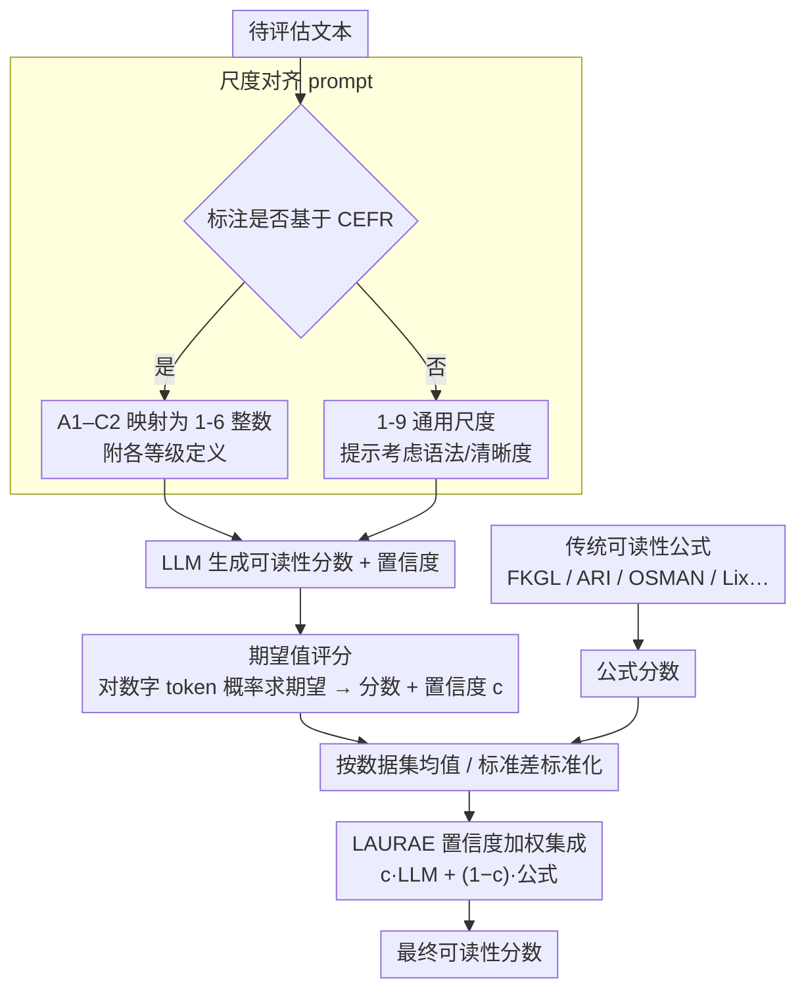

# Zero-shot Large Language Models for Automatic Readability Assessment

**会议**: ACL2026  
**arXiv**: [2604.24470](https://arxiv.org/abs/2604.24470)  
**代码**: https://github.com/rag24/LAURAE  
**领域**: 自动可读性评估 / 医学文本可读性 / NLP评估  
**关键词**: 可读性评估, 零样本LLM, LAURAE, 置信度集成, 医疗文本

## 一句话总结
本文系统评估 10 个开源 LLM 在 14 个多语言可读性数据集上的零样本 ARA 能力，并提出 LAURAE：用 LLM 的期望值可读性分数与传统可读性公式按 verbal confidence 加权集成，从而在 13/14 个数据集上优于既有无监督方法。

## 研究背景与动机
**领域现状**：自动可读性评估（ARA）长期服务于教育、医学、政务和文本简化研究。尤其在医疗场景，患者材料是否能被目标人群理解会直接影响患者决策和健康结果。传统可读性公式如 FKGL、ARI 依赖句长、音节数、多音节词等浅层特征，使用方便，因此 2025 年相关应用论文中仍有大量工作采用公式方法。

**现有痛点**：传统公式虽然易用，但忽略语义、语境和技术词解释；监督式 BERT/ML 模型准确率更高，却需要标注数据、训练资源和专业能力。近期 GPT-4 零样本可读性评估显示潜力，但已有研究多只覆盖一个英文数据集或闭源模型，无法回答三个实际问题：开源 LLM 是否可靠，非英语和技术文本是否可靠，短文本和长文本是否都可靠。

**核心矛盾**：研究者和实践者需要比公式更准的无监督 ARA，但又不想承担监督训练成本；LLM 具备语义理解，却可能在短文本、儿童文本或低资源语言上不稳，且完全依赖 LLM 会牺牲公式方法的鲁棒性和低成本优势。

**本文目标**：作者希望提供一个可复现的无监督 ARA 方案：先改进零样本 LLM 打分方法，再用 10 个开源 LLM 和 14 个数据集做全面评测，最后提出一个结合 LLM 语义能力与公式浅层特征的集成方法 LAURAE。

**切入角度**：论文不把 LLM 看作传统公式的简单替代，而是认为两者捕捉不同信号。LLM 更懂语境和难度定义，公式更稳定地捕捉句长、词长等表层负担；如果用 LLM 自报置信度决定二者权重，就可能获得更稳的无监督可读性分数。

**核心 idea**：让 LLM 在与人工标注相同的可读性尺度上给分，并用输出 token 概率计算期望分数；再用 LLM verbal confidence 加权融合 LLM 分数和传统公式分数，形成 LAURAE。

## 方法详解
本文包含两个层面的技术贡献。第一层是改进零样本 LLM ARA：提示词不仅要求模型给可读性分数，还尽量让它使用人工标注采用的同一尺度，例如 CEFR A1-C2，并在 prompt 中给出等级定义。第二层是 LAURAE 集成：把 LLM 分数和可读性公式分数标准化后加权平均，权重来自 LLM 对自己评分的自然语言置信度。

### 整体框架
输入是一段待评估文本。若该数据集的人工标注基于 CEFR，prompt 会要求 LLM 按 A1-C2 对应的 1-6 整数打分，并附上各等级定义；否则使用 1-9 的任意可读性尺度，并提示模型考虑语法、清晰度等因素。模型生成可读性分数和置信度分数。系统不只取生成的最高概率数字，而是查看输出位置上所有数字 token 的概率，用期望值计算可读性分数和置信度。

随后，LAURAE 选择一个传统无监督 ARA 分数作为浅层特征。英语用 FKGL/ARI，阿拉伯语用 OSMAN，印地语和希腊语用 Lix，法语/俄语用改造版 Flesch Reading Ease 等。LLM 分数和公式分数都按数据集均值、标准差标准化，再用 LLM confidence `c` 加权：LLM 越自信，LLM 分数权重越高；LLM 不自信，公式分数权重增加。

### 关键设计

**1. 与人工标注一致的可读性尺度 prompt：让 LLM 的输出空间贴近数据集 ground truth**

如果标注者按 CEFR 理解「难度」、而 LLM 按自己内部的标准给分，两者相关性会被无谓拉低。作者的做法是把评分尺度显式写进 prompt：7 个用 CEFR 的数据集，把 A1-C2 的等级定义连同 1-6 的映射一起塞给模型；其余数据集则用 1-9 分，并提示模型从语法、清晰度、文本复杂度等角度评判。这一步看似只是改 prompt，实际是把 task ontology 明确告诉了模型，对非英语数据集的帮助尤其大——模型不必再去猜「这个数据集所谓的难到底是什么」。

**2. 基于输出 token 概率的期望值评分：避免只取 greedy 数字带来的离散化和并列**

可读性本质上是连续难度，硬取概率最高的那个数字会丢掉模型的犹豫。作者改为在分数所在的 token 位置收集所有数字 token 的概率，把分数当成概率加权的期望值：若最高概率输出是 4，但 3 和 5 也占不小概率，期望分数就会保留这份不确定性，而不是一刀切成 4。这个改动在短文本对比任务里尤其值钱，因为它能减少两段文本被判成同分的 tie；论文消融显示它在全部 14 个数据集上都带来提升。

**3. LAURAE 的置信度加权集成：把 LLM 的语义判断和公式的浅层稳健性按自信度融到一起**

LLM 懂语境、懂技术词，但在儿童故事、极短句对或低资源语言上可能不稳；传统公式恰恰相反，浅层却稳定。作者让 LLM 额外输出一个 1-9 的置信度（同样用期望值计算），除以 10 得到权重 `c`，最终分数可写成 `c * standardized(LLM score) + (1-c) * standardized(formula score)`，两类分数都先按数据集均值、标准差标准化，保证各自至少有一定贡献。关键在于这个权重由模型自报的置信度决定，而非来自任何标注验证集——这让 LAURAE 能在完全无监督、既挑不了模型也调不了参的现实设定里自适应：LLM 自觉有把握就多听它的，没把握就让公式兜底。

### 损失函数 / 训练策略
本文完全是无监督推理方法，没有训练和 fine-tuning。实验使用 10 个开源 instruction-tuned LLM，包括 Llama 3.1 8B/70B、Llama 3.2 3B、Aya Expanse、Gemma 2、Mixtral 8x7B、Phi-4 等。英文数据后续主要采用 Llama 70B，非英语数据采用 Aya 32B，以模拟真实无监督场景下不能用验证集挑模型的设定。

评估指标随数据类型变化：11 个有连续 ground-truth rating 的数据集报告 Pearson correlation；3 个 pairwise comparison 数据集报告识别更易读文本的 accuracy。显著性检验上，相关性比较用 Steiger 修改的 Williams test，准确率比较用 McNemar test。

## 实验关键数据

### 主实验
14 个数据集覆盖 6 种语言、短句与段落/文章、CEFR 与非 CEFR 标注、医疗技术文本和 pairwise simplification 数据。MedReadMe 是医疗文本评测重点，能检验模型是否适合患者材料可读性场景。

| 数据集 | 语言 | N | 平均长度 | Ground Truth |
|--------|------|---:|---------:|--------------|
| ReadMe | 英/法/印地/阿/俄 | 163-296 | 22-25 | CEFR rating |
| MedReadMe | 英语 | 1,140 | 25 | CEFR rating，医疗文本 |
| Cambridge | 英语 | 300 | 579 | CEFR rating |
| CLEAR | 英语 | 1,890 | 201 | non-CEFR rating |
| Greek Language / History | 希腊语 | 393 / 804 | 161 / 209 | non-CEFR rating |
| OneStop | 英语 | 567 | 782 | non-CEFR rating |
| Asset | 英语 | 485 | 21 | pairwise comparison |
| Vikidia | 英/法 | 150 / 150 | 596 / 509 | pairwise comparison |

LAURAE 主结果非常明确：平均性能 0.740，高于 LLM-v-ns、公式和 RSRS 三类 baseline，且在 13/14 个数据集上是最强方法；唯一例外是 Cambridge，LLM-v-ns 0.888 略高于 LAURAE 0.860。

| 数据集 | LAURAE | LLM-v-ns | Formula | RSRS |
|--------|-------:|---------:|--------:|-----:|
| Greek Lang. | 0.430 | 0.427 | 0.162 | 0.116 |
| Greek Hist. | 0.572 | 0.520 | 0.373 | 0.163 |
| Vikidia (fr) | 0.953 | 0.760 | 0.887 | 0.840 |
| Asset | 0.629 | 0.324 | 0.557 | 0.561 |
| CLEAR | 0.735 | 0.725 | 0.517 | 0.484 |
| OneStop | 0.654 | 0.488 | 0.577 | 0.627 |
| MedReadMe | 0.770 | 0.736 | 0.469 | 0.646 |
| Cambridge | 0.860 | 0.888 | 0.702 | 0.713 |
| ReadMe | 0.798 | 0.776 | 0.680 | 0.759 |
| ReadMe (ru) | 0.803 | 0.393 | 0.639 | 0.694 |
| Average | 0.740 | 0.595 | 0.599 | 0.592 |

### 消融实验
作者把两项 prompt/评分改进拆开评估。期望值评分在 14/14 个数据集上都有提升，其中 12 个显著；加入 CEFR scale definition 对 7 个 CEFR 数据集中的 5 个显著提升，非英语提升尤其大。

| 数据集 | Expected Value 提升 | Scale Included 提升 |
|--------|--------------------:|--------------------:|
| Greek History | +0.022 | - |
| Vikidia (fr) | +0.160 | - |
| Asset | +0.231 | - |
| OneStop | +0.121 | - |
| MedReadMe | +0.014 | +0.026 |
| Cambridge | +0.032 | -0.059 |
| ReadMe (fr) | +0.016 | +0.214 |
| ReadMe (hi) | +0.058 | +0.204 |
| ReadMe (ar) | +0.029 | +0.177 |
| ReadMe (ru) | +0.030 | +0.339 |
| Average | +0.059 | +0.125 |

LAURAE 的 ensemble 权重也做了对照。相对于 standalone LLM，verbal confidence 加权的 LAURAE 平均提升 0.027，优于等权 naive 集成、entropy 权重和 min-max confidence 变体。

| 集成变体 | 平均相对 standalone LLM 的变化 | 说明 |
|----------|-----------------------------:|------|
| LAURAE | +0.027 | verbal confidence 作为权重，平均最好 |
| LAURAE-naive | +0.015 | 等权集成有提升，但在部分数据集损失较大 |
| LAURAE-entropy | +0.006 | 熵权重有效但不如自报置信度 |
| LAURAE-minmax | -0.013 | 数据集内 min-max 置信度反而变差 |
| LAURAE-agg | +0.0007 | 用数据集平均置信度替代逐文本置信度几乎无额外收益 |

### 关键发现
- 只看一个英文数据集会高估 LLM 零样本 ARA 的普适性。旧方法 LLM-v-ns 平均与公式、RSRS 接近，而不是全面碾压。
- Llama 70B 在英语数据上整体最强，但非英语数据上 Aya 32B 更稳，说明专门的多语言训练比单纯参数规模更重要。
- Expected value scoring 是低成本高收益改动，尤其对 Asset/Vikidia 这类比较任务有用，因为它能减少两个文本被判为同分的情况。
- LAURAE 在 MedReadMe 上从公式的 0.469 提升到 0.770，说明对医疗可读性这类技术文本，LLM 语义理解与浅层特征融合很有价值。

## 亮点与洞察
- 论文最强的地方是评估很全面。它没有只在 CLEAR 一个英文数据集上证明 LLM 好，而是把语言、文本长度、标注尺度、技术文本和比较任务都纳入评测。
- “同一标注尺度 prompt”看似简单，但非常重要。让 LLM 按 CEFR 定义打分，其实是在把 task ontology 明确写进 prompt，比泛泛要求“给可读性评分”可靠得多。
- verbal confidence 作为无监督集成权重很巧妙。它避免使用 dev labels 调参，同时比 entropy 这类纯概率不确定性更符合 LLM 作为自然语言评估器的特点。
- 这篇论文对医疗 NLP 很有实用意义。很多医院/健康机构仍用传统公式衡量患者材料，而 LAURAE 提供了一个性能更强但仍无需标注训练的替代方案。

## 局限与展望
- LAURAE 比传统公式要求更高：需要 Python 能力和 GPU/LLM 推理资源。作者报告 14B 以下模型用 1 张 A100，Aya 32B 用 2 张 A100，Mixtral/Llama 70B 用 3 张 A100。
- 方法不如公式可解释。公式能直接解释句长、词长等因素，LAURAE 虽然要求 LLM 生成解释，但论文没有验证这些解释是否忠实或有用。
- 评估主要看与 ground truth 的相关性，而非绝对 grade-level 或 CEFR level 的准确率。实际应用中，医疗材料常需要明确判断“是否达到 6 年级阅读水平”，这还需单独评估。
- 医疗场景只覆盖 MedReadMe 一个数据集，不能完全代表所有患者材料、疾病说明、知情同意书或多语言健康资料。
- 伦理上，作者明确不建议用该方法评价个人写作能力。可读性模型可能对某些写作风格存在偏差，应主要用于文本集合和材料版本比较。
- LLM 推理有能源成本，且开源模型版本变化可能影响可复现性；后续可研究量化模型是否保留 ARA 性能。

## 相关工作与启发
- **vs 传统可读性公式**: FKGL/ARI 等公式极易使用，但只看浅层特征；LAURAE 融合 LLM 语义判断后在 14 个数据集平均从约 0.599 提升到 0.740。
- **vs 监督式 BERT/ML ARA**: 监督模型依赖标注和训练，不适合很多低资源或快速应用场景；LAURAE 仍保持无监督，不需要目标数据集标签。
- **vs RSRS**: RSRS 用 PLM surprisal 衡量词语意外性，属于无监督神经方法；LAURAE 在大多数数据集上更强，尤其对多语言和技术文本更稳。
- **vs GPT-4 零样本可读性工作**: 既有工作证明了闭源 GPT 在单一英文数据集上的潜力；本文把问题推进到开源 LLM、多语言、多文本长度和集成鲁棒性。
- **启发**: LAURAE 的思想可以迁移到其他无监督 NLP 评估任务，例如 toxicity、情感、文本清晰度：让 LLM 给语义判断，让浅层或规则特征提供保底，再用置信度做无监督权重。

## 评分
- 新颖性: ⭐⭐⭐⭐ 单个组件不复杂，但把尺度 prompt、期望值评分和置信度加权集成组合成可靠无监督 ARA 方法很有新意。
- 实验充分度: ⭐⭐⭐⭐⭐ 10 个开源 LLM、14 个数据集、多语言、技术文本、消融和集成变体都覆盖，实验非常扎实。
- 写作质量: ⭐⭐⭐⭐ 结构清晰，结果解释充分；部分图表依赖相关性/准确率混合指标，初读需要注意数据集类型差异。
- 价值: ⭐⭐⭐⭐⭐ 对医学文本、教育材料和文本简化评估都有直接应用价值，也为无监督 LLM+规则集成提供了通用范式。

<!-- RELATED:START -->

## 相关论文

- [\[ACL 2026\] NovBench: Evaluating Large Language Models on Academic Paper Novelty Assessment](novbench_evaluating_large_language_models_on_academic_paper_novelty_assessment.md)
- [\[NeurIPS 2025\] Benchmarking Large Language Models for Zero-Shot and Few-Shot Phishing URL Detection](../../NeurIPS2025/llm_evaluation/benchmarking_large_language_models_for_zero-shot_and_few-shot_phishing_url_detec.md)
- [\[ACL 2026\] The Silent Vote: Improving Zero-Shot LLM Reliability by Aggregating Semantic Neighborhoods](the_silent_vote_improving_zero-shot_llm_reliability_by_aggregating_semantic_neig.md)
- [\[ACL 2026\] Question Difficulty Estimation for Large Language Models via Answer Plausibility Scoring](question_difficulty_estimation_for_large_language_models_via_answer_plausibility.md)
- [\[ACL 2026\] SciCustom: A Framework for Custom Evaluation of Scientific Capabilities in Large Language Models](scicustom_a_framework_for_custom_evaluation_of_scientific_capabilities_in_large_.md)

<!-- RELATED:END -->
