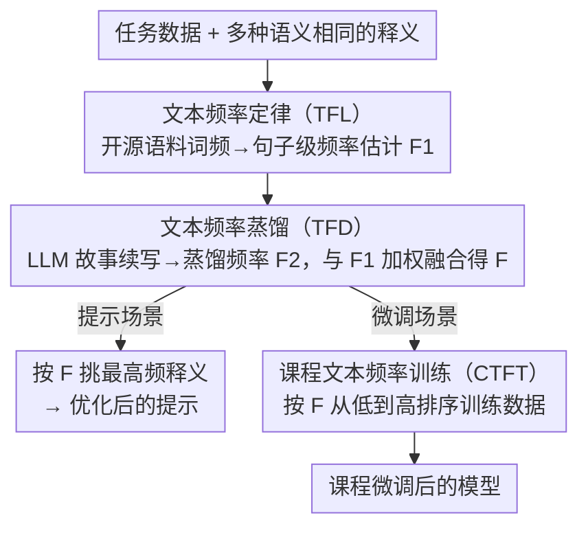

# Adam's Law: Textual Frequency Law on Large Language Models

**会议**: ACL 2026  
**arXiv**: [2604.02176](https://arxiv.org/abs/2604.02176)  
**代码**: [https://github.com/HongyuanLuke/frequencylaw](https://github.com/HongyuanLuke/frequencylaw)  
**领域**: LLM/NLP  
**关键词**: 文本频率、释义选择、课程学习、提示优化、微调策略

## 一句话总结
本文提出"文本频率定律"（TFL），发现当语义相同时，使用更高频率的文本表达来提示或微调LLM能获得更好效果，并设计了频率蒸馏和课程训练策略来进一步利用该规律。

## 研究背景与动机

**领域现状**：大语言模型在数学推理、机器翻译、常识推理等任务上已取得显著进展。近期研究表明，数据的质量和数量对LLM的表现至关重要，但数据的"频率"维度——即训练语料中某一表达出现的频繁程度——却很少被探讨。

**现有痛点**：已有研究发现，语义相同但表述不同的prompt会导致LLM输出质量差异很大，但尚无清晰的结论来解释哪些因素驱动了这一现象。此外，训练资源有限时，如何从多种释义中选择最优的训练数据也缺乏指导原则。

**核心矛盾**：LLM在预训练中对高频表达见过更多次，理论上应更擅长处理高频输入，但现有方法并未系统利用这一直觉。同时，由于大多数LLM的训练数据不公开，我们无法直接获知某一句子在预训练中出现的频率。

**本文目标**：(1) 验证高频文本表达是否确实优于低频表达；(2) 设计一种无需访问LLM训练数据即可估计句子频率的方法；(3) 提出利用频率信息优化微调顺序的课程学习策略。

**切入角度**：从人类认知研究中的词频效应出发（高频词的神经激活更强、语义检索更容易），作者假设这一规律同样适用于LLM——高频表达在预训练中见得更多，因此更容易被模型理解。

**核心 idea**：用开源语料的词频来估计句子级频率，选择高频释义进行提示/微调；再通过LLM自身的故事续写来蒸馏频率估计；最终按频率从低到高排序进行课程微调。

## 方法详解

### 整体框架

本文的核心直觉是：LLM 在预训练中对高频表达见得更多，因此语义相同时用高频释义来提示或微调更顺手；难点在于大多数 LLM 训练数据不公开，没法直接查某句话见过多少次。整个框架围绕这一难点串成三步——先用文本频率定律（TFL）以公开语料的词频来近似句子级频率并据此挑选高频释义；再用文本频率蒸馏（TFD）借 LLM 自身生成的文本来修正开源词频与真实预训练分布的偏差；最后用课程文本频率训练（CTFT）把微调数据按频率从低到高排序。输入是任务数据及其多种释义，输出是经过频率优化的提示，或按频率课程微调后的模型。

### 关键设计

**1. 文本频率定律（TFL）及句子频率估计：用公开词频近似句子在预训练中的出现频率**

由于 LLM 训练数据不公开，无法直接得到句子频率，而词频在不同语料间具有相对一致性，因此用开源语料的词频来近似是合理的。具体把句子级频率定义为词级频率的逆归一化乘积 $\text{sfreq}(\mathbf{x}, \mathcal{D}) = \sqrt[\mathbb{K}]{\frac{1}{\prod_{k=1}^{\mathbb{K}} \text{wfreq}(\mathbf{x}_k, \mathcal{D})}}$，其中 $\text{wfreq}$ 取自开源语料（如 Zipf 频率）。这是一种位置无关的乘法聚合，不需要触碰 LLM 的训练数据，于是对一组语义相同的释义就能算出各自分数，挑出频率最高的那条用于提示或微调。

**2. 文本频率蒸馏（TFD）：借模型自己生成的文本修正频率估计**

开源词频是外部统计，可能遗漏 LLM 实际见过的表达模式，而模型自身生成的文本更能反映其内部词频分布。TFD 让 LLM 对训练集文本做故事续写（story completion），把生成结果收集成蒸馏语料 $\mathcal{D}'$，得到新估计 $\mathcal{F}_2$，再与原始估计 $\mathcal{F}_1$ 加权融合：$\mathcal{F}(x) = \alpha \mathcal{F}_1(x) + (1 + \zeta \mathbb{1}(\mathcal{F}_1(x)=0)) \beta \mathcal{F}_2(x)$。其中指示函数项的作用是：当开源语料给出零频（$\mathcal{F}_1(x)=0$，即根本没收录该表达）时，用 $\zeta$ 因子放大蒸馏频率的权重，避免估计被外部语料的盲区拖到零。

**3. 课程文本频率训练（CTFT）：按频率从低到高排数据，先难后易**

受课程学习启发，但排序维度换成频率：低频表达更稀有、语言形式更多样也更难学，应先训练以撑开更广的表示能力，高频表达作为"容易"样本放后面巩固。实现上对训练集 $\mathcal{T}$ 的所有样本按 $\mathcal{F}(x_n)$ 升序排列，每个 epoch 都按此顺序喂入。这一升序方向正是后续实验中胜过反向顺序与传统句法难度课程的关键。

### 损失函数 / 训练策略

微调使用 LoRA，基于标准语言模型交叉熵损失；CTFT 只改变数据排列顺序，不改动损失函数本身。对比实验中额外测试了反向顺序（高频到低频）与传统易到难课程学习（按句法树深度排序），用以验证"按频率升序"这一排序维度的有效性。

## 实验关键数据

### 主实验

| 模型 | 低频准确率 | 高频准确率 | 提升 |
|------|-----------|-----------|------|
| GPT-4o-mini (MR) | 0.8266 | 0.8523 | +2.57% |
| DeepSeek-V3 (MR) | 0.8964 | 0.9119 | +1.55% |
| Llama-3.3-70B (MR) | 0.9092 | 0.9295 | +2.03% |
| GPT-4o-mini (CR) | 0.6747 | 0.6974 | +2.27% |
| DeepSeek-V3 (CR) | 0.7043 | 0.7235 | +1.92% |

机器翻译实验（100种语言）中，DeepSeek-V3使用高频释义后99/100种语言BLEU提升，GPT-4o-mini为95/100种语言提升。

### 消融实验

| 配置 | BLEU (kea) | BLEU (kik) | BLEU (pag) | BLEU (lvs) |
|------|-----------|-----------|-----------|-----------|
| 高频数据微调 | **4.48** | **3.22** | **29.73** | **15.91** |
| 低频数据微调 | 3.92 | 2.77 | 28.68 | 14.83 |
| CTFT (低→高) | **4.78** | **3.51** | **30.12** | **16.25** |
| 反向CTFT (高→低) | 4.21 | 3.05 | 29.15 | 15.44 |
| 传统课程学习 | 4.35 | 3.12 | 29.47 | 15.62 |

### 关键发现
- 高频释义在所有模型和几乎所有语言上都优于低频释义，验证了TFL的普遍性
- TFD能进一步提升频率估计质量，在工具调用任务上从84.21%提升到87.72%
- CTFT（低频到高频顺序）始终优于反向顺序和传统课程学习，说明频率是比句法复杂度更好的数据排序维度
- 低资源语言的翻译改进尤为显著，说明高频表达对LLM理解不熟悉语言的输入帮助更大

## 亮点与洞察
- **文本频率作为新的数据质量维度**：不同于传统的数据质量（干净/噪声）和数量（多/少）维度，频率提供了一个全新的数据选择视角——语义相同时选高频，这个思路简单但有效，且可以零成本应用于任何提示场景。
- **用LLM自身生成来估计训练分布**：TFD的思路很巧妙——通过故事续写间接"窥探"闭源模型的内部词频分布，这为理解和利用黑盒模型的训练偏好提供了新途径。
- **低频→高频的课程学习**：挑战了传统"易到难"的课程学习范式，提出频率维度的排序策略，为训练数据排列提供了新的指导原则。

## 局限与展望
- 句子频率估计通过词频乘积近似，忽略了词序和搭配信息，可能在句法复杂或罕见搭配的场景中不够准确
- 释义生成和人工标注成本较高（仅保留了56%的GSM8K和52%的FLORES-200样本），限制了数据集规模
- CTFT目前仅在LoRA微调上验证，未测试全参数微调或更大规模模型
- 未探讨频率效应在推理类任务（如代码生成、长链推理）中是否同样显著

## 相关工作与启发
- **vs 传统课程学习**：传统方法按难度（句法树深度等）排序，本文按频率排序效果更好，说明频率比复杂度更能反映LLM的学习偏好
- **vs 数据增强（释义）**：以往用释义做数据增强时通常全部纳入，本文指出应选高频释义，为释义增强提供了选择准则
- **vs 提示工程**：提示优化通常关注语义和格式，本文揭示了频率这一被忽视的因素，可作为提示选择的额外信号

## 评分
- 新颖性: ⭐⭐⭐⭐ 首次系统性地将文本频率引入LLM的提示和微调优化，视角新颖
- 实验充分度: ⭐⭐⭐⭐ 覆盖4个任务、多个模型和100种语言，验证较为全面
- 写作质量: ⭐⭐⭐⭐ 逻辑清晰，从定律到估计到蒸馏到课程训练层层递进
- 价值: ⭐⭐⭐⭐ 高频释义选择策略成本极低且即时可用，实用价值高

<!-- RELATED:START -->

## 相关论文

- [\[ACL 2025\] Better Embeddings with Coupled Adam](../../ACL2025/llm_nlp/better_embeddings_with_coupled_adam.md)
- [\[ACL 2026\] Repeated Sequences Reveal Gaps between Large Language Models and Natural Language](repeated_sequences_reveal_gaps_between_large_language_models_and_natural_languag.md)
- [\[ACL 2025\] Assessing and Enhancing the Causal Reasoning Abilities of Language Models via Faithful Textual Interpretation](../../ACL2025/llm_nlp/assessing_and_enhancing_the_causal_reasoning_abilities_of_language_models_via_fai.md)
- [\[ACL 2026\] MoRI: Learning Motivation-Grounded Reasoning for Scientific Ideation in Large Language Models](mori_learning_motivation-grounded_reasoning_for_scientific_ideation_in_large_lan.md)
- [\[ACL 2026\] SteerEval: How Controllable Are Large Language Models? A Unified Evaluation across Behavioral Granularities](how_controllable_are_large_language_models_a_unified_evaluation_across_behaviora.md)

<!-- RELATED:END -->
