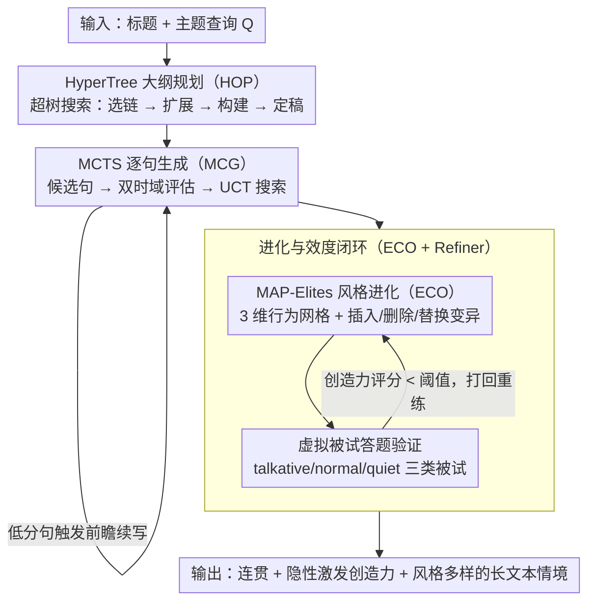

# AlphaContext: An Evolutionary Tree-based Psychometric Context Generator for Creativity Assessment

**会议**: ACL 2026  
**arXiv**: [2604.18398](https://arxiv.org/abs/2604.18398)  
**代码**: [https://github.com/yxwang19/AlphaContext](https://github.com/yxwang19/AlphaContext)  
**领域**: LLM/NLP  
**关键词**: 创造力评估, 心理测量, 进化算法, MCTS文本生成, MAP-Elites

## 一句话总结
提出 AlphaContext，一个基于进化树的心理测量情境生成器，通过 HyperTree 大纲规划、MCTS 逐句生成、MAP-Elites 多样性优化和评估引导迭代精炼四个模块，自动生成用于创造力评估的高质量长文本情境，在 7 个评估维度上平均超越竞争方法 8%。

## 研究背景与动机

**领域现状**：创造力评估在 LLM 时代变得愈发重要。心理测量研究认为基于情境的评估是测量创造性思维的有效方式——给被试一个未来导向的情境，让其识别潜在挑战来激发创造力。这一范式源自 Future Problem Solving Program (FPSP)。

**现有痛点**：高质量的创造力评估情境仍依赖专家手工设计，产能瓶颈严重（一个情境需要至少一周）。现有 LLM 生成方法面临两大挑战：(1) 难以同时满足隐性评估线索嵌入和全局叙事连贯性；(2) 在保证质量和测量效度的前提下难以实现多样性。

**核心矛盾**：心理测量情境不同于普通故事——需要在连贯叙事中隐含地嵌入评估线索，且这些线索必须能有效激发创造性思维。普通的故事生成框架无法满足这种细粒度约束。

**本文目标**：自动生成能替代专家设计的心理测量情境，同时保证叙事连贯性、评估线索对齐和风格多样性。

**切入角度**：将情境生成分解为规划-生成-进化三阶段，分别用搜索算法保证全局结构、局部质量和多样覆盖。

**核心 idea**：用 HyperTree 结构化专家大纲设计过程，MCTS 在大纲约束下逐句搜索最优文本，MAP-Elites 在风格行为空间中迭代进化，虚拟被试模拟验证评估有效性。

## 方法详解

### 整体框架

AlphaContext 把"专家写一篇心理测量情境"这件事拆成规划、生成、进化三个递进阶段，对应四个串联模块。输入是一个标题与主题查询 $Q$，先由 HyperTree Outline Planner 搜出一份层次化大纲，再交给 MCTS-based Context Generator 在大纲约束下逐句搜索出一篇种子情境，随后 Evolutionary Context Optimizer 用 MAP-Elites 在风格行为空间里反复变异进化，最后 Assessment-Guided Evolution Refiner 用虚拟被试模拟答题、把测不出创造力的低效情境打回前一阶段重练，最终输出既连贯、又能隐性激发创造力、且风格多样的长文本情境。

### 关键设计

**1. HyperTree Outline Planner（HOP）：把专家"先谋全局再逐层细化"的设计习惯形式化成超树搜索**

专家不会一上来就写句子，而是先搭骨架、再逐层填血肉，普通树结构难以表达这种"一个父节点同时展开成多组子主题"的分治过程。HOP 因此定义超树 $\mathcal{H} = (N, Q, \mathcal{R})$，让超边把一个父节点连到多个子节点集合，并按四步循环搜索：HT-Select 评估并剪枝超链、选出最优叶节点，HT-Expand 套用扩展规则生成候选子组，HT-Construct 迭代构建直到满足终止条件，HT-Decide 做一次全局评估选出最终大纲。这一步直接决定情境是否切题——消融实验里去掉 HOP，Relevance 从 79.06% 掉到 70.20%。

**2. MCTS-based Context Generator（MCG）：把长文本写作变成句子级搜索，用前瞻换长程一致性**

一次性让 LLM 写完整篇情境，容易跑题、丢失大纲约束，长程结构很难维持。MCG 转而把生成看成逐句决策：每步用 LLM 提出若干候选句子，再用双时域评估打分——高分节点直接采纳即时评估，把线索对齐 $S_{sc}$、意象生动性 $S_{im}$、话语连贯性 $S_{co}$ 的加权均值再乘以幻觉惩罚 $(1-S_{ha})$；低分节点则触发一段短续写做前瞻，看后续走向再重新评估，并用 UCT 公式平衡探索与利用。逐句搜索换来的正是连贯性，去掉 MCG 后 Coherence 从 81.28% 跌到 74.38%。

**3. Evolutionary Context Optimizer（ECO）+ Assessment-Guided Refiner：在风格空间里做"多样性 × 质量"双优化，并用虚拟被试闭环验证效度**

同一主题需要面向不同评估群体的多种风格情境，单条最优解远远不够。ECO 定义 3 维行为空间——接近性范围 $\phi_1$、知识密度 $\phi_2$、观点多样性 $\phi_3$，离散化成网格，每格只保留当前最优情境；通过插入/删除/替换三种变异编辑种子情境，按适应度函数（连贯性、相关性、参与度三者均值）更新精英，MAP-Elites 天然把"覆盖多样风格"和"保证质量"同时纳入优化。Assessment-Guided Refiner 再补上效度闭环：用 talkative/normal/quiet 三种风格的虚拟被试模拟答题，创造力评分低于阈值的情境被打回再进化。去掉 ECO 后所有指标下降，其中 Uncertainty 降幅最大。

### 一个完整示例

以"未来城市水资源危机"为主题：HOP 先搭出"背景设定 → 利益冲突 → 隐性挑战点"的超树大纲；MCG 在该大纲下逐句搜索，写到关键转折句时触发前瞻，比较几种续写后选中一句既连贯又埋下挑战线索的句子；ECO 把这篇种子情境投进风格网格，变异出"知识密度高/观点对立强"等不同格点的变体；Refiner 让三类虚拟被试答题，发现某个偏说教的变体测不出创造力，于是把它打回 ECO 再进化，直到落在创造力评分阈值之上才输出。

### 损失函数 / 训练策略

AlphaContext 是无监督搜索框架，不涉及传统意义的损失函数。质量评估由 LLM 评分器（DeepSeek-V3.1）给出，进化阶段以适应度函数 $F(C) = \text{Avg}(S_{coh}(C) + S_{rel}(C) + S_{eng}(C))$ 驱动精英更新。

## 实验关键数据

### 主实验

| 方法 | Coherence↑ | Relevance↑ | Engagement↑ | Significance↑ | Uncertainty↑ |
|------|-----------|-----------|------------|--------------|-------------|
| GPT-5.1 | 70.44 | 70.20 | 65.39 | 50.37 | 68.60 |
| Gemini-3.0-Pro | 72.54 | 75.37 | 62.56 | 48.40 | 63.30 |
| SS-GEN | 60.22 | 69.69 | 56.40 | 60.10 | 53.57 |
| **AlphaContext** | **81.28** | **79.06** | **79.93** | **71.06** | **80.30** |

### 消融实验

| 配置 | Coherence | Relevance | Engagement | Uncertainty |
|------|-----------|-----------|------------|-------------|
| Full AlphaContext | 81.28 | 79.06 | 79.93 | 80.30 |
| w/o HOP | 77.96 | 70.20 | 76.85 | 76.11 |
| w/o MCG | 74.38 | 71.80 | 72.17 | 71.92 |
| w/o ECO | 75.62 | 70.57 | 71.80 | 70.69 |

### 关键发现
- AlphaContext 在所有 7 个维度上均排名第一，最大优势体现在 Significance（+10.96% vs 次优）和 Uncertainty（+11.7% vs 次优）
- 人类偏好评估中，AlphaContext vs GPT-5.1 胜率 62%，vs Gemini 胜率 74%，人类与 LLM 评判一致性高（Cohen's κ > 0.8）
- 真实人类实验：36 名中学生的创造力评分呈正态分布，与 AUT 标准化测试的 Pearson 相关达 0.377，具有实际意义的效标效度
- 生成一个情境约 227 秒，远快于专家设计（约一周），成本可接受

## 亮点与洞察
- "规划-搜索-进化"三阶段设计思路非常系统：HyperTree 保证全局结构，MCTS 优化局部质量，MAP-Elites 扩展多样性。这个框架可以迁移到其他需要结构化长文本生成的场景（如教案设计、考题生成）
- 用虚拟被试模拟来验证评估有效性是一个巧妙的闭环设计，避免了依赖真人实验的高成本
- 真实人类实验验证了生成情境的心理测量效度，这在 NLP 论文中少见但非常有说服力

## 局限与展望

- 生成成本较高（每情境 ~12.9k tokens），需要多次 LLM 调用；未来可蒸馏为轻量生成器
- CreaTE 数据集为专家手工构建的标题-主题对，规模有限（203 条），领域覆盖待扩展
- 当前仅针对未来导向型情境，其他类型创造力评估（如开放式任务）的适用性未验证
- 虚拟被试模拟器的代表性取决于 LLM 对真实人类创造行为的近似程度
- 句子级 MCTS 和 MAP-Elites 的效率敏感于底层 LLM 和评估器的选择

## 相关工作与启发
- **vs DOC/CRITICS**: 这些故事生成框架关注叙事娱乐性和流畅性，不满足心理测量的质量和效度要求
- **vs SS-GEN**: SS-GEN 用于自闭症干预社交故事，场景与创造力评估根本不同
- **vs CPIG**: CPIG 生成短项目，不适用于需要话语连贯和隐性线索的长文本情境

## 评分
- 新颖性: ⭐⭐⭐⭐⭐ HyperTree+MCTS+MAP-Elites 的组合在文本生成中非常新颖
- 实验充分度: ⭐⭐⭐⭐⭐ 消融、人类偏好、真实人类实验、案例研究一应俱全
- 写作质量: ⭐⭐⭐⭐ 结构清晰但符号较多
- 价值: ⭐⭐⭐⭐ 开创了 LLM 辅助心理测量情境生成的新方向

<!-- RELATED:START -->

## 相关论文

- [\[ICLR 2026\] LLEMA: Evolutionary Search with LLMs for Multi-Objective Materials Discovery](../../ICLR2026/llm_nlp/llema_evolutionary_search_with_llms_for_multi-objective_material_design.md)
- [\[ACL 2026\] Text-to-Distribution Prediction with Quantile Tokens and Neighbor Context](text-to-distribution_prediction_with_quantile_tokens_and_neighbor_context.md)
- [\[ACL 2026\] UCS: Estimating Unseen Coverage for Improved In-Context Learning](ucs_estimating_unseen_coverage_for_improved_in-context_learning.md)
- [\[ICLR 2026\] Evaluating Text Creativity across Diverse Domains: A Dataset and Large Language Model Evaluator](../../ICLR2026/llm_nlp/evaluating_text_creativity_across_diverse_domains_a_dataset_and_large_language_m.md)
- [\[ACL 2025\] Evaluating Implicit Bias in Large Language Models by Attacking from a Psychometric Perspective](../../ACL2025/llm_nlp/evaluating_implicit_bias_in_large_language_models_by_attacking_from_a_psychometr.md)

<!-- RELATED:END -->
