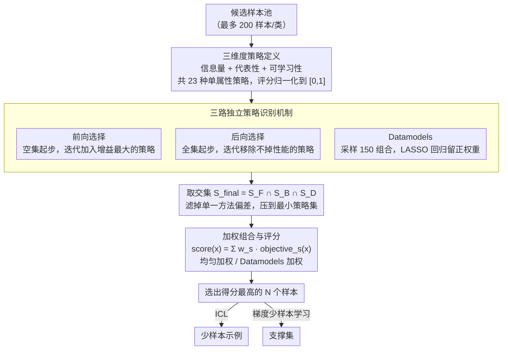

# Automatic Combination of Sample Selection Strategies for Few-Shot Learning

**会议**: ACL 2026  
**arXiv**: [2402.03038](https://arxiv.org/abs/2402.03038)  
**代码**: [https://github.com/kinit-sk/ACSESS](https://github.com/kinit-sk/ACSESS)  
**领域**: LLM/NLP  
**关键词**: 少样本学习, 样本选择, 策略组合, 上下文学习, 元学习

## 一句话总结

本文提出 ACSESS 方法，通过前向选择、后向选择和 Datamodels 三种机制自动识别互补的样本选择策略并加权组合，在 23 种策略、5 个 ICL 模型和 3 种梯度少样本学习方法、6 个文本和 8 个图像数据集上验证了组合策略一致优于单一策略和 ICL 专用基线。

## 研究背景与动机

**领域现状**：少样本学习面临样本选择的关键挑战——性能可能因样本选择而剧烈波动。现有选择策略通常仅关注单一属性（如相似性、多样性、信息量），而大量面向上下文学习（ICL）的新策略虽然有效但往往只针对特定场景设计，可迁移性差。

**现有痛点**：(1) 单属性策略各有局限——最具信息量的样本可能难以学习，最相似的样本可能缺乏多样性；(2) ICL 专用策略（如 LENS、Active Prompt、EXPLORA、CASE）针对特定场景优化，泛化能力有限；(3) 经典的监督学习选择策略（如主动学习、核心集选择）在 LLM 场景下被系统性忽略。

**核心矛盾**：单一样本属性无法全面衡量样本对少样本学习的贡献，但穷举所有策略组合的计算成本不可接受。

**本文目标**：自动识别互补的样本选择策略并优化组合，使经典选择策略的组合能匹配或超越 ICL 专用策略。

**切入角度**：借鉴传统机器学习中的特征选择方法（前向/后向选择）和 Datamodels 思想，将其从样本级别提升到策略级别进行操作。

**核心 idea**：样本的"好坏"不能用单一属性衡量——信息量、代表性和可学习性是互补的维度，自动组合这些维度的策略可以选出具有互补属性的高质量样本。

## 方法详解

### 整体框架

ACSESS 的核心思路是：样本的"好"不是单一属性能衡量的，应当把多条互补的选择策略自动组合起来。它把传统机器学习里的特征选择思路从样本级别抬升到策略级别，分三步走——先定义一个覆盖信息量、代表性、可学习性三大属性族的单属性策略库（23 种），再用前向选择、后向选择、Datamodels 三种独立方法各自挑出高贡献策略子集并取交集，最后按选定策略对每个样本加权打分、选出得分最高的 N 个样本作为少样本示例或支撑集。

### 关键设计

**1. 三维度策略定义（23 种单属性策略）：把样本选择的互补属性铺成一个统一的候选池**

不同少样本学习方法对样本属性的偏好截然不同——ICL 偏爱难学样本，梯度学习偏爱易学样本，单靠相似性或多样性都不够全面。ACSESS 因此沿三大属性族系统铺开候选策略：信息量一族含相似性、多样性、主动学习（Entropy、Margin、Least Confidence、Loss）与核心集选择（CAL、DeepFool、GraNd、Graph-Cut）；代表性一族含 Herding、KCenter、CRAIG、Glister；可学习性一族含 Forgetting（遗忘频率）与 Cartography（难学/易学/模糊样本）。每种策略都把样本评分归一化到 $[0,1]$，从而能被后续机制平等地比较与组合。

**2. 三路独立策略识别机制：用交集滤掉单一方法的偏差，挑出最稳健的最小策略集**

候选策略多达 23 种，穷举组合不可接受，而任何单一搜索方法都可能带偏。ACSESS 并行跑三种识别法：前向选择从空集开始，迭代加入带来最大性能增量的策略直到无正增量；后向选择从全集开始，迭代移除不降低性能的策略；Datamodels 选择则随机采样 150 个策略组合并评估，训练 LASSO 回归预测组合性能、保留正权重策略。最终策略集取三者交集 $S_{final} = S_F \cap S_B \cap S_D$，既滤掉了各自的偏差、保留最稳健的策略，又把策略数量压到最少以控成本。

**3. 加权组合与评分：把多策略融成单一样本得分，并在稳健默认与最优性能间留出选择**

确定策略集后，每个样本的综合得分为 $score(x) = \sum_{s \in S} w_s \cdot objective_s(x)$，关键在权重 $w_s$ 怎么定。论文给出三种方案：均匀加权 $w_s = 1/|S_{final}|$ 计算成本最低、跨数据集/模型可迁移性最强，性能只比加权方案差 0.10–0.25 个百分点；Datamodels 加权直接复用 LASSO 回归权重，对具体数据集/模型最优但需重新拟合；额外引入随机评分的带随机加权通常更差。这样均匀加权可作零额外成本的稳健默认，资源充足时再切到加权组合追求最优。

### 损失函数 / 训练策略

ACSESS 本身不训练模型，只作为样本选择的预处理步骤。对 ICL，选出的样本直接作少样本示例；对梯度少样本学习（Prototypical Networks、MAML、Few-Shot Fine-Tuning），选出的样本用作支撑集训练。评估采用 5-way 5-shot 设置，每次实验重复 5 次数据划分 × 10 次随机种子 × 300/600 个任务以控制方差。

## 实验关键数据

### 主实验

**ACSESS vs ICL 专用基线（文本数据集平均准确率增益，相对于 Classic selection）**

| 方法 | ICL 平均增益 (pp) | 类型 |
|------|-----------------|------|
| ACSESS (加权) | +2.5 | 本文方法 |
| CASE (Purohit et al., 2025) | +2.34 | ICL 专用 |
| EXPLORA (Purohit et al., 2024) | +1.8 | ICL 专用 |
| Active Prompt (Diao et al., 2024) | +1.6 | ICL 专用 |
| LENS (Li & Qiu, 2023) | +1.55 | ICL 专用 |
| 单属性最优 (Cartography-Hard) | +2.0 | 单策略 |
| Random selection | 0.0 | 基线 |

ACSESS 在所有比较中均通过 Wilcoxon 检验达到统计显著性。

### 消融实验

**样本数量对选择策略效果的影响**

| Shots 数量 | ACSESS vs Random (ICL, pp) | ACSESS vs Random (梯度, pp) |
|-----------|--------------------------|--------------------------|
| 1-shot | +4 ~ +7 | +7 |
| 5-shot | +2.5 | +1.8 |
| 20-shot | +10-12 (旧模型) / +2-3 (新模型) | 最高性能 |
| 30-40-shot | 开始回归 | 回归到随机 |
| 50-shot | ICL 性能下降 | — |

**数据集大小的影响**
- ICL：仅使用 25%（50 样本/类）即可匹配全数据集选择的性能
- 梯度学习：仅使用 10%（20 样本/类）即可匹配
- 降至 10 样本/类时，选择效益降低 20-40%

### 关键发现

- **可学习性是少样本学习最重要的样本属性**：ICL 偏好难学样本（Cartography-Hard），梯度学习偏好易学+模糊样本和低遗忘频率样本。代表性策略在 ACSESS 最终选择中完全未被纳入
- ACSESS 识别出的最佳策略组合因学习方式不同而异——ICL 倾向 Cartography-Hard + Forgetting + Margin + Entropy；梯度学习倾向 Cartography-Easy&Ambiguous + Forgetting + Margin + Graph-Cut
- 均匀组合 Cartography + Margin（+可选 Forgetting）即可作为零额外计算成本的默认推荐，性能仅略低于完整 ACSESS
- 样本数量增加到 30-40 后，所有策略回归到随机选择的水平，说明样本选择主要在极低样本场景下有价值
- 更多样本不总是更好——ICL 在 50+ shots 时性能反而下降，可能与上下文长度限制有关

## 亮点与洞察

- 首次在统一框架下系统比较了 23 种样本选择策略跨 ICL 和梯度少样本学习，填补了重要空白
- 将 Datamodels 从样本级别提升到策略级别操作是优雅的抽象——以较低计算成本实现了组合空间的有效搜索
- "可学习性 > 信息量 > 代表性"的属性重要性排序颠覆了直觉——此前大量工作聚焦于相似性和多样性
- 均匀组合 Cartography + Margin 的实用建议降低了方法的使用门槛
- 样本选择在小样本时重要但在大样本时失效的发现，对实践具有直接指导意义

## 局限与展望

- 假设有足够大的标注数据集可供选择（最多 200 样本/类），真正的极低资源场景需要不同方案
- 仅使用 5-way 分类设置，更高类别数下 ICL 性能可能因上下文限制而退化
- 未进行广泛的提示工程，可能低估了某些策略的效果
- 计算成本较高（约 2500 GPU 小时 A100，270 kgCO2）
- 未来可探索无标签场景下的策略选择和更大规模 LLM 的表现

## 相关工作与启发

- **vs LENS (Li & Qiu, 2023)**: LENS 使用两步搜索（信息量 + 多样性），ACSESS 自动发现最优策略组合，在多数场景下表现更好
- **vs CASE (Purohit et al., 2025)**: 最强 ICL 专用基线，ACSESS 均匀组合即可匹配，加权组合超越 +0.16pp
- **vs Datamodels (Ilyas et al., 2022)**: 原始 Datamodels 在样本级别操作，ACSESS 将其抽象到策略级别，降低了计算复杂度

## 评分

- 新颖性: ⭐⭐⭐⭐ 策略级别的自动组合是有价值的方法论创新，但各组件（前向/后向选择、Datamodels）本身不新
- 实验充分度: ⭐⭐⭐⭐⭐ 23 策略 × 5 ICL模型 × 3 梯度方法 × 14 数据集 × 多次重复，规模极大且消融全面
- 写作质量: ⭐⭐⭐⭐ 结构清晰，实用建议明确，但篇幅较长
- 价值: ⭐⭐⭐⭐ 对少样本学习样本选择的实践具有直接指导意义，统一比较填补了重要空白

<!-- RELATED:START -->

## 相关论文

- [\[ICML 2025\] Random Registers for Cross-Domain Few-Shot Learning](../../ICML2025/llm_nlp/random_registers_for_cross-domain_few-shot_learning.md)
- [\[ACL 2026\] Model-Agnostic Meta Learning for Class Imbalance Adaptation](model-agnostic_meta_learning_for_class_imbalance_adaptation.md)
- [\[ACL 2026\] DeCoVec: Building Decoding Space based Task Vector for Large Language Models via In-Context Learning](decovec_building_decoding_space_based_task_vector_for_large_language_models_via_.md)
- [\[ACL 2026\] FastDiSS: Few-step Match Many-step Diffusion Language Model on Sequence-to-Sequence Generation](fastdiss_few-step_match_many-step_diffusion_language_model_on_sequence-to-sequen.md)
- [\[ACL 2025\] From Selection to Generation: A Survey of LLM-based Active Learning](../../ACL2025/llm_nlp/from_selection_to_generation_a_survey.md)

<!-- RELATED:END -->
