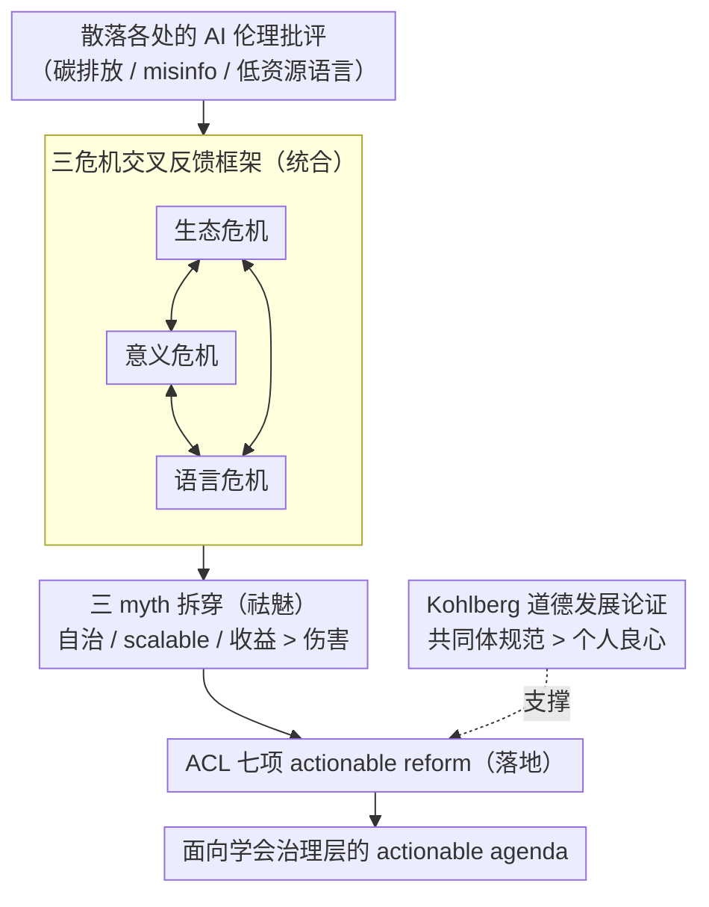

# Big AI is Accelerating the Metacrisis: What Can We Do?

**会议**: ACL 2026  
**arXiv**: [2512.24863](https://arxiv.org/abs/2512.24863)  
**代码**: 无（policy 立场论文）  
**领域**: AI 伦理 / 立场论文 / NLP 治理  
**关键词**: metacrisis, Big AI, ACL Code of Ethics, 生态危机, 语言多样性, ethics washing

## 一句话总结
Steven Bird 在这篇 ACL 2026 立场论文里论证："Big AI"（少数巨头驱动的工业化 LLM 工程）正在同时加速 3 大相互纠缠的危机——**生态危机 / 意义危机 / 语言危机**——而 ACL 作为最大 LLM 研究发表方，必须从"个人合规"转向"职业共同体集体行动"，并提出 7 项面向 ACL 的具体改革建议（重申公共利益优先、抵御 corporate capture、保护批判性 NLP、设立 NLP policy track 等）。

## 研究背景与动机

**领域现状**：ACL 可能是全球最大的 peer-reviewed LLM 研究发表方，其 Code of Ethics 明确要求"公共利益是 paramount consideration"。但现实是 ACL 论文绝大多数在为 Big AI（OpenAI / Google / Meta / Microsoft / 各类初创巨头）添砖加瓦——审稿生态、SOTA 比拼、conference sponsorship 都被工业捕获。

**现有痛点**：作者列出 NLP 领域被忽视或被"洗白"的多重危害：(1) 数据中心导致温室气体、e-waste、水资源消耗、稀有矿产挖掘；(2) LLM 内容侵蚀批判性思维、创造性工作、知识多样性、民主；(3) 全球 90% 语言无标准化书写，多语言 LLM 不解决语言衰亡的政治根源问题；(4) AI safety 本质不可 scalable，"加 guardrail 玩 whac-a-mole" 是 Big AI 维持 deregulated space 的伎俩；(5) 学界被 corporate philanthropy + ethics washing 反复腐蚀。

**核心矛盾**：个体研究者面临"公共利益 paramount" vs "工业 funder/雇主要求"的伦理冲突。作者用 Kohlberg 道德发展理论指出：单靠个人合规属于 Level 3 (postconventional)，只有 a minority of adults 能达到——靠不住。更现实的是 Level 2 (conventional)：通过 ACL 这种 prestigious group 的**集体期望和规范**来塑造行为。

**本文目标**：(a) 系统论证 Big AI 与 metacrisis 的因果链条；(b) 拆穿"AI 自我治理 / scalability / 收益大于伤害" 3 个 myth；(c) 给 ACL 提 7 条 actionable reform。

**切入角度**：作者站在"语言工程师作为职业共同体"立场，把矛盾从"道德个体困境"上抛到"职业组织治理"层面。

**核心 idea**：**Big AI 加速 metacrisis 不可单靠个人良心解决；ACL 作为最大语言工程职业组织，必须通过 collective standards、政策 track、独立 critical NLP 空间等机制集体行动**。

## 方法详解

### 整体框架
这是一篇 policy 立场论文，论证链条从"现象"走到"行动"：先把 LLM 同时卷入的生态 / 意义 / 语言三个危机以及它们两两之间的反馈环组装成一个 metacrisis 系统论证（§2），再逐一拆掉"Big AI 会自治、scalability 可行、收益大于伤害"这三个让现状显得合理的 myth（§3），最后把批判落到 ACL 这个职业共同体可执行的 7 条改革上（§4），并用 Kohlberg 道德发展理论解释"为何要走共同体规范而非个人良心"（§5）。换句话说，输入是散落各处的 AI 伦理批评，中间经过"统合 → 祛魅 → 落地"三步加工，输出是一份面向学会治理层的 actionable agenda。

### 关键设计

**1. 三危机交叉反馈的因果框架：把单点批评升级成系统论证**

传统 AI 伦理文献习惯分而治之地谈"碳排放""misinfo""低资源语言"，每条单拎出来都容易被"我只做 A，不管 B/C"轻巧绕过，论证效力被稀释。作者的做法是把三者画进一张反馈环图（Fig 1）：生态焦虑被 LLM 内容做成"attention capture"、doomscrolling 反过来又麻痹生态焦虑（生态 ↔ 意义）；主流语言的 LLM 内容挤压本地语言，而语言流失又瓦解长老角色与知识传承（意义 ↔ 语言）；语言流失削弱原住民照看祖先土地（生物多样性集中地）的能力，气候灾难与数据中心的矿产掠夺又反过来驱赶原住民、抹除语言社区（语言 ↔ 生态）。三个反馈环闭合后构成单一的 **metacrisis**（Morin & Kern 1999, Lawrence et al. 2024），让读者再难用"分管一摊"来回避整体责任。

**2. 三 myth 拆穿：先堵住读者的合理化辩护再谈改革**

作者预判读者会拿三套常见叙事来抵消后文建议，于是先发制人地逐一反驳。Myth 1"Big AI 会自治"：援引 Phan、Zuboff、Shelby、Ressa 指出 Big Tech 把 AI ethics 武器化为延缓监管的工具，举 GMU/Stanford 的 ethics-washing、FAccT 被 Google/Facebook/Microsoft 赞助的讽刺，并类比 Big Tobacco playbook（Abdalla & Abdalla 2021）。Myth 2"Scalability 可行"：数据中心的碳/水/矿产消耗已突破行星边界，AI safety 本质不可 scale、永远在打 whac-a-mole，annotation sweatshop 还在"AI 的隐蔽前哨"剥削低薪劳工。Myth 3"收益大于伤害"：序列模型与自然语言本就相去甚远（Bender & Koller 2020），SOTA-chasing 只是浮浅 fashion，bias 被当 bug 而非分类本身的固有特征（Crawford 2021），且资源消耗指数增长只换来性能线性提升（Schwartz et al. 2020）。这一步的关键在于：不先承认"现状的合理化叙事是错的"，§4 的改革建议就会被读者直接用这三个 myth 顶回去。

**3. ACL 七项 actionable reform：把哲学批评落到学会能执行的动作**

泛泛的批评很容易被当成"又一篇焦虑文章"打发掉，作者于是把主张拆成 7 条 board-actionable 的具体提案，逼 ACL 执委会无法假装看不见：重申 Code of Ethics 的"public good paramount"应约束成员行为而非仅论文；抵御 Meta 等公司 sponsorship 带来的形象洗白；在 CFP 中重新主张 computational linguistics 研究的是"自然人类语言"、鼓励 degrowth + small LM；为 critical NLP 设立独立 track 与评审流程以免被审稿守门员压制；设立 NLP policy research track 预备未来监管；以 ACL 名义发布 public statements；倡导 life-sustaining research vision（Ethics of Care、data feminism、decolonising methods 等）。每条都对应一个可由学会层面落地的具体机制，而非情绪化的口号。

## 实验关键数据

### 主实验：3 危机的实证证据汇总（数字均为论文中引用的真实事实）

| 危机维度 | 关键事实 / 引用 |
|---|---|
| 行星边界突破 | 9 个行星边界中 **6 个已被突破**（Richardson et al., 2023） |
| 数据中心消耗 | 温室气体、e-waste、水使用、稀土矿产掠夺增加（Crawford 2021; UNEP 2024） |
| 语言书写率 | 全球语言中**约 90% 无标准化书写**（Bird, 2026 等） |
| 多语言使用 | 全球**大多数人口已经多语**，用几十种 contact languages 完成信息获取与经济参与 |
| SOTA 资源比 | 资源消耗 **指数增长** 换来 **线性** 性能提升（Schwartz et al., 2020） |
| 多语言 LLM 局限 | 对低资源语言 "永远不会有足够数据" 训出鲁棒模型 |
| 道德发展层级 | Kohlberg Level 3 "只有少数成人能达到"——不能仅靠个人良心兜底 |

### 消融实验：3 myth vs reality 对照

| Myth | Big AI 叙事 | 论文 reality 反驳 | 关键引用 |
|---|---|---|---|
| Myth 1: Big AI 会自治 | Ethics frameworks 足以约束 | Ethics washing；FAccT 被 Big Tech 赞助 | Slee 2020; Ochigame 2022; Bietti 2021 |
| Myth 2: Scalability 可行 | 数据/算力堆积持续可行 | 行星边界已破；guardrail-on-guardrail 不 scalable | Bender & Hanna 2025; Slee 2020; Crawford 2021 |
| Myth 3: 收益 > 伤害 | "解决贫困、可持续城市、全民教育" | 序列模型 ≠ 自然语言；SOTA-chasing 是 fashion；AI 对全球多数人无用 | Bender & Koller 2020; Church & Kordoni 2022; Bender & Hanna 2025 |

### 关键发现
- **三危机共因 Big AI**：作者最有说服力的结论是把 ecological / meaning / language 危机的反馈环画在一张图（Fig 1），让 LLM 的"碳排放""信息污染""语言挤压" 三类批评第一次被统合为单一系统问题。
- **Kohlberg Level 2/3 论证非常巧**：把 ACL 改革建议建立在"成人 majority 处于 conventional 道德层" 的实证心理学之上，比单纯 "应当遵守 ethics" 的口号更有 leverage。
- **Big Tech 资助 ACL 的明显利益冲突**：Meta sponsorship、Big Tech 员工大量出现在评审环节、infra 优势让 PhD 学生服从 industry trends——这些 corporate capture 现象首次在 ACL 公开 paper 中被点名。
- **degrowth + small LM 的范式呼吁**：相比 over-funded SOTA-chasing，作者推荐 Vetter (2017)、Meyers (2023)、Wang et al. (2025)、Church (2026) 的 degrowth/small LM 路线，这对 ACL 评审重点有引导意义。

## 亮点与洞察
- **"metacrisis"框架使分散的批评汇成一记重拳**：以前 Bender (parrot)、Crawford (Atlas of AI)、Strubell (NLP 碳)、Birhane 各打一处；本文用 metacrisis 把它们串成系统论证，影响力 1+1>2。
- **ACL Code of Ethics 作为 leverage point**：作者抓住"public good paramount"这条已经存在的承诺，倒逼 ACL 兑现，比另起炉灶提新条款更可执行。
- **Big Tobacco 类比的精准度**：philanthropic funding、academic capture、自办"独立"ethics 机构、行业 lobby 反监管——4 条都与烟草业 1950-90 年代行为高度同构，让读者一秒理解。
- **"don't want to get political" 的 meta-political 反驳**：引用 Black Project 的话指出"声称要去政治化的人本身在维护让自己舒服的政治结构"，对 ACL 内部"不要谈政治"的常见反对意见做了预防性打击。
- **从个人 → 共同体的层级转换**：把对个体研究者的道德苛求转嫁到职业组织 governance 层，让讨论从"内疚" 转到"集体可执行机制"。

## 局限与展望
- 作者承认：(1) "Big AI"未明确点名具体公司，仅指方向；(2) 只覆盖 ecological / meaning / language 3 个危机，没覆盖战争、不平等、个人隐私等其他危机；(3) Fig 1 省略了政府-军方-高校直接关系，可能弱化国家在 AI 治理中的角色；(4) 文章针对 ACL，但 ACL 本质只是会员组织，能集体行动到何种程度有结构性局限。
- 自己观察：(a) 文章是纯 normative，**没有给出量化指标判定改革是否成功**（如 "Big Tech 论文占比" 阈值），未来工作需配套 metric；(b) 对"何为 small LM / what counts as life-sustaining research" 缺定义，可能导致后续操作时口径不一；(c) 对发展中国家 ACL 成员的语言/经济差异谈得较浅，degrowth 主张对低资源国家研究者公平性需更细讨论。
- 改进思路：(a) 联合 Strubell、Bender、Hanna 等共同体提案，让多人多文形成 ACL board petition；(b) 设计 ACL 论文 ethics statement 的 mandatory carbon/water 报告（类似 NeurIPS broader impact）；(c) 把 NLP policy track 与法律学院、行星边界研究中心做学术合作，扩大 leverage。

## 相关工作与启发
- **vs Bender et al. 2021 (Stochastic Parrots)**: Stochastic Parrots 聚焦 LM 自身的认知风险，本文把视野拉到星球生态系统层；可以视作 Stochastic Parrots 在 5 年后的"扩展版+治理化"。
- **vs Bender & Hanna 2025 (The AI Con)**: 那本书系统批 Big AI 商业模式，本文是其在 ACL 学界的 actionable 缩影。
- **vs Crawford 2021 (Atlas of AI)**: Atlas of AI 是物质性 AI 的人类学，本文借其证据但给出 NLP 学界专属的 reform agenda。
- **vs Abdalla & Abdalla 2021 (Grey Hoodie)**: 那篇量化了 Big Tech 对 NLP 的资助渗透，本文用其结论作 corporate capture 论据，并给出"如何抵御"。
- **vs Schwartz et al. 2020 (Green AI)**: Green AI 提倡 efficient research，本文把效率主张提升到"degrowth + 反 scalability"的政治经济学层级。
- **启发**：(a) 任何"AI for X"领域都可以做同样的"系统危机视角 + 学会层面治理 reform"分析（如 AI for Healthcare、AI for Education）；(b) 本文模板（论证 → 拆 myth → 7 条 reform → 道德发展层论证）可用于其他职业学会改革论文；(c) Kohlberg 共同体规范 leverage 思路对其他 high-stakes 工程伦理（生物伦理、核能伦理）也适用。

## 评分
- 新颖性: ⭐⭐⭐⭐ Metacrisis 框架与 7 条 ACL reform 的整合在 ACL 学会内部首次明文化提出，思路新颖但理论支柱（Bender/Crawford/Ressa）已有。
- 实验充分度: ⭐⭐⭐ Position paper 不做实验，但引用证据覆盖广泛 (~80 文献)，论证密度高；与传统实验论文不可直接比较。
- 写作质量: ⭐⭐⭐⭐⭐ 论证层次清晰、行文有力、引用精准、自我反驳完整（Limitations 内有 5 个"why"提问自我审视），是高质量 policy 写作范例。
- 价值: ⭐⭐⭐⭐⭐ 直接面向 ACL 治理层，可能影响未来 conference policy 和评审实践；对 NLP 学界自我反思有标志意义。

<!-- RELATED:START -->

## 相关论文

- [\[ACL 2026\] Can AI Be a Good Peer Reviewer? A Survey of Peer Review Process, Evaluation, and the Future](can_ai_be_a_good_peer_reviewer_a_survey_of_peer_review_process_evaluation_and_th.md)
- [\[ACL 2025\] BIG-Bench Extra Hard](../../ACL2025/llm_nlp/big-bench_extra_hard.md)
- [\[ICLR 2026\] d²Cache: Accelerating Diffusion-Based LLMs via Dual Adaptive Caching](../../ICLR2026/llm_nlp/d2cache_accelerating_diffusion-based_llms_via_dual_adaptive_caching.md)
- [\[ACL 2026\] From Fallback to Frontline: When Can LLMs be Superior Annotators of Human Perspectives?](from_fallback_to_frontline_when_can_llms_be_superior_annotators_of_human_perspec.md)
- [\[ACL 2026\] An Existence Proof for Neural Language Models That Can Explain Garden-Path Effects via Surprisal](an_existence_proof_for_neural_language_models_that_can_explain_garden-path_effec.md)

<!-- RELATED:END -->
