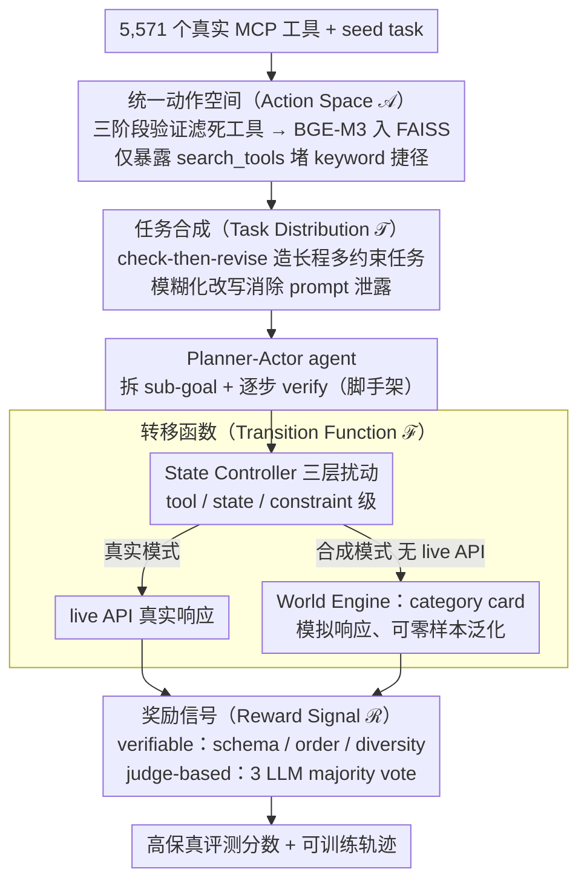

# C-World: A Computer Use Agent Environment Creator

**会议**: ACL 2026  
**arXiv**: [2601.06328](https://arxiv.org/abs/2601.06328)  
**代码**: https://ziqiao-git.github.io/C-World/ (有)  
**领域**: LLM Agent / 计算机使用 / Agent 环境  
**关键词**: MCP 工具, 长程任务, World Model, 状态扰动, 评测+训练数据引擎

## 一句话总结
作者将"agent 环境"形式化为 Action / Task / Transition / Reward 四元组并实现为 C-World：用 5,571 个真实 MCP 工具 + 自动任务合成 + state controller 扰动 + 双信号 reward 提供高保真评测，又用一个"World Engine"在无 live API 下模拟工具响应实现可规模化训练；评测 9 个前沿 LLM 发现"规划普遍强、执行普遍弱"，仅用 1,170 条 C-World 轨迹微调即可超过用 119k 样本训练的 baseline。

## 研究背景与动机

**领域现状**：单轮 function-calling 已接近饱和（BFCL 等基准均被刷到很高），但真实"计算机使用"任务往往涉及几十轮交互、跨多个 app、含模糊约束和动态失败。现有 agent benchmark（AgentBench、ToolBench、WebArena 等）要么工具数有限（<600），要么是静态题集，无法支持持续训练。

**现有痛点**：(1) 工具池小、领域单一，难以体现真实工作流的广度；(2) 任务静态，不能"自我进化"出新约束；(3) 缺少"扰动"——所有任务都是 happy path，无法测 agent 的 recovery / replan；(4) 评测信号简单（pass/fail 或 LLM judge），无法分离"规划失败"和"执行失败"；(5) 训练完全依赖真 API，受成本、速率、状态不稳定限制，做不到大规模轨迹采集。

**核心矛盾**：要让 agent 像人一样在复杂环境中学，就需要"广、深、可扰动、可低成本规模化"的环境，但人工搭这种环境本身贵到不可行；如果靠 live API，又被外部服务的速率/费用/不稳定卡死。

**本文目标**：(1) 形式化"agent 环境"应该包含哪些组件；(2) 构造一个可按需生成新环境的系统而不是固定 benchmark；(3) 提供一个不依赖 live API 的"world model"模式，让训练侧能规模化。

**切入角度**：把 RL 里成熟的 MDP 四元组（动作空间、转移、奖励、任务分布）原样套到 LLM agent，并把"工具调用响应"建模成一个可由 LLM 模拟的转移函数 → world engine。

**核心 idea**：定义 $(\mathcal{A},\mathcal{T},\mathcal{F},\mathcal{R})$ 四组件 + 真实模式 / 合成模式双轨实现；4 个组件全部用"自动合成 + LLM 模拟"替代人工。

## 方法详解

### 整体框架
C-World 把 RL 教科书里的 MDP 四元组原样搬到 LLM agent，把"agent 环境"形式化为 $(\mathcal{A},\mathcal{T},\mathcal{F},\mathcal{R})$ 四个组件——动作空间、任务分布、转移函数、奖励——再额外配一个 World Engine 把"工具响应"也建模成可由 LLM 模拟的转移。输入是 5,571 个真实 MCP 工具与一组 seed task，系统先自动合成长程任务、让 Planner-Actor agent 在 State Controller 注入的扰动下逐步执行、最后由双信号 reward 打分，从而得到高保真评测；而当切到合成模式时，World Engine 在不连 live API 的情况下批量生成"以假乱真"的工具响应，把训练轨迹采集从外部服务的速率与费用中解放出来。两套模式共用同一形式化骨架，使同一环境既能当评测台又能当训练数据引擎。

### 关键设计

**1. 统一动作空间 + 工具检索（Action Space）：把五千多个真实工具变成一个"既全又活"的可检索动作池**

以往 benchmark 要么硬塞一小撮工具（不真实），要么给一大堆却大半失效（不可执行），还容易让 agent 靠 keyword 走捷径。C-World 先用 registry 爬虫加人工补充，从 Smithery 抓 276 个 MCP server、5,571 个工具（覆盖 Gmail/GitHub/Slack 等 204 个常用 app），为需鉴权的服务配专用虚拟账号，再做三阶段验证（authenticated availability → successful invocation → usable responses）滤掉死工具。存活工具把"server identity + tool name + 描述 + schema"拼成文档，经 BGE-M3 编码后存入 FAISS，运行时只暴露一个 `search_tools(query, k)` 接口——agent 拿不到全量工具列表，必须自己检索、按需 load，这条唯一入口既保证规模真实又堵死 keyword 捷径。

**2. check-then-revise 任务合成 + 反捷径机制（Task Distribution）：无人工标注地造出长程、多 app、含 wild constraint 的任务**

合成任务的老毛病是要么太短、要么靠堆 steps 凑长，还会在评测时被合成 prompt 泄露答案。C-World 先采样 1~3 个 seed tool，用其描述做查询、经 `search_tools` 召回更大候选集，并对 server 做 round-robin 采样（强制最少 server 数）以保证跨 app。随后 LLM 生成初始 query 并进入 check-then-revise 循环，自动评估两项指标——tool coverage（是否合理激活全部候选工具）与 constraint quality（约束是否多样、互相耦合、产生长程依赖）——不达标就反馈重写，硬把任务推向长程。最后做模糊化改写（用"send the summary to the team"而非"use slack_post_message"），配合只暴露 `search_tools`，迫使 agent 自行分解 sub-query 检索，从源头消除"合成 prompt 泄露"的隐性 leakage。

**3. 三层 State Controller + World Engine（Transition Function）：让环境既能复现真实失败，又能脱离 live API 规模化**

纯随机噪声 agent 学不到东西，而死守 live API 又会被速率和费用卡死，所以转移层要同时解决"可复现的针对性扰动"和"低成本规模化"两件事。State Controller 是一个嵌在 agent runtime 内、拦截 MCP 出入流量的轻量 Python 中间件，按"adversity budget"注入三类扰动：tool-level（超时/不可用/限流）、state-level（payload 截断/session 失效）、constraint-level（中途加新规则）；为公平起见，每个模型遭遇的扰动总量恒定、仅触发时机随机。World Engine 则把工具按功能归类建"category card"（含典型响应模式、字段结构、常见失败），再以 schema + few-shot + 会话 log 为条件让 LLM 直接生成响应——因为只依赖 schema 与卡片，它能对同类未见工具零样本泛化，甚至能模拟现实中不存在的企业级环境做 stress test。在 50 个评测任务上，World Engine 与 live 执行的模型排名相关系数达 Spearman $\rho=0.883$，证明它几乎可平替真实 API。

**4. 双信号 reward（Reward Signal）：把"可机判"和"需理解"的评分分离，便宜可复现又贴合人类**

单一 pass/fail 粒度太粗、分不清是规划还是执行出错，而纯 LLM judge 又噪声大、贵、还可能偏向某一家模型。C-World 因此把奖励拆成两路互补信号。verifiable 一路直接从执行日志确定性计算、不过模型：schema compliance（每次工具调用对官方 JSON schema 校验）、order constraints（执行时间戳对任务依赖图）、information diversity（统计访问的不同 server/source 数），便宜、可复现、无 judge 噪声。judge-based 一路则处理需要理解意图的语义维度：用 GPT-4o / GPT-5.1 / DeepSeek-V3.2 三个前沿模型做 LLM-as-judge、majority vote 聚合，给 completeness（意图是否真正解决）、grounding（答案是否严格源于工具观测、罚幻觉）、format、tradeoff（冲突目标的取舍是否合理）打分。跨家集成 + 多数投票既中和了"偏袒自家模型"的担忧（集成里有两个 OpenAI judge，gpt-4o-mini 仍排垫底），又把人类对齐做到 Spearman $\rho\approx0.73\text{–}0.76$，逼近 0.773 的人类天花板。

### 一个完整示例
以一个"整理本周 GitHub issue 并通知团队"的合成任务为例：任务合成阶段从 GitHub、Slack 两个 seed tool 出发召回候选集，check-then-revise 把它扩成"汇总 high-priority issue + 按截止日期排序 + 发到对应频道"的多约束长程任务，并模糊化为"summarize this week's urgent issues and let the team know"。运行时 Actor 先 `search_tools("list github issues")` 检索并调用工具，Planner 把任务拆成"取 issue → 过滤 → 汇总 → 发送"的 sub-goal graph 并逐步 verify。途中 State Controller 按预算注入一次 state-level 扰动（GitHub 返回被截断的 payload）与一次 constraint-level 扰动（中途追加"只发 P0 级"），考验 agent 的 replan 与 recovery。任务结束后 reward 层用 verifiable 信号（schema/order/diversity）加 judge-based 信号（completeness/grounding/tradeoff，3 个前沿 LLM majority vote）给出最终评分。同一条任务若切到合成模式，则上述所有工具响应都由 World Engine 凭 category card 生成，无需真连 GitHub/Slack。

### 损失函数 / 训练策略
训练侧从 50 个 seed task 的"首轮有效动作"（abstract intent → 具体工具检索/调用）筛出 1,170 条样本，转成 ms-swift 格式后按 Hermes-style agent supervision（显式建模 tool invocation / tool response）做 SFT，并与 Toucan（119k）、ToolACE（11.3k）公平对比；结果是 1.2k 条 C-World 轨迹反超 119k 样本的 baseline，说明"长程 + 约束密集 + 含扰动"的轨迹远比海量 happy path 更值钱。

## 实验关键数据

### 主实验
9 个前沿 LLM 在 C-World 真实模式下的总分（10 分制 + %）：

| 模型 | Overall | Completeness | Recovery% | Format% | Tool Calls |
|------|---------|-----|-----|-----|-----|
| gemini-3-pro-preview | **5.87** | 4.75 | 89.0 | 53.9 | 47.9 |
| claude-opus-4.5 | 5.42 | 4.70 | 83.7 | 51.0 | 45.2 |
| deepseek-v3.2 | 4.97 | 4.00 | **90.6** | 39.5 | 21.7 |
| grok-4 | 4.78 | 3.80 | 89.0 | **68.3** | 27.4 |
| gpt-oss-120b | 4.66 | 3.42 | 72.7 | 35.8 | 14.4 |
| gpt-5.2 | 4.43 | 3.42 | 79.3 | 12.4 | 29.2 |
| qwen3-235b-a22b | 3.53 | 2.56 | 88.1 | 31.3 | 11.2 |
| gpt-4o-mini | 3.07 | 1.13 | 50.6 | 3.3 | 51.7 |

### 消融实验（World Engine 训练数据效率 + 模拟保真度）

| 模型 / 训练数据 | 样本数 | BFCL | MCP-Universe |
|------|-----|------|------|
| Qwen2.5-7B base | – | 19.93% | 4.40% |
| + Toucan | 119k | 27.18% | 15.28% |
| + ToolACE | 11.3k | 27.06% | 2.23% |
| **+ C-World** | **1.2k** | **28.58%** | **15.30%** |
| Qwen3-8B base | – | 18.32% | 6.35% |
| + Toucan | 119k | 27.39% | 6.67% |
| + ToolACE | 11.3k | 29.49% | 3.29% |
| **+ C-World** | **1.2k** | **30.05%** | **8.86%** |

| 评测模式 | Spearman ρ |
|------|------|
| World Engine (合成) vs Real Exec | **0.883** |
| DeepSeek-V3.2 judge vs Human | 0.759 |
| GPT-5.1 judge vs Human | 0.733 |
| Human vs Human ceiling | 0.773 |

### 关键发现
- **执行能力是 bottleneck**：所有模型的 Goal Decomposition 得分都在 7.7~8.6（规划没差距），但 Completeness 跨模型从 1.13 到 4.75（差距 4×），说明问题在"做"不在"想"。
- **工具调用数 ≠ 成功率**：gpt-4o-mini 调 51.7 次最多却最差（陷入循环式重复调用），Gemini-3-Pro 用相近 47.9 次拿最高分；说明高活动量必须配上高 reasoning 才有用。
- **约束遵循是主要失败模式**：Format compliance 跨模型从 3.3% 到 68.3%，比 tool invocation 的差距大得多。
- **World Engine 几乎可平替 live API**：模型排名 Spearman 0.883；judge 集成也接近人类 ceiling 0.773（仅低 0.014）。
- **数据效率惊人**：1,170 条 C-World 轨迹 SFT 反超 119k Toucan 样本，证明"长程 + 约束密集 + 含扰动"的轨迹比海量 happy path 更值钱。

## 亮点与洞察
- 把 RL 教科书里的 $(\mathcal{A},\mathcal{T},\mathcal{F},\mathcal{R})$ 形式化套到 LLM agent 是非常聪明的"还原"——之前 agent 论文经常把环境讲成黑盒，本文显式拆开后立刻清楚每个组件该怎么独立改、独立评测。
- World Engine 的"category card"设计是 zero-shot 泛化到同类未见工具的关键——比 per-tool demonstration 便宜得多，且让"完全不存在的工具"也能拥有可信的响应分布，可以用于做 stress test。
- "adversity budget 恒定 + 触发时机随机化" 是漂亮的公平性设计，回避了不同模型遭遇不同难度的偏差。
- "Planner-Actor 同模型 + Planner 每步 verify sub-goal" 是给长程任务找到的轻量解药——比 multi-agent 角色专业化简单，但 Table 3 显示 Gemini-3-Pro 凭它从首轮第 5 名爬到第 1 名。
- 1,170 条 > 119k 这种"训练数据效率"结论可能比 benchmark 数字本身更值得整个社区关注：暗示工具学习的核心是"少而硬"的轨迹，而不是"多而易"。

## 局限与展望
- 评测集只 50 个 seed scenario + 254 LongSeal 题，对工具-server-约束的组合空间覆盖远不充分。
- 主分析集中在 frontier / 大开源模型，sub-10B 模型只在 Appendix H 给了 4 个数据点；C-World 框架本身能不能稳定指导小模型训练有待验证。
- World Engine 虽然 Spearman 高，但绝对分数和 live execution 有系统偏差（如 deepseek-v3.2 合成 Pass% 只有 38.9%，远低于真实 87.5%），用作训练监督时可能引入偏差。
- 改进思路：(1) 把任务合成做成持续进化（new server / new failure mode 自动接入）；(2) world engine 输出做置信度估计，低置信时 fallback 到 live；(3) 把 sub-10B 模型纳入主分析，找到"对工具学习友好"的小模型起点。

## 相关工作与启发
- **vs AgentBench / WebArena**: 都是静态 benchmark，工具数少（18~600 vs 5,571）、不可重生成；C-World 的环境-级合成 + 状态扰动 + 模糊指令是真正"可演化"的环境。
- **vs ToolBench / Toucan**: 都做工具学习数据合成，但只是任务静态、无 transition 扰动；本文的 1.2k > 119k 直接打脸"靠堆数据涨点"的做法。
- **vs StableToolBench / MCP-Bench**: 同样关注 MCP 工具调用，但本文是第一个把"工具响应模拟器"（World Engine）形式化做出来并实证可平替 live API 的工作。
- **启发**：(1)「显式 $(\mathcal{A},\mathcal{T},\mathcal{F},\mathcal{R})$ 拆分」可迁移到任何需要 agent 评测的领域（多模态 agent、autonomous coding）；(2) category card 思路可推广到其他模拟器（如代码执行环境、浏览器）减少 per-instance 监督。

## 评分
- 新颖性: ⭐⭐⭐⭐⭐ "环境创建系统"而非"benchmark"是范式转移；World Engine 用 LLM 模拟 MCP 响应是新方向。
- 实验充分度: ⭐⭐⭐⭐ 9 个 frontier LLM + 真/合成双模式 + 训练侧 SFT 对比 + Per-event-type Recovery + 人类对齐 + 5 维 persona 分析，但 seed task 数（50）和 small model 覆盖偏少。
- 写作质量: ⭐⭐⭐⭐ 形式化清晰，每个组件都有独立 section 和示例；附录 F 把扰动类型用 4 个真实 trajectory 讲清楚，可读性很高。
- 价值: ⭐⭐⭐⭐⭐ 5,571 工具 + 双模式 + 公开代码，是目前最实用的 computer-use agent 训练评测基础设施之一；1.2k 反超 119k 的发现也直接改变工具学习的数据收集策略。

<!-- RELATED:START -->

## 相关论文

- [\[ACL 2025\] AXIS: Efficient Human-Agent-Computer Interaction with API-First LLM-Based Agents](../../ACL2025/llm_nlp/axis_efficient_human-agent-computer_interaction_with_api-first_llm-based_agents.md)
- [\[ICLR 2026\] WebOperator: Action-Aware Tree Search for Autonomous Agents in Web Environment](../../ICLR2026/llm_nlp/weboperator_action-aware_tree_search_for_autonomous_agents_in_web_environment.md)
- [\[NeurIPS 2025\] Do Language Models Use Their Depth Efficiently?](../../NeurIPS2025/llm_nlp/do_language_models_use_their_depth_efficiently.md)
- [\[ICML 2026\] Express Your Doubts: Probabilistic World Modeling Should Not Be Based on Token logprobs](../../ICML2026/llm_nlp/express_your_doubts_--_probabilistic_world_modeling_should_not_be_based_on_token.md)
- [\[ICML 2026\] Multi-Agent Teams Hold Experts Back: 自组织 LLM 团队为什么留不住「专家」](../../ICML2026/llm_nlp/multi-agent_teams_hold_experts_back.md)

<!-- RELATED:END -->
