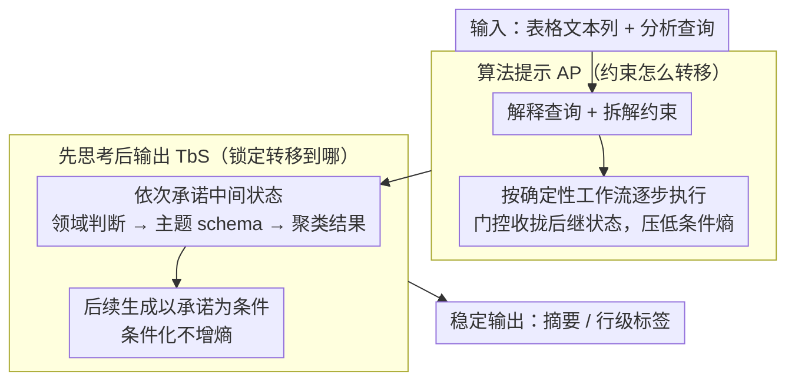

# CAST: Achieving Stable LLM-based Text Analysis for Data Analytics

**会议**: ACL 2026 Findings  
**arXiv**: [2602.15861](https://arxiv.org/abs/2602.15861)  
**代码**: [https://github.com/jxtse/CAST-text-analysis](https://github.com/jxtse/CAST-text-analysis)  
**领域**: LLM评测  
**关键词**: 输出稳定性, 文本分析, 表格数据, 算法提示, 中间状态承诺

## 一句话总结

提出CAST框架，通过算法提示（Algorithmic Prompting）和先思考后输出（Thinking-before-Speaking）两种机制约束LLM的潜在推理路径，显著提升文本摘要和标注任务的运行间稳定性，同时不损失输出质量。

## 研究背景与动机

**领域现状**：Text Analysis for Data Analysis (TADA) 是将表格中的自由文本列转化为结构化表示（如摘要主题、行级标签）的范式。LLM是执行TADA的天然候选工具，一个模型通过自然语言查询即可完成多种文本分析任务。

**现有痛点**：LLM生成的概率性本质与数据分析的确定性需求之间存在根本冲突。同一输入在不同运行中可能产生语义漂移的输出（如同一条评论被标记为"Customer Service"或"Support Team"），导致下游的过滤、分组、聚合结果不一致，破坏可复现性和信任度。

**核心矛盾**：不稳定性的根源在于LLM内部存在无约束的潜在推理轨迹。从概率视角看，提示LLM会在可能的推理路径上诱导一个分布；当该分布熵较高（模型对下一步推理不确定）时，微小的随机波动就会导致输出漂移。现有方法（如Self-Consistency）通过多次采样投票来提升正确性，但不针对稳定性设计。

**本文目标**：在不依赖重复采样的前提下，通过约束生成过程中的推理路径来实现输出稳定性。

**切入角度**：作者观察到，让模型在生成最终输出前先产生相关的中间推理状态，即使不指定具体内容，也能显著降低输出长度和内容的方差。

**核心 idea**：通过算法提示提供程序化脚手架约束推理转移，通过先思考后输出机制将关键中间状态显式固定，两者协同使推理路径集中在少数高概率轨迹上。

## 方法详解

### 整体框架

CAST把"输出稳定性"问题归结为"推理路径分布的熵"问题：LLM 在生成最终结构化结果前会隐式走过一条潜在推理轨迹，当这条轨迹的分布熵高时，随机扰动就会让输出漂移。框架因此用一次结构化的 LLM 调用，输入表格文本列与分析查询，输出稳定的摘要或行级标签——中间通过程序化脚手架约束状态转移、并强制模型显式写下关键中间状态，把推理压到少数高概率轨迹上。同一套模板只需切换任务特定的 schema 与约束即可在摘要和标注间复用，无需任何重复采样或投票。（稳定性度量 CAST-S / CAST-T 不在这条推理链上，而是事后跨多次运行评测一致性，故不出现在下图。）

### 关键设计

**1. 算法提示（Algorithmic Prompting, AP）：用确定性工作流修剪无效推理路径**

不稳定性的根源是模型在每一步都有大量"看似合理"的下一状态可走，转移无约束。AP 把经典的确定性分析工作流和专家启发式编码成结构化的提示序列——例如摘要任务先要求模型解释查询、拆解约束，再按固定算法流程逐步执行。形式上这相当于在每个推理步引入一个门控函数 $g_t(z_t, z_{<t}, x)$，通过硬掩码或软加权把概率质量收拢到更少的合理后继状态上，从而压低局部条件熵 $H(Z_t|Z_{<t}, x, \mathcal{C}_{AP})$。脚手架本身充当了强先验，等于在采样前就替模型砍掉了大片不该走的路径。

**2. 先思考后输出（Thinking-before-Speaking, TbS）：把关键中间状态显式钉死**

如果让模型隐式遍历整条推理轨迹、只吐出最终答案，那么轨迹上每一步的随机性都会累积到输出里。TbS 反其道而行，要求模型依次先生成并"承诺"一批中间状态（如领域判断、主题 schema、聚类结果），后续每一步生成都以这些已落地的承诺为条件。其依据是条件化必然不增熵的信息论事实 $H(Z_{>t}|X=x, Z_{\leq t}) \leq H(Z_{>t}|X=x)$：一旦 schema、主题集或领域决策被固定下来，后续生成就被迫与之保持一致，整条路径对微小随机波动也就不再敏感。AP 负责约束"怎么转移"，TbS 负责锁定"转移到哪"，两者协同把熵进一步压低。

**3. 稳定性度量 CAST-S / CAST-T：为运行间一致性量身定制的评测指标**

ROUGE-L、余弦相似度等通用指标对分析场景里真正要命的语义漂移和排序变化并不敏感，所以作者另立两个指标。摘要用 CAST-S，融合衡量内容重叠的语义分 $S_{sem}$ 与基于 Kendall's Tau 的排序一致性分 $S_{pos}$，加权为 $S_{CAST-S}(\alpha) = \alpha \cdot S_{sem} + (1-\alpha) \cdot S_{pos}$；实验中 $\alpha=0.9$ 时与人类判断相关性最高（$r=0.813$）。标注用 CAST-T，先让 LLM 把多次运行得到的标签按语义等价聚类，再以主导聚类所占比例作为稳定性分数，从而能识别"Customer Service"与"Support Team"这种语义相同但字面不同的漂移。

### 损失函数 / 训练策略

CAST 是纯推理时方法，不涉及任何训练或微调。全部约束都通过精心设计的结构化提示在单次 API 调用内完成，因此既不需要多次采样，也没有投票或后处理聚合的额外开销。

## 实验关键数据

### 主实验

| 模型 | 方法 | 摘要稳定性(CAST-S)↑ | 独立标注准确率↑ | 联合标注稳定性(CAST-T)↑ |
|------|------|---------------------|-----------------|------------------------|
| GPT-5.2 | Baseline | 9.24 | 95.0% | 9.40 |
| GPT-5.2 | Self-Consistency | 7.40 | 96.2% | 9.16 |
| GPT-5.2 | CAST | **9.39** | **98.2%** | **9.60** |
| DeepSeek-V3.2 | Baseline | 8.15 | 92.7% | 8.78 |
| DeepSeek-V3.2 | CAST | **9.47** | 95.6% | **9.14** |
| Gemini-3-Flash | Baseline | 9.80 | 96.0% | 8.18 |
| Gemini-3-Flash | CAST | **9.93** | **96.8%** | 8.26 |

### 消融实验

| 配置 | 摘要稳定性 (DeepSeek) | 说明 |
|------|----------------------|------|
| Full CAST (AP+TbS) | 9.47 | 完整模型 |
| AP Only | 8.97 | 仅算法提示 |
| TbS Only | 9.46 | 仅先思考后输出 |
| Few-shot | 8.96 | 少样本提示 |
| Self-Consistency | 7.06 | 多次采样投票反而更差 |

### 关键发现
- Self-Consistency在稳定性上反而最差，因为其扩散采样不适合可靠的事后聚合，且计算开销是CAST的3倍以上
- AP和TbS有协同效应，完整CAST通常优于单独使用任一组件
- CAST在提升稳定性的同时还略微提升了摘要质量（recall从0.854提升至0.879）

## 亮点与洞察
- 从信息论角度形式化了LLM输出不稳定性的机制——推理路径的高熵，并给出了约束推理降低熵的理论框架，这比经验性调参更有说服力
- 发现即使不指定中间状态的具体内容，仅要求模型产生相关中间推理就能降低输出方差，这个观察极其实用
- CAST-S/CAST-T评估指标填补了稳定性量化的空白，适用于任何需要LLM输出一致性的场景

## 局限与展望
- 算法脚手架目前需要人工设计，扩展到全新任务领域可能受限
- 实验主要覆盖摘要和标注，未验证在更复杂的TADA组合工作流中的效果
- 过度约束可能抑制某些分析场景中有价值的细微变化

## 相关工作与启发
- **vs Self-Consistency**: SC通过多次采样投票提升正确性，但不保证稳定性，且计算成本高。CAST用单次调用通过约束推理路径实现稳定性
- **vs Algorithm-of-Thoughts**: AoT目标是提升正确性，CAST目标是提升稳定性，是对"约束推理"思路的不同应用方向

## 评分
- 新颖性: ⭐⭐⭐⭐ 首次系统化地研究LLM在数据分析场景中的输出稳定性问题
- 实验充分度: ⭐⭐⭐⭐ 3个模型、多个基线和消融、人类评估验证指标
- 写作质量: ⭐⭐⭐⭐⭐ 理论框架和实证观察结合紧密，叙述清晰
- 价值: ⭐⭐⭐⭐ 对LLM在生产环境中的可靠部署有重要参考价值

<!-- RELATED:START -->

## 相关论文

- [\[ACL 2026\] Synthetic Eggs in Many Baskets: The Impact of Synthetic Data Diversity on LLM Fine-Tuning](synthetic_eggs_in_many_baskets_the_impact_of_synthetic_data_diversity_on_llm_fin.md)
- [\[AAAI 2026\] Collaborative LLM Numerical Reasoning with Local Data Protection](../../AAAI2026/llm_nlp/collaborative_llm_numerical_reasoning_with_local_data_protection.md)
- [\[ACL 2025\] Enabling LLM Knowledge Analysis via Extensive Materialization](../../ACL2025/llm_nlp/enabling_llm_knowledge_analysis_via_extensive_materialization.md)
- [\[CVPR 2026\] LLM-Guided Probabilistic Fusion for Label-Efficient Document Layout Analysis](../../CVPR2026/llm_nlp/llm-guided_probabilistic_fusion_for_label-efficient_document_layout_analysis.md)
- [\[ICLR 2026\] Fine-Grained Activation Steering: Steering Less, Achieving More](../../ICLR2026/llm_nlp/fine-grained_activation_steering_steering_less_achieving_more.md)

<!-- RELATED:END -->
