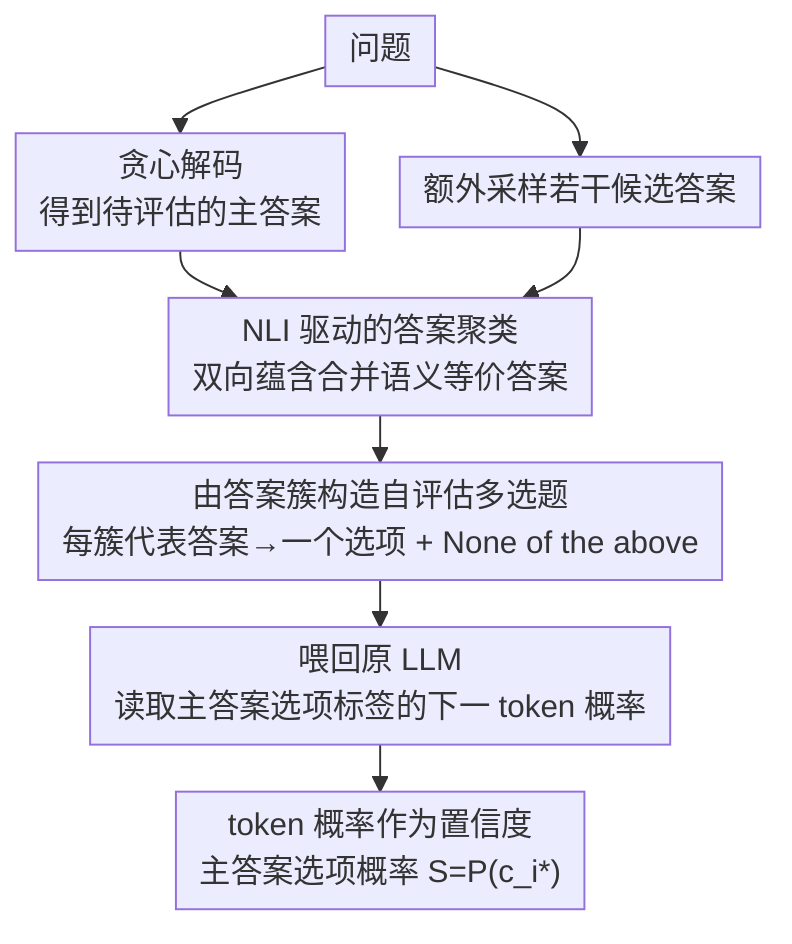

# Clustered Self-Assessment: A Simple yet Effective Method for Uncertainty Quantification in Large Language Models

**会议**: ACL2026 Findings  
**arXiv**: [2606.03846](https://arxiv.org/abs/2606.03846)  
**代码**: https://github.com/ccqq77/clustered_self_assessment  
**领域**: LLM不确定性估计 / NLP理解  
**关键词**: 大语言模型校准, 不确定性量化, 语义聚类, 自评估, 多选题重构

## 一句话总结
这篇论文提出 Clustered Self-Assessment：先把 LLM 的多个采样答案按语义聚成互斥选项，再让同一个 LLM 通过多选题概率给原答案打置信分，从而在 TQA、NQ 和 XSum 上获得比语义熵、P(True) 等基线更好的 AUROC 与 Brier 校准表现。

## 研究背景与动机
**领域现状**：LLM 在问答、摘要和开放式生成中已经很强，但它们经常生成流畅却错误的答案。实际部署时，用户不只需要答案本身，还需要知道模型对答案有多确定，因此不确定性量化成为可靠 LLM 系统的基础组件。

**现有痛点**：一类方法让模型直接用自然语言表达“不确定”，但先前工作已经观察到 LLM 往往过度自信。另一类方法从多次采样答案之间的分歧计算不确定性，如 predictive entropy、semantic entropy、EigV、Deg、SAR 等；这些方法能捕捉输出发散，却通常得到间接分数，用户不容易理解，也没有真正利用模型对候选答案的内部判断能力。

**核心矛盾**：采样式方法知道“模型可能说出哪些答案”，自评估方法知道“模型如何比较候选答案”，但二者通常分开使用。若直接把所有采样答案作为选项，又会出现语义等价答案重复切分概率质量的问题；若不采样，只问 P(True)，模型只能评价单个答案，缺少竞争性候选。

**本文目标**：作者希望构造一种无需训练、可解释且样本效率较高的不确定性估计方法：既保留采样答案提供的候选空间，又把语义相同的答案合并为清晰选项，并把 LLM 对选项 token 的概率直接作为置信度。

**切入角度**：论文的观察是，LLM 面对结构化多选题时可以给出更明确的相对偏好；如果选项来自模型自己的采样答案，且经过语义聚类去重，那么这个多选题就相当于让模型对“自己可能给出的几种答案”做一次显式自评估。

**核心 idea**：用 NLI 语义聚类把采样答案变成互斥 MCQ 选项，再用原 LLM 对目标答案选项的 token 概率 $S=P(c_{i^*})$ 作为可解释置信分。

## 方法详解

### 整体框架
Clustered Self-Assessment 是一个两阶段流程。给定问题后，模型先用贪心解码得到需要评估的主答案，同时额外采样若干答案。随后方法用 NLI 模型比较这些答案之间的语义关系，把互相兼容或蕴含的答案合并到同一簇。每个簇的代表答案被转写成一个多选题选项，并额外加入 “None of the above” 选项。最后，论文把这个多选题喂回原 LLM，读取模型对主答案所在选项标签的下一 token 概率，作为该答案的置信度。

这个流程的关键不是让模型再生成一段解释，而是把不确定性估计变成一个单 token 概率读取问题。采样负责暴露可能答案空间，聚类负责压缩语义冗余，多选题负责触发模型的比较式自评估。

### 关键设计

**1. NLI 驱动的答案聚类：把采样答案里语义重复的部分先合并掉，再让它们当选项**

直接把所有采样答案塞进多选题会踩一个坑：同一个意思被换成两三种说法时，模型的概率质量会被这些等价选项瓜分，原本该集中的置信度因此被低估；可如果反过来把语义冲突的答案也合并，又会把真实的不确定性遮住。作者用 NLI 关系来精确划清这条界限——对任意答案对 $(a_i,a_j)$，外部 NLI 模型双向判断 $a_i\rightarrow a_j$ 与 $a_j\rightarrow a_i$ 是 entailment、neutral 还是 contradiction。聚类时按固定顺序逐个处理采样答案并维护若干簇及其代表：新答案与某代表之间若没有 contradiction、或双向关系满足足够的 entailment，就并入该簇，否则另起一簇。之所以用蕴含关系而非 embedding 相似度，是因为这里要回答的是"两个答案能否互相支持"，这正是 NLI 擅长、而单纯的向量距离常常判错的判断。

**2. 由答案簇构造自评估多选题：把"原答案对不对"翻译成"在几个候选里我更信哪个"**

让模型直接说一句 confidence 时它往往过度自信，而纯熵分数又是个用户读不懂的间接量。这一步把开放式评估改造成结构化比较：每个答案簇对应一个 MCQ 选项，主答案所在簇也是其中之一，再额外加一个 "None of the above" 兜住所有候选都不可靠的情况。模型不必再生成任何长文本，只需对 A/B/C 这些选项标签 token 分配概率。多选题这个形式把"我对原答案有多确定"自然转写成"我在自己采样出的这几种答案里更倾向哪一个"，既比口头表达 confidence 稳定，也比一个熵值更容易向用户解释。

**3. token 概率作为置信度：直接读模型在正确选项上的那一格概率，不另训校准器**

有了多选题，置信度就不必再绕弯。设 LLM 输出词表 logits 为 $\mathbf{z}$，选项标签 token $c_i$ 的概率为

$$P(c_i)=\frac{\exp(z_{c_i})}{\sum_v \exp(z_v)},$$

主答案对应选项 $c_{i^*}$ 的概率 $S=P(c_{i^*})$ 即为该答案的置信分。这个分数直接落在模型对候选答案分配的概率质量上，天然归一化、可跨样本比较、可直接送进校准评估，既不需要额外训练一个校准器，又比语义熵这类间接指标更贴近"模型究竟有多相信这个答案"的语义——采样负责暴露可能的答案空间，聚类负责压掉语义冗余，多选题负责把模型的比较式判断逼出来，最终全部凝结成这一格概率。

### 损失函数或训练策略
主方法本身不需要训练。实验中，作者对 Qwen2.5、Qwen3、Gemma-3 系列共 7 个开源模型做推理评估；采样式方法默认使用 8 个额外样本，温度默认 $\tau=0.5$。答案聚类默认使用 deberta-large-mnli，并在附录中比较更大的 DeBERTa NLI 模型和 embedding-based 聚类替代方案。论文还把该置信分作为监督信号训练 probe：一种用 0.5 阈值二值化，另一种直接用软标签，结果显示软标签 probe 在分布外设置中比 SEP 等基线更稳。

## 实验关键数据

### 主实验
论文在 TriviaQA (TQA, 9,960 样本)、Natural Questions (NQ, 3,610 样本) 和 XSum (11,334 测试样本) 上评估，主指标为 AUROC；下表摘取 Qwen2.5-32B 与 Gemma-3-27B 上的消融式主结果，展示完整方法相对去掉聚类或去掉采样的差距。

| 数据集 | 模型 | 本文 AUROC | w/o clustering | w/o sampling |
|--------|------|-----------:|---------------:|-------------:|
| TQA | Qwen2.5-32B | 0.940 | 0.874 | 0.890 |
| NQ | Qwen2.5-32B | 0.850 | 0.741 | 0.785 |
| TQA | Gemma-3-27B | 0.924 | 0.895 | 0.789 |
| NQ | Gemma-3-27B | 0.821 | 0.766 | 0.659 |

### 校准实验
校准用 Brier score，数值越低越好。本文方法在两个 QA 数据集和多种模型上都优于 P(True)、原始生成概率和 normalized semantic entropy (NSE)。

| 数据集 | 模型 | Ours | P(True) | Probability | NSE |
|--------|------|-----:|--------:|------------:|----:|
| TQA | Qwen2.5-32B | 0.0843 | 0.1172 | 0.2267 | 0.1200 |
| NQ | Qwen2.5-32B | 0.1597 | 0.1918 | 0.3155 | 0.1993 |
| TQA | Gemma-3-27B | 0.0721 | 0.1758 | 0.1975 | 0.0937 |
| NQ | Gemma-3-27B | 0.1736 | 0.2354 | 0.3503 | 0.2462 |

### 稳健性与敏感性
| 分析项 | 关键结果 | 说明 |
|--------|----------|------|
| 样本效率 | 2 个额外样本即可达到有竞争力表现 | 采样成本是主要开销，少样本下仍强说明 MCQ 自评估利用了候选结构 |
| 答案顺序 | TQA/Qwen2.5-32B: Original 0.940, Reverse 0.938, Random 0.939 | 选项顺序影响很小 |
| NLI 模型大小 | TQA/Qwen2.5-32B: v1-large/v2-xlarge/v2-xxlarge 均为 0.940 | 更大 NLI 模型没有显著改变结果 |
| 采样温度 | TQA/Qwen2.5-32B: 0.25 为 0.934, 0.5 为 0.940, 0.75 为 0.938, 1.0 为 0.937 | 中等温度较稳，过低会降低答案多样性 |

### 关键发现
- 两个组件都重要：去掉 clustering 会让语义等价答案竞争概率质量；去掉 sampling 则退化到类似 P(True)，缺少候选对照。
- 校准收益很明显：Brier score 的提升说明它不是只会排序正确/错误答案，也更适合作为面向用户的置信度。
- NLI 聚类比 embedding 聚类更稳，论文附录指出显式蕴含关系建模在多数配置中优于 OpenAI/MPNet/LLM hidden embedding 的阈值或 K-means 聚类。

## 亮点与洞察
- **把不确定性估计改写成 MCQ 自评估**：这一步很简洁，却巧妙地把开放式答案评估转化为单 token 概率读取，避免了长文本自信表达的过度自信问题。
- **语义聚类是概率校准的关键前处理**：论文不是简单采样更多答案，而是先消除语义重复选项；这让概率质量真正落在“不同答案假设”上。
- **结果具有用户可解释性**：相比语义熵、图谱特征值或隐藏态 probe，选项概率天然能解释为“模型在这些候选中选择原答案的概率”。
- **可作为 probe 训练信号**：作者进一步显示该分数能监督隐藏态 probe，说明它不只是推理时 trick，也可能接近模型内部不确定性表征。

## 局限与展望
- 方法需要访问输出 logits，因此不适用于只返回文本或屏蔽 token 概率的闭源 API。
- 聚类依赖外部 NLI 模型，会引入额外开销和外部分布偏移；在专业领域、长答案或含细微数值差异的答案上，NLI 误判可能直接影响置信分。
- 当前主要在 QA 与摘要上验证，尚不清楚对长链推理、代码生成、多轮对话或安全审查任务是否同样有效。
- 未来可以用 LLM 内部表示替代外部 NLI，或者把候选聚类、MCQ 构造和置信度校准做成端到端可学习模块。

## 相关工作与启发
- **vs Semantic Entropy**: Semantic Entropy 也按语义簇度量生成分歧，但主要输出熵式间接分数；本文进一步把簇转成 MCQ，让模型显式比较候选答案。
- **vs P(True)**: P(True) 只判断单个答案是否真实，缺少替代答案作参照；本文通过采样候选让自评估更有上下文。
- **vs SAR / EigV / Deg 等采样基线**: 这些方法侧重从样本间关系推导不确定性；本文把关系建模作为构造候选的前处理，最终分数仍来自 LLM 对选项的概率。
- **启发**：在需要置信度的 RAG、医疗问答或自动评测中，可以把检索证据或多代理答案先聚成互斥假设，再让模型用结构化选择题进行自校准。

## 评分
- 新颖性: ⭐⭐⭐⭐☆ 不是发明采样或自评估本身，但把语义聚类与 MCQ token 概率结合得很自然。
- 实验充分度: ⭐⭐⭐⭐☆ 覆盖多个模型、QA/摘要任务、校准和敏感性分析；更复杂长推理任务还可补充。
- 写作质量: ⭐⭐⭐⭐☆ 方法清晰、结果组织直接，附录对聚类替代和采样设置给了足够细节。
- 价值: ⭐⭐⭐⭐⭐ 对需要可解释置信度的 LLM 系统很实用，尤其适合能访问 logits 的开源模型部署。

<!-- RELATED:START -->

## 相关论文

- [\[ACL 2025\] Revisiting Uncertainty Quantification Evaluation in Language Models: Spurious Interactions with Response Length Bias Results](../../ACL2025/llm_nlp/revisiting_uncertainty_quantification_evaluation_in_language_models_spurious_int.md)
- [\[ACL 2025\] Uncertainty Unveiled: Can Exposure to More In-context Examples Mitigate Uncertainty for Large Language Models?](../../ACL2025/llm_nlp/uncertainty_unveiled_can_exposure_to_more_in-context_examples_mitigate_uncertain.md)
- [\[ACL 2025\] Towards Harmonized Uncertainty Estimation for Large Language Models](../../ACL2025/llm_nlp/towards_harmonized_uncertainty_estimation_for_large_language_models.md)
- [\[ACL 2025\] Theory of Mind in Large Language Models: Assessment and Enhancement](../../ACL2025/llm_nlp/theory_of_mind_llm.md)
- [\[ACL 2025\] SConU: Selective Conformal Uncertainty in Large Language Models](../../ACL2025/llm_nlp/sconu_selective_conformal_uncertainty_in_large_language_models.md)

<!-- RELATED:END -->
