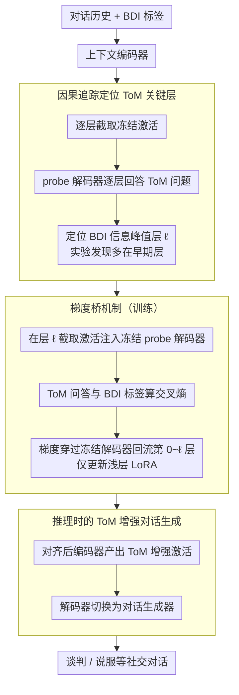

# CoSToM: Causal-oriented Steering for Intrinsic Theory-of-Mind Alignment in Large Language Models

**会议**: ACL 2026  
**arXiv**: [2604.10031](https://arxiv.org/abs/2604.10031)  
**代码**: [GitHub](https://github.com/CGCL-codes/CoSToM)  
**领域**: LLM/NLP  
**关键词**: 心智理论, 因果追踪, 激活转向, 对话系统, 社会推理

## 一句话总结
提出 CoSToM 框架，先用因果追踪定位 LLM 中编码心智理论（ToM）特征的关键层（发现主要在早期层），再通过激活转向在这些层上进行轻量级对齐，使 LLM 在谈判和说服对话中显著提升社会推理质量——从"知道但不会用"变为"知道且会用"。

## 研究背景与动机

**领域现状**：心智理论（ToM）——理解他人信念、欲望和意图的能力——是人类社会智能的标志。LLM 在标准 ToM 基准上表现不错，但研究发现它们在任务特定场景中难以泛化，依赖精心设计的 prompt 来模拟推理。

**现有痛点**：存在关键的"内部知识-外部行为"错位：LLM 可以正确回答 ToM 问题（推断用户想要柴火），但在实际谈判中却生成不连贯的提议（提供水而非柴火）。一旦去掉"推断并回应"的显式指令，模型就无法将内部编码的心理状态落地为行为。

**核心矛盾**：LLM 展现的 ToM 能力可能不是稳定的内在认知，而是由指令触发的临时模拟——内部有知识但无法自发外化为行为。

**本文目标**：(1) 发现 LLM 是否真正具有 ToM 相关的内部表征；(2) 这些表征在模型的哪些层；(3) 能否通过干预这些表征来提升下游对话质量。

**切入角度**：从机制性可解释性出发，用因果追踪定位 ToM 特征，然后用激活转向主动干预。

**核心 idea**：用冻结的 probe 解码器作为可微分验证器，反向传播 ToM 对齐损失到编码器的 ToM 关键层，通过梯度桥机制只更新浅层的 LoRA 适配器。

## 方法详解

### 整体框架
CoSToM 的出发点是"诊断再治疗"：要让 LLM 把内部已有的 ToM 知识自发外化为对话行为，得先知道这些知识藏在哪一层，再有针对性地干预那一层。框架因此分两阶段——解释阶段用因果追踪逐层扫描，定位编码 BDI（信念-欲望-意图）信息的关键层（实验发现主要在早期层）；转向阶段在这些关键层装上 LoRA 适配器，用一个冻结的 probe 解码器把 ToM 问答准确率当作监督信号反向传播回编码器。训练时输入是对话历史与 BDI 标签，解码器充当 ToM 验证器；推理时同一个编码器产出 ToM 增强的激活，解码器切换成对话生成器，输出谈判 / 说服等社交对话。

### 关键设计

**1. 因果追踪定位 ToM 关键层：先搞清 BDI 信息存在哪**

要精确干预就得先回答"ToM 特征在哪一层"。CoSToM 实例化两个模型副本——上下文编码器照常处理对话历史，探针解码器则只接收编码器某一层 $\ell$ 的冻结激活，并据此尝试回答 ToM 问题。通过逐层扫描解码器在不同 $\ell$ 上的回答准确率，就能读出哪些层真正携带了足够的 ToM 信息。这一扫描得出了反直觉的结论：ToM 特征主要集中在早期层，而非通常以为的高层语义区，且这一模式在 Llama-3-8B 与 Qwen2.5-7B 上一致，为后续只动浅层提供了依据。

**2. 梯度桥机制：让对齐损失穿过冻结解码器流回编码器浅层**

直接拿 ToM 问答任务去微调编码器，效果很差，因为"回答 ToM 问题"和"生成对话"两个目标并不对齐。梯度桥绕开了这个错配：编码器处理对话历史后，在 ToM 关键层 $\ell$ 截取激活，注入冻结的 probe 解码器，由解码器回答 ToM 问题并与 BDI 标签算交叉熵损失；梯度随后穿过冻结的解码器、穿过激活接口，一路流回编码器的第 0 层到第 $\ell$ 层，且只更新这些浅层上的 LoRA 适配器。换句话说，训练目标不是教模型"怎么答 ToM 题"，而是逼它"生成 ToM 信息更丰富的表征"，参数量也远小于全层微调。

**3. 推理时的 ToM 增强对话生成：训练与推理解耦的即插即用模块**

CoSToM 在训练和推理时让解码器扮演两种角色。推理阶段，经过 ToM 对齐的编码器照常处理对话历史，解码器不再回答 ToM 问题，而是条件化在那些 ToM 丰富的激活上直接生成任务特定对话（谈判、说服等）。正因为编码器只负责"产出好表征"、解码器负责"把表征落成对话"，二者解耦让 CoSToM 成为一个即插即用模块，能跨不同社交任务复用而无需为每个任务重新设计 prompt。

### 一个完整示例
以"用户其实想要柴火"的谈判场景为例：解释阶段先用因果追踪扫出 BDI 信息集中的早期层 $\ell$；训练阶段，编码器读入对话历史，在层 $\ell$ 截取激活送进冻结 probe 解码器，解码器回答"用户的 desire 是什么"，与标签"柴火"算交叉熵，梯度经梯度桥流回编码器第 0–$\ell$ 层、只更新 LoRA；推理阶段，同一编码器对新对话产出 ToM 增强激活，解码器据此直接生成"我可以用柴火和你交换"这类连贯提议，而不再需要"先推断再回应"的显式指令——模型从"知道但不会用"变成"知道且会用"。

## 实验关键数据

### 主实验（谈判和说服对话质量）

| 方法 | 对话质量提升 | 说明 |
|------|------------|------|
| 标准 prompt | 基线 | 仅用通用指令 |
| ToM-explicit prompt | +显著 | 需要精心设计的 prompt |
| Full-layer LoRA | +中等 | 参数多但改进不明显 |
| **CoSToM** | **+最大** | 仅更新 ToM 关键层的 LoRA |

### 因果追踪发现

| 发现 | 说明 |
|------|------|
| ToM 特征主要编码在**早期层** | 与直觉相反——通常认为高层编码语义 |
| BDI 三要素在不同层有不同峰值 | 信念/欲望/意图的编码位置不完全重合 |
| 跨模型一致 | Llama-3-8B 和 Qwen2.5-7B 都呈现类似模式 |

### 关键发现
- **ToM 特征主要编码在早期层**这一发现颠覆了"高层=高级语义"的常见假设
- **CoSToM 作为即插即用模块跨任务泛化**：在谈判和说服两个不同社交任务上都有效
- **梯度桥比直接 ToM QA 微调更有效**：因为后者训练目标与对话生成不对齐
- **轻量级**：只需更新 ToM 关键层的 LoRA 适配器，参数量远小于全层微调

## 亮点与洞察
- **"从解释到干预"的方法论**非常有启发性——先用因果追踪回答"在哪里"，再用激活转向回答"怎么用"，这种两步范式可以应用于任何 LLM 内部能力的对齐
- **冻结解码器作为可微分验证器**的设计巧妙地解决了"ToM 推理 ≠ 对话生成"的任务不对齐问题
- **"内部知识-外部行为"错位**的诊断对整个 LLM 对齐领域都有警示意义

## 局限与展望
- 需要 BDI 标注数据，获取成本较高
- 双模型架构的内存占用是 2N，对资源有要求
- ToM 关键层的定位可能因任务和数据分布变化
- 仅在谈判和说服两个任务上验证，更多社交场景（如安慰、教育）待探索
- 因果追踪的计算成本在大模型上可能较高

## 相关工作与启发
- **vs Prompt-based ToM**: prompt 方法是外部支架，CoSToM 是内部对齐——前者需要每次精心设计 prompt，后者一次训练永久生效
- **vs MindDial (Qiu et al., 2024)**: MindDial 显式追踪信念文本并拼接到输入，会传播错误。CoSToM 在激活空间操作，避免了文本层面的误差传播
- **vs Mechanistic Interpretability**: 大多数工作止步于诊断，CoSToM 从诊断走到了治疗

## 评分
- 新颖性: ⭐⭐⭐⭐⭐ 因果追踪+梯度桥的 ToM 对齐范式非常新颖
- 实验充分度: ⭐⭐⭐⭐ 跨模型验证+消融，但下游任务只有两个
- 写作质量: ⭐⭐⭐⭐⭐ RQ 驱动的结构非常清晰，图示优秀
- 价值: ⭐⭐⭐⭐⭐ 对 LLM 社会智能和对齐研究都有深远启发

<!-- RELATED:START -->

## 相关论文

- [\[ACL 2025\] Theory of Mind in Large Language Models: Assessment and Enhancement](../../ACL2025/llm_nlp/theory_of_mind_llm.md)
- [\[ACL 2026\] Mind the Gap: How Elicitation Protocols Shape the Stated-Revealed Preference Gap in Language Models](mind_the_gap_how_elicitation_protocols_shape_the_stated-revealed_preference_gap_.md)
- [\[ICLR 2026\] Fine-Grained Activation Steering: Steering Less, Achieving More](../../ICLR2026/llm_nlp/fine-grained_activation_steering_steering_less_achieving_more.md)
- [\[ACL 2026\] Repeated Sequences Reveal Gaps between Large Language Models and Natural Language](repeated_sequences_reveal_gaps_between_large_language_models_and_natural_languag.md)
- [\[ACL 2026\] Adam's Law: Textual Frequency Law on Large Language Models](adam39s_law_textual_frequency_law_on_large_language_models.md)

<!-- RELATED:END -->
