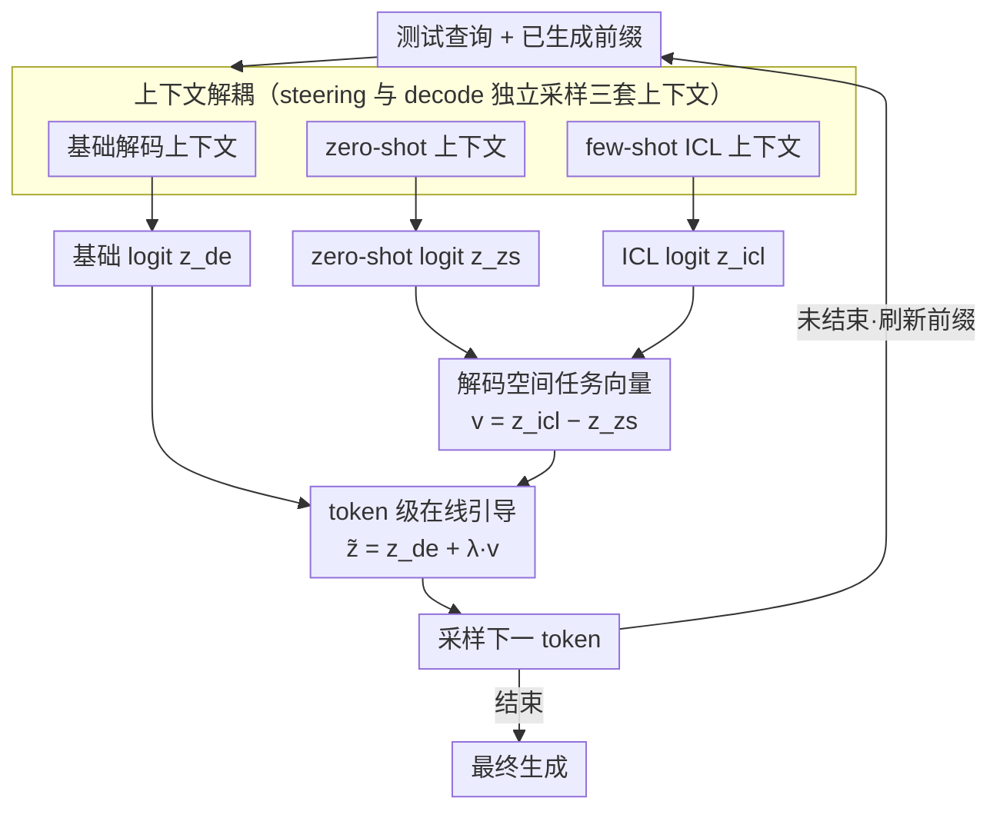

# DeCoVec: Building Decoding Space based Task Vector for Large Language Models via In-Context Learning

**会议**: ACL 2026 Findings  
**arXiv**: [2604.11129](https://arxiv.org/abs/2604.11129)  
**代码**: [GitHub](https://github.com/szu-tera/DeCoVec)  
**领域**: 机器人  
**关键词**: 任务向量, 解码空间, 上下文学习, 无训练LLM引导, logit操控

## 一句话总结
提出 DeCoVec（Decoding Space based Task Vector），一个无训练、非侵入式的框架，通过对比 few-shot 和 zero-shot prompt 的输出 logit 分布差异构建解码空间中的任务向量，注入解码过程引导生成，在 TruthfulQA、Math-500 和 AQUA-RAT 上比标准 few-shot 基线平均提升高达 5.50 准确率。

## 研究背景与动机

**领域现状**：任务向量——在高维空间中编码特定任务行为的方向——已成为引导 LLM 的有前景的工具。现有方法在两个空间操作：(1) 权重空间任务向量（需要微调）；(2) 激活空间任务向量（需要侵入式操控内部隐状态）。

**现有痛点**：(1) 权重空间方法需要每个任务完整微调，计算成本高；(2) 激活空间方法需要复杂的优化或辅助训练来操控隐状态，结构侵入性强；(3) 两类方法都限制了灵活性和可扩展性。

**核心矛盾**：需要在不修改模型参数或侵入内部结构的前提下，有效引导 LLM 的任务行为。

**本文目标**：在解码空间（输出 logit 层）构建任务向量，实现无训练、非侵入式的 LLM 引导。

**切入角度**：ICL（上下文学习）改变了 LLM 的输出分布，这种分布的变化本身编码了任务信息。可以直接在输出 logit 空间捕捉这种变化作为任务向量。

**核心 idea**：任务向量 = few-shot logit - zero-shot logit，将这个差异向量注入正常解码过程来引导生成。

## 方法详解

### 整体框架
DeCoVec 不碰模型参数也不碰内部隐状态，只在输出 logit 这一层做文章。给定一个测试查询，它在每个解码步同时维护三套上下文：基础解码上下文、zero-shot 上下文和 few-shot ICL 上下文，分别前向得到三组 logit。核心观察是 zero-shot 与 few-shot 的 logit 之差恰好刻画了「示例激活了哪些任务行为」，把这个差向量当作解码空间里的任务向量按比例叠加回基础 logit，就能逐 token 地把任务知识注入生成，而无需任何训练或结构改动。

### 关键设计

**1. 解码空间任务向量：把任务行为读成 logit 之差**

以往的任务向量要么活在权重空间（必须微调），要么活在激活空间（必须侵入隐状态），DeCoVec 把它搬到模型最终的输出接口——logit。它的依据是：zero-shot 上下文代表模型的任务无关状态，few-shot ICL 上下文代表被示例激活后的任务感知状态，两者之差就编码了 ICL 引入的任务级特征。第 $t$ 步的任务向量定义为 $\mathbf{v}_\mathcal{T}^t = \mathbf{z}_{\text{icl}}^t - \mathbf{z}_{\text{zs}}^t$。关键在于两套上下文共享同一段已生成前缀 $y^{1:t}$，因此它们的 logit 落在严格对齐的同一词表分布上，相减天然成立，不存在激活空间方法常见的序列长度错配问题，操作透明且完全可控。

**2. token 级在线引导：让任务信号随生成动态对齐**

DeCoVec 不把任务向量当成一次性算好的静态偏置，而是在每个解码步重新计算并注入。每步跑三次前向传播，得到基础解码 logit $\mathbf{z}_{\text{de}}^t$、zero-shot logit $\mathbf{z}_{\text{zs}}^t$、steering ICL logit $\mathbf{z}_{\text{icl}}^t$，再按缩放因子 $\lambda$ 把任务向量叠加到基础 logit 上得到最终分布 $\tilde{\mathbf{z}}^t = \mathbf{z}_{\text{de}}^t + \lambda \cdot \mathbf{v}_\mathcal{T}^t$。之所以要逐 token 算而不是用一个全局向量，是因为任务向量随当前生成上下文实时刷新，能始终与正在写的那部分内容对齐；$\lambda$ 控制注入强度，过大易扭曲语义，实验中 $0.5$–$1.5$ 区间最稳。

**3. steering 与 decode 上下文解耦：避免示例偏差被放大两次**

DeCoVec 把「算任务向量用的 ICL 上下文」和「做基础解码用的上下文」拆成两路，各自用独立的采样策略构建，可以选用不同的示例集。这样做的动机是：如果同一组示例既决定基础解码又决定任务向量，那么这组示例的选择偏差会在两处被同时放大；解耦之后，任务向量负责注入任务语义、基础解码负责保持流畅，二者的示例来源互不污染，也让方法对示例排序更鲁棒。

### 一个完整示例
以 AQUA-RAT 一道数学选择题为例。解码第 $t$ 步时，模型分别在三套上下文下前向：基础上下文给出 $\mathbf{z}_{\text{de}}^t$，zero-shot 上下文（仅问题，无示例）给出 $\mathbf{z}_{\text{zs}}^t$，few-shot 上下文（拼上几道带解题步骤的范例）给出 $\mathbf{z}_{\text{icl}}^t$。两者相减得到任务向量 $\mathbf{v}_\mathcal{T}^t$，它会放大与「逐步推理、写出中间算式」相关的 token 概率；取 $\lambda=1.0$ 叠加后，$\tilde{\mathbf{z}}^t$ 相比原始 few-shot 更倾向于生成结构完整的推理链而非直接跳答案。下一步用新前缀重复这一过程，任务信号随生成持续刷新，直到输出最终选项。

## 实验关键数据

### 主实验（7 个 LLM, 0.5B-9B）

| 方法 | TruthfulQA MC1/MC2/MC3 | Math-500 | AQUA-RAT | 平均Δ |
|------|----------------------|----------|----------|-------|
| Zero-shot | 基线 | 基线 | 基线 | - |
| Few-shot (Random) | +小幅 | +小幅 | +小幅 | - |
| Few-shot (KATE) | +中等 | +中等 | +中等 | - |
| **DeCoVec** | **+显著** | **+显著** | **+显著** | **+5.50** |

### 消融实验

| 配置 | 说明 |
|------|------|
| λ=0 (无任务向量) | 退化为标准 few-shot |
| λ 过大 | 任务信号过强，可能扭曲语义 |
| λ 适中 (0.5-1.5) | 最优范围，提升稳定 |
| 不同 k (示例数) | 3-5 shot 最优 |

### 关键发现
- **DeCoVec 在所有 7 个模型上一致优于 few-shot 基线**，最大提升达 5.50 平均准确率
- **任务向量编码高层任务语义而非表面模式**：分析表明向量放大了与正确推理相关的 token 概率
- **有效抑制生成退化和逻辑缺陷**：错误分析表明 DeCoVec 减少了数学推理中的逻辑错误
- **对示例排序鲁棒**：不像标准 ICL 对示例顺序敏感，DeCoVec 表现稳定
- **无额外输入 token 成本**：任务向量在 logit 空间操作，不增加输入上下文长度

## 亮点与洞察
- **在解码空间构建任务向量**是概念上的突破——将任务向量从"模型内部"搬到"模型输出接口"，使得方法完全非侵入式
- **"ICL 的 logit 差异编码任务语义"**这一发现对理解 ICL 机制有理论意义
- **三次前向传播的开销**虽然比标准解码多，但比微调或训练辅助模型轻量得多

## 局限与展望
- 每个解码步需要三次前向传播，推理延迟约为标准的 3 倍
- $\lambda$ 的最优值因任务和模型而异，需要一定调参
- 在 0.5B-9B 范围内验证，更大模型（70B+）上的效果未知
- 仅在知识和推理任务上验证，在生成任务（如对话、翻译）上的效果待探索
- 任务向量的可解释性仍需进一步研究

## 相关工作与启发
- **vs 权重空间任务向量 (Ilharco et al.)**: 需要微调，不灵活。DeCoVec 无训练
- **vs 激活空间任务向量 (In-Context Vector)**: 需要操控内部隐状态，侵入式。DeCoVec 非侵入式
- **vs Contrastive Decoding**: 对比解码用"专家 vs 业余"logit 差异来提升质量，DeCoVec 用"有示例 vs 无示例"差异来注入任务知识，思路类似但目标不同

## 评分
- 新颖性: ⭐⭐⭐⭐ 解码空间任务向量是新概念，但方法核心是 logit 差异注入，简单
- 实验充分度: ⭐⭐⭐⭐ 7 个模型+3 个基准，分析深入
- 写作质量: ⭐⭐⭐⭐ 方法清晰，与已有工作的对比表格有用
- 价值: ⭐⭐⭐⭐ 轻量级即插即用方案，对 ICL 理解有启发

<!-- RELATED:START -->

## 相关论文

- [\[ACL 2026\] UCS: Estimating Unseen Coverage for Improved In-Context Learning](ucs_estimating_unseen_coverage_for_improved_in-context_learning.md)
- [\[AAAI 2026\] LILAD: Learning In-context Lyapunov-stable Adaptive Dynamics Models](../../AAAI2026/llm_nlp/lilad_learning_in-context_lyapunov-stable_adaptive_dynamics_models.md)
- [\[ACL 2025\] Enhancing Input-Label Mapping in In-Context Learning with Contrastive Decoding](../../ACL2025/llm_nlp/enhancing_input-label_mapping_in_in-context_learning_with_contrastive_decoding.md)
- [\[NeurIPS 2025\] Unifying Attention Heads and Task Vectors via Hidden State Geometry in In-Context Learning](../../NeurIPS2025/llm_nlp/unifying_attention_heads_and_task_vectors_via_hidden_state_geometry_in_in-contex.md)
- [\[ACL 2026\] MoRI: Learning Motivation-Grounded Reasoning for Scientific Ideation in Large Language Models](mori_learning_motivation-grounded_reasoning_for_scientific_ideation_in_large_lan.md)

<!-- RELATED:END -->
