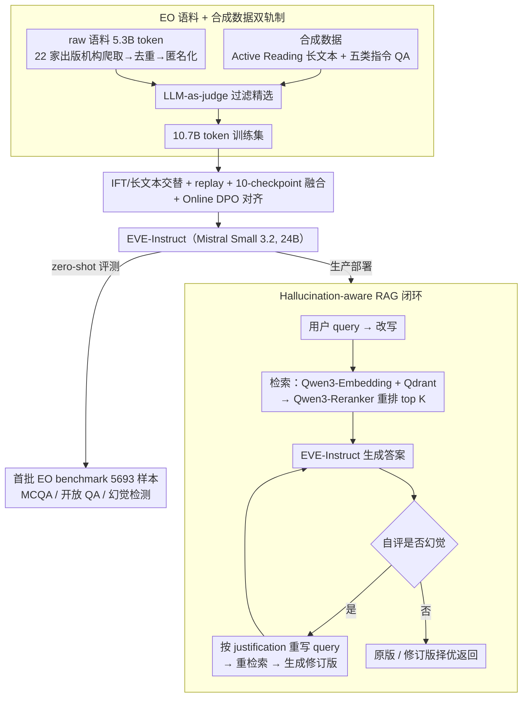

# EVE: A Domain-Specific LLM Framework for Earth Intelligence

**会议**: ACL 2026  
**arXiv**: [2604.13071](https://arxiv.org/abs/2604.13071)  
**代码**: <https://github.com/eve-esa>（模型在 <https://huggingface.co/eve-esa>）  
**领域**: 领域 LLM / 地球科学 / RAG  
**关键词**: 地球观测、领域 LLM、RAG、幻觉检测、Mistral Small 3.2、ESA

## 一句话总结
本文提出 EVE——欧空局 (ESA) Φ-lab 主导的首个面向 Earth Observation / Earth Sciences 的开源端到端 LLM 框架，包含 24B 领域适配的 EVE-Instruct（基于 Mistral Small 3.2 + 10.7B 合成 token 的 IFT/CPT 交替微调 + 10 个 checkpoint 融合）、首批 5693 条人工 EO 评测 benchmark、RAG + 幻觉检测 pipeline，已在 6 个月 pilot 中服务 350 位用户。

## 研究背景与动机

**领域现状**：Earth Observation (EO) 和 Earth Sciences 每天产生海量高价值知识，但这些知识分散在异构来源（卫星图像、科学论文、出版商专属数据库、ESA 内部文档），用户必须有深度专业知识才能拼凑出来。通用 LLM 缺乏领域专业性与严格评测，无法满足"Earth Action"决策所需的科学严谨度。

**现有痛点**：(i) 已有的领域 LLM 工作要么只做语料 + CPT（INDUS、K2、AstroLLaMA、COSMOSAGE）但缺端到端部署；要么只做空间推理工具集成（GeoLLM、GeoGPT、ChatGeoAI）但没有真正的领域 SFT。(ii) Earth Sciences 缺乏标准化对话 / NLP benchmark，没法横向比较模型。(iii) 24B 这种"中等规模"模型如何在领域适配同时不牺牲通用能力（tool calling / IF / chat quality），是产线部署的核心矛盾。

**核心矛盾**：要做一个真正可用的领域助手，必须同时解决数据（高质量 EO 语料）+ 训练（避免灾难性遗忘）+ 评测（领域 benchmark）+ 部署（RAG 接地 + 幻觉控制）四件事，前人工作只覆盖了其中一两件。

**本文目标**：(i) 构造 5.3B token 的高质 EO 语料 + 10.7B token 合成训练数据；(ii) 用 IFT/长文本交替 + replay + 10-checkpoint 融合的训练配方实现领域适配又保留通用能力；(iii) 发布首套 5693 样本的 EO 评测 benchmark（MCQA + 开放问答 + 幻觉检测）；(iv) 端到端集成 RAG + 幻觉检测部署到生产，服务 350 用户。

**切入角度**：作者发现 LoRA 在 5.3B token 这种"中等规模"上不够，但纯 CPT 又会破坏 instruction-following。所以选择"interleaved IFT + long-form text + replay data" 的混合训练，把 long-form 与 instruct 在同一 run 内交叉，并用 active reading 自合成增强语料。

**核心 idea**：用"小规模高质语料 + 大规模合成数据 + IFT/长文本交替 + replay + checkpoint 融合"五件套，把一个 24B 通用模型在不增加参数的前提下变成领域专家。

## 方法详解

### 整体框架
EVE 是一个把数据、训练、评测、部署四件事打通的端到端生产系统，前人工作往往只覆盖其中一两件。系统由四大模块协同：核心是 **EVE-Instruct**（基于 Mistral Small 3.2，24B、128k context 微调而来），负责答案生成、查询改写 (query rewriting) 与摘要；其上接 ~365k 文档的多源知识库 (Knowledge Bases，开放访问 + Wiley 专属 + ESA 内部文档，支持 semantic + metadata 混合检索）；检索管线 (Retrieval Pipeline) 按查询与过滤器召回候选并用 Qwen3-Reranker-4B 重排；最外层的对话系统 + 幻觉检测 (Chat System + Hallucination Detection) 管理对话状态、做事实核查、必要时触发「重写答案」闭环。一次提问会经历检索接地、生成、自评幻觉、按需修订这一条龙处理后才返回——但要让这条龙跑起来，前面还有「先把数据备好、把模型练出来、把效果量化」三步，下图把数据→训练→评测→部署四个阶段串成一条完整链路。

### 关键设计

**1. EO 语料 + 合成数据双轨制：在「raw 不够做 CPT」与「合成易跑偏」之间找平衡**

EO 原始高质语料只有 5.3B token，恰好卡在「足够 SFT 却不够 CPT」的尴尬区间，纯 CPT 会破坏 instruction-following，于是作者用真实语料打底、合成数据补量。raw 一路用自研 scraper 从 22 家可信出版机构、172 个来源抓取（4.2B 开放 + 1.1B Wiley 专属），经 Trafilatura / Nougat OCR 抽取、SHA-256 与 MinHash LSH 去重、Presidio 匿名化、CrossRef 元数据补全。合成一路分两支：long-form text 走 Active Reading pipeline（Mistral Medium 3.1 选策略、Mistral Small 3.2 生成）主动重组重点内容；instruction text 由 7 个高质模型（Mistral Large 3、GPT-4o Mini、Qwen3-235B、DeepSeek-R1 等）产出 ContextQA / SelfQA / LongQA / MultiHop QA / self-referential alignment 五类样本。两支合计约 21B token，再用 LLM-as-judge 过滤精选到最终 10.7B 训练集，既补足规模又保住多样性与质量。

**2. IFT/长文本交替训练 + replay + 10-checkpoint 融合：领域适配又不丢通用能力**

24B 这种中等规模模型做领域适配时，最大风险是灾难性遗忘——学会 EO 却忘了 tool calling、instruction following。作者在同一 training run 内交替注入 instruction-formatted text 与 long-form text，每类内部再按 50/50 或 60/40 混入 general-domain replay，学习率取 IFT 与 CPT 之间的中间值，平衡「事实集成」与「对齐稳定」。真正的关键招是 checkpoint 融合：跑 10 次不同混合比例的训练 run，得到一批「领域强但通用弱」与「通用强但领域弱」的 checkpoint，再用均匀参数插值（uniform parameter interpolation）直接把它们平均成一个 trade-off 最优的模型。相比 LoRA 或正则化抗遗忘，它是个低成本 ensemble 替代品——只在训练时多花算力，推理仍是单模型、零额外部署成本，却拿到接近多模型平均的鲁棒性，最后用 Online DPO 收尾对齐。

**3. 首批 EO benchmark + Hallucination-aware RAG 闭环：让效果可量化、让幻觉可自修**

通用幻觉 benchmark（FEVER / TruthfulQA / HaluEval）覆盖不到 EO 领域知识，作者因此自建首套 5693 样本 benchmark，含 5 类任务（MCQA 单选 1261 / 多选 431 / 开放无 context 1257 / 开放带 context 418 / 幻觉检测 2326），由 25 位 EO 专家人工标注、LLM 与 Human 双源生成并独立审核。RAG 端用 ~512 词 chunk + Qwen3-Embedding-4B + Qdrant binary 量化，检索时先 query rewriting、每个 KB 取 top 2K 候选再由 Qwen3-Reranker-4B 重排取 top K。幻觉控制走一条轻量自修闭环：EVE-Instruct 先自评 → 若标记幻觉则用 justification 重写 query → 重检索 → 生成修订版 → 再自评 → 在原版与修订版中择优。把 detect / revise / select 三步全压进 EVE-Instruct 自身而非另起独立 verifier，省掉一次模型部署、也把产线延迟控制在可接受范围。

### 损失函数 / 训练策略
基础模型为 Mistral Small 3.2 (24B, 128k context)；训练阶段按 long-form 30% + instruction 70% 比例混入，每类内部 50/50 或 60/40 加 replay data（具体见 Table 3）；学习率介于典型 IFT 与 CPT 之间；最终融合 10 个不同 mix 比例的 checkpoint；alignment 用 Online DPO（同 Liu et al. 2026 配方）。所有训练成本估算约 38 吨 CO₂eq。

## 实验关键数据

### 主实验（EO benchmark zero-shot）

| 模型 | 参数量 | MCQA 多选 IoU | MCQA 单选 Acc | Hallucination F1 | 开放 QA Judge | 平均 rank ↓ |
|------|-------|---------------|----------------|------------------|----------------|-------------|
| Llama4 Scout | 109-A17 | 80.32 | 71.23 | 66.08 | 87.37 | 3.67 |
| Qwen3 | 30-A3 | 78.40 | 66.36 | 81.30 | 94.92 | 2.67 |
| Gemma3 | 27 | 73.60 | 57.54 | 75.07 | 94.41 | 3.83 |
| Mistral Small 3.2 (parent) | 24 | 80.19 | 70.30 | 82.19 | 91.78 | 3.50 |
| **EVE-Instruct** | **24** | **86.12** | **77.73** | **84.70** | **96.40** | **1.33** |

EVE-Instruct 在 5 个任务中 4 项夺第一，平均 rank 1.33；MCQA 多选 IoU 86.12 比第二的 Mistral Small 3.2 高 6 分；Hallucination F1 84.70 远超 Llama4 Scout 的 66.08，证明领域适配带来的判别能力增益。

### 消融实验（通用能力是否被牺牲）

| Category | Small 3.2 | EVE-Instruct | Δ |
|----------|-----------|--------------|---|
| Math & Reasoning | 50.8 | 54.9 | +4.1 |
| Coding | 55.6 | 56.5 | +0.9 |
| Knowledge | 67.7 | 69.0 | +1.3 |
| Tool Calling | 87.9 | 90.9 | +3.0 |
| Instruction Following | 80.1 | 81.2 | +1.1 |
| Chat Quality | 90.8 | 91.7 | +0.9 |
| **Overall** | **72.2** | **74.0** | **+1.8** |

所有通用能力子项都不降反升，证明 interleaved IFT/long-form + replay + 10-checkpoint 融合的训练配方真的解决了"领域 vs 通用" trade-off。

### 关键发现
- **24B 也能打过 109B**：EVE-Instruct 在 EO 任务上稳定超过 Llama4 Scout (109B MoE)，说明在垂直领域精细数据 + 合理训练策略比单纯堆参数更重要。
- **领域适配不必牺牲通用**：Δ 全为正，打破了"领域 LLM 必然在通用任务上掉点"的传统认知。
- **judge bias 已验证**：把 LLM-judge 换成 Claude Sonnet 4.6 + Gemini 2.5 Flash（与训练数据无交集），rank 最大移动 ±0.25，证明评测结论不依赖 judge 选择。
- **生产可行性**：6 个月 pilot 服务 350 用户，部署在 RunPod serverless (1-30 worker, A100/H100) + Qdrant binary 量化 + AWS 后端，证明 24B 模型的领域助手是经济可行的。
- **Open-Ended QA with Context** 上 Qwen3 的 judge score 略高，但 EVE 在 Win Rate 上最优，说明 RAG 增强场景下两者综合质量相当。

## 亮点与洞察
- **"10-checkpoint 融合"作为低成本 ensemble**：用均匀参数插值代替推理时 ensemble，把"领域 vs 通用"trade-off 用训练后融合解决，是个值得在其他领域 LLM 项目复用的工程 trick——只在训练时多花算力，部署成本不变。
- **Active Reading pipeline 用于合成长文本**：与传统 paraphrase / back-translation 不同，Active Reading 让 LLM 主动重组"重要内容 + 关键术语"，对领域适配特别有效，因为它强化的是 schema 与术语而非表面句法。
- **首批 EO benchmark + 25 位专家标注**：作为公开 release，会推动整个 Earth Sciences NLP 社区有 standardized eval，这是社区级贡献而非单一模型贡献。
- **Hallucination 自评 + 自修复闭环**：把 detect / revise / select 三步全压到一个模型上，单 RT 而非多模型 pipeline，延迟友好；这是从 RARR / SelfCheckGPT 系列方法到产线落地的关键工程化。

## 局限与展望
- 因 Wiley 协议无法 release 1.1B token (~21% 语料)；外部完全复现需独立买数据，开源透明度打了折扣。
- 评测仍以 LLM-as-judge 为主，人类评测覆盖有限；EO 领域专家稀缺，这是结构性瓶颈。
- 当前 EVE 是纯文本，无法直接处理卫星图像 / 结构化地理数据——作者承认下一步要做 multimodal + agentic 平台，集成 Geospatial Foundation Models。
- RAG 时效性依赖人工 KB 刷新，没解决"知识陈旧"的工程化更新问题。
- 38 吨 CO₂eq 训练成本对学术机构仍偏高，开源策略主要服务复用而非复现。

## 相关工作与启发
- **vs INDUS / K2 / AstroLLaMA / COSMOSAGE**：那些工作主要做语料 + CPT，本文升级到完整端到端系统（数据 + 训练 + 评测 + RAG + 部署），并提供首批领域 benchmark，是 EO 领域的"全栈版本"。
- **vs GeoGPT / GeoLLM / ChatGeoAI**：他们用 LLM + GIS tool calling 做空间推理，本文专注文本理解 + 科学 QA + 幻觉控制，定位互补；未来可结合。
- **vs SelfCheckGPT / RARR**：本文的 hallucination 自评 + 重写循环借鉴 RARR 思想但全压在单个模型内，更适合生产部署。
- **vs LoRA / 选择性参数冻结**：作者实验后弃用 LoRA，证明在 5.3B token 这种"中规模"语料下，full-parameter 交替微调 + checkpoint 融合的 trade-off 更优。

## 评分
- 新颖性: ⭐⭐⭐ 单个组件（IFT/CPT 混合、checkpoint 融合、RAG + halu）都不新，但完整端到端 EO 系统 + 公开 benchmark 是首次
- 实验充分度: ⭐⭐⭐⭐ 多 judge + 跨族评测 + 通用能力对比 + 6 个月 pilot 实际部署，业内罕见
- 写作质量: ⭐⭐⭐⭐ 结构清晰，方法 + 评测 + 部署各自完整，工程细节透明
- 价值: ⭐⭐⭐⭐⭐ 开源模型 + 语料 + benchmark + 代码，对 EO NLP 社区是基础设施级贡献

<!-- RELATED:START -->

## 相关论文

- [\[ACL 2025\] TrimLLM: Progressive Layer Dropping for Domain-Specific LLMs](../../ACL2025/llm_nlp/trimllm_layer_dropping.md)
- [\[ACL 2026\] MulDimIF: A Multi-Dimensional Constraint Framework for Evaluating and Improving Instruction Following in Large Language Models](muldimif_a_multi-dimensional_constraint_framework_for_evaluating_and_improving_i.md)
- [\[ACL 2026\] 当梯度相撞：多目标提示优化对 LLM 评判员的失效模式](when_gradients_collide_failure_modes_of_multi-objective_prompt_optimization_for_.md)
- [\[ICLR 2026\] BOTS: A Unified Framework for Bayesian Online Task Selection in LLM Reinforcement Finetuning](../../ICLR2026/llm_nlp/bots_a_unified_framework_for_bayesian_online_task_selection_in_llm_reinforcement.md)
- [\[ICLR 2026\] ELLMob: Event-Driven Human Mobility Generation with Self-Aligned LLM Framework](../../ICLR2026/llm_nlp/ellmob_event-driven_human_mobility_generation_with_self-aligned_language_models.md)

<!-- RELATED:END -->
