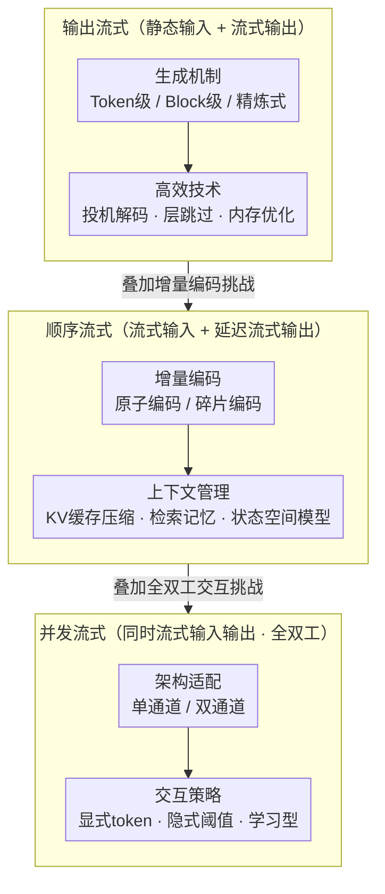

# From Static Inference to Dynamic Interaction: A Survey of Streaming Large Language Models

**会议**: ACL 2026  
**arXiv**: [2603.04592](https://arxiv.org/abs/2603.04592)  
**代码**: [GitHub](https://github.com/EIT-NLP/Awesome-Streaming-LLMs)  
**领域**: LLM 系统 / 流式推理  
**关键词**: 流式LLM, 实时交互, 增量编码, 全双工, 投机解码

## 一句话总结

本文首次系统综述流式大语言模型（Streaming LLMs），提出基于数据流和交互并发性的统一定义，将现有方法分为三级递进分类——输出流式（Output-streaming）、顺序流式（Sequential-streaming）和并发流式（Concurrent-streaming），覆盖文本、语音和视频流式场景的方法论和应用。

## 研究背景与动机

**领域现状**：标准 LLM 采用"一次性读取全部输入"的静态推理范式——先编码完整输入到 KV 缓存，再自回归解码。这在基准测试中有效，但根本性地限制了在实时翻译、流式视频理解、交互式工具代理等动态场景中的适用性。

**现有痛点**：(1) 现实世界中信息是增量到达的、随时间积累的、且可能长度无界的，静态范式无法处理；(2) 现有关于"流式 LLM"的定义混乱——自回归解码、增量/分块编码、全双工交互等不同概念被混淆在同一个"Streaming LLM"标签下；(3) 缺乏支持实时交互、部分输入监督和细粒度时间对齐的大规模预训练数据。

**核心矛盾**：LLM 的离线、全上下文设计与现实世界的在线、增量、交互式数据流之间存在根本不匹配——模型需要动态决定何时响应、何时等待更多信息、何时终止。

**本文目标**：提出流式 LLM 的统一定义和系统分类，厘清术语歧义，为这一新兴领域提供结构化的研究路线图。

**切入角度**：基于数据流（data flow）和交互并发性（interaction concurrency）两个维度定义流式 LLM，而非按模态或架构分类。

**核心 idea**：流式 LLM 是一个三级递进体系——(1) 输出流式：静态输入 + 流式输出（标准自回归）；(2) 顺序流式：流式输入 + 流式输出（增量编码后生成）；(3) 并发流式：同时流式输入和输出（全双工交互），每一级在前一级基础上引入新挑战。

## 方法详解

### 整体框架

本综述不按模态或架构划分领域，而是从数据流（data flow）与交互并发性（interaction concurrency）两个维度重新定义流式 LLM，把被混用的"Streaming LLM"拆成一个三级递进体系：输出流式（静态输入 + 流式输出）关注流式生成机制与高效生成，顺序流式（流式输入 + 延迟流式输出）在其上引入增量编码与上下文管理，并发流式（同时流式输入输出）再额外引入架构适配与交互策略。每一级都在前一级的挑战上叠加新问题，每级下又分文本、语音、视频三种模态分别梳理。

### 关键设计

**1. 输出流式 LLM（Output-Streaming）：静态输入上把生成吞吐做上去**

自回归逐 token 生成效率低是流式应用的主要瓶颈，这一级在输入已完整的前提下追求更高吞吐。生成机制分三类：Token 级是标准自回归（GPT、LlamaGen）；Block 级是半自回归（SoT 并行生成多 token）和块扩散（SSD-LM）；精炼式则是多尺度（VAR 从粗到细）和全局扩散（LLaDA 迭代去噪）。

在生成机制之上叠加一系高效技术抠吞吐：投机解码（Speculative Decoding 用小模型起草、大模型验证）、层跳过（AdaInfer 动态跳过冗余层）、以及内存优化（StreamingLLM 的 attention sink 机制保留初始 token 的 KV 缓存）。这一级是所有流式场景的公共底座。

**2. 顺序流式 LLM（Sequential-Streaming）：在不完整信息下边收边编码**

流式输入意味着编码时看不到完整上下文，模型要在信息增量到达、且可能长度无界的条件下决定何时响应。第一个挑战是增量编码：把连续到达的输入分为"原子编码"（已有离散单元，如 subword、ViT patch）和"碎片编码"（需要分段，如固定间隔分割或语义驱动分割 CTC/DiSeg）。

第二个挑战是上下文管理，因为长序列的 KV 缓存线性增长会让内存不可行：一是 KV 缓存压缩（token 淘汰如 H2O、量化如 KVQuant、合并如 CaM），二是检索增强记忆（MemWalker 层次导航长上下文），三是状态空间模型（Mamba 的线性复杂度天生适合流式输入）。

**3. 并发流式 LLM（Concurrent-Streaming）：同时说与听的全双工交互**

全双工交互是人类对话的自然模式——人在说话时仍在听，但传统 LLM 的"轮流"模式无法并行这两件事。第一个挑战是架构适配：单通道架构把输入输出交错为单一序列（如 SpeechGPT、MiniOmni），简单但输入输出互相干扰；双通道架构用独立通道处理输入和输出（如 Moshi 的内部/外部流双 Transformer），并行但参数量翻倍。

第二个挑战是交互策略，即"何时响应"：基于特殊 token 的显式策略（用 `<wait>/<speak>` token 控制时机）、基于启发式的隐式策略（输出概率超阈值时触发生成）、以及学习型策略（通过 RL 学最优交互时机）。这是全双工的最大开放问题——阈值法简单但脆弱，RL 法有前景但训练困难。

### 流式训练的关键挑战
综述性论文，不涉及具体损失函数。作者单独梳理了流式训练的三个共性难点：缺乏流式预训练数据、部分输入监督的设计、以及时间对齐标注的高成本。

## 实验关键数据

### 主实验

综述论文无自有实验，但整理了关键技术对比：

**三级流式范式对比**

| 范式 | 输入模式 | 输出模式 | 核心挑战 | 代表方法 |
|------|---------|---------|---------|---------|
| 输出流式 | 静态 | 流式 | 高效生成 | Speculative Decoding, SoT |
| 顺序流式 | 流式 | 流式（延迟） | 增量编码+上下文管理 | StreamingLLM, H2O, Mamba |
| 并发流式 | 流式 | 流式（同时） | 全双工架构+交互策略 | Moshi, MiniOmni, OmniChat |

**KV 缓存压缩方法对比**

| 方法类别 | 代表工作 | 核心机制 | 优缺点 |
|---------|---------|---------|--------|
| Token 淘汰 | H2O, FastGen | 基于注意力分数淘汰不重要 token | 简单高效但可能丢失关键信息 |
| 量化 | KVQuant, KIVI | 降低 KV 缓存精度 | 压缩比高但可能损失精度 |
| 合并 | CaM, D2O | 合并相似 token 的 KV 表示 | 保留信息但计算开销稍大 |

### 关键发现

- 三级分类清晰地表明了技术挑战的递进关系——并发流式建立在前两者之上，额外引入架构适配和交互策略
- 语音流式是当前最成熟的方向（Moshi、SpeechGPT-Gen），文本流式次之，视频流式最不成熟
- KV 缓存管理是所有流式场景的共同瓶颈——StreamingLLM 的 attention sink 发现（初始 token 对注意力分数至关重要）推动了该方向
- 全双工交互的最大开放问题是"何时响应"的策略学习——基于阈值的方法简单但脆弱，RL 方法有前景但训练困难

## 亮点与洞察

- 三级递进分类框架非常清晰——从数据流视角统一了混乱的术语，为后续研究提供了结构化路线图
- 单通道 vs 双通道架构的对比揭示了全双工交互的核心设计权衡：单通道简单但输入输出互相干扰，双通道并行但参数量翻倍
- 对"何时响应"问题的系统梳理（显式 token、隐式阈值、学习型策略）覆盖了从简单到复杂的完整谱系

## 局限与展望

- 流式 LLM 的评估标准尚未统一——延迟、质量、交互性如何综合衡量缺乏共识
- 流式预训练数据的稀缺是根本瓶颈，尤其是全双工交互场景
- 多模态并发流式（同时处理语音、视频、文本）的统一架构仍是开放问题
- 安全性考量不足——流式生成一旦输出就难以撤回，错误成本比静态推理更高

## 相关工作与启发

- **vs Xiao et al. (2023) StreamingLLM**: StreamingLLM 是一个具体方法（attention sink + 滑动窗口）；本综述将其归为顺序流式下的 KV 缓存管理方法之一
- **vs 推测解码综述**: 推测解码属于输出流式的高效生成技术；本综述将其置于更广泛的流式 LLM 框架中
- **vs 语音对话模型综述**: 语音对话模型主要关注并发流式；本综述同时覆盖文本和视频场景

## 评分

- 新颖性: ⭐⭐⭐⭐ 三级递进分类框架和统一定义具有重要的概念贡献
- 实验充分度: ⭐⭐ 综述论文无自有实验
- 写作质量: ⭐⭐⭐⭐⭐ 分类清晰、图表设计优秀、覆盖全面
- 价值: ⭐⭐⭐⭐⭐ 首个系统性流式 LLM 综述，为快速发展的领域提供了急需的结构化框架

<!-- RELATED:START -->

## 相关论文

- [\[ACL 2026\] PersonaArena: Dynamic Simulation for Evaluating and Enhancing Persona-Level Role-Playing in Large Language Models](personaarena_dynamic_simulation_for_evaluating_and_enhancing_persona-level_role-.md)
- [\[AAAI 2026\] Quantifying Conversational Reliability of Large Language Models under Multi-Turn Interaction](../../AAAI2026/llm_nlp/quantifying_conversational_reliability_of_large_language_models_under_multi-turn.md)
- [\[ACL 2025\] Large Language Models in Bioinformatics: A Survey](../../ACL2025/llm_nlp/large_language_models_in_bioinformatics_a_survey.md)
- [\[ACL 2025\] Knowledge Boundary of Large Language Models: A Survey](../../ACL2025/llm_nlp/knowledge_boundary_survey.md)
- [\[ACL 2025\] Turning Trash into Treasure: Accelerating Inference of Large Language Models with Token Recycling](../../ACL2025/llm_nlp/token_recycling.md)

<!-- RELATED:END -->
