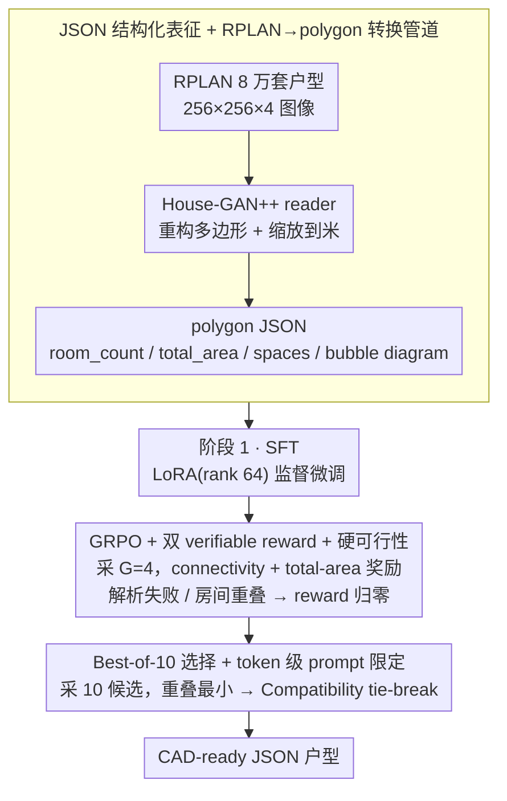

# Generative Floor Plan Design with LLMs via Reinforcement Learning with Verifiable Rewards

**会议**: ACL 2026  
**arXiv**: [2605.14117](https://arxiv.org/abs/2605.14117)  
**代码**: <https://github.com/ludolara/floor-plan-rlvr>  
**领域**: LLM 生成 / RLVR / 建筑设计  
**关键词**: 户型生成、JSON 结构化输出、GRPO、verifiable rewards、bubble diagram

## 一句话总结
作者把 RPLAN 中 8 万套真实公寓户型转成 JSON 多边形格式，用 Llama-3.3-70B-Instruct 做两阶段训练（SFT + GRPO with verifiable rewards：connectivity + total-area 奖励，重叠/解析失败硬置零），让 LLM 输出能同时满足 bubble diagram 拓扑约束和数值面积约束的 CAD-ready 户型，在 8 房间任务上 Compatibility 相比 HouseDiffusion 下降 94%（2.5 → 0.15）。

## 研究背景与动机
**领域现状**：建筑户型生成（floor plan generation）是 AI 辅助设计里的经典任务。主流路线有三：① 视觉式 GAN（House-GAN/House-GAN++）以 bubble diagram 为图条件，输出 rasterized 图；② diffusion-based（HouseDiffusion）用 1-D polygonal loop 表示房间并迭代去噪；③ 早期符号系统（Lopes et al.）用 constraint satisfaction + 手工规则。

**现有痛点**：① 主流模型只接受 connectivity（哪几个房间相邻），无法接受**数值约束**（卧室必须 12 m²、总建筑面积 80 m²）；② 视觉/diffusion 输出 raster 或缩放不变的形状，不能直接喂 CAD；③ 现有评测只看 Compatibility / Realism / Diversity，不显式测"用户指定的房间面积是否被满足"，更没人测"房间是否互相重叠"这种基本几何 validity；④ Tell2Design 试过文本 → 户型，但用图像渲染做评测、忽视结构错误且空间关系处理差。

**核心矛盾**：专业建筑师真正要的是同时控制拓扑（哪些房间相邻）+ 几何数值（每个房间多大、polygon 在哪里）+ 几何合法性（不重叠、闭合多边形）。但前两条要求结构化文本输出（不能 rasterize），第三条要求生成器自己学会"几何 feasibility"——而 LLM 默认 free-form 生成既容易输出无效 JSON 又会让多边形重叠。

**本文目标**：① 用 JSON 作为统一表征同时承载结构 + 数值约束；② 用 LLM 学到 RPLAN 真实分布；③ 用 RL with verifiable rewards 把"匹配 bubble diagram"和"匹配总面积"做成自动可验证奖励，并用"重叠/解析失败 = 0 奖励"作为硬可行性条件治住几何 validity；④ 提出 4 个直接测约束遵循度的新指标（Room Area / Room ID / Overlap / % Overlap）填补评测空白。

**切入角度**：把问题从"图像生成 + 后处理"重新框定成"结构化文本到结构化文本"的 seq2seq —— LLM 已经擅长生成 JSON、调用工具、遵循 schema，再用 RLVR 把那些可以被程序验证的约束直接奖励，避开"用 reward model 学品味"的不可验证陷阱。

**核心 idea**：把户型生成当作"程序合成 + 几何验证"双重 RL —— connectivity 奖励 + total-area 奖励 + overlap 硬置零 + 无效 JSON 硬置零，让 LLM 自己学到既符合拓扑又符合几何的结构化输出。

## 方法详解

### 整体框架
两阶段训练 Llama-3.3-70B-Instruct，输入是 JSON（含 room_count / total_area / spaces 列表 / input_graph bubble diagram），输出也是 JSON（每个 space 含 id / room_type / area / floor_polygon 顶点列表，单位米）。**阶段 1 SFT**：在 RPLAN 转换的 JSON 户型上做 LoRA 监督微调（rank 64, $\alpha=128$，2 epoch，6×4×H100），学到 prompt → JSON 的基本映射。**阶段 2 GRPO**：合并 LoRA 后用 verifiable rewards 做 RL，每个 prompt 采 $G=4$ 个候选，按 connectivity reward + total-area reward 平均得分计算 group-relative advantage 更新。**推理**：best-of-10，按"重叠面积最小 → 平局看 Compatibility"选最终输出。

### 关键设计

**1. JSON 结构化表征 + RPLAN→polygon 转换管道：把户型生成从"画图"重新框定成"写结构化文本"**

主流路线都把户型当图像生成，可图像既塞不进"卧室必须 12 m²"这种数值约束，输出的 raster 或 scale-invariant 形状也喂不进 CAD。作者干脆换一套表征：每个 space（房间或门）是一个 JSON 对象，含 id（如 `bedroom|0`）、room_type、area（m²）和 floor_polygon（绝对坐标顶点列表），输入侧再带上 room_count、total_area 和 input_graph 邻接表。RPLAN 原始是 $256\times256\times4$ 的图像，作者写了 custom converter 把它翻成 polygon JSON——借 House-GAN++ 的 data reader 读边界与房间标签、重构多边形、从像素缩放到米、再从内门连通性导出 bubble diagram。选 JSON 是因为它一次满足四件事：数值约束无歧义解析、schema 强制一致、嵌套天然表达户型层级、输出可直接进 CAD；更关键的是，结构化文本本就是 LLM 的主场，verifier 也能直接解析它来判分，这把"约束遵循"从图像后处理变成了模型能学、程序能验的文本任务。

**2. GRPO + 双 verifiable reward + 硬可行性：用程序能验证的奖励对齐约束，再用一道硬闸门掐死几何违法**

SFT 只学会了"长得像 RPLAN"，但拓扑和面积是否真的对得上，需要进一步对齐。作者用 GRPO：对每个 prompt $x$ 采 $G=4$ 个候选，算 group-relative advantage

$$\hat{A}_i=\frac{R(x,y_i)-\mu_x}{\sigma_x+\epsilon},$$

再优化 PPO-style 目标 $L^{\text{GRPO}}(\theta)=\mathbb{E}_x\big[\tfrac{1}{G}\sum_i \tfrac{\pi_\theta(y_i|x)}{\pi_{\theta_{\text{old}}}(y_i|x)}\hat{A}_i\big]$，省掉 critic 网络。奖励由两项等权平均：Connectivity reward $r_{\text{conn}}\in[0,1]$ 从生成 JSON 重建邻接图、与 input bubble diagram 比对，越像越高；Total-area reward $r_{\text{TA}}=\max(0,\,1-\text{TAE})$，其中 $\text{TAE}=|A(y)-A^\star|/A^\star$ 是总面积相对误差。最关键的一笔是**硬可行性**：JSON 解析失败或任何两个房间多边形重叠，reward 直接归零，而不是软扣分。这么设计是因为 connectivity 与 area 本就可被程序自动验证，正落在 RLVR 的适用区；而几何合法性更适合做成 binary kill switch——作者发现初版只给 connectivity reward 时，模型会把房间缩成针尖去 game 邻接图，直到补上 area 奖励和 overlap=0 这道硬闸门，reward hacking 才被彻底堵死。

**3. Best-of-10 选择 + token 级 prompt 限定：推理端再用同一套"可验证"标准榨出合法输出**

即便训练好了，单次采样仍偶有重叠（8 房间任务 best-of-1 的 Overlap 达 0.26）。作者在推理时采 10 个候选（temperature 0.7、top-p 0.9），按"重叠面积最小"为第一序、Compatibility 为 tie-break 第二序挑最终输出；同时在 system message 里下硬指令，如"Your top priority is that no two room polygons ever overlap""every adjacency in the bubble diagram must be bridged by exactly one door"。效果是单调的：Overlap 从 0.26（n=1）压到 0.13（n=10）再到 0.10（n=100），Compatibility 同步从 1.89→0.15→0.02。这本质是拿推理算力换约束遵循度的明确 trade-off，而且训练端的 reward 是验证型、推理端的 selection 也是验证型，两头用的是同一把尺子，逻辑上对称自洽。

### 损失函数 / 训练策略
SFT 用标准 NLL：$L^{\text{SFT}}(\theta)=\mathbb{E}_{(x,y)\sim\mathcal{D}}[-\sum_t \log \pi_\theta(y_t|y_{<t},x)]$，LoRA rank 64，lr 1e-4，2 epoch。GRPO 用 AdamW，lr 1e-6、clip 0.2、KL 系数 0.04、temperature 0.9、top-p 1.0、prompt+completion 4096 tokens，每 prompt 采 4 generations，每 100 步在 200 个 val 样本上 validate；作者注意到最优 checkpoint 通常就在 step 100（~2h wall-clock），GRPO 阶段比 SFT 还短。RPLAN 80,788 户型按房间数（5/6/7/8）切四组，hold out 一组做评测、用其他三组训练（zero-shot 跨房间数泛化）。

## 实验关键数据

### 主实验（vs HouseDiffusion 等 SOTA）

| 方法 | Comp(5)↓ | Comp(6)↓ | Comp(7)↓ | Comp(8)↓ | Realism↑ (8) | Div(8)↓ |
|------|----------|----------|----------|----------|--------------|---------|
| Johnson et al. 2018 | 7.7 | 6.5 | 10.2 | 11.3 | -1.00 | 186.0 |
| House-GAN | 2.5 | 2.4 | 3.2 | 5.3 | -0.95 | 66.4 |
| House-GAN++ | 1.9 | 2.2 | 2.4 | 3.9 | -0.52 | 32.9 |
| HouseDiffusion | 1.5 | 1.2 | 1.7 | 2.5 | -0.19 | 9.5 |
| **本文 (SFT+RLVR best-of-10)** | **0.01** | **0.02** | **0.10** | **0.15** | **0.03** | **7.0** |
| 相对 HouseDiffusion 提升 | -99.3% | -98.3% | -94.1% | **-94.0%** | +0.22 | -26.3% |

关键观察：8 房间任务 Compatibility 从 HouseDiffusion 的 2.5 降到 0.15（-94%），Realism 0.03（近 0 表示志愿者认为生成与真实几乎不可区分），Diversity (FID) 也是所有方法里最低。

### 消融实验（训练阶段 + 推理预算）

| 配置 | 任务 8 Room Area↓ | Room ID↑ | Overlap↓ | % Overlap↓ | Compatibility↓ |
|------|------------------|----------|----------|------------|----------------|
| Few-shot (3-shot, best-of-10) | 0.12 | 0.91 | 0.51 | 0.04 | 6.89 |
| SFT only (best-of-10) | 0.08 | **1.00** | 0.37 | 0.01 | 0.41 |
| **SFT + RLVR (best-of-10)** | 0.10 | **1.00** | **0.13** | **0.00** | **0.15** |
| SFT + RLVR (best-of-1) | **0.09** | 1.00 | 0.26 | 0.01 | 1.89 |
| SFT + RLVR (best-of-100) | 0.09 | 1.00 | 0.10 | 0.00 | **0.02** |

平均 5-8 房间，RLVR 比 SFT 把 Overlap 降 65%、Compatibility 降 56%，同时 Room Area 与 Room ID 不退步。

### 关键发现
- **结构化文本生成 + RLVR 范式在专业设计任务上彻底超越视觉/扩散 SOTA**：Compatibility 数量级下降（HouseDiffusion 2.5 → 本文 0.15），同时几何合法性（Overlap 0.13）、面积精度（Room Area 10%）、标签精度（Room ID 1.00）三个新指标都过关，说明 LLM 的结构化生成能力是这个领域被长期低估的。
- **硬可行性是 RLVR 治住 reward hacking 的关键**：作者明确写"只用 connectivity reward 时模型把房间缩成针尖来 game 邻接图"；加入 total area + overlap=0 hard floor 后才彻底治住。
- **70B 是必需的，8B 不行**：Llama-3.1-8B-Instruct 即使用 rank 256/512 的 LoRA 也会陷入重复 loop 输出无效几何；作者切换到 Llama-3.3-70B 才稳定。这给"用小 LLM 做结构化生成"的实践者一个警告。
- **GPT-4o / o3 / QwQ-32B 的 few-shot 也不行**：作者尝试 SOTA 闭源/开源大模型 few-shot，全都失败 —— 非闭合多边形、自相交、数值漂移、重复 loop —— 说明专业结构化输出任务必须经过 SFT，不能靠 prompt 工程蒙混。
- **JSON 比自然语言更可靠但模型也能零样本处理自然语言**：把 JSON 输入换成自然语言模板（同信息），Room Area / ID / Overlap 几乎不变，仅 Compatibility 从 0.15 升到 0.37（措辞模糊性引入歧义），说明 SFT 后的模型仍保留 free-form 解读能力。

## 亮点与洞察
- **"程序合成 + 几何验证"双重 RL 是 verifiable reward 的理想样板**：和数学/代码的 RLVR 一脉相承（reward 都来自自动 verifier），但本文把这个范式扩展到了 2D 几何 / 建筑这类显式约束领域 —— 任何"约束是可程序验证的"任务都可以套这个模板，比如电路布线、PCB layout、芯片 floorplan、UI mockup 生成。
- **硬可行性 + 软奖励的组合**：把"必须满足的约束"（无重叠、JSON 合法）变成 binary kill switch，把"想优化的目标"（connectivity / area）变成连续奖励 —— 这种分层 reward design 比把所有约束都揉成单一奖励更稳定，也避免了"小重叠抵消大 connectivity 提升"的折中。
- **RLVR 比 SFT 短得多**：作者注意到 GRPO 最佳 checkpoint 常在 step 100（~2h），比 2 epoch SFT 还快 —— 用很少的 RL 步数就能锁定 SFT 学到的能力并大幅强化约束遵循，这种"SFT 大力 + RLVR 短刀"的资源配比对工业部署很友好。
- **新的约束遵循度评测体系**：Room Area / Room ID / Overlap / % Overlap 这 4 个直接、可验证的指标补上了 Compatibility/Realism/Diversity 之外的盲区；任何后续工作都应该报这些指标。
- **作者写了一节"behind the scenes"诚实分享失败经验**（ProcTHOR 数据增强失败、8B backbone 不行、reward hacking 怎么治），这种透明度在论文里很罕见也很有价值。

## 局限与展望
- 只测可自动验证的约束（connectivity / area / 重叠）；建筑真正关心的 circulation、egress、accessibility、daylight、structural、building code 都没建模 —— 强 Compatibility 不等于 code-compliant，不能直接施工。
- 仅 RPLAN 单数据集 + 单一文化（亚洲单层住宅）；商业建筑、多层楼、欧美户型分布是否泛化未知。
- 推理需要 best-of-10 甚至 best-of-100 才能压住 Overlap，单样本质量偏弱（best-of-1 时 Compatibility 1.89）；inference cost 不低。
- Reward 权重等权拍脑袋（connectivity 和 total area 各 50%），未系统扫描；不同权重在不同房间数任务上的 trade-off 未探索。
- 没有多 seed / 多 backbone / 多 reward 配比的扩展消融。
- RPLAN 数据集是 research-only 受限许可，复现成本高且不能 redistribute。

## 相关工作与启发
- **vs HouseDiffusion**：他们的 1-D polygonal loop diffusion 在 Compatibility 上是当时 peer-reviewed SOTA（2.5），但无数值约束、无 overlap 治理；本文 0.15 把这个 baseline 直接拍碎一个数量级。
- **vs Tell2Design**：相似的"文本到户型"思路，但他们 render 成图像做评测、忽视结构错误；本文直接从 JSON 输出做几何评测，不经过 rasterize 损失精度。
- **vs House-GAN / House-GAN++**：经典 GAN 路线只接 bubble diagram，输出 scale-invariant 图像；本文 JSON 输出含绝对米单位坐标，可直接喂 CAD。
- **vs ProcTHOR**：作者尝试用 ProcTHOR 程序生成数据增强，发现拓扑病态（浴室作走廊连厨房卧室）频繁，决定弃用 —— 这是对"用合成数据 boot 真实分布"的一个反例。
- **vs RLVR 在数学/代码**（DeepSeekMath、GRPO 原作 Shao 2024）：本文证明 RLVR 范式可以推广到几何/建筑这类专业领域，verifier 类型从代码执行结果扩展到几何检测，思想完全一致。

## 评分
- 新颖性: ⭐⭐⭐⭐ JSON 表征 + RLVR + 硬可行性的组合在户型生成上是首次完整落地
- 实验充分度: ⭐⭐⭐⭐ 5 个 baseline + 4 房间数 + 新 4 指标 + 推理预算扫描 + JSON/NL 对比 + 人评 40 志愿者
- 写作质量: ⭐⭐⭐⭐⭐ 方法清晰、limitation 诚实、Behind-the-Scenes 节真实分享失败，极佳工程文写法
- 价值: ⭐⭐⭐⭐⭐ 给"结构化文本生成 + verifiable RL"范式在专业领域提供模板，对建筑/PCB/UI 等约束设计任务可迁移性极强

<!-- RELATED:START -->

## 相关论文

- [\[ACL 2026\] Generative Interfaces for Language Models](generative_interfaces_for_language_models.md)
- [\[ACL 2026\] Solver-Independent Automated Problem Formulation via LLMs for High-Cost Simulation-Driven Design](solver-independent_automated_problem_formulation_via_llms_for_high-cost_simulati.md)
- [\[ICML 2026\] T$^2$PO: Uncertainty-Guided Exploration Control for Stable Multi-Turn Agentic Reinforcement Learning](../../ICML2026/llm_nlp/t2po_uncertainty-guided_exploration_control_for_stable_multi-turn_agentic_reinfo.md)
- [\[NeurIPS 2025\] Preference-based Reinforcement Learning beyond Pairwise Comparisons: Benefits of Multiple Options](../../NeurIPS2025/llm_nlp/preference-based_reinforcement_learning_beyond_pairwise_comparisons_benefits_of_.md)
- [\[ICLR 2026\] Rethinking Code Similarity for Automated Algorithm Design with LLMs](../../ICLR2026/llm_nlp/rethinking_code_similarity_for_automated_algorithm_design_with_llms.md)

<!-- RELATED:END -->
