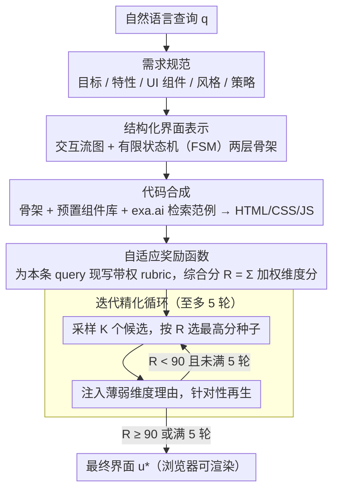

# Generative Interfaces for Language Models

**会议**: ACL 2026  
**arXiv**: [2508.19227](https://arxiv.org/abs/2508.19227)  
**代码**: https://github.com/SALT-NLP/GenUI  
**领域**: LLM 交互 / 人机交互 / UI 生成  
**关键词**: 生成式界面, 自适应 UI, 有限状态机, 迭代精化, 自适应奖励

## 一句话总结
本文提出 **Generative Interfaces (GenUI)**，让 LLM 不再用单一聊天框回复用户，而是基于"交互流图 + 有限状态机"的结构化中间表示和"自适应奖励驱动的迭代精化"，在线生成一个为查询量身定制的可交互 Web 界面，在 100 条 UIX prompt 上相比 Claude 3.7 聊天 UI 取得 **84%** 的总体偏好胜率。

## 研究背景与动机

**领域现状**：当前主流 LLM 应用形态仍是 *Conversational UI*（ConvUI）——不论任务多复杂，输出都被塞进一个线性聊天框，由长段文本回应。OpenAI Canvas、Claude Artifacts 等"画布/工件"工具把代码、文档独立到副窗口，但 UI 组件仍是预设、固定的。

**现有痛点**：在多轮、信息密集、探索式任务（如"我想理解神经网络"、"如何高效练钢琴"）中，纯文本输出导致认知负荷高、缺少可操作的交互（如示意动画、即时反馈、模块化导航），用户需要反复 prompt 才能逼近他们真正想要的"工具"。

**核心矛盾**：LLM 的能力已经可以一次性合成完整网页（Design2Code、Sketch2Code 等），但 LLM 与用户之间的 *交互范式* 还停留在"文本对话"。生成能力强 vs. 交互形式弱，这是范式层面的不对称。

**本文目标**：分两个子问题——(I) 如何"按需"为每条查询生成一个 *功能正确、可交互* 的界面（基础设施问题）；(II) 如何 *系统评估* 生成界面是否真的改善了用户体验（评测协议问题）。

**切入角度**：作者认为直接让 LLM 一次输出 HTML/JS 代码搜索空间过大、可控性差；应该引入一个 *面向界面的结构化中间表示*——交互流图刻画"用户走哪条路径"，有限状态机刻画"每个组件如何响应事件"，让 LLM 在结构化骨架上填肉，再用任务自适应的奖励函数做多轮精化。

**核心 idea**：把"生成回答"升级为"生成界面"——以"交互流图 + FSM"为脚手架，以"查询专属 rubric"为奖励，做 5 轮 generate→evaluate→regenerate 循环，让 UI 在线为每条 query 进化。

## 方法详解

### 整体框架

GenUI 把"为查询生成回答"重新定义为"为查询在线生成一个可交互界面"：输入是一条自然语言查询 $q$，输出是一份可直接在浏览器中渲染的 HTML/CSS/JS 界面 $u^*$。整条推理时 pipeline 由五次 LLM 调用串成——先把 $q$ 翻译成结构化需求规范（目标、特性、UI 组件、交互风格、解题策略），据此生成"交互流图 + 有限状态机"两层骨架，再把规范、骨架、预置组件库（时钟、地图、计算器、图表等）与 exa.ai 检索到的相关 UI 范例一起喂给 LLM 合成可执行代码，最后为本条 query 现场构造一组带权 rubric 作奖励，驱动多轮 generate→evaluate→regenerate 循环把界面打磨到位。系统在 OpenCanvas 框架上实现，默认主干为 Claude 3.7，全程不更新任何权重。

### 关键设计

**1. 结构化界面表示：用 Interaction Flow + FSM 当生成骨架**

让 LLM 端到端直接吐交互式界面，搜索空间巨大且状态/事件极易缺失，常常生成出"点了没反应、弹窗关不掉"的死界面。GenUI 在代码合成之前先搭两层显式骨架：高层 *Interaction Flow* 是一张有向图 $\mathcal{G}=(\mathcal{V},\mathcal{T})$，节点 $\mathcal{V}$ 是 UI 视图或子目标（如 Home View → Explore Tutorials → Run Simulation → Glossary Lookup），边 $\mathcal{T}$ 是由点击/导航触发的转移，刻画"用户会走哪条路径"；低层把每个 UI 组件建模为有限状态机 $\mathcal{M}=(\mathcal{S},\mathcal{E},\delta,s_0)$，其中 $\mathcal{S}$ 是原子状态（如 `isModalOpen=true`），$\mathcal{E}$ 是用户事件，转移函数 $\delta:\mathcal{S}\times\mathcal{E}\to\mathcal{S}$ 规定"组件在哪个状态、看到什么事件、应转到哪个状态"，$s_0$ 是初态。

把"用户路径"和"组件行为"分层硬约束下来，相当于给代码 LLM 喂了一份 interface-level CoT，交互正确性和可解释性都显著提升。消融显示，相对纯自然语言描述，该结构化表示把整体胜率从 13% 提升到 17%。

**2. 自适应奖励函数：给每条 query 现场写评分标准**

传统通用 UI 启发式（可用性、信息组织等）是一把尺子量所有任务，无法区分"理解量子物理"和"今天天气"在交互上的真实诉求。GenUI 改用 LLM 为当前 query 即时生成一组评估维度，每维含 `name / description / criteria / weight` 四字段，候选界面 $u$ 的综合分为各维加权和 $R(u)=\sum_i w_i\cdot s_i(u)$（每维 0–100）。例如对量子物理这条 query，rubric 会自动加入 "Interactive models effectively demonstrate phenomena like wave-particle duality" 这样意图敏感的 criteria，逼着生成的界面真的去可视化"波粒二象性"，而非只堆文字。

这本质是一种零训练成本的 task-conditional reward modeling，给出"意图对齐"而非"通用美观"的奖励信号。消融显示，把 adaptive 换成静态 reward，整体胜率下降 17%，且全部 7 个感知维度一致退化——奖励"该看什么"比"打磨几次"更关键。

**3. 迭代精化循环：用奖励把界面从粗到精打磨**

一次性生成的界面常有布局拥挤、缺少 onboarding、信息密度失衡等问题，而 UI 设计天然是迭代过程。GenUI 在推理时做 reward-guided best-of-N：第 $t$ 轮采样 $K$ 个候选 $\{u^t_k\}$，按奖励选出 $u^t_*=\arg\max_k R(u^t_k)$，再把这个种子连同它在各评分维度上的薄弱点理由一起喂入第 $t{+}1$ 轮 prompt，让下一轮针对性补强，直到最高分 $R\geq 90$ 或迭代满 5 轮停止。

消融显示，相对 one-shot，迭代精化在所有 7 个感知维度上一致提升，整体胜率 +14%，且第 2、3 轮的 LLM reward 分分别再涨 +1.2% 和 +4.9%，说明反馈再生确实在持续收敛而非空转。

### 一个完整示例

以查询 $q=$"我想理解量子物理"为例：① 需求规范阶段 LLM 把它展开为"目标=建立波粒二象性直觉、组件=交互式模拟 + 概念词条、风格=探索式"；② 骨架阶段画出 Home → 双缝实验模拟 → 概念词条查询的 Interaction Flow，并为模拟器组件定义 FSM（`idle`→点击发射→`running`→粒子落屏→`measured`）；③ 代码合成阶段结合预置图表组件与检索到的科普 UI 范例生成首版 HTML/JS；④ 奖励阶段现写出含 "Visual Structure / Explain Physics Concept / Clarity" 的 rubric；⑤ 迭代阶段发现首版"模拟太抽象、缺少粒子轨迹动画"，下一轮据此补强，直到综合分越过 90，输出最终界面 $u^*$。整个过程对用户透明，前后约几分钟。

### 损失函数 / 训练策略

方法本身 *training-free*，不更新任何 LLM 权重；所有"学习"都发生在推理时的 reward-guided 自我精化循环里。奖励由 LLM 即时生成，停止条件为 $R\geq 90$ 或迭代 5 次；生成主干默认 Claude 3.7（消融与对比时也用 GPT-4o 测 ConvUI）。

## 实验关键数据

### 主实验
评测协议：100 条 UIX prompt 覆盖 10 个领域 × {简洁/详细} × {一般对话/交互任务}，由 428 名 Prolific 美国母语用户做成对比较（三人投票多数派），Fleiss' $\kappa = 0.525$。

| 对比 | 维度 | GenUI 胜 | 平 | 对手胜 |
|------|------|---------|----|--------|
| GenUI vs ConvUI (Claude 3.7) | Overall | **84%** | 4% | 12% |
| GenUI vs ConvUI (Claude 3.7) | ASA (审美) | 89% | 8% | 3% |
| GenUI vs ConvUI (Claude 3.7) | IES (满意度) | 87% | 7% | 6% |
| GenUI vs ConvUI (GPT-4o) | Overall | **69%** | 1% | 30% |
| GenUI vs IUI (Claude 3.7 + Artifact) | Overall | **75%** | 8% | 17% |

LLM-as-judge 给出的 0–100 分（Appendix B）显示 GenUI 在 Usability 上把 ConvUI(Claude) 从 34.7 拉到 87.0（相对 +151%），TaskEff 从 47.6 拉到 84.2（+77%）。

### 消融实验

| 配置 | 表示 | 生成 | Reward | Overall Loss vs Full | 说明 |
|------|------|------|--------|----------------------|------|
| Full GenUI | Structured | Iterative | Adaptive | — | 完整版 |
| w/o Adaptive Reward | Structured | Iterative | Static | 54% | 去掉自适应奖励，整体胜率 −17% |
| w/o Iterative | Structured | One-shot | Static | 78% | 单次生成，整体胜率再 −14% |
| w/o Structured | Natural Lang. | One-shot | Static | 82% | 全部退化为自然语言描述 |

### 关键发现
- **审美与满意度是最强驱动力**：相对 ConvUI(Claude) 的 7 维相对提升中 ASA (+86%)、IES (+112%)、Usability (+151%) 显著高于 Learnability (+16%) 和 IC (+16%)，说明 GenUI 主要赢在"看起来像工具/有交互"，而不仅是文字组织。
- **领域差异显著**：在 Data Analysis & Visualization（93.8%）、Business Strategy（87.5%）这类结构化信息密集任务上 GenUI 大幅领先；而 Advanced AI/ML 这种公式重的解释场景仅 50%，说明纯文本仍有不可替代性。
- **查询类型差异**：交互型 query 上 GenUI 偏好达 80%、详细 query 80%、简洁 query 73%；越复杂越受益。
- **奖励维度比迭代次数更重要**：把 adaptive 换 static 的胜率代价（−17%）大于把 iterative 换 one-shot（−14%），说明"打分该看什么"是 reward-guided refinement 的瓶颈，而非"打磨几次"。
- **真实用户研究复现结论**：380 条用户自报 query 上 GenUI 50.8% 胜 / 41.1% 输，30.3% 用户强偏好 GenUI（≥80% 场景），仅 18.4% 强偏好 ConvUI。

## 亮点与洞察
- **范式级贡献**：把"生成回答"升级为"生成界面"，是 LLM 应用形态的一次重要重新定义；从研究的角度，这给"LLM × HCI"开了新的评测维度（功能/交互/情感三轴）。
- **结构化中间表示的复用价值**：把 Interaction Flow 当作 *interface-level CoT*、把 FSM 当作 *component-level constraints*，这种"两层骨架 + 代码 LLM 填肉"范式可直接迁移到 Agent UI、教学课件、可视化看板等"形式自由但语义受约束"的代码生成任务。
- **自适应 rubric 替代固定指标**：让 LLM 为每个 query 现场写评分项，本质是 *task-conditional reward modeling* 的轻量实现，可视为对 RLAIF 在没有训练成本下的实践化身——既可做 inference-time best-of-N 的 selector，也可未来作为 RL 训练信号。
- **"专业感"来自呈现而非内容**：用户问卷分析表明 86.5% 把 GenUI 选为更"可信、专业"的输出，但许多人承认两者内容相近——这给"内容相同时排版可显著影响 LLM 输出被信任度"提供了实证。

## 局限与展望
- **只能跑前端**：仅支持 HTML/CSS/JS 无后端逻辑，长尾任务（持久化数据、复杂交互流）难以胜任；FSM/Flow 二级表示对大型应用可能不够表达力。
- **延迟显著**：5 轮迭代 + 多候选采样常需"几分钟"级别延迟，远不适合实时 chat；论文未量化具体延迟分布与 token 成本。
- **"对所有 query 都生成 UI"**：作者也承认有些查询（"今天纽约天气"）根本不需要 GUI，未来需要 *router/classifier* 判断是否触发 GenUI。
- **评测有评估者偏置风险**：LLM-as-judge 与人评一致率仅 69%，存在长度/视觉复杂度偏置；ConvUI(Claude) 输出被人为剥离了 Artifact，可能高估了 GenUI 优势。
- **可访问性/伦理盲点**：高度图形化界面对屏幕阅读器等辅助技术不友好；"工具感"可能带来 overtrust。

## 相关工作与启发
- **vs Claude Artifacts / OpenAI Canvas**：它们提供"预设画布"承载代码/文档输出，UI 组件是固定的；GenUI 让 *整个 UI 结构本身* 也由 LLM 动态生成。
- **vs DynaVis / GenerativeGUI / ClarifyGPT**：均为"特定场景下的动态 UI"（图表编辑、澄清问题、代码生成），GenUI 是通用 query→UI 框架。
- **vs Design2Code / Sketch2Code / WebSight**：聚焦"截图/草图→代码"的视觉到代码转换，输入是视觉规范；GenUI 输入是 *自然语言意图*，无需 UI 草图。
- **vs Graphologue**：把 LLM 回复后处理为图谱以辅助探索；GenUI 是端到端生成新界面而非回答的可视化。

## 评分
- 新颖性: ⭐⭐⭐⭐⭐ "把回答变界面"的范式级提法 + Flow/FSM 结构化表示，少有同类工作做这么完整。
- 实验充分度: ⭐⭐⭐⭐ 100-prompt 受控 + 380-query 真实用户两类研究，并辅以消融与 LLM 评测；缺延迟/成本/失败案例分析。
- 写作质量: ⭐⭐⭐⭐⭐ 范式动机讲得清晰，方法、评测、用户分析结构分明，图表与例子相互呼应。
- 价值: ⭐⭐⭐⭐⭐ 对 LLM 产品形态与 HCI 评测的双向影响显著，UIX benchmark 与 GenUI 代码均开源，社区可直接复用。

<!-- RELATED:START -->

## 相关论文

- [\[ACL 2026\] Generative Floor Plan Design with LLMs via Reinforcement Learning with Verifiable Rewards](generative_floor_plan_design_with_llms_via_reinforcement_learning_with_verifiabl.md)
- [\[ACL 2025\] MExGen: Multi-Level Explanations for Generative Language Models](../../ACL2025/llm_nlp/mexgen_multi_level_explanations.md)
- [\[ACL 2025\] Generative Psycho-Lexical Approach for Constructing Value Systems in Large Language Models](../../ACL2025/llm_nlp/generative_psycholexical_approach_for_constructing_value.md)
- [\[ICLR 2026\] ConflictScope: Generative Value Conflicts Reveal LLM Priorities](../../ICLR2026/llm_nlp/quamo_quaternion_motions_for_vision-based_3d_human_kinematics_capture.md)
- [\[ICML 2025\] Generative Social Choice: The Next Generation](../../ICML2025/llm_nlp/generative_social_choice_the_next_generation.md)

<!-- RELATED:END -->
