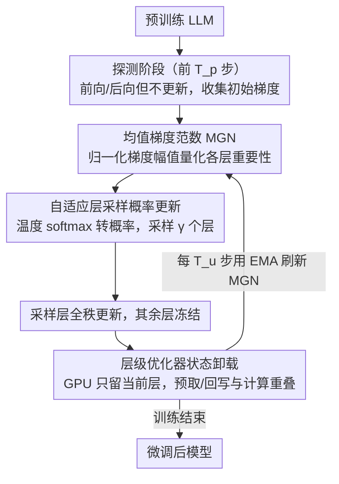

# GRASS: Gradient-based Adaptive Layer-wise Importance Sampling for Memory-Efficient LLM Fine-tuning

**会议**: ACL 2026 Findings  
**arXiv**: [2604.07808](https://arxiv.org/abs/2604.07808)  
**领域**: LLM/NLP  
**关键词**: 层级采样, 梯度重要性, 内存高效微调, 优化器状态卸载, 自适应训练

## 一句话总结

提出 GRASS 框架，使用均值梯度范数（MGN）作为任务感知和训练阶段感知的层重要性指标，自适应地采样和更新模型层子集进行微调，配合层级优化器状态卸载机制，在平均准确率提升最高 4.38 分的同时减少最高 19.97% 的内存使用。

## 研究背景与动机

**领域现状**：LLM 的全参数微调（FFT）在下游任务适配中效果最好，但随着模型规模增长，GPU 显存需求成为瓶颈。参数高效微调（PEFT）方法如 LoRA 通过只更新少量参数来降低内存，是目前最流行的折中方案。

**现有痛点**：LoRA 等低秩方法虽然高效，但低秩参数化限制了模型表达能力，性能不可避免地低于 FFT。层级微调方法（如 LISA）提供了另一条路——每次只激活部分层进行全参数更新，避免低秩约束。但 LISA 采用静态均匀采样策略选择层，隐式假设各层重要性恒定，这与实际情况不符。例如 LISA 在 GSM8K 上比 FFT 低 4.4%，SingleEq 低 8.9%。

**核心矛盾**：层级微调面临层重要性的动态性问题——不同任务需要更新不同的层，同一任务不同训练阶段重点层也在变化，而静态选择策略无法捕捉这种动态性。

**本文目标**：设计一种能自适应感知任务和训练阶段的层采样策略，在保持层级微调内存优势的同时逼近甚至超越 FFT 性能。

**切入角度**：梯度直接编码了损失对参数更新的敏感度——一阶 Taylor 近似下，梯度范数大的层更新后对训练目标影响更大。因此梯度统计量是实时层重要性的天然指标。

**核心 idea**：用均值梯度范数（MGN）动态量化各层对损失下降的贡献，通过 softmax 转化为采样概率并周期性更新，自适应选择最重要的层进行微调。

## 方法详解

### 整体框架

GRASS 在层级微调的框架下，把"每步该更新哪些层"从静态均匀采样换成由实时梯度信号驱动的自适应采样。训练分两阶段：先用前 $T_p$ 步做"探测"——照常前向/后向但不更新参数，纯粹收集各层的初始梯度统计；随后进入自适应微调，每步按层重要性概率采样 $\gamma$ 个层做全参数更新、其余层冻结，并每隔 $T_u$ 步重算重要性、刷新采样概率，从而跟住"不同任务、不同阶段重点层在变"的动态性。与此并行，一套层级优化器状态卸载机制只把当前更新层的状态留在 GPU，把显存压到接近 LoRA 的水平。

### 关键设计

**1. 均值梯度范数（MGN）：用梯度量化层重要性**

LISA 用均匀采样、OWS 用权重范数、IST 用响应抑制加强化学习，这些指标要么静态、要么启发式，都不反映"当前这一步优化最需要更新哪层"。GRASS 直接诉诸梯度——一阶 Taylor 近似下，梯度范数大的层更新后对损失下降贡献更大。具体对每一层 $l$，在连续 $T$ 步上聚合归一化梯度幅值 $m_l(T) = \frac{1}{T}\sum_{t=1}^T \sqrt{\frac{1}{N_p^{(l)}} \|g_t^{(l)}\|_2^2}$，其中除以参数数量 $N_p^{(l)}$ 使深浅、大小不同的层可比。

这个指标天然带任务感知和阶段感知：实验中 TinyLlama 在算术推理与常识推理上各层归一化 MGN 分布差异显著，例如第 20 层在常识推理里很重要、在算术推理里却不突出——这正是静态策略无法捕捉、而梯度信号能实时反映的差异。

**2. 自适应层采样概率更新：让选层策略随训练演化**

只用探测阶段的初始 MGN 固定一套策略（即"静态 GRASS"），训练推进后重要性分布漂移会让选层逐渐次优。GRASS 因此每隔 $T_u$ 步刷新一次：把当前 MGN 经带温度 softmax 转成层采样概率 $p^{(l)} = \frac{\exp(m_l/\tau)}{\sum_i \exp(m_i/\tau)}$，据此采样 $\gamma$ 个层。刷新时，本轮被采样到的层用指数移动平均更新其 MGN，$m_l(T) = \alpha m_l(T_u) + (1-\alpha)m_l(T-T_u)$，而未被采样的冻结层则保留上一轮的 MGN 不变。

温度 $\tau$ 控制采样的探索-利用平衡，EMA 则让重要性估计在噪声梯度下平滑过渡，避免单步梯度抖动把策略带偏。

**3. 层级优化器状态卸载（重叠卸载）：把显存压到极限**

层级微调的所有可训练层都要保存优化器状态，全留 GPU 会爆显存、全放 CPU 则换入换出有延迟。GRASS 让 GPU 只保留当前更新层的优化器状态，其余存 CPU，关键是让传输与计算完全重叠：更新第 $i$ 层时，异步预取第 $i+1$ 层状态（HtoD）、同时回写第 $i-1$ 层状态（DtoH），使 PCIe 传输隐藏在计算之下、几乎不损吞吐。

这一工程设计把层级微调引入的内存增长从 1.63GB 压到 0.14GB，是"算法选层 + 系统卸载"协同的直接收益。

### 损失函数 / 训练策略

GRASS 不改变原始训练损失，仅改变哪些层参与梯度计算和参数更新：冻结层照常参与前向但不产生梯度，采样层做全参数（全秩）更新。探测阶段跳过参数更新和优化器状态管理，额外开销可控。

## 实验关键数据

### 主实验

算术推理任务上的准确率对比（六个 benchmark 平均）：

| 模型 | 方法 | MultiArith | GSM8K | SingleEq | 平均 |
|------|------|-----------|-------|----------|------|
| TinyLlama | FFT | 64.17 | 15.16 | 42.92 | 33.48 |
| TinyLlama | LoRA r=128 | 61.17 | 15.16 | 38.19 | 29.84 |
| TinyLlama | LISA | 65.00 | 17.74 | 43.11 | 33.63 |
| TinyLlama | **GRASS** | **68.00** | 17.13 | 42.52 | **34.22** |
| Gemma-2B | FFT | 86.67 | 42.53 | 80.12 | 60.16 |
| Gemma-2B | LISA | 90.17 | 40.18 | 75.00 | 56.46 |
| Gemma-2B | **GRASS** | **93.50** | **43.06** | 78.35 | **60.65** |

### 消融实验

| 配置 | 关键指标 | 说明 |
|------|---------|------|
| GRASS (完整) | 34.22 (TinyLlama avg) | 完整自适应框架 |
| 静态 GRASS | 部分任务下降 | 只用初始 MGN 不更新概率 |
| w/o Offloading | +1.49GB 显存 | 优化器状态全留 GPU |
| FFT vs GRASS 显存 | 51.3GB vs 19.1GB | LLaMA2-7B 减少 62.8% |

### 关键发现
- GRASS 在 TinyLlama 和 Gemma-2B 上甚至超越 FFT，说明自适应层选择可能起到隐式正则化效果
- 相比 LoRA r=128，GRASS 在 TinyLlama 上提升 4.38 分（34.22 vs 29.84）
- LISA 性能在不同任务间波动大，GRASS 表现更稳定
- 长序列（1792 tokens）时 LoRA/DoRA 超出 24GB 显存限制，GRASS 仍在 23.25GB 以内
- 常识推理任务上 GRASS 同样全面优于其他 PEFT 方法，显示跨任务泛化能力

## 亮点与洞察
- **梯度范数作为层重要性信号**：相比权重范数等静态指标，梯度范数直接反映当前训练目标对各层的需求，理论直觉清晰且实验有效。可迁移到混合精度训练、知识蒸馏中的层选择等场景
- **超越 FFT 的"意外"发现**：选择性更新可能带来正则化效果，与 dropout 和模型剪枝的理论有呼应，暗示并非所有层在所有时刻都需要更新
- **计算-通信重叠的工程价值**：优化器状态的层级卸载+重叠传输将内存增长从 1.63GB 压到 0.14GB，展示了算法设计与系统优化的协同效果

## 局限与展望
- 实验仅在 1B-7B 规模模型上验证，7B 上 GRASS 已不如 FFT，更大模型效果未知
- 超参数较多（gamma, Tp, Tu, Ts, tau, alpha），调参成本可能抵消部分便利性
- 仅在单 GPU 上实验，多卡分布式训练场景下的适配未讨论
- 未与最新的 GaLore、量化微调等内存高效方法对比

## 相关工作与启发
- **vs LISA**: LISA 使用均匀静态采样，在某些任务上严重退化，GRASS 通过自适应采样全面改善
- **vs LoRA/DoRA**: LoRA 受低秩约束限制表达能力，GRASS 保持全秩更新同时通过层选择降低内存
- **vs LIFT**: LIFT 用固定前到后更新顺序，缺乏层重要性判断，GRASS 的梯度驱动选择更有针对性

## 评分
- 新颖性: ⭐⭐⭐⭐ 梯度范数作为层采样权重的 idea 直觉清晰，自适应更新+卸载组合有效
- 实验充分度: ⭐⭐⭐⭐ 三个模型规模x两大类任务，消融充分，但缺少更大模型对比
- 写作质量: ⭐⭐⭐⭐ 行文清晰，动机和方法的逻辑链完整
- 价值: ⭐⭐⭐⭐ 为层级微调提供了实用且通用的自适应框架，对内存受限场景有实际意义

<!-- RELATED:START -->

## 相关论文

- [\[ACL 2026\] Synthetic Eggs in Many Baskets: The Impact of Synthetic Data Diversity on LLM Fine-Tuning](synthetic_eggs_in_many_baskets_the_impact_of_synthetic_data_diversity_on_llm_fin.md)
- [\[ACL 2025\] A Semantic-Aware Layer-Freezing Approach to Computation-Efficient Fine-Tuning of Language Models](../../ACL2025/llm_nlp/a_semantic-aware_layer-freezing_approach_to_computation-efficient_fine-tuning_of.md)
- [\[ACL 2025\] GORP: Continual Gradient Low-Rank Projection Fine-Tuning for LLMs](../../ACL2025/llm_nlp/gorp_continual_gradient_projection.md)
- [\[ACL 2025\] Efficient Ensemble for Fine-tuning Language Models on Multiple Datasets](../../ACL2025/llm_nlp/efficient_ensemble_for_fine-tuning_language_models_on_multiple_datasets.md)
- [\[NeurIPS 2025\] Synergy over Discrepancy: A Partition-Based Approach to Multi-Domain LLM Fine-Tuning](../../NeurIPS2025/llm_nlp/synergy_over_discrepancy_a_partition-based_approach_to_multi-domain_llm_fine-tun.md)

<!-- RELATED:END -->
