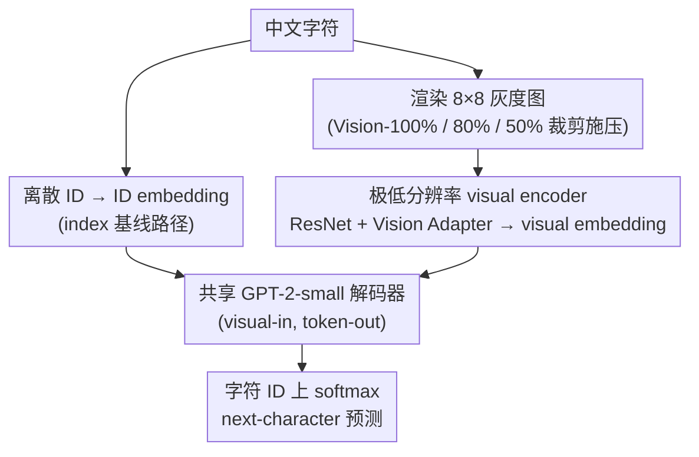

# Hot-Start from Pixels: Low-Resolution Visual Tokens for Chinese Language Modeling

**会议**: ACL 2026  
**arXiv**: [2601.09566](https://arxiv.org/abs/2601.09566)  
**代码**: 待确认  
**领域**: NLP / 中文语言建模 / 视觉表示  
**关键词**: pixel-based LM, Chinese characters, hot-start, low-resolution, visual tokens

## 一句话总结
把中文字符渲染成 $8\times 8$ 灰度小图喂给 GPT-2 风格解码器做 next-character 预测，最终精度（39.21%）追平 index-based 基线（39.10%），并且在训练早期（0.4% 数据时）就把基线翻一倍以上——展示了"视觉结构"作为汉字建模的天然 hot-start 先验。

## 研究背景与动机

**领域现状**：中文 LM 主流仍把字符当离散 token ID（如 GPT/BERT 中文版）。已有 glyph-augmented 工作（Glyce、ChineseBERT）把字形特征**作为辅助**接进 token embedding；PIXEL 等 pixel-based LM 直接在 rendered text 上做 MLM 但目标是 pixel→pixel。

**现有痛点**：
- index-based 表示把"山"剥成抽象 ID，丢掉了山形山势这种对人类显然有意义的视觉信息；
- 中文是 logographic，字形本身就编码语义/语音信息，离散 ID 在数据稀缺时收敛慢；
- 现有 glyph-augmented 方法把 glyph 当 side info，未做"完全替换 token ID"的可控对照。

**核心矛盾**：表征到底是 token ID 还是 pixel？两者在最终精度上看似都行，但**训练动力学**可能差异很大——视觉表示在 embedding 空间里天然带几何结构，可能为早期训练提供 structural prior。

**本文目标**：把字符表示从 index 完全换成 pixel，系统回答 4 个研究问题：(RQ1) 视觉够不够用？(RQ2) 早期学习动力学如何？(RQ3) 多低分辨率仍 OK？(RQ4) 部分遮挡下还能行吗？

**切入角度**：完全干净地做 "visual-in, token-out" 对照实验——共用同一 GPT-2-small 解码器，输入路径前面接 ResNet+Adapter 处理 $4\times 4$ 到 $96\times 96$ 灰度图。

**核心 idea**：视觉结构本身就是一个 ready-to-use prior，**最低 $8\times 8$ 分辨率**就足够追平 index-based baseline，并在早期训练形成 "hot-start" 效应。

## 方法详解

### 整体框架

本文做的是一个干净的 "visual-in, token-out" 对照实验：两条 pipeline 共享同一个 GPT-2-small（117M 参数、12 层、768 维）解码器，差别只在输入端的字符表示。Index path 走传统路线，字符 → 离散 ID → embedding → decoder；Visual path 则把每个字符渲染成灰度小图（默认 $8\times 8$、留 10% 边距）→ ResNet encoder → Vision Adapter → 映射进 decoder 的 embedding 空间。两条路输出端完全一致，都在字符 ID 上做标准 next-character 预测，因此精度、困惑度等指标可以直接对比，从而把"换表示"的效果干净归因出来。

训练目标都是 next-character 交叉熵：

$$\mathcal{L}_{CE} = -\frac{1}{N}\sum_{i=1}^N \sum_{t=1}^T \log P(c_{t+1}^{(i)}|I_1^{(i)}, \dots, I_t^{(i)})$$

（行内可读作 $\mathcal{L}_{CE} = -\frac{1}{N}\sum_i \sum_t \log P(c_{t+1}|I_{\le t})$。）

### 关键设计

**1. 极低分辨率可学的 visual encoder：证明视觉表示不是靠堆参数赢**

原版 ResNet 是为 $64\times 64$ 设计的，对 $8\times 8$ 的字图严重 over-parameterize；要让"视觉表示成立"这个结论可信，就必须排除"它只是参数更多才追平"的可能。作者给出三档实现做对照：(a) 原版 ResNet（26.45M 参数、+16% FLOPs）；(b) 为 $8\times 8$ 优化的 minimal encoder 配深 adapter（22.32M、+12%）；(c) minimal encoder 配简单线性 adapter（12.61M、+7%）。

结果是最精简的 (c) 在参数量上比 index baseline（18.97M）还少 33.5%，却追平了大 encoder 的最终精度。这说明 $8\times 8$ 输入根本不需要大网络，over-engineering 反而拖效率——视觉表示的优势来自结构先验，而非容量。

**2. Vision-100% / 80% / 50% 三档 cropping：验证模型靠"结构"而非"OCR 重建"**

一个自然的质疑是：模型会不会只是把字图反向 OCR 成 ID、再走 index 路径？如果是这样，遮挡像素就应让它崩。作者用三档纵向裁剪施压：Vision-80% 只保留图像 top 80% 像素、Vision-50% 只保留 top 50%，其余以背景填充。在 $8\times 8$ 上真正有信号的像素本就只占 $6\times 6$，Vision-80% 缩到 $6\times 5$，Vision-50% 进一步缩到 $6\times 3$。

实测 Vision-50% 在如此重度遮挡下仍有 38.63% 精度（满版才 39.21%），直接反证模型学到的是**分布式视觉特征**而非逐像素重建——这就是所谓 "toast-center" 效应：中央 strokes 携带了绝大部分判别信息，边缘像素几乎可丢。

**3. Visual-in, token-out 范式：锁死输出口以做公平对比**

与 PIXEL / PIXAR 系列"pixel-in, pixel-out"不同，本文刻意保持输出端是字符 ID 上的 softmax，只把输入端从 ID embedding 切换到 visual embedding。这样 cross-entropy / perplexity / accuracy 全部与 index baseline 同口径可比。要回答的问题是"视觉作为 input 表示到底有没有用"，把输出口锁定不变是排除混淆因素的必要实验控制。

### 损失函数 / 训练策略

- 数据集为 THUCNews（740k 篇新闻、12.8M 字符实例，切成长度 128 的固定序列），采用 quadratic curriculum：每个 epoch 的训练序列数按 $5000 + 918.37 \cdot \text{epoch} + 18.74 \cdot \text{epoch}^2$ 增长，验证集固定 5K 序列。
- 优化器 AdamW，lr $2\times 10^{-4}$（OneCycle max $1.5\times 10^{-3}$），batch 128，weight decay 0.01，FP16，early stopping patience 7。
- visual encoder + adapter + decoder 端到端联合训练；消融发现冻结 decoder 只训 adapter 显著差于联合训练。
- 不做 OCR 预训练、不引入任何字符 ID 信号，是干净的"以图建模语言"。

## 实验关键数据

### 主实验：最终精度（RQ1 + RQ3 + RQ4）
THUCNews 上跨分辨率 $\times$ 三档 crop 的 Accuracy / PPL：

| 模式 | $4\times 4$ | $8\times 8$ | $20\times 20$ | $30\times 30$ | $80\times 80$ |
|------|-------------|-------------|---------------|---------------|---------------|
| Vision-100% | 29.70 / 85.33 | **39.21 / 46.59** | 39.16 / 45.83 | 39.14 / 48.73 | 39.03 / 49.41 |
| Vision-80% | 18.28 / 195 | 39.18 / 46.23 | 39.15 / 46.33 | 39.07 / 48.83 | 39.08 / 48.74 |
| Vision-50% | 2.10 / 2249 | **38.63 / 47.95** | 38.70 / 48.04 | 38.66 / 49.81 | 38.57 / 50.33 |
| Index-based baseline | — | — | — | — | **39.10 / 47.58** |

关键观察：$8\times 8$ 几乎逼近 $80\times 80$ 的精度；Vision-50% 严重遮挡只掉不到 0.6 个点。

### 消融实验：Hot-Start 与效率（RQ2）

| 训练样本数 | Index baseline | $8\times 8$ Vision | $40\times 40$ Vision |
|------------|----------------|--------------------|---------------------|
| 4,096 | 4.30% | 4.19% (-0.11) | 13.06% (+8.76) |
| 6,152 | 4.61% | 5.57% (+0.96) | 14.7% (+10.09) |
| 8,200 | 5.84% | **12.34%** (+6.5) | 15.46% (+9.62) |
| 10,248 | 8.45% | 13.94% (+5.49) | 15.92% (+7.47) |

效率分析（zhwp + RTX 5090 Laptop GPU）：

| 配置 | Params | FLOPs | samples/sec | Acc@8k | Final Acc |
|------|--------|-------|-------------|--------|-----------|
| Text (index) | 18.97M | 26.30G | 347.3 | 5.30% | 39.10% |
| Vision-100% (orig.) | 26.45M | 30.61G (+16%) | 314.3 | 8.88% | 39.21% |
| Vision-100% (opt.) | 22.32M | 29.56G (+12%) | 306.9 | 8.75% | 39.18% |
| **Vision-100% (simp.)** | **12.61M** | 28.14G (+7%) | 323.4 | 6.97% | 39.19% |

### 关键发现
- **Hot-start 真实存在**：$8\times 8$ 视觉模型在 8.2k 样本处达到 12.34%，是 index baseline 5.84% 的 2.1 倍；$40\times 40$ 在 4.1k 样本就有 13.06%，是 baseline 4.30% 的 3 倍。
- **越高分辨率 hot-start 越早起效**，但最终精度都收敛到 39% 左右，说明"视觉 prior"主要影响早期收敛速度而非渐近上限。
- **"Toast-center" 效应**：注意力集中在中央 strokes（≈30% 像素承载了大部分判别力），边缘像素几乎可丢——这也解释了 Vision-50% 的鲁棒性。
- **Vision (simp.) 用更少参数（12.61M）+ 仅 +7% FLOPs**，就拿到完整 hot-start 增益，net training efficiency 反而比 text baseline 更好（8k vision 样本 6.97% > 10k text 样本 6.26%）。
- 在 Chinese Wikipedia 2019 上模式复现：$8\times 8$ vision 8k 达 8.88%，text 仅 5.30%；最终精度 32.4% vs 32.1%。

## 亮点与洞察
- **"视觉作为先验"的反直觉证据**：人类一直凭直觉认为汉字是字形语言，但学界主流 LM 都丢掉了字形；这篇论文用干净的 controlled study 给出"丢掉了真的亏"的硬证据。
- **"Hot-start"是新指标**：以前比较表征都看最终精度，这里把镜头对准"早期 1% 训练量"的精度差异，刻画了 prior 的真实价值。
- **极简 encoder 反而更好**：和 NLP 圈"大力出奇迹"反着来——$8\times 8$ 输入根本不需要大网络，over-engineering 反而拖效率。这也启发其它低分辨率/低 token 数任务可大胆做 model sizing。

## 局限与展望
- 只在 GPT-2-small 上验证；更大 LM（已附加规模分析但仍以小模型为主）能否同样 hot-start 待考。
- 只测 next-character prediction，下游任务（QA、推理、翻译）上视觉表示能否同样追平 index 待补。
- 部分推论（如 toast-center）来自定性可视化，缺乏更严谨的归因分析。
- 没有探讨多字符 token、subword 表示等更现代 tokenization 与视觉表示的混搭。

## 相关工作与启发
- **vs Glyce / ChineseBERT**：他们把 glyph 作为辅助叠加在 ID 上，本文完全替换 ID，从而能干净归因。
- **vs PIXEL / PIXAR**：它们是 visual-in visual-out，本文 visual-in token-out，更利于和 index baseline 对照。
- **vs DeepSeek-OCR / Pix2Struct**：它们做 OCR/transcription，本文做"用视觉做语言建模"，目标完全不同。

## 评分
- 新颖性: ⭐⭐⭐⭐ "Hot-start 现象"和 "$8\times 8$ 就够" 的发现是新的；范式（visual-in, token-out for LM）也少见。
- 实验充分度: ⭐⭐⭐⭐ 分辨率/cropping/效率/规模 4 维都做了，但下游任务覆盖弱。
- 写作质量: ⭐⭐⭐⭐ RQ 驱动结构清晰，表格信息密度高。
- 价值: ⭐⭐⭐⭐ 对汉字 LM 的表征设计、低资源训练、可解释表示都有启发。

<!-- RELATED:START -->

## 相关论文

- [\[ACL 2026\] Text-to-Distribution Prediction with Quantile Tokens and Neighbor Context](text-to-distribution_prediction_with_quantile_tokens_and_neighbor_context.md)
- [\[AAAI 2026\] LoKI: Low-damage Knowledge Implanting of Large Language Models](../../AAAI2026/llm_nlp/loki_low-damage_knowledge_implanting_of_large_language_models.md)
- [\[CVPR 2025\] Test-Time Visual In-Context Tuning](../../CVPR2025/llm_nlp/test-time_visual_in-context_tuning.md)
- [\[AAAI 2026\] Identifying and Analyzing Performance-Critical Tokens in Large Language Models](../../AAAI2026/llm_nlp/identifying_and_analyzing_performance-critical_tokens_in_large_language_models.md)
- [\[ACL 2025\] ChartLens: Fine-Grained Visual Attribution in Charts](../../ACL2025/llm_nlp/chartlens_fine-grained_visual_attribution_in_charts.md)

<!-- RELATED:END -->
