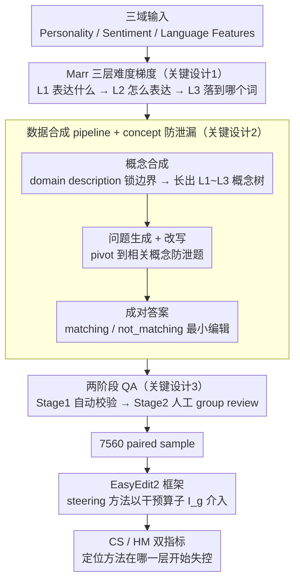

# SteerEval: How Controllable Are Large Language Models? A Unified Evaluation across Behavioral Granularities

**会议**: ACL 2026  
**arXiv**: [2603.02578](https://arxiv.org/abs/2603.02578)  
**代码**: https://github.com/zjunlp/EasyEdit/blob/main/examples/SteerEval.md  
**领域**: 可解释性 / 模型可控性 / Benchmark  
**关键词**: LLM steering, controllability, hierarchical benchmark, activation steering, Marr's levels

## 一句话总结
SteerEval 把 LLM 可控性按 Marr 的三层分析框架拆成 L1（表达什么）/L2（怎么表达）/L3（具体落到哪个词），覆盖 Personality、Sentiment、Language Features 三个域共 7560 个 paired sample，系统揭示了"细粒度上现有 steering 方法普遍崩溃"这一关键缺口。

## 研究背景与动机

**领域现状**：LLM 越来越多地用在教育、医疗、客服等社会敏感场景，因此能"可控引导"模型行为（personality、sentiment、风格等）至关重要。主流 steering 范式有两类：(i) prompt-based（在输入前加 concept prompt $p_g$）；(ii) activation-based（在前向传播中加 concept 向量），方法包括 DiffMean、PCA、RePS、CAA 等。

**现有痛点**：现有 benchmark 几乎都是"扁平的"——只测某个粗粒度行为（如"友好"vs"敌对"），缺乏对**控制粒度**的系统刻画。AXBENCH 标准化了评估流程，但概念来自 SAE 特征描述、缺少行为学定义和层级结构，且评测 prompt 来自 Alpaca-Eval，不针对具体 concept 定制。

**核心矛盾**：真实控制目标本身有层级——"让 LLM 表达自主性"是高层意图，"用'自我决断'的语气"是中层策略，"包含'self-authored'这个词"是底层标记；现有评测无法分辨方法是否能从粗到细一致地控制。

**本文目标**：构建一个跨域、跨粒度的层级 steering benchmark，公平比较 prompt-based 与 activation-based 方法在不同抽象层上的可控性。

**切入角度**：借鉴 Marr's three levels of analysis（Computational / Algorithmic / Implementational），把行为控制建模成"意图 → 策略 → 可验证证据"的三层 hierarchy；并跨三个具有不同认知深度的域（Personality 是高层 dispositional prior、Sentiment 是中层 affective state、Language Features 是底层 surface form）。

**核心 idea**：用自动数据合成 + 人工校验的 pipeline 造一个 Marr-inspired 三层 hierarchy benchmark，让"该方法在哪一层开始失控"成为可测的指标。

## 方法详解

### 整体框架
SteerEval 要解决的问题是"现有 steering 评测看不出方法在多细的粒度上还能控住模型"，于是把 benchmark 沿两条正交轴展开：域轴上是 Personality（高层 dispositional prior）/ Sentiment（中层 affective state）/ Language Features（底层 surface form）三个认知深度不同的 domain，粒度轴上则借 Marr 三层把每个控制目标拆成 L1 Computational（表达什么）→ L2 Algorithmic（怎么表达）→ L3 Implementational（落到哪个可机检的词）。从输入到输出的流程是：先由数据合成 pipeline 在每个 (domain, level) 下造出 8 个 concept、每 concept 105 个最小编辑的 paired sample（总计 $7560 = 3 \times 3 \times 8 \times 105$），再统一放进 EasyEdit2 框架，让任意 steering 方法以 $\hat y_{\text{steered}} = \mathcal{I}_g(M, x)$ 的形式介入——$\mathcal{I}_g$ 既可以是 prompt prepend $M(p_g \| x)$，也可以是在前向传播中注入 concept vector——最后用 CS / HM 双指标读出"该方法在哪一层开始失控"。

### 关键设计

**1. Marr 启发的三层 granularity hierarchy：把可控性测成一条难度梯度**

现实里的控制目标天然分层——"让模型表达自主性"是意图、"用自我决断的语气"是策略、"输出里出现 self-authored 这个词"是可验证的证据——但既往 benchmark 把它们压平成"某属性改没改"的单点判断，于是看不出方法是从哪一层崩的。SteerEval 把每个 concept 沿 L1→L3 同时收紧三件事：L1 只给高层意图（如 increase redundancy）允许多样输出，L2 叠加策略约束（如必须用 rephrased restatement），L3 则要求一个 atomic 的表面证据（如包含 `'(i.e.,'`）可直接 string match。三层在频次、抽象度上递减、在可验证性上递增，构成一个被精确控制的任务难度梯度，从而把"方法在哪个抽象层失灵"变成可定位的坐标。

**2. 自动化数据合成 pipeline + concept 防泄漏：让层级数据可低成本扩展又不被问题泄题**

层级化 paired preference 数据若纯靠人写既贵又难一致，于是用三步合成：(a) Hierarchical Concept Synthesis 先由 domain name 让 LLM 生成 domain description 当全局约束、再据此长出 L1∼L3 概念树，用 description 锁住 domain 边界防止概念漂移；(b) Question Generation & Refine 为每 concept 生成训练/测试与 anchor 问题及参考 pos/neg 答案，并做关键的 **question rewriting**——把问题 pivot 到相关但不同的 concept，避免模型直接从问题措辞就猜出 target；(c) Paired Answer Generation 对每个改写后的问题生成 (matching, not_matching) 对且强制 lexical-level 最小编辑，保证两答案差异完全来自目标 concept 而非其他文本因素。这条 pipeline 既保证可扩展，又通过"锁边界 + 改问题 + 最小编辑"三道闸门隔离 concept 信号。

**3. 两阶段 QA：自动验证叠加人工 group review 保住 label 可信度**

纯 LLM 合成容易漏掉细微的 concept 偏差，而 benchmark 的全部价值都押在标注准确率上，所以质检分两段：Stage 1 每个任务生成多个 candidate，过格式与完整性的自动检查后按序截到目标数量；Stage 2 由按 domain × granularity 划分的专业 NLP 标注员先在 20% 随机子集上做 calibration，再双人独立审、有分歧时共识解决，最后附隐私与安全审计、以 MIT 协议发布。自动检查保格式、专家 group review 保语义，两段串联才让这套层级数据具备可信的 credibility。

### 损失函数 / 训练策略
SteerEval 是 benchmark，不训练新模型。被评估方法（Prompt 0/3-shot、PCA、DiffMean、RePS 等）各自按自己的 inference-time intervention $\mathcal{I}_g$ 跑，再用 CS（Concept Score，target 达成度）与 HM（CS 与质量分的调和平均）两个指标打分。

## 实验关键数据

### 主实验：跨域跨层 steerability（Gemma-2-9b-Instruct）
评估指标：CS（concept score，target 达成度）/ HM（与质量分的调和平均）。L1→L3 越向右越难。

| 方法 | Language Features L1 (CS/HM) | LF L2 | LF L3 | Personality L1 | Pers L2 | Pers L3 | Sentiment L1 | Sent L2 | Sent L3 |
|------|--------------|------|------|------|------|------|------|------|------|
| Vanilla | 1.16/1.38 | 0.95/1.14 | 0.14/0.15 | 0.45/0.58 | 0.79/1.01 | 0.05/0.06 | 1.40/1.61 | 1.18/1.40 | 0.00/0.00 |
| Prompt (0-shot) | 2.53/2.72 | 2.84/3.03 | 2.85/3.21 | 2.57/2.99 | 3.02/3.21 | 2.87/3.17 | 2.87/3.18 | 3.15/3.39 | 2.57/2.99 |
| Prompt (3-shot) | 2.32/2.60 | 2.99/3.14 | **2.88/3.19** | 2.71/3.10 | 2.94/3.27 | **3.18/3.47** | 2.97/3.35 | 2.94/3.24 | 2.37/2.71 |
| PCA | 1.94/1.85 | 1.45/1.51 | 0.13/0.15 | 1.33/1.48 | 1.51/1.20 | 0.05/0.06 | 1.86/2.01 | 1.68/1.75 | 0.00/0.00 |
| DiffMean | **3.12/2.98** | 2.70/2.78 | 0.14/0.14 | **3.16/3.10** | 3.17/3.10 | 0.05/0.05 | 2.79/2.92 | 2.83/2.68 | 0.07/0.08 |
| RePS | 2.87/2.82 | 2.36/2.16 | 2.07/2.00 | 3.15/3.04 | **3.63/3.48** | 2.34/2.12 | **3.27/3.21** | 2.75/2.53 | 1.65/1.64 |

### 消融实验：跨抽象层的失控曲线

| 方法类型 | L1 表现 | L2 表现 | L3 表现 | 结论 |
|----------|---------|---------|---------|------|
| Activation-based (PCA / DiffMean) | 中-强 | 中等 | **接近 0** | 在 L3 几乎无法注入具体 token |
| Prompt-based (0-/3-shot) | 中等 | 中等 | 中等 | 唯一在 L3 稳定的方法 |
| RePS (混合) | 中-强 | 强 | 中等（>0 但不及 prompt） | 折中方案 |

### 关键发现
- 方法对**域**不敏感，但对**粒度**极敏感——多数 activation steering 方法（DiffMean、PCA）在 L1/L2 表现良好，到 L3 直接掉到接近 0。
- Prompt steering 是唯一稳定支持 L3 的方法，但 CS 上限被 L1/L2 的 prompt 干扰拉低。
- RePS 是 activation 系里在 L3 上唯一非零的方法（≈2.07 LF / 2.34 Pers / 1.65 Sent），但仍远不及 prompt 路线。
- Personality 域比 Sentiment / Language Features 整体更难（高层 dispositional prior 更不易用单一 vector 表达）。
- 启示：要在 deploy 中实现"既能调高层意图又能强制底层 token 约束"，需要混合范式——这个 benchmark 给出了量化失控位置。

## 亮点与洞察
- **把 Marr 三层引入 LLM 评估**：长期 LLM 可控性测评停留在"测一个 attribute 改没改"，本文用经典认知科学框架把这个问题结构化了，定位 steering 失灵的抽象层。
- **L3 是 activation steering 的盲区**：所有活化向量方法在"精确插入某 token"任务上都接近 0，提示研究者要把 representation engineering 和 constrained decoding 结合。
- **数据合成 + 人工双校的 pipeline**：question rewriting 防泄漏 + minimal-edit paired answer 是其他 preference benchmark 可借鉴的方法学贡献。

## 局限与展望
- 评估指标 CS/HM 依赖 evaluator LLM，可能引入评估 bias。
- 三个域虽有代表性，但远不覆盖所有可控行为（如长度、引用风格、伦理边界等）；reasoning patterns 域作为 appendix 补充。
- 主要在 Gemma-2-9b / Qwen-2.5-7b 上跑，对超大模型（70B+）的 steerability 规律尚未验证。
- Activation steering 在 L3 接近 0 的原因没深挖——是 vector 表达不了离散 token 偏置，还是 hook 注入层位置不对？

## 相关工作与启发
- **vs AXBENCH**：同样标准化 steering 评估，但 SteerEval 多了**granularity 维度**和定制化 prompt；AXBENCH 概念来自 SAE，SteerEval 概念来自人为定义的行为目标。
- **vs RepE / CAA / ReFT 系列**：本文不是新方法，而是揭示这些方法的共同盲区——L3 实质性 token-level 控制几乎做不到。
- **vs IFEval / FollowBench**：那些 benchmark 测 instruction following，SteerEval 测 representation-level 行为引导，互补关系。

## 评分
- 新颖性: ⭐⭐⭐⭐ 把 Marr 框架引入 LLM 可控性评估是少见的 framing。
- 实验充分度: ⭐⭐⭐⭐ 3 域 × 3 层 × 多方法 × 多模型，但模型规模未到 70B+。
- 写作质量: ⭐⭐⭐⭐ 三层定义清晰，图 2 例子化呈现很直观。
- 价值: ⭐⭐⭐⭐ 给 representation engineering / activation steering 研究指出关键空白（L3 控制），是个 long-lasting 的 benchmark。

<!-- RELATED:START -->

## 相关论文

- [\[CVPR 2025\] MG-MotionLLM: A Unified Framework for Motion Comprehension and Generation across Multiple Granularities](../../CVPR2025/llm_nlp/mg-motionllm_a_unified_framework_for_motion_comprehension_and_generation_across_.md)
- [\[ACL 2026\] Mind the Gap: How Elicitation Protocols Shape the Stated-Revealed Preference Gap in Language Models](mind_the_gap_how_elicitation_protocols_shape_the_stated-revealed_preference_gap_.md)
- [\[ACL 2026\] Foresight Optimization for Strategic Reasoning in Large Language Models](foresight_optimization_for_strategic_reasoning_in_large_language_models.md)
- [\[ACL 2025\] Behavioral Analysis of Information Salience in Large Language Models](../../ACL2025/llm_nlp/behavioral_analysis_of_information_salience_in_large_language_models.md)
- [\[ACL 2026\] Repeated Sequences Reveal Gaps between Large Language Models and Natural Language](repeated_sequences_reveal_gaps_between_large_language_models_and_natural_languag.md)

<!-- RELATED:END -->
